# Support & Resistance Agent — Technical Design Document

**Version:** 0.1 (P0–P4 designed; P5–P6 provisional)
**Date:** 18 September 2026
**Companion to:** [`BUILD-PLAN.md`](BUILD-PLAN.md) (what we build, in what order, with what gates). This document is the *how*: for every phase it fixes the architecture, the data/work flow, the classes and layers, the data sources and storage, and the algorithms and formulas an implementer needs. Where the two disagree, BUILD-PLAN's gates and constants win and this document is wrong.
**Reference catalogues:** [`Support-Resistance-design-fixed.MD`](Support-Resistance-design-fixed.MD) (label definitions §6–7, §16; state machine §63; schema §48) and [`SR-Plan.md`](SR-Plan.md) (volume profile §1.1, KDE/GMM/Camarilla §3).

---

## How to read this document

- **§1** records the decisions that shape every phase. **§2** is the cross-phase foundation (architecture, storage, data sources, notation) that every phase builds on.
- **§3–§9** are the seven phases, P0–P6, each written to the same template so a phase can be read alone:

  | # | Sub-section | Contents |
  |---|---|---|
  | .1 | Objective, gate, kill | Quoted from BUILD-PLAN §12; what "done" means |
  | .2 | Architecture (this phase) | Mermaid diagram of the components active in the phase; new components highlighted |
  | .3 | Data / work flow | Mermaid flow or sequence diagram of the run path, with artefacts named by table/file |
  | .4 | Layers & classes | Class diagram + table: module path, class, responsibility, inputs → outputs |
  | .5 | Data sources & storage | Sources consumed; tables/datasets introduced or extended |
  | .6 | Algorithms & formulas | Every non-trivial computation, with initial parameter values and which are learned |
  | .7 | Tests that decide the gate | Concrete test suites and experiment scripts |
  | .8 | Deliverables | Checklist |

- Diagrams are Mermaid fenced blocks (rendered natively by GitHub and VS Code preview). In every architecture diagram, components **new in that phase** are drawn with a thick border (`:::new`); inherited components are plain.
- Formulas use plain Unicode/LaTeX-style inline math. Every constant that BUILD-PLAN fixes is cited as `(BP §x)`; every constant introduced here is marked **initial** and may only be tuned inside walk-forward validation (BP §7.4).
- Sections marked **[provisional]** describe phases whose gate depends on the outcome of an earlier gate; they will be rewritten when work reaches them.

---

## 1. Decisions and assumptions

| # | Decision | Consequence for the design |
|---|---|---|
| D1 | **No monthly data budget → Tier-0 sources only** (BP §5.1, §15 "budget ceiling"). | Options/GEX (BP family G), intraday bars, off-exchange prints, and minute-level volume profile are **not built**. The product is a **daily-bar forecaster**. All schema slots for these sources are kept with `*_available = 0` (BP §5, design-fixed §76). A zero-cost nightly archive of the free CBOE options snapshot is started in P1 (§4.5) so a future options module could be backtested; no module consumes it in this plan. |
| D2 | **US first, HK second**, other markets deferred (BP §1.2, §15). | P0–P3 are US (S&P 500 + 400, point-in-time). HK (Hang Seng constituents via Stooq `.HK` daily bars) enters in P4 as the generalisation test. China A-share price-limit truncation is a hook in the MC engine (§6.6.6), inactive. |
| D3 | **Horizon H = 5 local sessions** (BP §3, design-fixed §3). | Session arithmetic goes through `exchange_calendars` everywhere; never calendar days. |
| D4 | **Price spine = Stooq** (bulk daily, US + HK), **Tiingo free tier for reconciliation only**. | Tiingo's free tier caps (documented in §2.5) cannot serve a ~900-name universe, but comfortably serve the P1 reconciliation sample of 50 tickers × 200 dates. `yfinance` is dev-only cross-check, never a source of truth (BP §5.1). |
| D5 | **Point-in-time universe from a hand-curated membership CSV** built from published S&P 500/400 change histories plus EDGAR delisting evidence. | This is the P1 kill-criterion risk (BP §12 P1). §4.6.4 defines what "cannot assemble" means and the descope path. |
| D6 | **Storage = Parquet lake + DuckDB catalogue**, single workstation (BP §1.2, §11). | No services to run. DuckDB file `data/sr.duckdb` holds catalogue views over Parquet plus small mutable tables (forecast store, registry). |
| D7 | **LightGBM is the production model; deep learning is a challenger** (BP §8). | P5's sequence model ships only if it beats LightGBM out-of-sample with CI excluding zero. |
| D8 | **The LLM never emits a number** (BP §4). | Every numeric field in a forecast is produced by the deterministic core; the verifier (§7.6.2) machine-checks the narrative. |

---

## 2. Cross-phase foundation

### 2.1 System architecture

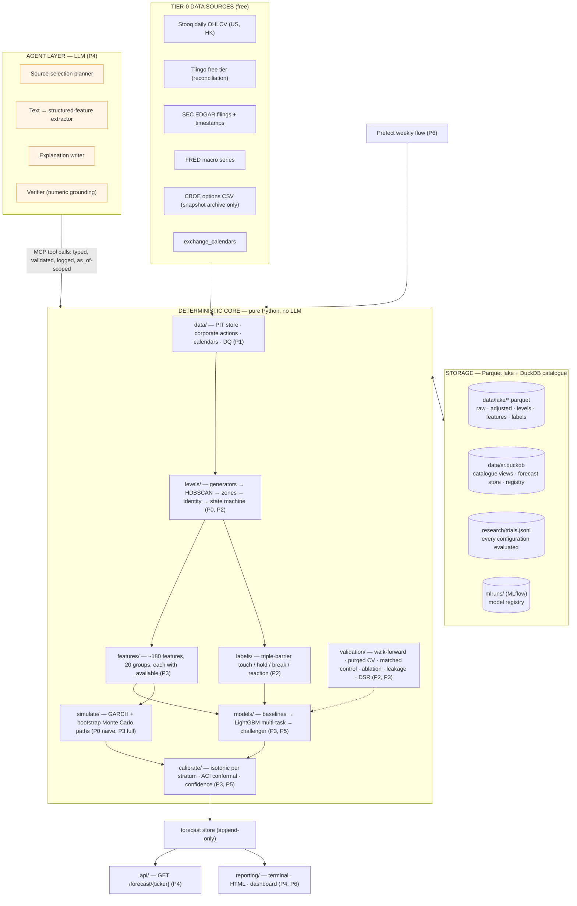

The MCP boundary is the whole point (BP §4): the LLM decides *which* sources to use and *how to explain* the result; the core computes every level, probability, and score. Nothing above the boundary can write a number into a forecast.

### 2.2 Repository layout and layer map

The package tree is BUILD-PLAN §11, annotated with the phase that first creates each module.

```text
sr_agent/
├─ config/            markets.yaml · features.yaml · models.yaml · thresholds.yaml        P0 (grows every phase)
├─ data/              ingestion/{stooq,tiingo,edgar,fred,cboe}.py · adjust.py             P1
│                     calendars.py · quality.py · universe.py · store.py (PITStore)        P1
├─ levels/            generators/{structure,round,volume_profile,vwap,technical,          P0: structure, round
│                                 statistical,options}.py                                  P2: the rest (options = stub)
│                     cluster.py · zone.py · identity.py · state_machine.py               P0 naive cluster · P2 full
├─ features/          20 modules, one per group · registry.py                              P3
├─ labels/            triple_barrier.py · touch.py · hold.py · reaction.py                P2
├─ models/            baseline.py · logistic.py · lgbm.py · survival.py                   P3
│                     sequence.py · ensemble.py                                            P5
├─ simulate/          monte_carlo.py · gaps.py · limits.py                                 P0 naive · P3 full
├─ calibrate/         isotonic.py · confidence.py                                          P3
│                     conformal.py                                                         P5
├─ validation/        matched_control.py · leakage.py · trials.py                          P2
│                     walk_forward.py · purged_cv.py · ablation.py · stress.py             P3
│                     dsr.py                                                               P5
├─ agent/             loop.py · prompts/ · verifier.py · mcp_server.py · extract.py        P4
├─ api/               main.py                                                              P4
├─ reporting/         render.py · dashboard.py · score.py · drift.py                       P4 render · P6 rest
├─ ops/               flows.py (Prefect)                                                   P6
├─ research/          notebooks/ · trials.jsonl · rejected.md                              P2
├─ cli.py             `sr p0 AAPL` · `sr ingest` · `sr forecast` …                         P0
└─ tests/             unit/ · leakage/ · determinism/ · guardrails/                        P1
data/                 raw/ · lake/ · sr.duckdb            (git-ignored)                    P0 raw · P1 lake
```

Layer discipline (enforced by import-linter in CI from P1):

| Layer | Packages | May import |
|---|---|---|
| L0 Config | `config/` | nothing |
| L1 Data | `data/` | L0 |
| L2 Level engine | `levels/`, `labels/` | L0–L1 |
| L3 Features & simulation | `features/`, `simulate/` | L0–L2 |
| L4 Models & calibration | `models/`, `calibrate/`, `validation/` | L0–L3 |
| L5 Agent & delivery | `agent/`, `api/`, `reporting/`, `ops/` | L0–L4 |

### 2.3 Notation

| Symbol | Meaning | Defined by |
|---|---|---|
| `t`, `as_of` | Forecast timestamp: the close of the last session before the forecast week (Friday close, 20:00 UTC for XNYS) | BP §3.2, design-fixed §4 |
| `H` | Horizon = 5 local trading sessions | BP §7.1 |
| `ATR₂₀` | Wilder average true range over 20 sessions, evaluated at `t` | §3.6.1 |
| `δ` | Breach buffer = `0.25·ATR₂₀` | BP §7.1 |
| `R_min` | Reaction threshold = `0.5·ATR₂₀` | BP §7.1 |
| `[L, U]` | Zone interval, lower and upper bound; `center`, `width = U − L` | BP §6.1 |
| `q` | Zone width in ATR units, `width = q·ATR₂₀`, learned per (market × vol-decile) | BP §6.3 |
| `d` | Signed distance from spot to zone center in ATR units, `d = (center − close_t)/ATR₂₀` (negative below spot) | BP §3.2 `distance_atr` |
| `event_ts` | When the fact occurred (bar close, filing acceptance, …) | BP §7.4 |
| `available_at` | Earliest timestamp at which the fact could have been known to a forecaster | BP §7.4, §10.4.3 |
| `security_id` | Stable internal integer key; tickers change, ids do not | design-fixed §48 |
| `zone_id` | Persistent identity `{TICKER}-{S\|R}-{ISOyear}W{week}-{nn}` | BP §3.2, §6.1 |
| `Y_touch, Y_hold, Y_break, Y_reaction, T_*` | Triple-barrier labels | BP §7.1, §5.6.5 here |
| `DQ` | Data-quality score in [0,1]; `< 0.7` suppresses the zone | BP §9.3, design-fixed §43 |

### 2.4 Core definitions carried by every phase

**Zone and events** (BP §7.1; design-fixed §6–7). For a support zone `[L,U]` observed at `t`:

- *Touch* on session `s ∈ (t, t+H]`: `Low_s ≤ U` **and** `High_s ≥ L`.
- *Hold* (defined only if touched): after first entry at session `s₀` with entry price `E` (§5.6.5), price reaches `E + R_min` (support) / `E − R_min` (resistance) before the breach condition.
- *Break*: `Close_s < L − δ` (support) / `Close_s > U + δ` (resistance) occurs first.
- *Reaction* `Y_reaction = (post-touch extreme − E)/ATR₂₀`, signed in the favourable direction.

**Session arithmetic.** `sessions(as_of, n)` returns the next `n` sessions of the security's exchange from `exchange_calendars`; the forecast window is `sessions(t, 5)`. Half-days count as sessions.

**Availability rule.** A row is visible to a query with `as_of` iff `available_at ≤ as_of`. There is no other read path (BP §10.4.3). For daily bars `available_at = session close + publication lag` (default lag 0 for Stooq EOD, set in `markets.yaml`); for EDGAR filings `available_at = acceptance datetime`; for FRED `available_at = release datetime` from the release calendar, never the observation date.

### 2.5 Data sources — Tier-0 catalogue

All sources are free. Every source is optional at forecast time; missing sources set `*_available = 0` and lower `DQ` (BP §5).

| Source | What we take | Access | Limits & notes | Landing table | First used |
|---|---|---|---|---|---|
| **Stooq** | Daily OHLCV, US (`.US`) and HK (`.HK`); also index/ETF series (SPY, sector ETFs, `^SPX`, `^HSI`) | Per-symbol CSV `https://stooq.com/q/d/l/?s={sym}&i=d`; bulk daily archives for backfill | Unadjusted for dividends; split-adjusted inconsistently → we treat Stooq as **raw** and apply our own corporate actions. Polite rate: ≤ 1 req/s, cache everything. Limited delisted coverage (→ D5). | `bar_daily_raw` | P0 |
| **Tiingo (free tier)** | Daily OHLCV + adjusted close, split/dividend factors, for the reconciliation sample and CA cross-check | REST `https://api.tiingo.com/tiingo/daily/{ticker}/prices`, token | Free-tier caps (verify at sign-up; treat as hard limits in `markets.yaml`): ~50 req/hr, ~1 000 req/day, ~500 unique symbols/month. Enough for 50 tickers × 200 dates. | `bar_daily_ref`, `corporate_action` (source=`tiingo`) | P1 |
| **SEC EDGAR** | Filing index with acceptance timestamps (8-K, 10-Q, 10-K, Form 25, Form 15), full text for extraction | `https://data.sec.gov/submissions/CIK##########.json`; full-text search `https://efts.sec.gov/LATEST/search-index?q=…`; documents from `https://www.sec.gov/Archives/` | Descriptive `User-Agent: SR-Agent <email>`; ≤ 10 req/s; no key. Acceptance datetime is `available_at`. | `filing`, `document` | P1 (index), P4 (text) |
| **FRED** | Macro series (DGS10, DFF, VIXCLS, …) and the release calendar | `https://api.stlouisfed.org/fred/series/observations`, free key; `fred/releases/dates` | Unlimited for our volume. Use *vintage* (ALFRED) endpoints for revised series so `available_at` is the release date. | `macro_series`, `macro_release` | P1 |
| **CBOE options CSV** | Full daily chain snapshot incl. OI (T-1) | `https://www.cboe.com/delayed_quotes/{sym}/quote_table` CSV export | **Snapshot only — no history.** Archived nightly from P1 (§4.5) purely to accumulate a future backtest set. Not consumed by any model (D1). | `options_snapshot_archive` | P1 (archive only) |
| **`exchange_calendars`** | Sessions, holidays, half-days for XNYS, XHKG (XSHG/XSHE for the inactive limit hook) | Python package | Pin the version; sessions are computed, not stored, but a materialised `session_calendar` table exists for SQL joins. | `session_calendar` | P0 |
| **Index membership (curated)** | Point-in-time S&P 500 / S&P 400 / Hang Seng membership intervals | `data/curated/index_membership.csv`, maintained by hand from published change histories (Wikipedia "List of S&P 500 companies" change table and its edit history; S&P Dow Jones Indices press releases; HSI announcements), one source URL per row | This is the survivorship-bias defence (BP §12 P1). Rows: `(index, ticker_at_time, security_id, start_date, end_date, source_url)`. | `universe_membership` | P1 |
| **EDGAR Form 25 / Form 15** | Delisting / deregistration evidence with dates, to close membership intervals and mark `security_master.delisting_date` | EDGAR full-text search on form type | Free; the only free authoritative delisting record. | `security_master`, `corporate_action` (type=`delist`) | P1 |
| `yfinance` | Dev-only convenience cross-check | package | Never a source of truth, never read by the PIT store (BP §5.1). | — | dev |

**Explicitly not used (D1):** Tiingo Power, EODHD, Polygon/Massive, Databento, any LOB or dark-pool feed. `features.yaml` still declares the `options`, `offexchange`, `orderbook`, and `intraday_vp` groups so that the feature matrix shape is stable; their `_available` flags are always 0.

### 2.6 Storage architecture

**Layout.**

```text
data/
├─ raw/                        immutable downloads, one file per (source, symbol, fetch_date)
│   └─ stooq/AAPL.US/2026-09-12.csv
├─ lake/                       Parquet, Hive-partitioned; written only by ingestion/pipeline jobs
│   ├─ bar_daily_raw/market=US/year=2026/*.parquet
│   ├─ bar_daily_adj/market=US/year=2026/*.parquet
│   ├─ candidate_level/market=US/year=2026/*.parquet
│   ├─ zone/…  zone_state_history/…  zone_label/…
│   ├─ feature_store/market=US/year=2026/*.parquet
│   └─ options_snapshot_archive/underlying=SPY/date=2026-09-12/*.parquet
├─ curated/index_membership.csv
└─ sr.duckdb                   catalogue: views over lake/ + small mutable tables
research/trials.jsonl          append-only experiment log
mlruns/                        MLflow tracking + model registry
```

Rules: raw data is never overwritten (design-fixed §44); lake datasets are rewritten per partition by idempotent jobs keyed on `(source, as_of)`; every table carries `event_ts` and `available_at` (BP §7.4); DuckDB is the only query engine and `PITStore` the only read API (§4.4).

**Entity model.** Each entity is tagged with the phase that introduces it. Full DDL is in Appendix A.

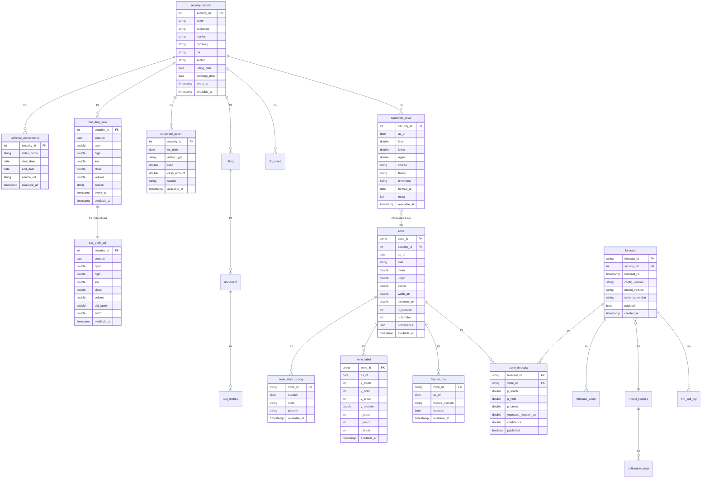

### 2.7 Configuration files

| File | Keys (initial) | Owner phase |
|---|---|---|
| `markets.yaml` | per market: `calendar` (XNYS/XHKG), `close_utc`, `bar_publication_lag_minutes`, `tick_size`, `price_limit` (`null` for US/HK; `±0.10` hook for A-shares), `stooq_suffix`, `round_number_multipliers` | P0 |
| `thresholds.yaml` | `atr_window: 20`, `horizon_sessions: 5`, `delta_atr: 0.25`, `r_min_atr: 0.5`, `dq_suppress: 0.7`, `publish: {p_touch: 0.60, p_hold: 0.65, confidence: 0.70, dq: 0.80}`, `dq_weights`, `cluster: {eps_atr: 0.25, min_cluster_size: 2}`, `identity_match_atr: 0.25` | P0, P1, P2 |
| `features.yaml` | 20 groups, each: `enabled`, `lookback_sessions`, `available_at_rule`, and the feature list with `dtype` | P3 |
| `models.yaml` | walk-forward schedule, purge/embargo, LightGBM params per target, isotonic strata + min-n ladder, MC params (`n_paths`, `block_len`, `seed`) | P3 |
| `agent.yaml` | model ids per role, prompt-cache settings, cost cap per forecast, tool allow-list | P4 |

All numbers in `thresholds.yaml` that BUILD-PLAN fixes are marked `frozen: true` and a unit test asserts they equal the BUILD-PLAN values.

### 2.8 Output contract and its storage projection

The forecast JSON is BUILD-PLAN §3.2, `schema_version: "1.0"`, frozen at P1 and versioned thereafter. It is stored twice: verbatim in `forecast.payload` (append-only, never updated) and flattened into `zone_forecast` for SQL. `forecast_id = sha256(security_id, forecast_ts, config_version, model_version)[:16]` so a replay of the same inputs collides on purpose (replay determinism, BP §10.4.4).

---

## 3. P0 — Walking skeleton (Week 1)

### 3.1 Objective, gate, kill

> One ticker, daily bars only, swing + round-number generators, naive clustering, MC touch probability, printed output. Ugly and end-to-end. **Purpose:** validate the shape of the pipeline before investing in any of it. **Gate:** it runs. **Kill:** none. — BP §12 P0

"Done" means `uv run sr p0 AAPL` fetches (or reads cached) daily bars, prints the spot, `ATR₂₀`, at least one support and one resistance zone, each with a `P(touch)` from 10 000 bootstrap paths, in under 10 s. No DuckDB, no LLM, no persistence beyond a CSV cache.

### 3.2 Architecture (this phase)

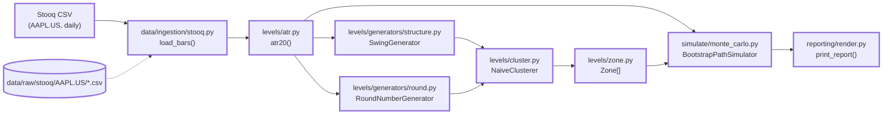

Everything is new; every box is a module that survives into later phases (the *naive* clusterer and the *bar-triple* simulator are replaced in P2/P3 but keep their interfaces).

### 3.3 Data / work flow

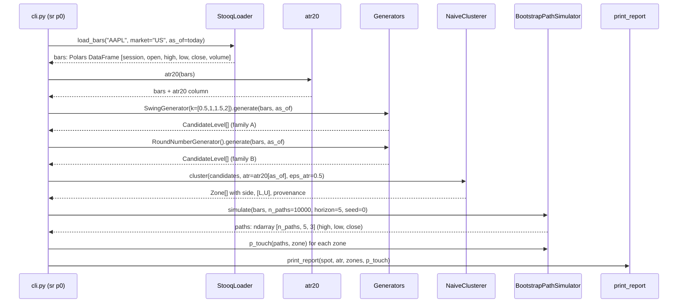

### 3.4 Layers & classes

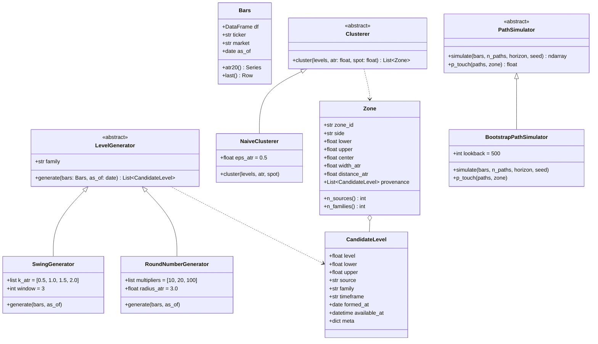

| Module | Class / function | Responsibility | Inputs → Outputs |
|---|---|---|---|
| `data/ingestion/stooq.py` | `load_bars(ticker, market, as_of)` | Download-or-read-cache the Stooq daily CSV; parse to Polars; drop rows after `as_of`; attach `available_at = session close` | `str, str, date → Bars` |
| `levels/atr.py` | `atr20(bars)` | Wilder ATR (§3.6.1) | `Bars → Series` |
| `levels/generators/base.py` | `LevelGenerator`, `CandidateLevel` | Interface every generator implements from here on; `family` is the independence key used in P2 | — |
| `levels/generators/structure.py` | `SwingGenerator` | Multi-k swing highs/lows (§3.6.2) | `Bars, date → CandidateLevel[]` |
| `levels/generators/round.py` | `RoundNumberGenerator` | Round-number ladder near spot (§3.6.3) | `Bars, date → CandidateLevel[]` |
| `levels/cluster.py` | `NaiveClusterer` | 1-D single-linkage merge in ATR units (§3.6.4); replaced by HDBSCAN in P2 behind the same `Clusterer` interface | `CandidateLevel[], atr, spot → Zone[]` |
| `levels/zone.py` | `Zone` | Value object; `side` = support if `center < spot` else resistance; `zone_id` provisional (`{ticker}-{S\|R}-P0-{nn}`) until identity exists in P2 | — |
| `simulate/monte_carlo.py` | `BootstrapPathSimulator` | Bar-triple bootstrap paths and `P(touch)` (§3.6.5) | `Bars → ndarray[n, H, 3]` |
| `reporting/render.py` | `print_report(...)` | Fixed-width table to stdout | — |
| `cli.py` | `sr p0 TICKER` | Wires the above; `--seed`, `--paths`, `--as-of` flags | — |

### 3.5 Data sources & storage

| Source | Used for | Storage |
|---|---|---|
| Stooq (`https://stooq.com/q/d/l/?s=aapl.us&i=d`) | The only input | `data/raw/stooq/AAPL.US/{fetch_date}.csv`, immutable; loader picks the newest file ≤ `as_of` |
| `exchange_calendars` XNYS | Validating that every session in the CSV is a real session (warn, don't fail) and computing `sessions(as_of, 5)` for the report header | none |

No DuckDB, no Parquet, no forecast store in P0. The report is stdout only.

### 3.6 Algorithms & formulas

#### 3.6.1 Wilder ATR

```
TR_t   = max( H_t − L_t,  |H_t − C_{t−1}|,  |L_t − C_{t−1}| )
ATR_t  = ( (n−1)·ATR_{t−1} + TR_t ) / n,   n = 20,   ATR_n = mean(TR_1..TR_n)
```

`ATR₂₀` at `as_of` is the value on the last session ≤ `as_of`. All ATR-normalised quantities in every later phase use this exact series (frozen: `thresholds.yaml: atr_window: 20`, BP §7.1).

#### 3.6.2 Multi-k swing points (design-fixed §9)

A bar `t` is a swing high candidate if `H_t = max(H_{t−w..t+w})` with window `w = 3` sessions (**initial**), and is *accepted* at significance `k` if the subsequent retrace is large enough:

```
accept_high(t, k)  ⇔  H_t − min(L_{t+1..t+m}) ≥ k·ATR_t   for some m ≤ 20
accept_low(t, k)   ⇔  max(H_{t+1..t+m}) − L_t ≥ k·ATR_t
k ∈ {0.5, 1.0, 1.5, 2.0}
```

Each accepted swing emits one `CandidateLevel` with `level = H_t` (or `L_t`), `lower = level − 0.1·ATR`, `upper = level + 0.1·ATR` (**initial** half-width, superseded by the learned `q` in P2), `source = "swing_high_k{k}"`, `family = "A"`, `timeframe = "1D"`, `formed_at = session t`, and — critically — `available_at = close of session t+m` (the swing is not known until the retrace confirms it; this is the first leakage trap in the project). Only levels within `±6·ATR` of spot are kept (**initial**).

#### 3.6.3 Round numbers (BP §6.2 family B; Osler 2003)

Let `P = close_{as_of}` and `e = 10^⌊log₁₀ P⌋` (for `P = 182.4`, `e = 100`). Generate three ladders with step `e/m`, `m ∈ {10, 20, 100}` (steps 10, 5, 1 for a $182 stock), plus half-steps of the finest ladder (0.5). Keep every rung within `±3·ATR₂₀` of `P` (**initial**). Each rung is a `CandidateLevel` with `source = "round_{step}"`, `family = "B"`, `meta.step = step`, `formed_at = null`, `available_at = −∞` (always known), and half-width `0.1·ATR`. Coarser steps carry `meta.rank` so P2 features can weight $10 rungs above $1 rungs.

#### 3.6.4 Naive clustering

1. Convert every candidate to ATR units: `x_i = level_i / ATR₂₀`.
2. Sort ascending; walk once, starting a new cluster whenever `x_i − x_{i−1} > ε`, `ε = 0.5` (**initial**; P2 replaces this with HDBSCAN, §5.6.2).
3. For each cluster: `center = mean(level_i)`, `L = min(lower_i)`, `U = max(upper_i)`, `provenance = members`, `side = support if center < spot else resistance`, `distance_atr = (center − spot)/ATR₂₀`.
4. Drop clusters whose interval contains the spot (neither side). Rank each side by `|distance_atr|` ascending and keep the nearest 4 per side for the report.

#### 3.6.5 Bar-triple bootstrap Monte Carlo and `P(touch)`

The daily path model needs a high and a low per session, not just a close; sampling historical *bar shapes* as a unit preserves the intra-bar high/low relationship without a model. From the last `N = 500` sessions build the triple set

```
τ_s = ( H_s/C_{s−1},  L_s/C_{s−1},  C_s/C_{s−1} )
```

Then for each of `n_paths = 10 000` paths and each of the `H = 5` sessions, draw `τ` i.i.d. with replacement (seeded `numpy.random.default_rng(seed)`) and roll forward:

```
C_0 = spot
H_j = C_{j−1}·τ.h,   L_j = C_{j−1}·τ.l,   C_j = C_{j−1}·τ.c,   j = 1..5
```

`P(touch)` for zone `[L,U]`:

```
P(touch) = (1/n_paths) · Σ_paths 1[ ∃ j ≤ 5 : L_j ≤ U  and  H_j ≥ L ]
```

which is exactly the touch definition in §2.4 applied to simulated bars. This estimator ignores volatility clustering, gaps, and events; P3 replaces it (§6.6.6) behind the same `PathSimulator` interface. Also report `P(Low < L)` and `P(High > U)` for the P0 table — they are free and sanity-check the zone side.

### 3.7 Tests that decide the gate

- `tests/unit/test_atr.py` — ATR against a hand-computed 25-bar fixture.
- `tests/unit/test_swings.py` — a synthetic zig-zag series where the accepted swings for each `k` are known by construction; asserts `available_at > formed_at`.
- `tests/unit/test_round.py` — `P = 182.4` yields rungs `{170,175,180,185,190,…}` ∩ `±3·ATR`.
- `tests/unit/test_cluster.py` — two levels 0.4 ATR apart merge, 0.6 ATR apart do not.
- `tests/unit/test_mc.py` — with `seed` fixed, `simulate()` is byte-identical across two calls; a zone containing the spot has `P(touch) = 1.0`; a zone 50 ATR away has `P(touch) = 0.0`.
- Gate: `uv run sr p0 AAPL` exits 0 and prints ≥ 1 support and ≥ 1 resistance zone with `0 < P(touch) < 1`.

### 3.8 Deliverables

- [ ] `uv init`, Python 3.11, `pyproject.toml` with `polars numpy exchange_calendars typer`; the §2.2 package skeleton with empty `__init__.py`.
- [ ] `config/markets.yaml`, `config/thresholds.yaml` with the frozen constants.
- [ ] Modules in §3.4; `sr p0` CLI.
- [ ] The five unit tests above.
- [ ] `.gitignore` covers `data/`, `mlruns/`.

---

## 4. P1 — Data spine (Weeks 2–3)

### 4.1 Objective, gate, kill

> Point-in-time store, `event_ts` + `available_at` on every row, corporate actions (raw preserved separately from adjusted), exchange calendars, **point-in-time universe reconstruction including delisted names**, DQ scoring. Universe: S&P 500 + S&P 400 members as of each historical date, 2010→present.
> **Gate:** (a) adjusted closes reconcile against a second source within tolerance on a 50-ticker × 200-date sample; (b) the 2015 universe contains companies that no longer exist; (c) the leakage test suite passes on all features defined so far.
> **Kill:** cannot assemble a survivorship-free universe → descope to a smaller curated universe with hand-verified delistings; do not proceed with a survivorship-biased one. — BP §12 P1

### 4.2 Architecture (this phase)

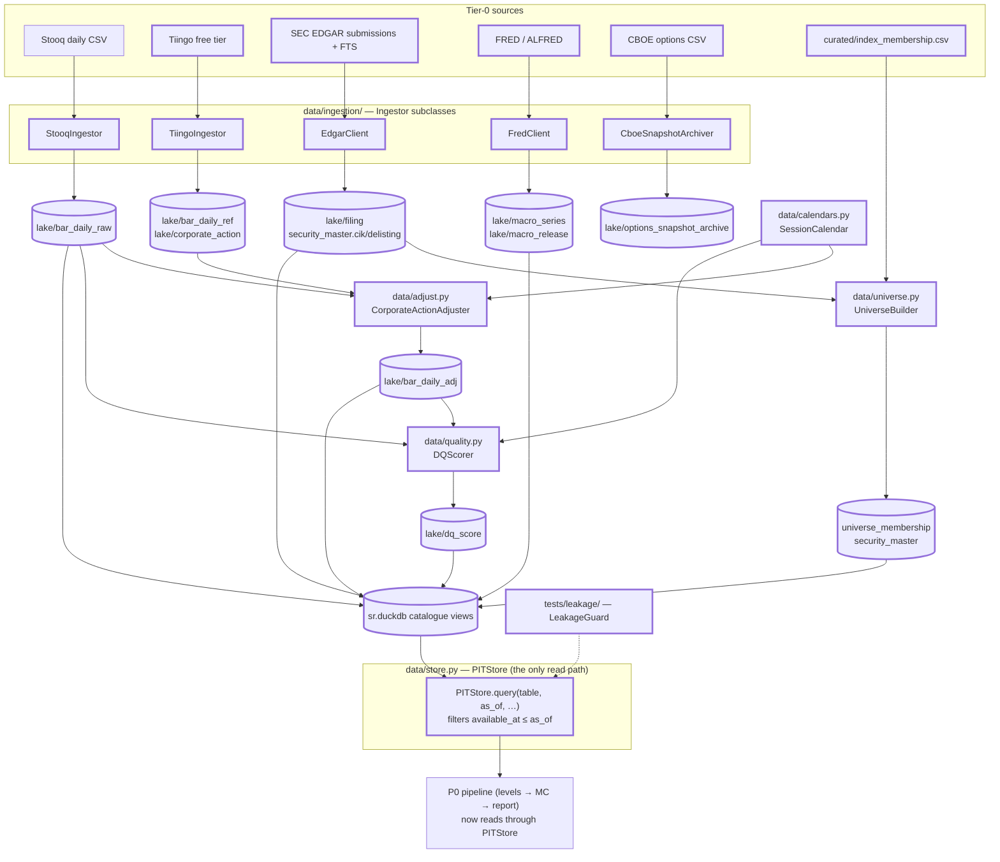

### 4.3 Data / work flow

**Batch ingestion** (`sr ingest --market US --from 2010-01-01`), idempotent per `(source, symbol, fetch_date)`:

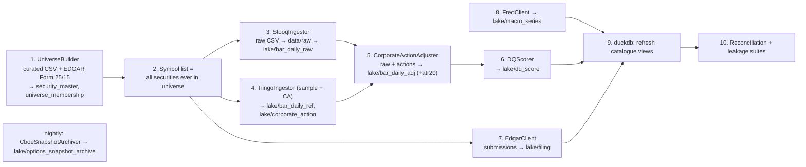

**Point-in-time read** (every downstream consumer, from P1 on):

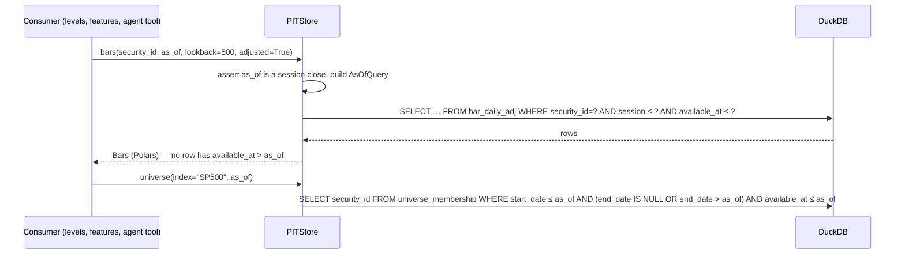

### 4.4 Layers & classes

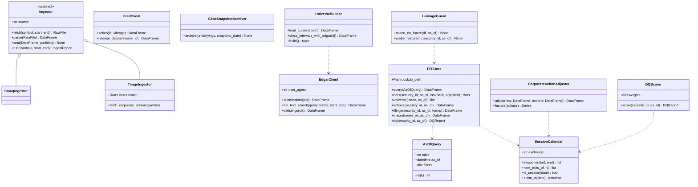

| Module | Class | Responsibility | Inputs → Outputs |
|---|---|---|---|
| `data/ingestion/base.py` | `Ingestor` | Fetch → raw file (immutable) → parse → Parquet partition. Every landed row gets `source`, `event_ts`, `available_at`, `ingested_at`. | symbols, dates → `IngestReport{n_rows, n_new, errors}` |
| `data/ingestion/stooq.py` | `StooqIngestor` | Price spine. `available_at = SessionCalendar.close_ts(session) + bar_publication_lag`. | → `bar_daily_raw` |
| `data/ingestion/tiingo.py` | `TiingoIngestor` | Reference prices + split/dividend factors for the sample; token-bucket limiter obeying the free-tier caps. | → `bar_daily_ref`, `corporate_action` |
| `data/ingestion/edgar.py` | `EdgarClient` | Submissions JSON → `filing(form, filed, acceptance_ts, accession, url)`; FTS for Form 25/15; CIK ↔ ticker map from `company_tickers.json`. `available_at = acceptance_ts`. | → `filing`, `security_master.cik` |
| `data/ingestion/fred.py` | `FredClient` | ALFRED vintages so revised series get `available_at = release_ts`. | → `macro_series`, `macro_release` |
| `data/ingestion/cboe.py` | `CboeSnapshotArchiver` | Nightly snapshot to Parquet; never read in this plan (D1). | → `options_snapshot_archive` |
| `data/adjust.py` | `CorporateActionAdjuster` | Backward adjustment (§4.6.1); writes `bar_daily_adj` with `adj_factor` so raw is recoverable; computes `atr20` column. | raw + actions → adjusted |
| `data/calendars.py` | `SessionCalendar` | Thin wrapper over `exchange_calendars`; materialises `session_calendar` table. | — |
| `data/universe.py` | `UniverseBuilder` | Curated CSV → intervals; closes open intervals with EDGAR delisting dates; assigns `security_id`; writes `security_master`, `universe_membership` with `available_at = max(announcement, effective)`. | → two tables |
| `data/quality.py` | `DQScorer` | §4.6.3 score + component breakdown + blockers. | → `dq_score` |
| `data/store.py` | `PITStore`, `AsOfQuery` | The only read path. `AsOfQuery.sql()` always appends `available_at <= :as_of`; there is no method that omits it (BP §10.4.3). | — |
| `tests/leakage/guard.py` | `LeakageGuard` | Test helper: recomputes a feature at `as_of` after deleting all rows with `available_at > as_of` and asserts equality. | — |

### 4.5 Data sources & storage

Sources: all of §2.5 become live in P1 except EDGAR document text (P4). New tables (DDL in Appendix A):

| Table | Grain | Key columns | `available_at` rule |
|---|---|---|---|
| `security_master` | one per security | `security_id, ticker, exchange, market, currency, cik, sector, listing_date, delisting_date` | Row valid from `listing_date`; `delisting_date` becomes known at the Form 25 acceptance ts |
| `universe_membership` | interval | `security_id, index_name, start_date, end_date, source_url` | `max(announcement_date, start_date)`; if only the effective date is known, effective date + 1 session (conservative) |
| `bar_daily_raw` | security × session | OHLCV as published, `source` | session close + `bar_publication_lag_minutes` (markets.yaml; 0 initial) |
| `bar_daily_ref` | security × session (sample only) | Tiingo OHLCV, `adj_close`, `split_factor`, `div_cash` | as above |
| `corporate_action` | security × ex_date × type | `action_type ∈ {split, dividend, special_dividend, spinoff, delist}`, `ratio`, `cash_amount`, `source` | announcement ts if known, else ex_date − 1 session |
| `bar_daily_adj` | security × session | adjusted OHLCV, `adj_factor`, `atr20` | `max(bar.available_at, latest action.available_at used)` — an adjusted bar is only knowable once the action is |
| `session_calendar` | exchange × session | `open_ts, close_ts, is_half_day` | −∞ (published years ahead) |
| `filing` | filing | `security_id, form, filed_date, acceptance_ts, accession, primary_doc_url` | `acceptance_ts` |
| `macro_series`, `macro_release` | series × obs date × vintage | `series_id, obs_date, value, vintage_ts` | `vintage_ts` (= release ts) |
| `dq_score` | security × as_of | `score, components(json), blockers(json)` | = `as_of` |
| `options_snapshot_archive` | underlying × snapshot date × contract | full CBOE row | snapshot ts (never queried in this plan) |

Parquet partitioning is `market=/year=` for bar-grain tables; DuckDB `sr.duckdb` holds `CREATE VIEW … AS SELECT * FROM read_parquet('data/lake/<t>/**/*.parquet', hive_partitioning=true)` for each, refreshed by `sr catalogue refresh`.

### 4.6 Algorithms & formulas

#### 4.6.1 Backward corporate-action adjustment (design-fixed §44)

Raw is never overwritten; adjusted is a pure function of raw + actions. For each security, with actions sorted by ex-date, the cumulative backward factor for session `t` is

```
f_t = Π_{u : ex_date_u > t}  g_u
g_u = 1/ratio_u                    for splits (2:1 → ratio 2 → g = 0.5)
g_u = 1 − D_u / C_{u−1}            for cash dividends D_u with ex-date u, C_{u−1} = raw close of the prior session
g_u = 1/(1 + spin_value/C_{u−1})   for spin-offs where a value is known, else treat as dividend of the reference source
```

Adjusted `O,H,L,C` are multiplied by `f_t`; adjusted volume is divided by the split-only product `Π ratio_u`. `adj_factor = f_t` is stored so `raw = adj / adj_factor`. Adjustment is recomputed on every ingest run — the factors change whenever a new action arrives, and `bar_daily_adj.available_at` records that.

#### 4.6.2 Reconciliation test (gate a)

Sample 50 securities stratified by (decile of dollar volume) × (has-a-split-since-2010), 200 sessions each, uniformly from 2010–present. For each `(security, session)` compare Stooq-derived `adj_close` with Tiingo's:

```
rel_err = |adj_close_stooq − adj_close_tiingo| / adj_close_tiingo
pass    ⇔  rel_err ≤ 0.001  or  |Δ| ≤ 1 tick
gate    ⇔  pass rate ≥ 99.0 %  and  no security has pass rate < 95 %
```

Failures are written to `research/reconciliation_failures.parquet`; a security with < 95 % is marked `dq.blockers += ["reconciliation"]` until resolved.

#### 4.6.3 Data-quality score (design-fixed §43)

For security `i` at `as_of`, over the trailing 252 sessions:

```
c_missing  = 1 − (#sessions with no bar) / 252
c_stale    = 1 − (#sessions with close == prev close and volume == 0) / 252
c_spike    = 1 − (#sessions with |log return| > 8·σ_60) / 252      σ_60 = trailing 60-session std of log returns
c_ca       = 1 if every |overnight gap| > 25 % coincides with a known action, else 1 − (#unexplained)/(#gaps)
c_calendar = 1 − (#bars on non-sessions + #sessions with no bar) / 252
c_fresh    = 1 if last bar session == last session ≤ as_of, else exp(−(#sessions late)/2)
c_sources  = (#available optional sources)/(#optional sources declared)     (options, offexchange, orderbook, text…)

DQ = Σ_k w_k·c_k,   w = {missing .20, stale .10, spike .15, ca .20, calendar .10, fresh .15, sources .10}   (initial, thresholds.yaml)
```

`blockers` lists any component < 0.5. `DQ < 0.7` suppresses publication (BP §9.3); `DQ < 0.8` fails the publication threshold (BP §10.5). Under D1, `c_sources` is structurally ≤ 0.5 for every US name; the weight is small so that the floor for a clean daily-bar history is ≈ 0.95.

#### 4.6.4 Point-in-time universe reconstruction (gate b, kill criterion)

1. Load `curated/index_membership.csv`. Every row has a `source_url`. Rows without one are rejected by the loader.
2. Open intervals (`end_date IS NULL`) for tickers that no longer trade are closed with the EDGAR Form 25 (delisting) or Form 15 (deregistration) acceptance date; if neither exists, with the last Stooq bar date and `source_url = "stooq:last_bar"` flagged as *weak*.
3. Ticker re-use (e.g. a symbol reassigned to a new company) is resolved by CIK: one `security_id` per CIK per listing.
4. **Gate b** is a query: `COUNT(DISTINCT security_id) WHERE index='SP500' AND start_date ≤ '2015-06-30' < end_date AND delisting_date IS NOT NULL` must be ≥ 60 (the S&P 500 turns over ≈ 20–30 names/yr; 2015→2026 implies well over 100 departures, of which a large fraction were acquisitions or delistings).
5. **"Cannot assemble"** means: after two weeks of curation, > 10 % of 2015 members have no price history in Stooq or no closing evidence. The descope (BP §12 P1 kill) is then: restrict the universe to securities with complete history *and* keep the delisted ones we did find, and record the coverage ratio in `research/universe_coverage.md` so the survivorship residual is stated, not hidden.

#### 4.6.5 Session arithmetic

`sessions(as_of, n)` = the first `n` entries of `calendar.sessions_in_range(as_of + 1 day, as_of + 30 days)`. Forecast window = `sessions(t, 5)`. A label window that would cross a missing bar (halt) is flagged `label_gap = true` and excluded from training (P2).

#### 4.6.6 Leakage suite (gate c)

For every registered feature `f` (P1: `atr20`, `sessions`, `dq`, and the P0 generators), for a random sample of `(security_id, as_of)`:

```
v₁ = f(security_id, as_of)                                 # normal computation via PITStore
v₂ = f(security_id, as_of) on a store copy where every row with available_at > as_of is deleted
assert v₁ == v₂
```

plus a static check that every SQL emitted by `PITStore` contains `available_at <=`. This suite runs in CI on every commit from P1 onward.

### 4.7 Tests that decide the gate

- `tests/data/test_reconciliation.py` — §4.6.2 on the frozen sample (sample ids committed in `tests/fixtures/recon_sample.csv`).
- `tests/data/test_universe.py` — gate b query; every membership row has a `source_url`; no overlapping intervals per (security, index).
- `tests/leakage/test_pit.py` — §4.6.6; `AsOfQuery` cannot be constructed without `as_of`.
- `tests/data/test_adjust.py` — a 2:1 split and a $1 dividend fixture reproduce hand-computed factors; `raw == adj / adj_factor` to 1e-12.
- `tests/data/test_calendar.py` — `sessions('2026-09-11', 5) == ['2026-09-14', …, '2026-09-18']`; a half-day counts.
- `tests/determinism/test_ingest_replay.py` — two ingest runs over the same raw files produce identical `bar_daily_adj` partitions (hash compare).

### 4.8 Deliverables

- [ ] Five ingestors, adjuster, calendar, universe builder, DQ scorer, `PITStore`.
- [ ] `data/curated/index_membership.csv` for S&P 500 + 400, 2010→present, with per-row sources; `research/universe_coverage.md`.
- [ ] `sr ingest`, `sr catalogue refresh`, `sr dq TICKER`, `sr cboe-archive` CLIs; a cron line for the nightly CBOE archive.
- [ ] P0 pipeline re-pointed to `PITStore.bars()`.
- [ ] CI: unit + leakage + determinism suites; import-linter layer rules (§2.2).

---

## 5. P2 — Levels, labels, and the matched-control gate (Weeks 4–6)

### 5.1 Objective, gate, kill

> All Tier-0 generators (families A–F), ATR-space HDBSCAN, zone identity + state machine, triple-barrier labels, the full level-reaction database, and the §7.3 matched-control experiment.
> **Gate — THE decision point:** real zones beat matched-distance placebos on hold rate and reaction magnitude, per distance decile, bootstrap CI excluding zero, in at least two distinct regimes, for at least three generator families.
> **Kill:** no family beats placebo → the premise is not supported on daily bars for this universe. Options then are (i) drop to intraday, (ii) restrict to the families that *did* work, or (iii) stop. **Do not proceed to modelling by adding features until something works.** — BP §12 P2

Under D1, option (i) is unavailable; the kill path is (ii) or (iii).

### 5.2 Architecture (this phase)

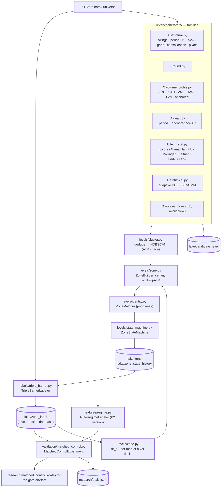

### 5.3 Data / work flow

**Weekly level build**, run for every `(security, Friday as_of)` in the universe from 2010 (`sr levels build --from 2010-01-08`):

```mermaid
flowchart LR
    S0["as_of = Friday close\nbars = PITStore.bars(id, as_of, 756)"] --> S1["run every generator\n→ CandidateLevel[] (N ≈ 40–80)"]
    S1 --> S2["dedupe: same source+level within 0.05 ATR"]
    S2 --> S3["HDBSCAN on level/ATR20"]
    S3 --> S4["ZoneBuilder: center, [L,U] = center ± q·ATR/2,\nside, distance, n_sources, n_families"]
    S4 --> S5["ZoneMatcher: inherit zone_id from prior week\nor mint new"]
    S5 --> S6["ZoneStateMachine.step(bars since prior as_of)\n→ state, polarity, touch_count"]
    S6 --> S7["write candidate_level, zone, zone_state_history"]
    S7 --> S8["TripleBarrierLabeler over sessions(as_of, 5)\n(runs only when as_of + 5 sessions ≤ now)"]
    S8 --> S9["write zone_label"]
```

**Matched-control experiment** (`sr research matched-control`): reads `zone` ⋈ `zone_label` ⋈ regime, samples placebos, computes the lift table (§5.6.9), writes the gate artefact and a `trials.jsonl` line.

### 5.4 Layers & classes

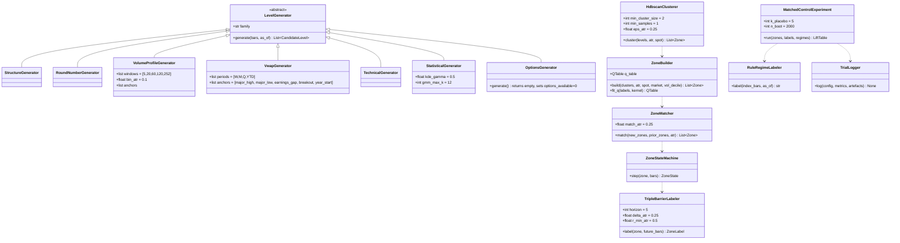

| Module | Class | Responsibility | Inputs → Outputs |
|---|---|---|---|
| `levels/generators/structure.py` | `StructureGenerator` (family A) | P0 swings + prior day/week/month/quarter H/L, 52-week and YTD extremes, open/filled gap edges, consolidation boundaries, prior breakout/breakdown pivots (§5.6.1) | `Bars, as_of → CandidateLevel[]` |
| `levels/generators/volume_profile.py` | `VolumeProfileGenerator` (C) | Daily-bar volume profiles over five windows + event-anchored windows (§5.6.1) | idem |
| `levels/generators/vwap.py` | `VwapGenerator` (D) | Period and anchored VWAPs (§5.6.1) | idem |
| `levels/generators/technical.py` | `TechnicalGenerator` (E) | Classic + Camarilla pivots, Fibonacci, Bollinger, Keltner, GARCH envelope (§5.6.1) | idem |
| `levels/generators/statistical.py` | `StatisticalGenerator` (F) | Adaptive KDE and BIC-GMM over turning points (§5.6.1) | idem |
| `levels/generators/options.py` | `OptionsGenerator` (G) | Stub returning `[]`; exists so family G has a slot and `options_available = 0` is emitted (D1) | — |
| `levels/cluster.py` | `HdbscanClusterer` | Dedupe + HDBSCAN in ATR space (§5.6.2) | `CandidateLevel[] → cluster[]` |
| `levels/zone.py` | `ZoneBuilder`, `fit_q` | Zone geometry with learned width (§5.6.3) | clusters → `Zone[]` |
| `levels/identity.py` | `ZoneMatcher` | Persistent `zone_id` across weeks (§5.6.4) | — |
| `levels/state_machine.py` | `ZoneStateMachine` | State/polarity/touch-count updates (§5.6.5) | → `zone_state_history` rows |
| `labels/triple_barrier.py` | `TripleBarrierLabeler` | Labels (§5.6.6); `labels/{touch,hold,reaction}.py` hold the per-label helpers | `Zone, future bars → ZoneLabel` |
| `features/regime.py` | `RuleRegimeLabeler` | P2 rule-based regime (§5.6.8); upgraded to HMM in P3 | index bars → label |
| `validation/matched_control.py` | `MatchedControlExperiment` | Placebo sampling, lift, bootstrap CI, FDR (§5.6.9) | → `LiftTable`, markdown |
| `validation/trials.py` | `TrialLogger` | Appends one JSON line per evaluated configuration (§5.6.10) | — |

### 5.5 Data sources & storage

Inputs: `bar_daily_adj` (via `PITStore`), `filing` (earnings-date anchors for the anchored profiles/VWAPs: the 8-K Item 2.02 acceptance date), index bars (SPY / `^SPX` from Stooq) for the regime labeler. No new external source.

New tables (level-reaction database, design-fixed §15):

| Table | Grain | Columns beyond §2.6 | `available_at` |
|---|---|---|---|
| `candidate_level` | security × as_of × candidate | `level, lower, upper, source, family, timeframe, formed_at, meta{k, window, anchor, rank, …}` | max over inputs (the generator's own `available_at`; for swings, confirmation close) |
| `zone` | zone × as_of | `zone_id, side, lower, upper, center, width_atr, distance_atr, n_sources, n_families, redundancy_ratio, provenance(json: candidate ids + weights), q_used, vol_decile, market` | = `as_of` |
| `zone_state_history` | zone × session | `state, polarity, touch_count, hold_count, break_count, last_touch_session, age_sessions` | session close |
| `zone_label` | zone × as_of | `y_touch, y_hold, y_break, y_reaction, t_touch, t_react, t_break, entry_price, label_gap, horizon_end` | `horizon_end` close (labels are known only after the window) |
| `regime_label` | market × session | `regime ∈ {strong_bull, weak_bull, range, weak_bear, strong_bear, high_vol}`, `trend_z, vol_pctile` | session close |
| `matched_control_result` | experiment × family × decile × regime | `n_real, n_placebo, hold_real, hold_placebo, lift, ci_lo, ci_hi, p_value, q_value, reaction_real, reaction_placebo` | run ts |
| `research/trials.jsonl` | one line per evaluated configuration | §5.6.10 | — |

Expected volume: ~900 securities × ~850 Fridays × ~8 zones ≈ 6 M zone rows, ~50 M candidate rows; both are comfortable in Parquet + DuckDB on the target workstation.

### 5.6 Algorithms & formulas

#### 5.6.1 Candidate generators (BP §6.2)

All generators emit `CandidateLevel` with half-width `0.1·ATR` (**initial**; the zone width is decided later by `q`, §5.6.3) and a family letter. Unless stated, `timeframe = "1D"` and `available_at = as_of` close.

**Family A — structure.** P0 swings (§3.6.2) on daily bars, plus weekly-bar swings (`timeframe="1W"`, bars resampled by ISO week); `prev_{day,week,month,quarter}_{high,low}`; `52w_{high,low}`, `ytd_{high,low}`; **gap edges**: for each session with `Open_s > High_{s−1}` (gap up) emit `High_{s−1}` and `Open_s` (`source="gap_up_edge"`) until filled (`Low_u ≤ High_{s−1}` for some later `u`); symmetric for gap down; **consolidation boundaries**: any run of ≥ 10 sessions with `(max High − min Low) ≤ 2·ATR` emits its max and min; **breakout pivots**: the level of a consolidation boundary that was subsequently closed through by > δ, re-emitted as `source="broken_boundary"` with the flip recorded in `meta.polarity_flip`.

**Family C — volume profile** (SR-Plan §1.1, design-fixed §11) from daily bars. For window `w ∈ {5, 20, 60, 120, 252}` sessions ending at `as_of`, with `bin_width = c·ATR₂₀`, `c = 0.1` (**initial**):

```
Each session s contributes V_s spread uniformly over [L_s, H_s]   (daily bars have no intra-bar distribution)
VP(b) = Σ_s V_s · |bin_b ∩ [L_s, H_s]| / (H_s − L_s)
POC   = argmax_b VP(b)
VA    = smallest set of bins, grown outward from POC one bin at a time on the heavier side, with Σ VP ≥ 0.70·Σ_all VP;  VAH = top of VA, VAL = bottom
Smooth: VP̃ = VP ⊛ Gaussian(σ = 1 bin)
HVN   = local maxima of VP̃ with VP̃ ≥ 1.5 · median(VP̃)
LVN   = local minima of VP̃ with VP̃ ≤ 0.5 · median(VP̃)
```

Each of POC/VAH/VAL/HVN/LVN is a candidate with `source="{name}_{w}d"` and `meta.volume_pctile`. **Anchored profiles** repeat the computation from an anchor session to `as_of` for anchors: last earnings (8-K 2.02 acceptance date), last gap > 2·ATR, last 252-day high, last 252-day low.

**Family D — VWAP** (design-fixed §12). `VWAP_{a→t} = Σ_{s=a..t} P̄_s V_s / Σ V_s` with `P̄_s = (H_s+L_s+C_s)/3` (daily typical price). Periods: current week, month, quarter, YTD. Anchors: last major swing high/low (k=2 swing), last earnings gap, last breakout pivot, year start. `meta.slope = (VWAP_t − VWAP_{t−5})/ATR`.

**Family E — technical.**

```
Classic pivots (prior week H,L,C):  P=(H+L+C)/3;  R1=2P−L; S1=2P−H;  R2=P+(H−L); S2=P−(H−L);  R3=H+2(P−L); S3=L−2(H−P)
Camarilla (SR-Plan §3.3):           H3=C+(H−L)·1.1/4;  H4=C+(H−L)·1.1/2;  L3=C−(H−L)·1.1/4;  L4=C−(H−L)·1.1/2
Fibonacci of dominant swing (largest k=2 swing in the last 120 sessions, from low ℓ to high h or vice-versa):
                                    level_r = h − r·(h−ℓ),  r ∈ {0.236, 0.382, 0.5, 0.618, 0.786}
Bollinger (20, 2):                  SMA20 ± 2·σ20 of close
Keltner (20, 1.5):                  EMA20 ± 1.5·ATR20
GARCH(1,1) envelope:                fit on 750 sessions of log returns (arch package, zero mean, Student-t);
                                    σ²_{5} = Σ_{j=1..5} E[σ²_{t+j}]  (multi-step forecast);  level_±k = C_t · exp(±k·sqrt(σ²_5)),  k ∈ {1, 2}
```

**Family F — statistical** (SR-Plan §3.1–3.2). Turning points `P_i` = all k≥0.5 swing highs/lows of the last 504 sessions, weight `ω_i` = volume of the swing session.

```
KDE:  f̂(p) = Σ_i ω_i · K((p − P_i)/h) / (h·Σ ω_i),   K Gaussian,   h = γ·ATR₁₄,  γ = 0.5 (initial)
      candidates = local maxima of f̂ on a grid of 0.05·ATR, with meta.density = f̂/max f̂
GMM:  fit 1-D Gaussian mixtures with K = 1..12 (sklearn, weighted by ω_i via sample repetition), pick K by BIC;
      candidates = μ_k with meta.weight = w_k, half-width = max(0.1·ATR, σ_k)
```

**Family G — options.** Stub (D1). Emits nothing; `features.options_available = 0`.

#### 5.6.2 Dedupe and HDBSCAN clustering (BP §6.1; design-fixed §13)

1. Dedupe: candidates with the same `source` within `0.05·ATR` collapse to their mean.
2. Normalise: `x_i = level_i / ATR₂₀`. One-dimensional input, metric = absolute difference.
3. HDBSCAN (`hdbscan` package): `min_cluster_size = 2`, `min_samples = 1`, `cluster_selection_epsilon = 0.25`, `cluster_selection_method = "leaf"` (**initial**, all in `thresholds.yaml`). Noise points (label −1) become singleton clusters — a lone 52-week high is still a zone.
4. Clusters spanning more than `1.0·ATR` are split at their widest internal gap (a guard against chaining).

#### 5.6.3 Zone geometry and the learned width `q` (BP §6.3)

For a cluster `𝒞` with members `(level_i, family_i, meta_i)`:

```
w_i     = family_base[family_i] · recency_i,   family_base = 1 initially (all families equal; learned weights are a P3 feature, not a P2 input)
          recency_i = exp(−λ·age_i), λ = 1/252 (initial), age in sessions since formed_at (round numbers: age = 0)
center  = Σ w_i·level_i / Σ w_i
width   = q(market, vol_decile)·ATR₂₀
[L, U]  = [center − width/2, center + width/2]
side    = support if center < close_t else resistance;  clusters containing close_t are dropped
n_sources = |𝒞|,  n_families = |{family_i}|,  redundancy_ratio = n_sources / n_families    (BP §6.4)
```

`vol_decile` = decile of 20-session realised volatility across the market's universe at `as_of`.

**Fitting `q`** (`ZoneBuilder.fit_q`). Bootstrap `q` from an **initial** value of 0.5 and refine on the level-reaction database once labels exist, using only training-window years (BP §7.4). For each `(market, vol_decile)` bucket, let `𝒯` be the set of touched zones and `e_z` the ATR-normalised distance from the zone center to the *reaction point* (the extreme reached after entry). Choose `q` to maximise the out-of-sample log-likelihood of those reaction points under a boxcar-plus-Gaussian kernel centred on the zone:

```
q* = argmax_q  Σ_{z∈𝒯} log[ (1−π)·𝟙(|e_z| ≤ q/2)/q  +  π·N(e_z; 0, (q/2)²) ],   π = 0.2
```

evaluated on validation years only; `q` is clipped to `[0.2, 1.5]`. The fitted table is versioned (`q_table_version`) and stored with the zone (`q_used`). Until the first fit, `q = 0.5` and `q_table_version = "init"`.

#### 5.6.4 Zone identity across weeks (BP §6.1; design-fixed §64)

For each new zone `z` at `as_of` and the prior week's zones `Z_prev` for the same security:

```
candidates = { p ∈ Z_prev : |center_z − center_p| ≤ 0.25·ATR₂₀ }
J(z, p)    = |sources(z) ∩ sources(p)| / |sources(z) ∪ sources(p)|         (source = generator name, not level value)
match      = argmax_{p ∈ candidates, J > 0} J(z,p);   ties → smallest |Δcenter|
```

A matched zone inherits `zone_id`, `touch_count`, `hold_count`, `break_count`, `polarity_history`, and `formed_at`; an unmatched one is minted `{TICKER}-{S|R}-{ISOyear}W{week}-{nn}`. A prior zone that no new zone matches is retired (`state = RETIRED` in `zone_state_history`) but keeps its id, so a later revival re-links by the same rule against the last 12 weeks, not only the prior week.

#### 5.6.5 Zone state machine (design-fixed §63)

```mermaid
stateDiagram-v2
    [*] --> UNTESTED
    UNTESTED --> APPROACHING : |dist| ≤ 1·ATR
    APPROACHING --> UNTESTED : |dist| > 1·ATR for 5 sessions
    APPROACHING --> TOUCHED : Low ≤ U and High ≥ L
    UNTESTED --> TOUCHED : Low ≤ U and High ≥ L (gap into zone)
    TOUCHED --> HELD : reaction ≥ R_min before breach
    TOUCHED --> BROKEN : Close beyond L−δ / U+δ first
    HELD --> RETEST : price re-enters zone later
    RETEST --> HELD : reaction ≥ R_min
    RETEST --> BROKEN : breach
    BROKEN --> FLIPPED : polarity flips (S→R or R→S); retest from the other side
    FLIPPED --> HELD : retest holds as new polarity
    FLIPPED --> BROKEN : retest fails
    HELD --> RETIRED : unmatched for 12 weeks
    BROKEN --> RETIRED : unmatched for 12 weeks
```

`ZoneStateMachine.step(zone, bars)` replays the sessions since the prior `as_of` in order and applies the transitions with the §2.4 event definitions; every transition appends a `zone_state_history` row. `touch_count` increments on each `→ TOUCHED` or `→ RETEST`; `hold_count`/`break_count` on `→ HELD`/`→ BROKEN`. `polarity_history` records `"resistance->support@{session}"` on `→ FLIPPED`.

#### 5.6.6 Triple-barrier labels (BP §7.1; design-fixed §16)

For zone `[L,U]` (support case; resistance mirrors signs) at `as_of = t`, over `sessions(t, 5) = s₁..s₅`, with `ATR = ATR₂₀(t)`, `δ = 0.25·ATR`, `R_min = 0.5·ATR`:

```
touch session  s₀ = min{ s_j : L_{s_j} ≤ U and H_{s_j} ≥ L }        Y_touch = 1[s₀ exists], T_touch = j
entry price    E  = clip(O_{s₀}, L, U) if O_{s₀} ∈ [L,U]  else  U   (first price inside the zone: the open if it opens inside, else the upper bound crossed from above)
for sessions s ≥ s₀ in order (including s₀):
    breach_s   = C_s < L − δ
    react_s    = H_s ≥ E + R_min
    tie rule within one session: if both react_s and breach_s, the session's OPEN decides —
        O_s ≥ E → reaction is assumed to have come first (HELD);  O_s < E → breach first (BROKEN)
    first session with react → Y_hold = 1, Y_break = 0, T_react = j
    first session with breach → Y_break = 1, Y_hold = 0, T_break = j
neither by s₅ → Y_hold = Y_break = 0 (touched, unresolved; kept in the hold model as a censored 0 with flag unresolved=1)
Y_reaction = (max_{s₀ ≤ s ≤ s₅, s ≤ first breach} H_s − E) / ATR        (support; for resistance: (E − min L_s)/ATR)
```

`Y_hold`, `Y_break`, `Y_reaction`, `T_react`, `T_break` are `NULL` when `Y_touch = 0` (BP §7.2 — they are conditional labels). `label_gap = 1` if any session in the window is missing a bar; such rows are excluded from all gates. Labels are written with `available_at = close(s₅)`.

#### 5.6.7 Approach features captured at touch (design-fixed §53)

Stored on `zone_label` for the P3 hold model: `approach_velocity = (C_{s₀−1} − C_{s₀−5})/ATR`, `consec_down = #consecutive down closes before s₀`, `gap_into = 1[O_{s₀} < L_{s₀−1}]`, `vol_accel = V_{s₀−1} / mean(V_{s₀−21..s₀−2})`, `vwap_dist = (C_{s₀−1} − VWAP_week)/ATR`.

#### 5.6.8 Rule-based regime labeler (P2 version; design-fixed §17)

On the market index (SPY for US, `^HSI` for HK) at `as_of`:

```
trend_z    = (C − SMA_200) / (σ_20·sqrt(200))            standardised distance from the 200-day mean
vol_pctile = percentile rank of σ_20 over the trailing 3 years
regime     = high_vol      if vol_pctile ≥ 0.90
           = strong_bull   if trend_z ≥ +1.0
           = weak_bull     if 0 < trend_z < 1.0
           = weak_bear     if −1.0 < trend_z ≤ 0
           = strong_bear   if trend_z ≤ −1.0
           (range = |trend_z| < 0.25 overrides weak_bull/weak_bear)
```

"Two distinct regimes" for the gate means two of `{bull := strong_bull ∪ weak_bull, bear := strong_bear ∪ weak_bear, range, high_vol}` each with ≥ 5 000 touched real zones.

#### 5.6.9 Matched-control experiment (BP §7.3) — the gate

For every real zone `z` (security `i`, `as_of` `t`, side, distance `d_z`, width `w_z`) sample `K = 5` placebos:

```
d_k  = d_z + ε_k,  ε_k ~ U(−0.1, +0.1) ATR, same sign as d_z
center_k = C_t + d_k·ATR,   [L_k, U_k] = center_k ± w_z/2
reject and resample if [L_k,U_k] overlaps any real zone of (i,t) by more than 25 % of its width
```

Placebos are labelled with the identical `TripleBarrierLabeler`. Then, per stratum `g` = (family ∈ provenance, distance decile of `|d|` over all real zones, regime):

```
hold_rate_real(g) = mean(Y_hold | Y_touch=1, real, g)         hold_rate_pl(g) = same over placebos
lift(g)           = hold_rate_real − hold_rate_pl
reaction_lift(g)  = mean(Y_reaction | touched, real) − mean(Y_reaction | touched, placebo)
CI                = BCa bootstrap, B = 2000, resampling by (security, ISO-week) cluster so overlapping labels stay together
p(g)              = two-sided bootstrap p-value;  q(g) = Benjamini–Hochberg over all (family × decile) cells within a regime
```

**Gate condition** (BP §12 P2), evaluated on 2010–2021 only (2022+ is sealed for P3's test years): there exist ≥ 3 families and ≥ 2 regimes such that, for that family and regime, `lift(g) > 0` with `ci_lo(g) > 0` and `q(g) < 0.10` in **every** distance decile that has `n_real ≥ 500`, and `reaction_lift` shares the sign in at least half of those deciles. The artefact is the table (family × decile × regime → n, hold_real, hold_placebo, lift, CI, q) written to `research/matched_control_{date}.md` and `matched_control_result`.

Note also the H1' test (BP §6.4): regress `Y_hold` on `n_independent_families` and `n_sources` (logit, touched real zones, distance-decile fixed effects); report both coefficients with cluster-robust SEs. This is informational in P2 and becomes a feature-selection input in P3.

#### 5.6.10 `research/trials.jsonl` (BP §7.4)

One line per evaluated configuration, from the first matched-control run onward, so the P5 Deflated Sharpe has a true trial count:

```json
{"trial_id": "uuid", "ts": "2026-10-03T14:02:11Z", "phase": "P2", "kind": "matched_control|fit_q|model|ablation|threshold",
 "git_sha": "…", "config_hash": "…", "config": {...}, "data_window": ["2010-01-08","2021-12-31"],
 "metrics": {...}, "artefacts": ["research/matched_control_2026-10-03.md"], "note": "…"}
```

`TrialLogger.log` is called by every experiment entry point; a CI check fails if an experiment script imports `TrialLogger` but does not call it.

### 5.7 Tests that decide the gate

- `tests/levels/test_generators.py` — each family on synthetic bars with known answers (e.g. a synthetic profile with one heavy bin yields POC there; VWAP of constant price = price; Camarilla arithmetic; Fibonacci of a known swing; KDE peak at a repeated turning point).
- `tests/levels/test_cluster.py` — HDBSCAN merges levels 0.2 ATR apart, keeps 0.6 apart; a lone level survives as a singleton; the chaining guard splits a 1.5-ATR chain.
- `tests/levels/test_identity.py` — a zone persisting three weeks keeps its id; a 0.3-ATR drift with disjoint sources mints a new id.
- `tests/levels/test_state_machine.py` — every transition in §5.6.5 exercised on hand-built bar sequences, including the gap-into-zone and the tie rule.
- `tests/labels/test_triple_barrier.py` — the six label outcomes (no touch; hold; break; unresolved; reaction magnitude; label_gap) plus Hypothesis property tests: `Y_hold + Y_break ≤ 1`, `Y_hold = 1 ⇒ Y_reaction ≥ 0.5`, labels are `NULL` iff `Y_touch = 0`.
- `tests/leakage/test_levels.py` — `LeakageGuard.probe_feature` over every generator and over `zone_label` (a label must not be visible before `horizon_end`).
- `tests/validation/test_matched_control.py` — on a synthetic universe where zones are placed at random (no structure), the lift table shows no cell with `ci_lo > 0` after FDR in > 5 % of cells; on a synthetic universe with planted bounce behaviour, the planted family clears the gate.
- Gate: `sr research matched-control` produces the artefact and the §5.6.9 condition is true.

### 5.8 Deliverables

- [ ] Six generators + options stub; HDBSCAN clusterer; `ZoneBuilder` with `q` table (`init` then fitted); `ZoneMatcher`; `ZoneStateMachine`.
- [ ] `TripleBarrierLabeler` + approach features; level-reaction database built 2010→present for the P1 universe (`sr levels build`, `sr labels build`).
- [ ] `RuleRegimeLabeler`; `MatchedControlExperiment`; `TrialLogger` + `research/trials.jsonl`.
- [ ] Gate artefact `research/matched_control_{date}.md` and, if the gate fails, `research/rejected.md` with the per-family numbers and the chosen kill option.

---

## 6. P3 — Baselines, LightGBM, calibration, Monte Carlo (Weeks 7–10)

### 6.1 Objective, gate, kill

> Rungs 0–6 of §8. Walk-forward with purge + embargo. Isotonic calibration. Full MC path engine. Ablation harness and `trials.jsonl` in place from day one.
> **Gate:** calibrated LightGBM beats rung-3 logistic on Brier with bootstrap CI excluding zero, ECE < 0.05 in the three largest strata, calibration slope in [0.85, 1.15], and matched-control lift preserved after calibration.
> **Kill:** ML adds nothing over historical frequency → ship the statistical engine as the product. — BP §12 P3

### 6.2 Architecture (this phase)

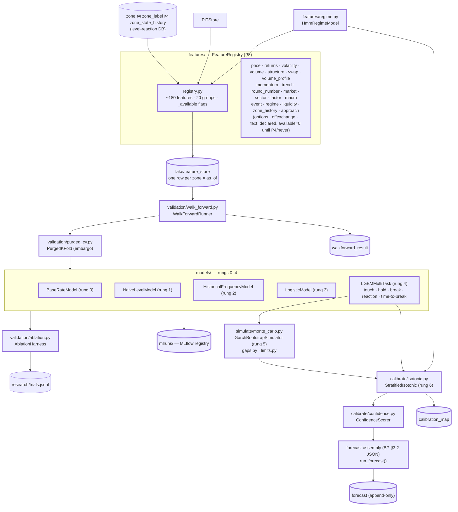

### 6.3 Data / work flow

**Training (annual walk-forward, `sr train --test-year 2022`)**:

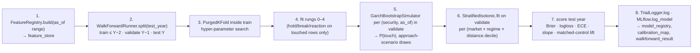

**Inference (`run_forecast(security_id, as_of, config_version)`)** — the deterministic core of every later phase:

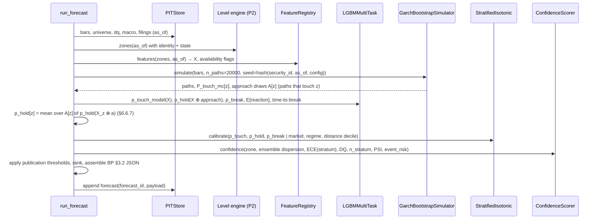

### 6.4 Layers & classes

```mermaid
classDiagram
    class FeatureSpec {
        +str name
        +str group
        +callable fn
        +int lookback
        +str available_at_rule
        +str dtype
    }
    class FeatureRegistry {
        +list~FeatureSpec~ specs
        +register(spec)
        +build(zones, as_of, store) DataFrame
        +availability(as_of) dict
    }
    class WalkForwardRunner {
        +int first_test_year = 2015
        +split(test_year) Split
        +run(model_factory, years) list~FoldResult~
    }
    class PurgedKFold {
        +int n_splits = 5
        +int embargo_sessions
        +split(X, label_windows) iterator
    }
    class SRModel {
        <<abstract>>
        +str rung
        +fit(X, Y, sample_weight)
        +predict(X) Predictions
    }
    class BaseRateModel
    class NaiveLevelModel
    class HistoricalFrequencyModel {
        +dict table
    }
    class LogisticModel {
        +list feature_subset
    }
    class LGBMMultiTask {
        +dict boosters
        +fit(X, Y)
        +predict(X) Predictions
        +shap(X) DataFrame
    }
    class Predictions {
        +Series p_touch
        +Series p_hold_cond
        +Series p_break_cond
        +Series e_reaction
        +Series t_break_q50
    }
    class PathSimulator {
        <<abstract>>
    }
    class GarchBootstrapSimulator {
        +int n_paths = 20000
        +int block_len = 5
        +simulate(bars, as_of, events, market_bars, seed) Paths
        +p_touch(paths, zone) float
        +approach_draws(paths, zone) DataFrame
        +quantiles(paths) dict
    }
    class PriceLimitHook {
        +truncate(paths, limit) Paths
    }
    class StratifiedIsotonic {
        +list strata_keys
        +int min_n = 500
        +fit(p, y, strata)
        +transform(p, strata) Series
        +ece(stratum) float
    }
    class ConfidenceScorer {
        +dict weights
        +score(zone_ctx) float
    }
    class AblationHarness {
        +run(groups, model_factory, years) DataFrame
    }
    class HmmRegimeModel {
        +int n_states = 6
        +fit(index_features)
        +probs(as_of) dict
    }
    SRModel <|-- BaseRateModel
    SRModel <|-- NaiveLevelModel
    SRModel <|-- HistoricalFrequencyModel
    SRModel <|-- LogisticModel
    SRModel <|-- LGBMMultiTask
    SRModel ..> Predictions
    PathSimulator <|-- GarchBootstrapSimulator
    GarchBootstrapSimulator ..> PriceLimitHook
    FeatureRegistry o-- FeatureSpec
    WalkForwardRunner ..> PurgedKFold
    AblationHarness ..> WalkForwardRunner
```

| Module | Class | Responsibility | Inputs → Outputs |
|---|---|---|---|
| `features/registry.py` | `FeatureRegistry`, `FeatureSpec` | Declarative feature catalogue; every feature emits `<name>` and `<name>_available`; `available_at_rule` is one of `bar_close`, `filing_acceptance`, `release_ts`, `label_horizon_end`, `always` and is what the leakage suite checks (§6.6.1) | zones, as_of → wide frame |
| `features/<group>.py` (20 modules) | functions | One module per group of BP §8.1; §6.6.2 lists the members | — |
| `features/regime.py` | `HmmRegimeModel` | 6-state Gaussian HMM on index features; emits `regime_probs` (features) and the argmax label (calibration stratum). Replaces the P2 rule labeler for features; the rule labeler is kept for reporting continuity. | index bars → probs |
| `validation/walk_forward.py` | `WalkForwardRunner` | Expanding-window schedule (§6.6.3) | — |
| `validation/purged_cv.py` | `PurgedKFold` | Purge + embargo splits inside the training window (§6.6.3) | — |
| `models/baseline.py` | `BaseRateModel`, `NaiveLevelModel`, `HistoricalFrequencyModel` | Rungs 0–2 (§6.6.4) | — |
| `models/logistic.py` | `LogisticModel` | Rung 3 on ~30 features (§6.6.4) | — |
| `models/lgbm.py` | `LGBMMultiTask` | Rung 4: five boosters over one feature matrix (§6.6.5); SHAP via `booster.predict(pred_contrib=True)` | — |
| `models/survival.py` | `TimeToBreakModel` | Discrete-time hazard over sessions 1–5 (a LightGBM classifier on the person-period expansion); optional in P3, its output is the `t_break_q50` field | — |
| `simulate/monte_carlo.py` | `GarchBootstrapSimulator` | Rung 5 path engine (§6.6.6) | bars, events → paths |
| `simulate/gaps.py` | `OvernightGapModel` | Empirical overnight-gap distribution and event-jump mixture | — |
| `simulate/limits.py` | `PriceLimitHook` | Path truncation at daily price limits; a no-op for US/HK (D2) | — |
| `calibrate/isotonic.py` | `StratifiedIsotonic` | Rung 6 (§6.6.8) | — |
| `calibrate/confidence.py` | `ConfidenceScorer` | BP §9.3 (§6.6.9) | — |
| `validation/ablation.py` | `AblationHarness` | Leave-one-group-out / add-one-group ΔBrier with bootstrap CI (§6.6.10) | — |
| `models/forecast.py` | `run_forecast` | Assembles the BP §3.2 JSON; the only writer to `forecast` | → `forecast_id` |

### 6.5 Data sources & storage

Inputs: everything from P1–P2 plus Stooq sector ETF and index bars (XLK, XLF, …, SPY, `^SPX`, `^VIX` via FRED `VIXCLS`) and FRED macro (DGS10, DGS2, DFF, BAMLH0A0HYM2). No new external source.

| Table / artefact | Grain | Contents | `available_at` |
|---|---|---|---|
| `feature_store` (Parquet) | zone × as_of × feature_version | ~180 feature columns + ~180 `_available` flags + `feature_version`; wide layout, one Parquet partition per (market, year) | max over the inputs' `available_at` (= as_of close for bar features; filing/release ts for event/macro features) |
| `regime_label` (extended) | market × session | + `hmm_probs` (json), `hmm_label`, `hmm_version` | session close |
| `model_registry` (MLflow + DuckDB mirror) | model version | `model_version, rung, trained_through, validate_year, test_year, feature_version, params, metrics(json), q_table_version, git_sha, trial_id` | training run ts |
| `calibration_map` | model_version × stratum | isotonic breakpoints `(x[], y[])`, `n`, `ece`, `slope`, fallback level used | validate-year end |
| `walkforward_result` | model_version × test_year × metric × stratum | Brier, logloss, ECE, slope, matched-control lift, with bootstrap CI | — |
| `forecast`, `zone_forecast` (§2.6) | forecast | full JSON + flattened zones; append-only from P3 (historical replays are forecasts too, flagged `replay = true`) | `created_at` |
| `research/trials.jsonl` | — | every fit, every ablation cell, every threshold trial | — |

### 6.6 Algorithms & formulas

#### 6.6.1 Feature registry contract

```python
FeatureSpec(name="touch_count", group="zone_history", fn=zone_history.touch_count,
            lookback=0, available_at_rule="bar_close", dtype="int")
```

`FeatureRegistry.build` evaluates every enabled spec for every zone at `as_of`, writes `<name>` and `<name>_available` (0 when the source is missing, the lookback is not covered, or the group is disabled by D1), and records the per-row `available_at`. The leakage suite (§4.6.6) is parameterised over the registry, so adding a feature automatically adds its leakage test.

#### 6.6.2 Feature groups (~180 features; BP §8.1)

| Group | Count | Members (all ATR- or percentile-normalised where a price unit would otherwise leak scale) |
|---|---|---|
| `price` | 8 | range/ATR, body/ATR, upper/lower wick/ATR, close position in range, close vs 5/20/60-day mean /ATR |
| `returns` | 6 | log returns over 1, 2, 5, 10, 20, 60 sessions |
| `volatility` | 10 | ATR₂₀/close, realised σ₅/σ₂₀/σ₆₀, Parkinson, Garman–Klass, Rogers–Satchell (20), vol percentile (3y), σ₂₀/σ₆₀ ratio, GARCH σ₅ forecast |
| `volume` | 8 | relative volume 1/5/20, OBV slope, volume acceleration, volume percentile, dollar-volume rank in universe, volume surprise |
| `structure` | 12 | distance/ATR to prev day/week/month H/L, 52w H/L, YTD H/L; sessions since 52w high/low; open-gap count |
| `vwap` | 8 | distance/ATR to weekly/monthly/quarterly/YTD VWAP; count of VWAPs within 0.25/0.5/1 ATR; weekly VWAP slope |
| `volume_profile` | 10 | distance/ATR to POC/VAH/VAL (20, 60, 252), HVN count, LVN count, profile skew, kurtosis |
| `momentum` | 6 | RSI14, ROC10, stochastic %K, MACD hist/ATR, momentum acceleration, 20-day drawdown |
| `trend` | 6 | SMA20/50/200 distance/ATR, SMA slope, ADX14, trend persistence (sign runs) |
| `round_number` | 5 | distance/ATR to nearest $1/$5/$10 rung, rung rank of nearest, whether zone contains a rung |
| `market` | 8 | SPY returns 1/5/20, VIX level & 5-day change, breadth (% of universe above SMA50), index vol percentile, index trend_z |
| `sector` | 6 | sector ETF returns 5/20, stock−sector relative strength 5/20/60, sector breadth |
| `factor` | 6 | beta (60d), size rank, 12-1 momentum rank, low-vol rank, idiosyncratic vol, liquidity rank |
| `macro` | 6 | DGS10 level & 20d change, 2s10s slope, HY OAS & 20d change, days to next FOMC |
| `event` | 6 | days to next earnings (from 8-K cadence: last 8-K 2.02 + ~91 days until a date is filed), days since last 8-K, ex-dividend in window, event_risk score, days to FOMC/CPI (FRED release calendar), macro-heavy-week flag |
| `regime` | 8 | HMM state probabilities (6) + rule label one-hot compressed (2) |
| `liquidity` | 5 | ADV20, spread proxy (Corwin–Schultz), turnover, zero-volume days, price level bucket |
| `zone_history` | 14 | touch_count, hold_count, break_count, hold ratio, last-touch age, age with decay `e^{−λ·age}` (λ ∈ {1/63, 1/252}), polarity flips, mean past reaction, reaction σ, sessions between touches, state one-hot (4) |
| `zone_geom` | 10 | distance/ATR (signed), |distance|, width_atr, n_sources, n_families, redundancy_ratio, family one-hot (6), q_used, side |
| `approach` (hold model only) | 5 | §5.6.7 — at inference these come from MC draws, §6.6.7 |
| `options`, `offexchange`, `text`, `orderbook` | declared, empty | `_available = 0` in P3 (`text` becomes live in P4) |

Total ≈ 178 live in P3. The `distance` feature is deliberately included in every rung ≥ 3 — the gate is the matched-control lift *after* the model has distance, not a distance-blind model.

#### 6.6.3 Walk-forward and purged CV (BP §7.4)

Test years `Y = 2015 … 2021` in P3 (2022+ sealed until model selection is frozen). For each: `train = as_of.year ≤ Y−2`, `validate = Y−1`, `test = Y`. Within `train`, hyper-parameters use `PurgedKFold`:

```
label window of row r:  W_r = [as_of_r, horizon_end_r]  (5 sessions)
for fold k with validation rows V_k:
    purge:   drop train row r if W_r ∩ (∪_{v∈V_k} W_v) ≠ ∅
    embargo: additionally drop train rows with as_of ∈ (max_{v∈V_k} horizon_end, + E sessions],  E = H + max lookback of any feature = 5 + 252
```

Rows within the same `(security, as_of)` (all zones of one ticker-week) are always assigned to the same fold. Sample weights `1/(#zones of that ticker-week)` keep tickers with many zones from dominating.

#### 6.6.4 Rungs 0–3 (BP §8)

```
Rung 0  P(hold) = hold rate in the zone's distance decile (train years)
Rung 1  "naive levels": zones from prior-week H/L, ATR bands (±1,±2), classic pivots, Bollinger only;
        P(hold) = per-source hold rate by distance decile — i.e. what a chartist's toolbox gives
Rung 2  P(hold | source family, distance decile, regime) — a 3-way frequency table with Laplace smoothing (α = 5),
        backing off to (family, decile) then (decile) when n < 200
Rung 3  Logistic regression, L2, on 30 features chosen a priori: zone_geom (10), zone_history (8), volatility (4), regime (6), market (2)
```

Every rung produces `p_touch` (on all zones), `p_hold_cond`, `p_break_cond` (on touched), and rungs ≥ 3 an `e_reaction` regression.

#### 6.6.5 Rung 4 — LightGBM "multi-task" (BP §8, design-fixed §26)

LightGBM has no native multi-task head; "multi-task" here means **one feature matrix, five boosters, jointly validated**:

| Target | Rows | Objective | Notes |
|---|---|---|---|
| `p_touch` | all zones | `binary` | includes distance; the MC estimate is a *feature* (`mc_p_touch`) from rung 5 onward |
| `p_hold_cond` | `Y_touch = 1` | `binary` | features ⊕ approach features (§5.6.7); `unresolved` rows weighted 0.5 (**initial**) |
| `p_break_cond` | `Y_touch = 1` | `binary` | trained separately (not `1 − p_hold`) because of the unresolved class; then renormalised: `p_break ← p_break/(p_hold + p_break)` if the sum exceeds 1 |
| `e_reaction` | `Y_touch = 1` | `huber` | clipped at 5 ATR |
| `t_break` | `Y_touch = 1` | discrete hazard (`models/survival.py`) | person-period rows (zone × session 1..5), `binary` on "breaks this session | not yet" |

Parameters (**initial**, `models.yaml`): `num_leaves 31, learning_rate 0.03, n_estimators ≤ 3000 with early stopping on the purged validation fold (50 rounds), feature_fraction 0.7, bagging_fraction 0.7, min_child_samples 200, lambda_l2 10, max_bin 255, categorical: market, family, state, regime_label`. Monotone constraint: `p_touch` decreasing in `|distance|` (guards the confound from inverting). Attribution = TreeSHAP; the top-3 positive/negative contributions per zone populate `attribution` in the forecast JSON.

#### 6.6.6 Rung 5 — Monte Carlo path engine (BP §9.4; design-fixed §30)

Per `(security, as_of)`, `n_paths = 20 000` (**initial**, 10k–50k allowed), `H = 5`, seeded by `sha256(security_id, as_of, config_version)`.

```
1. Returns:      r_s = log(C_s/C_{s−1}) over the last 750 sessions (adjusted)
2. GARCH(1,1):   r_s = μ + ε_s,  ε_s = σ_s z_s,   σ²_s = ω + α ε²_{s−1} + β σ²_{s−1}     (arch, Student-t innovations; fit at as_of only on data ≤ as_of)
                 standardised residuals  ẑ_s = ε_s/σ_s;   forecast σ²_{t+1..t+5} by recursion
3. Market factor: β = OLS slope of r_s on index returns m_s (60 sessions);  idiosyncratic residual û_s = ẑ_s − β·(m_s/σ^m_s)
                 index path m̃_{t+j} drawn by block bootstrap of index standardised residuals with its own GARCH σ^m
4. Block bootstrap (block_len = 5) of û_s → ũ_{t+j};   z̃_{t+j} = β·m̃_{t+j} + ũ_{t+j}    (rescaled to unit variance over the bootstrap sample)
5. Close path:   C̃_{t+j} = C̃_{t+j−1} · exp( μ + σ_{t+j}·z̃_{t+j} )
6. Overnight gap: split each session's return into gap + intraday using the empirical ratio ρ_s = log(O_s/C_{s−1}) / r_s from the same bootstrapped session (keeps gap/intraday coherence)
7. High/low:     from the same bootstrapped session s take (H_s − max(O_s,C_s))/ATR_s and (min(O_s,C_s) − L_s)/ATR_s — the wick sizes — and scale by ATR at as_of:
                 H̃ = max(Õ, C̃) + wick_up·ATR_t,   L̃ = min(Õ, C̃) − wick_dn·ATR_t
8. Event jump:   if an earnings date (event group) falls in the window at session j*, with probability 1 draw an extra jump
                 J ~ mixture( 0.5·N(0, s_e²) + 0.5·Laplace(0, s_e/√2) ),  s_e = historical |earnings-day move| median for the security (fallback: sector median)
                 applied to the gap of session j*; the window's σ forecast is not otherwise changed
9. Price limits:  PriceLimitHook.truncate — no-op for US/HK; for A-shares would clip Õ,H̃,L̃,C̃ to ±limit·C̃_{j−1} and freeze the path if a limit is hit at the close (hook only, D2)
Outputs:
   P_touch_mc(z) = mean_paths 1[∃ j: L̃_j ≤ U_z and H̃_j ≥ L_z]
   P(Low < L), P(High > U), quantiles q05/q50/q95 of weekly high, low, close   (raw; ACI-calibrated in P5)
   approach draws A(z): for each path that touches z, the §5.6.7 approach features computed from the simulated bars up to the touch session
```

Replay determinism (BP §10.4.4): the RNG seed, the `arch` fit (deterministic given data), and the bootstrap index sequence are all functions of `(security_id, as_of, config_version)`; a CI test asserts byte-identical output across two processes.

#### 6.6.7 Conditioning `P(hold)` at Friday close (BP §7.2)

The hold booster needs approach features that are unknown at `t`. Integrate over the MC approach scenarios:

```
p_hold(z) = (1/|A(z)|) · Σ_{a ∈ A(z)} p_hold_cond( X_z ⊕ a )
p_break(z) analogously;  E[reaction](z) analogously
joint     = p_touch(z) · p_hold(z)      (published separately; BP §7.2)
```

If `|A(z)| < 200` (zone rarely touched in simulation), the approach features are set to their training medians and `confidence` is penalised via `sample_support`.

#### 6.6.8 Rung 6 — stratified isotonic calibration (BP §9.1) and metrics

Strata `g = (market, regime_label, distance decile)`. Fit `IsotonicRegression(out_of_bounds="clip")` on the validation year for each stratum with `n ≥ 500` (**initial**); fallback ladder `(market, regime) → (market) → global`. Metrics, reported per stratum and overall:

```
Brier  = (1/N) Σ (p_i − y_i)²
LogLoss= −(1/N) Σ [y_i log p_i + (1−y_i) log(1−p_i)]
ECE    = Σ_b (n_b/N) · |mean(p | b) − mean(y | b)|,  b = 10 equal-mass bins
slope  = β̂₁ from the logistic recalibration  logit P(y=1) = β₀ + β₁·logit(p)     (target 1; gate [0.85, 1.15])
ΔBrier(A vs B) with BCa bootstrap CI, B = 2000, cluster resampling by (security, ISO-week)
```

**Gate check** (BP §12 P3): `ΔBrier(rung 6 vs rung 3) < 0` with CI excluding 0 on every test year 2015–2021 pooled; `ECE < 0.05` and `slope ∈ [0.85, 1.15]` in the three largest strata; the §5.6.9 lift table recomputed with **published** zones (post-threshold) still shows positive lift with `ci_lo > 0` in the same families/regimes.

#### 6.6.9 Confidence score (BP §9.3)

```
model_agreement     = 1 − sd(p_hold over {rung 2, rung 3, rung 4, rung 4 ⊕ MC}) / 0.25       clipped to [0,1]
calibration_quality = 1 − ECE(stratum of z)
data_quality        = DQ(security, as_of)
sample_support      = min(1, log10(n_stratum)/4)                                                (n = 10 000 → 1)
regime_stability    = 1 − PSI(feature distribution at as_of vs training)/0.25                  clipped
penalty             = event_risk · 0.3
confidence          = Σ w_k·component_k − penalty,   w fit on the validation year by maximising the Spearman correlation between confidence and −(per-zone Brier); initial w = (0.25, 0.25, 0.2, 0.15, 0.15)
```

Publication (BP §10.5, frozen in `thresholds.yaml`): `p_touch ≥ 0.60 ∧ p_hold ≥ 0.65 ∧ confidence ≥ 0.70 ∧ DQ ≥ 0.80 ∧ event_risk ≤ 0.7`; rank by `p_touch · p_hold · E[reaction] · confidence`; top 2 per side, up to 4 when the 3rd/4th are within 10 % of the 2nd's score. `DQ < 0.7` suppresses all zones (refusal path).

#### 6.6.10 Ablation harness (BP §8 rung 7 mechanics, used from P3)

For a feature group `G`: fit rung 4 with and without `G` on the same folds; report `ΔBrier` with CI per test year and pooled; log each cell to `trials.jsonl`. `AblationHarness.run` also produces the design-fixed §66 ladder (price-only → +technical → +volume → …) as a single table. A group is *admitted* if pooled `ΔBrier < 0` with `ci_hi < 0`; rejected groups go to `research/rejected.md`.

### 6.7 Tests that decide the gate

- `tests/features/test_registry.py` — every spec has an `available_at_rule`; `build` emits exactly `2 × |specs|` columns; disabled groups emit `_available = 0`.
- `tests/leakage/test_features.py` — the §4.6.6 probe over all ~180 features on 200 random `(security, as_of)`; a feature whose rule is `bar_close` must be invariant to deleting any filing/macro row.
- `tests/validation/test_purged_cv.py` — no train row's window overlaps any validation window; embargo length asserted.
- `tests/models/test_rungs.py` — on a synthetic dataset with a planted signal each rung ≥ its predecessor on Brier; monotone constraint holds (`p_touch` non-increasing in `|distance|` on a grid).
- `tests/simulate/test_garch_mc.py` — determinism across processes; a zone at the spot has `P_touch_mc = 1`; simulated 5-day variance within 10 % of the GARCH forecast; the price-limit hook clips a synthetic A-share path.
- `tests/calibrate/test_isotonic.py` — perfectly calibrated input is unchanged; fallback ladder used when `n < 500`; ECE of the calibrated validation output ≤ raw.
- `tests/determinism/test_run_forecast.py` — `run_forecast` twice → identical `forecast_id` and byte-identical payload.
- Gate: `sr train --years 2015-2021` writes `walkforward_result` satisfying §6.6.8's gate check; `sr research matched-control --published` preserves lift.

### 6.8 Deliverables

- [ ] `FeatureRegistry` + 20 group modules + `HmmRegimeModel`; `feature_store` built 2010→present.
- [ ] Rungs 0–6; `GarchBootstrapSimulator` with gap/event/limit hooks; `StratifiedIsotonic`; `ConfidenceScorer`; `run_forecast`.
- [ ] `WalkForwardRunner`, `PurgedKFold`, `AblationHarness`; MLflow registry; `walkforward_result`, `calibration_map`.
- [ ] `sr train`, `sr forecast TICKER --as-of` (prints the JSON; no LLM yet), `sr research ablation`.
- [ ] Gate report `research/p3_gate_{date}.md`; if killed, the statistical engine (rung 2 + MC + isotonic) is what `run_forecast` ships.

---

## 7. P4 — Agent layer + enrichment (Weeks 11–14)

### 7.1 Objective, gate, kill

> MCP tools, agent loop, verifier, `GET /forecast/{ticker}`, terminal + HTML report. Then enrichment modules, each through the §8 rung-7 gate individually: options/GEX (US), events + LLM-extracted text features, sector/market context, intraday volume profile (only if Tier 2 was purchased). HK universe added here as the generalization test.
> **Gate:** each module admitted or rejected on its own ΔBrier; agent passes all five §10.4 guardrail test suites; HK model calibrates without architecture changes (market embedding + feature-availability flags only).
> **Kill (per module):** module fails ablation → it is removed, not "kept for completeness." — BP §12 P4

Under D1 the enrichment set is: **(a) events + LLM-extracted text features (EDGAR), (b) sector/market context, (c) HK universe.** Options/GEX and intraday volume profile are **not built**; §7.5 records the slots they keep.

**LLM provider policy.** The LLM is a *configurable reference*, not a dependency on one vendor: every call goes through an `LLMClient` interface with a role → (provider, model) mapping in `agent.yaml`, and adapters translate the MCP tool schemas into each provider's tool-calling format. BUILD-PLAN §10.3's model choices are the shipped *defaults* in that file, nothing more; swapping providers (hosted API, OpenAI-compatible endpoint, local server) is a config change, and the guardrail suites (§7.7) must pass against whichever provider is configured.

### 7.2 Architecture (this phase)

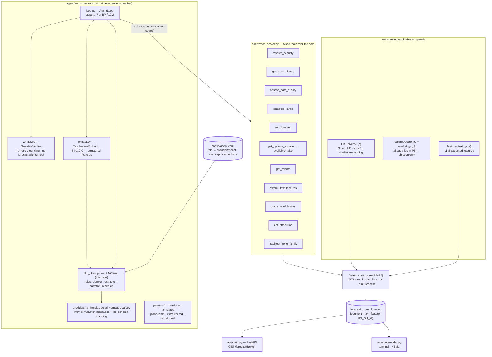

### 7.3 Data / work flow

**Interactive forecast (`sr forecast AAPL`, target < 60 s, ≤ cost cap):**

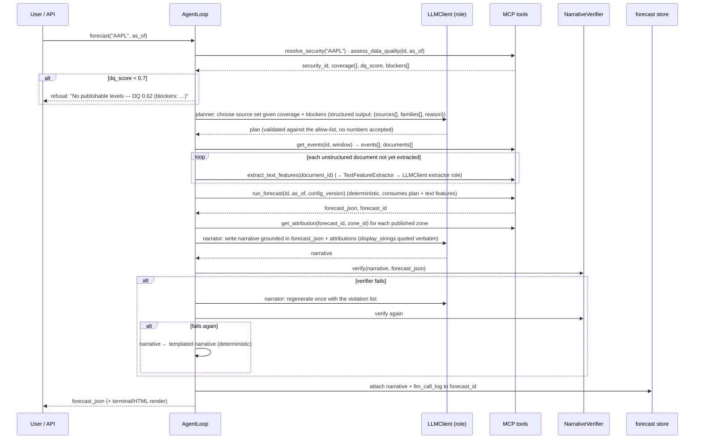

**Scheduled batch** runs the same loop per ticker in the Friday flow (P6) with the planner cached per coverage class, so its cost is dominated by extraction of new filings.

**Text-feature extraction (batchable, offline):**

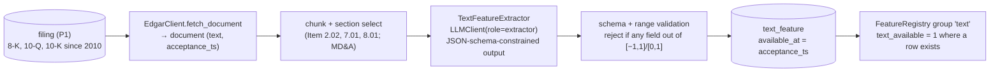

### 7.4 Layers & classes

```mermaid
classDiagram
    class LLMClient {
        <<interface>>
        +complete(role, messages, tools, schema, max_cost) LLMResult
        +capabilities(role) ProviderCaps
    }
    class ProviderAdapter {
        <<abstract>>
        +str provider
        +to_provider_tools(mcp_tools) list
        +from_provider_toolcall(raw) ToolCall
        +complete(model, messages, tools, schema) LLMResult
    }
    class AnthropicAdapter
    class OpenAICompatAdapter
    class LocalAdapter
    class RoleConfig {
        +str role
        +str provider
        +str model
        +float max_cost_usd
        +bool cache_system_prompt
        +bool batch_ok
    }
    class LLMResult {
        +str text
        +dict structured
        +list~ToolCall~ tool_calls
        +Usage usage
        +float cost_usd
    }
    class AgentLoop {
        +run(ticker, as_of) ForecastResult
        +plan_sources(coverage, blockers) SourcePlan
        +write_narrative(forecast, attributions) str
    }
    class SourcePlan {
        +list sources
        +list families
        +str reason
    }
    class NarrativeVerifier {
        +verify(narrative, forecast_json) Verdict
        +extract_numbers(text) list
        +flatten(forecast_json) set
    }
    class TextFeatureExtractor {
        +schema TextFeatureSchema
        +extract(document) list~TextFeature~
    }
    class TextFeature {
        +str name
        +float value
        +float confidence
        +str source
        +datetime timestamp
        +str evidence_span
    }
    class MCPServer {
        +tools list
        +call(name, args, as_of) ToolResult
    }
    class ToolResult {
        +dict data
        +str display_string
        +str schema_version
    }
    class ForecastAPI {
        +get_forecast(ticker, as_of) JSON
    }
    LLMClient <|.. ProviderAdapter
    ProviderAdapter <|-- AnthropicAdapter
    ProviderAdapter <|-- OpenAICompatAdapter
    ProviderAdapter <|-- LocalAdapter
    LLMClient o-- RoleConfig
    LLMClient ..> LLMResult
    AgentLoop ..> LLMClient
    AgentLoop ..> MCPServer
    AgentLoop ..> NarrativeVerifier
    AgentLoop ..> SourcePlan
    TextFeatureExtractor ..> LLMClient
    TextFeatureExtractor ..> TextFeature
    MCPServer ..> ToolResult
    ForecastAPI ..> AgentLoop
```

| Module | Class | Responsibility | Inputs → Outputs |
|---|---|---|---|
| `agent/llm_client.py` | `LLMClient`, `RoleConfig` | Provider-agnostic entry point. Reads `agent.yaml`; enforces per-call and per-forecast cost caps; logs every call to `llm_call_log`; supports JSON-schema-constrained output for planner/extractor roles. | role, messages → `LLMResult` |
| `agent/providers/*.py` | `ProviderAdapter` subclasses | Map messages, tool schemas and structured-output requests to the provider's API; expose `ProviderCaps{prompt_cache, batch, json_schema, max_context}` so the loop degrades gracefully (e.g. no caching → still correct, just costlier). Adding a provider = one file. | — |
| `agent/loop.py` | `AgentLoop` | BP §10.2 steps 1–7; only steps 2 and 6 call the LLM. | ticker, as_of → forecast |
| `agent/prompts/` | templates | Versioned (`prompt_version` recorded per call); planner and narrator prompts contain the rule "quote `display_string` fields verbatim; never compute". | — |
| `agent/verifier.py` | `NarrativeVerifier` | §7.6.2 | narrative, JSON → verdict |
| `agent/extract.py` | `TextFeatureExtractor` | §7.6.3 | document → `TextFeature[]` |
| `agent/mcp_server.py` | `MCPServer` | BP §10.1 tools; every tool takes `as_of`; every numeric return carries a `display_string` | — |
| `features/text.py` | group `text` | Aggregates `text_feature` rows into the registry (latest value per feature with decay, `days_since_filing`) with `available_at = acceptance_ts` | — |
| `data/universe.py` (ext.) | HK support | Hang Seng membership intervals (curated CSV), `.HK` Stooq symbols, XHKG calendar, `market = "HK"` embedding (categorical) | — |
| `api/main.py` | `ForecastAPI` | `GET /forecast/{ticker}?as_of=` → latest stored forecast (never recomputes on a GET; `POST /forecast/{ticker}` triggers the loop) | — |
| `reporting/render.py` (ext.) | `render_terminal`, `render_html` | Zone ladder (design-fixed §85), probabilities, evidence, narrative, DQ, model versions | — |

### 7.5 Data sources & storage

Sources: EDGAR document text (§2.5, now fetched), Stooq HK bars and `^HSI`, curated HSI membership CSV. The configured LLM provider(s) are an external dependency but **not a data source**: nothing they return is stored except `text_feature` rows (which pass through the same ablation gate as any feature) and the narrative.

| Table | Grain | Columns | `available_at` |
|---|---|---|---|
| `document` | filing document | `document_id, security_id, accession, form, item_codes, text_hash, char_len, fetched_at` | filing `acceptance_ts` |
| `text_feature` | document × feature | `name ∈ {sentiment, guidance_change, earnings_risk, regulatory_risk, demand_change, pricing_change, margin_change, capex_change, management_confidence, surprise_probability, event_severity}`, `value, confidence, evidence_span, extractor_version, provider, model` | `acceptance_ts` (never the extraction time) |
| `forecast` (ext.) | forecast | + `narrative, narrative_source ∈ {llm, template}, verifier_verdict(json), source_plan(json), prompt_version` | — |
| `llm_call_log` | call | `call_id, forecast_id?, role, provider, model, prompt_version, input_tokens, output_tokens, cached_tokens, cost_usd, latency_ms, schema_valid` | — |
| `agent_run` | run | `run_id, ticker, as_of, steps(json), total_cost_usd, wall_ms, outcome ∈ {published, refused, error}` | — |
| `research/rejected.md` | — | modules that failed ablation with their ΔBrier tables | — |

**Slots kept for modules not built (D1):** `options_snapshot_archive` keeps accumulating; `features.yaml` groups `options`, `offexchange`, `intraday_vp`, `orderbook` stay declared with `_available = 0`; `get_options_surface` returns `{available: false, reason: "no historical options data (Tier-0)"}`; `levels/generators/options.py` stays a stub.

### 7.6 Algorithms & formulas

#### 7.6.1 Source-selection planner (the one judgment call; BP §4.1)

Input to the planner role: `coverage{source → available, freshness, dq_component}` and `blockers[]` from `assess_data_quality`, plus the family list. Output is JSON-schema constrained:

```json
{"sources": ["stooq_daily", "edgar_filings", "fred_macro"], "families": ["A","B","C","D","E","F"],
 "exclude": [{"family": "C", "reason": "volume flagged stale for 40 sessions"}], "reason": "…"}
```

The loop validates it against the allow-list (only declared sources/families), rejects any numeric content, and applies it as a *mask* to `run_forecast` — the core still computes everything; the mask only affects which candidates enter clustering. A planner failure (timeout, invalid JSON) falls back to "all available sources", which is what the deterministic batch uses anyway.

#### 7.6.2 Narrative verifier (BP §10.4.1)

```
1. numbers(text)  = every match of  [-+]?\d[\d,]*(\.\d+)?\s*(%|ATR|x)?   normalised: strip commas; "%" → /100; "ATR" tag kept
2. F              = flatten(forecast_json): every numeric leaf, plus for each leaf v the renderings {v, round(v,1), round(v,2), 100·v (if 0≤v≤1)}
3. for each n in numbers(text):  ok(n) ⇔ ∃ f ∈ F : |n − f| ≤ max(0.005·|f|, 0.005)   (a 0.5 % or half-cent tolerance for rounding)
4. verdict = PASS iff all ok;  else FAIL with the list of ungrounded numbers
5. additional checks: every zone_id mentioned exists in the forecast; no phrase from a deny-list ("guaranteed", "will bounce") ;
   narrative length ≤ 1 200 chars
```

Dates and session counts are exempt only when they appear in `session_calendar` for the forecast. On FAIL the loop regenerates once with the violation list injected; a second FAIL publishes the structured forecast with `narrative_source = "template"` (a deterministic Jinja template over the JSON).

#### 7.6.3 Text-feature extraction (BP §4.1, design-fixed §23)

Per document: select sections by item code (8-K: 2.02, 7.01, 8.01, 1.01, 5.02; 10-Q/10-K: MD&A, Risk Factors first 6 000 chars), chunk at 8 000 chars, and ask the extractor role for the schema below **per chunk**, then aggregate by `confidence`-weighted mean per feature:

```json
{"features": [{"name": "guidance_change", "value": -1.0, "confidence": 0.7, "evidence_span": "…verbatim quote…"}, …]}
value ∈ [−1, 1] for directional features, [0, 1] for risk/probability features; confidence ∈ [0, 1]
```

Validation: schema-valid, ranges respected, `evidence_span` must be a substring of the chunk (rejects hallucinated support). Rejected chunks are logged and the feature row is omitted (`text_available` stays 0 for that filing). `available_at = acceptance_ts` — extraction happens later, but the information existed at acceptance; the leakage suite checks that the feature value at `as_of` depends only on documents with `acceptance_ts ≤ as_of`. In the registry, `text` features decay: `value_t = value_doc · exp(−days_since/45)` (**initial**).

#### 7.6.4 Enrichment ablations (BP §8 rung 7)

Run `AblationHarness` for: `text` (a), `sector ∪ market` (b), and — for (c) — the HK pooled-vs-US-only comparison. Admission is §6.6.10's rule. (b) is already in the P3 feature set; here it is *tested for removal*: if `ΔBrier ≥ 0` with `ci_lo > 0` when removed, it is dropped.

#### 7.6.5 HK generalisation (BP §12 P4, design-fixed §75–76)

No new model code. Changes are: `markets.yaml` entry for HK (XHKG, close 08:00 UTC, tick size table by price band, `round_number_multipliers` adjusted for HKD price levels), `security_master.market = "HK"` as a categorical feature (the "market embedding" in LightGBM is the categorical split), `^HSI` for regime/market features, sector via Hang Seng industry classification, `options_available = 0`, `text_available = 0` (HKEX filings are out of scope in P4; slot kept). Calibration strata already key on `market`. Gate: the same §6.6.8 checks on HK test years with `n_stratum ≥ 500` where available; the fallback ladder covers thin strata.

#### 7.6.6 Cost and latency budget

```
per forecast:  planner ≤ 1 call (cached system prompt when ProviderCaps.prompt_cache), narrator ≤ 2 calls, extraction 0..k calls (only new filings)
cap            = agent.yaml: max_cost_usd_per_forecast (default 0.15, BP §3.1);  exceeding it → templated narrative, forecast still published
latency        = run_forecast (deterministic) dominates; MC at 20k paths ≈ 2–4 s per ticker; LLM calls ≤ 15 s total
batch          = extraction over the historical filing backlog uses the provider's batch endpoint when ProviderCaps.batch, else a rate-limited queue
```

### 7.7 Tests that decide the gate (BP §10.4 — "each is a test, not a policy")

- `tests/guardrails/test_numeric_grounding.py` — 50 narratives with planted ungrounded numbers all FAIL; 50 grounded ones PASS; the templated fallback always PASSes.
- `tests/guardrails/test_no_forecast_without_tool.py` — the loop cannot return a forecast object whose `forecast_id` is absent from the store (mocked LLM that tries to "answer directly" is rejected).
- `tests/guardrails/test_leakage_tool_boundary.py` — every MCP tool signature has `as_of`; a static check that no tool implementation calls DuckDB except through `PITStore`.
- `tests/guardrails/test_replay_determinism.py` — `run_forecast` via the MCP tool twice → identical payload; the narrative may differ but `forecast_id` and all numbers match.
- `tests/guardrails/test_refusal_path.py` — DQ 0.62 → refusal message, no `forecast` row; no zone clearing thresholds → forecast row with `zones: []` and the "no high-conviction levels" narrative.
- `tests/agent/test_provider_adapters.py` — each adapter round-trips the MCP tool schemas and a structured-output request against a recorded fixture; the loop passes all guardrail suites with every configured provider (parametrised).
- `tests/agent/test_extractor.py` — `evidence_span` not in chunk → row rejected; ranges enforced; `available_at == acceptance_ts`.
- `tests/api/test_forecast_endpoint.py` — GET returns the stored JSON unchanged; unknown ticker → 404; DQ-refused → 200 with `refused: true`.
- Gate artefacts: `research/p4_ablation_{date}.md` (per-module ΔBrier tables), `research/hk_calibration_{date}.md`.

### 7.8 Deliverables

- [ ] `LLMClient` + three adapters + `agent.yaml`; `AgentLoop`; prompts v1; `NarrativeVerifier`; `TextFeatureExtractor`; `MCPServer` with the 11 tools.
- [ ] `document`, `text_feature`, `llm_call_log`, `agent_run` tables; text-feature backfill 2010→present for the US universe.
- [ ] HK universe (curated HSI membership), XHKG calendar, HK bars, HK level/label/feature builds.
- [ ] FastAPI service; terminal + HTML renderers; `sr forecast TICKER`, `sr serve`, `sr extract --backfill`.
- [ ] Ablation reports; `research/rejected.md` entries for any rejected module; the five guardrail suites in CI.

---

## 8. P5 — Challengers + economic validation (Weeks 15–18) **[provisional]**

### 8.1 Objective, gate, kill

> Sequence model (TCN/small Transformer, multi-task + quantile head), ACI/EnbPI conformal intervals, meta-ensemble, trading simulation with market-specific costs, Deflated Sharpe.
> **Gate:** DL beats LightGBM OOS, or it is not deployed. Economic result survives DSR given the true trial count.
> **Kill:** DSR indicates the economic result is attributable to selection → publish the forecast product as a *calibrated-probability* tool and do not make trading claims. — BP §12 P5

This section is provisional: its inputs depend on which rungs and modules survived P3–P4, and on the P3 gate outcome (if the statistical engine shipped, the challenger is compared against *that*).

### 8.2 Architecture (this phase)

```mermaid
flowchart TB
    FS[("feature_store (P3)")] --> SD["models/sequence_data.py\nSequenceDatasetBuilder\n(ATR-normalised OHLCV windows + zone context)"]:::new
    SD --> SDS[("lake/sequence_dataset\n.npz shards per (market, year)")]:::new
    SDS --> SEQ["models/sequence.py\nTCN / small Transformer\nmulti-task + quantile heads"]:::new
    R4["LGBMMultiTask (P3)"] --> ENS
    SEQ --> ENS["models/ensemble.py\nMetaEnsemble (logistic stacking)"]:::new
    MC["GarchBootstrapSimulator (P3)"] --> ENS
    ENS --> ISO["StratifiedIsotonic (P3)"]
    MC --> ACI["calibrate/conformal.py\nACI · EnbPI over weekly H/L/C quantiles"]:::new
    ISO --> FC["run_forecast (P3)"]
    ACI --> FC
    FC --> TS["validation/trading_sim.py\nTradingSimulator + CostModel"]:::new
    TS --> DSR["validation/dsr.py\nDeflatedSharpe(trials.jsonl)"]:::new
    TR[("research/trials.jsonl")] --> DSR
    DSR --> REP["research/p5_gate_{date}.md"]:::new
    GPU["GPU: rented by the hour\n(local driver mismatch, BP §11)"]:::new -.-> SEQ
    classDef new stroke-width:3px
```

### 8.3 Data / work flow

```mermaid
flowchart LR
    A["1. SequenceDatasetBuilder\nwindow = 120 sessions per zone × as_of"] --> B["2. train sequence model\nsame walk-forward folds as P3"]
    B --> C["3. score validate year\n→ per-zone p_touch, p_hold, p_break, quantiles"]
    C --> D["4. MetaEnsemble.fit on validate\n(rung outputs → logit stack)"]
    D --> E["5. StratifiedIsotonic refit"]
    E --> F["6. ACI over MC + quantile-head intervals\n(online on validate, frozen γ)"]
    F --> G["7. score test years\nΔBrier vs rung 6 · pinball · coverage"]
    G --> H["8. TradingSimulator on published zones\n→ P&L, Sharpe, costs"]
    H --> I["9. DeflatedSharpe with N_trials from trials.jsonl"]
    I --> J["10. gate report + trials.jsonl"]
```

### 8.4 Layers & classes

```mermaid
classDiagram
    class SequenceDatasetBuilder {
        +int window = 120
        +build(zones, as_of_range) SequenceDataset
    }
    class SequenceModel {
        <<abstract>>
        +fit(dataset, folds)
        +predict(dataset) Predictions
    }
    class TCNModel {
        +int channels = 64
        +int levels = 6
        +float dropout = 0.2
    }
    class SmallTransformer {
        +int d_model = 64
        +int n_heads = 4
        +int n_layers = 3
    }
    class MultiTaskHead {
        +touch
        +hold
        +break_
        +quantiles
        +reaction
    }
    class MetaEnsemble {
        +fit(rung_outputs, y)
        +predict(rung_outputs) Series
        +weights() dict
    }
    class AdaptiveConformal {
        +float alpha = 0.10
        +float gamma = 0.005
        +update(err) None
        +interval(q_lo, q_hi) tuple
        +trailing_coverage(n) float
    }
    class EnbPI {
        +int n_members = 20
        +residual_window = 250
    }
    class CostModel {
        +dict per_market
        +cost(trade) float
    }
    class TradingSimulator {
        +run(forecasts, bars, cost_model) BacktestResult
    }
    class DeflatedSharpe {
        +compute(sharpe, n_trials, skew, kurt, T) float
    }
    SequenceModel <|-- TCNModel
    SequenceModel <|-- SmallTransformer
    SequenceModel o-- MultiTaskHead
    SequenceDatasetBuilder ..> SequenceModel
    MetaEnsemble ..> SequenceModel
    TradingSimulator ..> CostModel
    DeflatedSharpe ..> TradingSimulator
```

| Module | Class | Responsibility |
|---|---|---|
| `models/sequence_data.py` | `SequenceDatasetBuilder` | Per zone × as_of: a `[120, F]` tensor of ATR-normalised OHLCV + selected daily features, a static vector (zone_geom, zone_history, market categorical), and the P3 labels |
| `models/sequence.py` | `TCNModel`, `SmallTransformer`, `MultiTaskHead` | Rung 8 challenger (§8.6.1); PyTorch; trained on rented GPU or CPU for the TCN |
| `models/ensemble.py` | `MetaEnsemble` | Rung 9 logistic stacking over rung outputs (§8.6.2) |
| `calibrate/conformal.py` | `AdaptiveConformal`, `EnbPI` | Interval calibration of weekly high/low/close (§8.6.3) |
| `validation/trading_sim.py` | `TradingSimulator`, `CostModel` | Economic validation (§8.6.4); reads only *published* forecasts (BP §10.5) |
| `validation/dsr.py` | `DeflatedSharpe` | §8.6.5 |

### 8.5 Data sources & storage

No new external data. New artefacts: `lake/sequence_dataset` (`.npz` shards; regenerated from `feature_store`, never a source of truth), `ensemble_weights` (model_version × rung → weight), `conformal_state` (market × quantile → `α_t`, trailing coverage), `backtest_result` (strategy_version × year → gross/net return, Sharpe, DSR, turnover, hit rate, max drawdown, cost breakdown). The forecast JSON's `weekly_distribution.interval_method` string (BP §3.2) is populated from `conformal_state`.

### 8.6 Algorithms & formulas

#### 8.6.1 Sequence challenger (design-fixed §27–28)

Input: `X_seq ∈ ℝ^{120×F}` (F ≈ 24: O/H/L/C returns and wicks in ATR units, volume z-score, ATR/close, distance of each bar to the zone in ATR, weekday), `X_static ∈ ℝ^{S}`. Encoder: TCN (dilated causal convolutions, receptive field ≥ 120) **or** a 3-layer Transformer encoder with learned positional encoding; both project to a 64-d shared representation concatenated with an embedding of `X_static`. Heads: `touch`, `hold`, `break` (sigmoid), `reaction` (linear), `quantiles` of weekly high/low/close (7 quantiles each, non-crossing enforced by cumulative softplus).

```
L = λ₁·BCE(touch) + λ₂·BCE(hold | touched) + λ₃·BCE(break | touched) + λ₄·Σ_q pinball_q(quantiles) + λ₅·Huber(reaction | touched)
pinball_q(y, ŷ) = max(q·(y − ŷ), (q − 1)·(y − ŷ))
λ selected on the validate year by minimising Brier(hold); initial λ = (1, 1, 1, 0.5, 0.5)
```

Training uses exactly the P3 folds (purge + embargo). Admission: `ΔBrier(challenger vs rung 6) < 0` with `ci_hi < 0` pooled over test years, **and** pinball loss ≤ MC quantiles'. Otherwise it is not deployed (BP §8).

#### 8.6.2 Meta-ensemble (design-fixed §31)

`logit p̂ = β₀ + Σ_r β_r · logit p_r` over rung outputs `r ∈ {2, 3, 4, 4⊕MC, 8}`, fit on the validate year with L2, followed by `StratifiedIsotonic`. Weights are reported per regime (`regime_probs` interact with `logit p_r`) — this is the "learned, regime-conditioned meta-model" that replaces SR-Plan's hand-assigned table (BP §1.2).

#### 8.6.3 Conformal intervals (BP §9.2)

For each weekly target `Y ∈ {high, low, close}` and level `α = 0.10`, raw interval `[q̂_{α/2}, q̂_{1−α/2}]` from MC (or the quantile head if admitted). **ACI** (Gibbs & Candès; Zaffran et al.):

```
err_t   = 1[Y_t ∉ Ĉ_t(α_t)]
α_{t+1} = α_t + γ·(α − err_t),        γ = 0.005 (initial), α_t clipped to [0.01, 0.5]
Ĉ_t(α_t) = [q̂_{α_t/2}, q̂_{1−α_t/2}] widened by the conformity quantile of trailing residuals
```

**EnbPI** alternative: `n_members = 20` bootstrap MC seeds, residuals from leave-one-out aggregation, sliding window 250. Both are run on validate + test; the one with realised coverage closest to 90 % and narrower average width is selected per market and recorded in `interval_method`. Gate (BP §14): realised coverage 88–92 % at target 90 %.

#### 8.6.4 Trading simulation and costs (design-fixed §41–42)

Strategy (fixed, not optimised — optimisation would inflate the trial count): for each published support zone, a limit buy at `U` valid 5 sessions; stop at `L − δ`; target `E + max(R_min, E[reaction]·ATR)`; symmetric short for resistance where allowed. Position size = equal notional (sizing belongs to the portfolio layer, design-fixed §87–88).

```
Net = Gross − commission − spread/2 (each side) − slippage − impact
US:  commission 0.0005/share, spread from Corwin–Schultz proxy, slippage 0.02 %, impact 0.1·σ_daily·sqrt(notional/ADV)
HK:  commission 0.03 % + stamp 0.1 % + levies 0.0057 %, spread from tick table, slippage 0.05 %, impact as above
```

#### 8.6.5 Deflated Sharpe Ratio (Bailey & López de Prado; BP §7.4)

```
SR₀      = sqrt( V[SR_n] ) · ( (1−γ_E)·Φ⁻¹(1 − 1/N) + γ_E·Φ⁻¹(1 − 1/(N·e)) ),   γ_E = 0.5772,  N = #trials from trials.jsonl (all kinds, all phases)
DSR      = Φ( (SR̂ − SR₀)·sqrt(T − 1) / sqrt(1 − γ₃·SR̂ + (γ₄ − 1)/4 · SR̂²) )
```

with `SR̂` the observed net Sharpe (per period), `T` the number of periods, `γ₃, γ₄` skew and kurtosis of returns, and `V[SR_n]` the variance of Sharpe across the logged trials. Gate: `DSR ≥ 0.95`; otherwise no trading claims (BP §12 P5 kill).

### 8.7 Tests that decide the gate

- `tests/models/test_sequence.py` — overfits a 200-sample synthetic set; quantile heads are non-crossing; determinism with fixed seeds on CPU.
- `tests/calibrate/test_conformal.py` — ACI on a synthetic series with a variance shift recovers 90 % coverage within 300 steps; EnbPI coverage ≥ 88 % on stationary noise.
- `tests/validation/test_trading_sim.py` — a known zone sequence reproduces hand-computed P&L including costs; no fills at prices outside the session's [L, H].
- `tests/validation/test_dsr.py` — DSR of a random-strategy set with N trials ≈ uniform under the null.
- Gate artefacts: `research/p5_gate_{date}.md` with ΔBrier, pinball, coverage, Sharpe, N_trials, DSR.

### 8.8 Deliverables

- [ ] Sequence dataset + TCN/Transformer challenger; `MetaEnsemble`; ACI/EnbPI; `TradingSimulator` + `CostModel`; `DeflatedSharpe`.
- [ ] Decision recorded: challenger deployed or rejected (`research/rejected.md`); interval method per market in `conformal_state`.

---

## 9. P6 — Production loop (ongoing) **[provisional]**

### 9.1 Objective, gate, kill

> Friday post-close scheduled run, forecast store, weekly scoring of last week's forecast against what happened, drift monitoring (PSI, KS, Wasserstein), model registry with full governance metadata, auto-downgrade of confidence on drift. — BP §12 P6

There is no gate; the phase is "keep the product honest every week". Provisional because the exact modules scheduled depend on P4–P5 admissions.

### 9.2 Architecture (this phase)

```mermaid
flowchart TB
    CRON["Prefect schedule\nFriday 21:30 UTC (XNYS) · Friday 09:30 UTC (XHKG)\nsession-calendar aware"]:::new --> FLOW
    subgraph FLOW["ops/flows.py — weekly_forecast_flow"]
        S1["ingest (P1)\nStooq · EDGAR · FRED · CBOE archive"]
        S2["dq_all (P1)"]
        S3["score_last_week (P6)\nreporting/score.py"]:::new
        S4["levels + labels build (P2)"]
        S5["features build (P3)"]
        S6["drift_check (P6)\nreporting/drift.py"]:::new
        S7["forecast_all (P3–P5)\nrun_forecast per ticker"]
        S8["agent narratives (P4)\nAgentLoop batch"]
        S9["publish + rank\ncross-sectional table"]:::new
        S1 --> S2 --> S3 --> S4 --> S5 --> S6 --> S7 --> S8 --> S9
    end
    S3 --> FS[("forecast_score")]:::new
    S6 --> DM[("drift_metric")]:::new
    DM --> DG["confidence downgrade rule\n(calibrate/confidence.py)"]:::new
    DG --> S7
    S9 --> DB["reporting/dashboard.py\nzone ladders · calibration curves · drift"]:::new
    REG[("model_registry\n+ governance fields")]:::new --> S7
    ALERT["alerts: DQ blockers · drift WARN · verifier fallbacks"]:::new
    S2 --> ALERT
    S6 --> ALERT
    S8 --> ALERT
    classDef new stroke-width:3px
```

### 9.3 Data / work flow

```mermaid
sequenceDiagram
    participant P as Prefect
    participant F as weekly_forecast_flow
    participant ST as PITStore / lake
    participant SC as Scorer
    participant DR as DriftMonitor
    participant RF as run_forecast
    participant AG as AgentLoop
    P->>F: trigger(as_of = last session close this week)
    F->>ST: ingest + catalogue refresh
    F->>SC: score forecasts with forecast_ts = as_of − 1 week
    SC->>ST: labels for those zones (now available: horizon_end ≤ as_of)
    SC-->>ST: forecast_score rows (Brier, hit, reaction realised, calibration bin update)
    F->>DR: compare feature_store(as_of) vs training distribution
    DR-->>ST: drift_metric rows with level OK / WARN / CRITICAL
    F->>RF: forecast every ticker in universe(as_of) with drift-adjusted confidence
    F->>AG: narratives for tickers with ≥ 1 published zone
    F-->>P: summary: n_published, n_refused, cost, alerts
```

### 9.4 Layers & classes

```mermaid
classDiagram
    class WeeklyForecastFlow {
        +run(as_of) FlowSummary
    }
    class ForecastScorer {
        +score(forecast_id) ScoreRow
        +update_calibration_bins(scores) None
    }
    class DriftMonitor {
        +psi(ref, cur) float
        +ks(ref, cur) float
        +wasserstein(ref, cur) float
        +check(as_of) DriftReport
    }
    class ConfidenceDowngrade {
        +apply(confidence, drift_report) float
    }
    class ModelRegistry {
        +register(model, governance) str
        +active(market) ModelVersion
        +retire(version, reason) None
    }
    class Dashboard {
        +render(as_of) HTML
    }
    class AlertSink {
        +send(level, message) None
    }
    WeeklyForecastFlow ..> ForecastScorer
    WeeklyForecastFlow ..> DriftMonitor
    WeeklyForecastFlow ..> ModelRegistry
    DriftMonitor ..> ConfidenceDowngrade
    WeeklyForecastFlow ..> AlertSink
    Dashboard ..> ForecastScorer
```

| Module | Class | Responsibility |
|---|---|---|
| `ops/flows.py` | `WeeklyForecastFlow` | Prefect flow; each step is a task with retries; idempotent per `as_of` |
| `reporting/score.py` | `ForecastScorer` | Realised labels vs published probabilities (§9.6.1); updates the `calibration_bin.historical_realized` shown in the forecast JSON |
| `reporting/drift.py` | `DriftMonitor` | PSI / KS / Wasserstein per feature and group (§9.6.2) |
| `calibrate/confidence.py` (ext.) | `ConfidenceDowngrade` | §9.6.3 |
| `models/registry.py` | `ModelRegistry` | design-fixed §58 governance fields; one active version per market |
| `reporting/dashboard.py` | `Dashboard` | Static HTML from DuckDB: zone ladders (design-fixed §85), cross-sectional ranking, calibration curves per stratum, drift heatmap, cost |
| `ops/alerts.py` | `AlertSink` | stdout/email/webhook (configurable) |

### 9.5 Data sources & storage

No new external sources; the CBOE archive keeps growing. New tables:

| Table | Grain | Columns |
|---|---|---|
| `forecast_score` | zone_forecast × scoring run | `y_touch, y_hold, y_break, y_reaction` realised, `brier_touch, brier_hold, hit, reaction_realised_atr, scored_at` |
| `drift_metric` | as_of × feature | `psi, ks_stat, ks_p, wasserstein, level` |
| `model_registry` (ext.) | model version | + `data_version, validation_results(json), calibration_results(json), market_coverage, known_limitations, activated_at, retired_at, retire_reason` |
| `flow_run` | run | `as_of, started, finished, n_published, n_refused, total_cost_usd, alerts(json)` |

### 9.6 Algorithms & formulas

#### 9.6.1 Weekly scoring

For each published zone of last week's forecasts, once `horizon_end ≤ as_of`: apply `TripleBarrierLabeler` (P2) to the realised bars, then `brier_hold = (p_hold − y_hold)²` on touched zones, `brier_touch = (p_touch − y_touch)²` on all; roll into the per-stratum calibration bins (`predicted`, `historical_realized`, `n`) that the forecast JSON reports. Monthly: recompute ECE/slope per stratum on the trailing 52 weeks; if `ECE > 0.05` in a top-3 stratum → alert `WARN` and schedule recalibration (isotonic refit on the trailing year; retrain only on the annual walk-forward cadence).

#### 9.6.2 Drift monitors (design-fixed §84)

```
PSI(f)  = Σ_b (cur_b − ref_b) · ln(cur_b / ref_b),   10 equal-mass bins from the training distribution;  WARN ≥ 0.10, CRITICAL ≥ 0.25
KS(f)   = sup_x |F_ref(x) − F_cur(x)|,  two-sample p-value
W₁(f)   = Wasserstein-1 between ref and cur, in units of ref σ
group level = max over the group's features;  regime drift = PSI over HMM state probabilities
```

`cur` = feature values at `as_of` over the universe; `ref` = the active model's training distribution (stored with the model version).

#### 9.6.3 Confidence auto-downgrade (BP §12 P6, §9.3)

`regime_stability` in §6.6.9 already carries PSI; in production add a hard rule:

```
level = max(group levels)
confidence' = confidence                     if OK
            = confidence · 0.85              if WARN
            = min(confidence, 0.69) · 0.7    if CRITICAL   (below the 0.70 publication threshold → nothing publishes until recalibration)
```

CRITICAL also flags the model version `needs_review` in the registry and raises an alert; it never silently retrains.

#### 9.6.4 Schedule and session awareness

The flow is scheduled per market at `close_ts(last session of ISO week) + 90 min` from `session_calendar` (holiday-shortened weeks still forecast; a week with no session is skipped). `as_of` is that session's close, so a Thursday-close week is a legitimate `as_of`.

### 9.7 Tests

- `tests/ops/test_flow_idempotent.py` — running the flow twice for one `as_of` produces no duplicate `forecast`, `forecast_score` or `drift_metric` rows.
- `tests/reporting/test_score.py` — scoring reuses `TripleBarrierLabeler` (no second label implementation); hand-built case reproduces Brier values.
- `tests/reporting/test_drift.py` — PSI = 0 on identical samples; the WARN/CRITICAL thresholds trigger on shifted synthetic data; downgrade rule arithmetic.
- `tests/ops/test_schedule.py` — a holiday week schedules on Thursday's close; an empty week schedules nothing.

### 9.8 Deliverables

- [ ] `WeeklyForecastFlow` with Prefect deployment; `ForecastScorer`; `DriftMonitor`; `ConfidenceDowngrade`; `ModelRegistry` governance; dashboard; alerts.
- [ ] Runbook `docs/RUNBOOK.md`: how to read alerts, recalibrate, retrain, roll back a model version.

---

## Appendix A — DuckDB DDL (catalogue)

Views over Parquet are created by `sr catalogue refresh`; the mutable tables below live inside `sr.duckdb`. Types: DuckDB. `event_ts`/`available_at` are `TIMESTAMPTZ`.

```sql
-- P1 -----------------------------------------------------------------------
CREATE TABLE security_master (
  security_id INTEGER PRIMARY KEY, ticker VARCHAR NOT NULL, exchange VARCHAR, market VARCHAR NOT NULL,
  currency VARCHAR NOT NULL, cik VARCHAR, sector VARCHAR, industry VARCHAR,
  listing_date DATE, delisting_date DATE, event_ts TIMESTAMPTZ, available_at TIMESTAMPTZ NOT NULL);
CREATE TABLE universe_membership (
  security_id INTEGER REFERENCES security_master, index_name VARCHAR NOT NULL,
  start_date DATE NOT NULL, end_date DATE, source_url VARCHAR NOT NULL, available_at TIMESTAMPTZ NOT NULL);
CREATE VIEW bar_daily_raw AS SELECT * FROM read_parquet('data/lake/bar_daily_raw/**/*.parquet', hive_partitioning=true);
  -- columns: security_id, session DATE, open, high, low, close DOUBLE, volume DOUBLE, source VARCHAR, event_ts, available_at, ingested_at
CREATE VIEW bar_daily_ref AS SELECT * FROM read_parquet('data/lake/bar_daily_ref/**/*.parquet', hive_partitioning=true);
CREATE VIEW corporate_action AS SELECT * FROM read_parquet('data/lake/corporate_action/**/*.parquet', hive_partitioning=true);
  -- security_id, ex_date DATE, action_type VARCHAR, ratio DOUBLE, cash_amount DOUBLE, source VARCHAR, available_at
CREATE VIEW bar_daily_adj AS SELECT * FROM read_parquet('data/lake/bar_daily_adj/**/*.parquet', hive_partitioning=true);
  -- + adj_factor DOUBLE, atr20 DOUBLE, ca_version VARCHAR
CREATE TABLE session_calendar (exchange VARCHAR, session DATE, open_ts TIMESTAMPTZ, close_ts TIMESTAMPTZ, is_half_day BOOLEAN, PRIMARY KEY (exchange, session));
CREATE VIEW filing AS SELECT * FROM read_parquet('data/lake/filing/**/*.parquet', hive_partitioning=true);
  -- security_id, cik, form VARCHAR, filed_date DATE, acceptance_ts TIMESTAMPTZ, accession VARCHAR, primary_doc_url VARCHAR, items VARCHAR[], available_at
CREATE VIEW macro_series AS SELECT * FROM read_parquet('data/lake/macro_series/**/*.parquet');
  -- series_id, obs_date DATE, value DOUBLE, vintage_ts TIMESTAMPTZ, available_at
CREATE VIEW macro_release AS SELECT * FROM read_parquet('data/lake/macro_release/**/*.parquet');
CREATE VIEW dq_score AS SELECT * FROM read_parquet('data/lake/dq_score/**/*.parquet', hive_partitioning=true);
  -- security_id, as_of DATE, score DOUBLE, components JSON, blockers JSON, available_at
CREATE VIEW options_snapshot_archive AS SELECT * FROM read_parquet('data/lake/options_snapshot_archive/**/*.parquet', hive_partitioning=true);

-- P2 -----------------------------------------------------------------------
CREATE VIEW candidate_level AS SELECT * FROM read_parquet('data/lake/candidate_level/**/*.parquet', hive_partitioning=true);
  -- candidate_id VARCHAR, security_id, as_of DATE, level, lower, upper DOUBLE, source, family, timeframe VARCHAR, formed_at DATE, meta JSON, available_at
CREATE VIEW zone AS SELECT * FROM read_parquet('data/lake/zone/**/*.parquet', hive_partitioning=true);
  -- zone_id VARCHAR, security_id, as_of DATE, side VARCHAR, lower, upper, center, width_atr, distance_atr DOUBLE,
  -- n_sources, n_families INTEGER, redundancy_ratio DOUBLE, provenance JSON, q_used DOUBLE, q_table_version VARCHAR, vol_decile INTEGER, market VARCHAR, available_at
CREATE VIEW zone_state_history AS SELECT * FROM read_parquet('data/lake/zone_state_history/**/*.parquet', hive_partitioning=true);
  -- zone_id, session DATE, state, polarity VARCHAR, touch_count, hold_count, break_count INTEGER, last_touch_session DATE, age_sessions INTEGER, available_at
CREATE VIEW zone_label AS SELECT * FROM read_parquet('data/lake/zone_label/**/*.parquet', hive_partitioning=true);
  -- zone_id, as_of DATE, y_touch, y_hold, y_break INTEGER, y_reaction DOUBLE, t_touch, t_react, t_break INTEGER, entry_price DOUBLE,
  -- unresolved, label_gap BOOLEAN, horizon_end DATE, approach_velocity, consec_down, gap_into, vol_accel, vwap_dist DOUBLE, available_at
CREATE VIEW regime_label AS SELECT * FROM read_parquet('data/lake/regime_label/**/*.parquet');
  -- market, session DATE, regime VARCHAR, trend_z, vol_pctile DOUBLE, hmm_probs JSON, hmm_label VARCHAR, hmm_version VARCHAR, available_at
CREATE TABLE matched_control_result (
  experiment_id VARCHAR, run_ts TIMESTAMPTZ, family VARCHAR, distance_decile INTEGER, regime VARCHAR,
  n_real INTEGER, n_placebo INTEGER, hold_real DOUBLE, hold_placebo DOUBLE, lift DOUBLE, ci_lo DOUBLE, ci_hi DOUBLE,
  p_value DOUBLE, q_value DOUBLE, reaction_real DOUBLE, reaction_placebo DOUBLE);

-- P3 -----------------------------------------------------------------------
CREATE VIEW feature_store AS SELECT * FROM read_parquet('data/lake/feature_store/**/*.parquet', hive_partitioning=true);
  -- zone_id, as_of DATE, feature_version VARCHAR, <~180 feature columns>, <~180 *_available SMALLINT>, available_at
CREATE TABLE model_registry (
  model_version VARCHAR PRIMARY KEY, rung VARCHAR, market VARCHAR, trained_through DATE, validate_year INTEGER, test_year INTEGER,
  feature_version VARCHAR, data_version VARCHAR, q_table_version VARCHAR, params JSON, metrics JSON,
  validation_results JSON, calibration_results JSON, market_coverage JSON, known_limitations VARCHAR,
  git_sha VARCHAR, trial_id VARCHAR, mlflow_run_id VARCHAR, created_at TIMESTAMPTZ,
  activated_at TIMESTAMPTZ, retired_at TIMESTAMPTZ, retire_reason VARCHAR, needs_review BOOLEAN DEFAULT FALSE);
CREATE TABLE calibration_map (
  model_version VARCHAR REFERENCES model_registry, target VARCHAR, stratum JSON, fallback_level INTEGER,
  x DOUBLE[], y DOUBLE[], n INTEGER, ece DOUBLE, slope DOUBLE, fitted_on_year INTEGER);
CREATE TABLE walkforward_result (
  model_version VARCHAR, test_year INTEGER, metric VARCHAR, stratum JSON, value DOUBLE, ci_lo DOUBLE, ci_hi DOUBLE, n INTEGER);
CREATE TABLE forecast (
  forecast_id VARCHAR PRIMARY KEY, security_id INTEGER, forecast_ts TIMESTAMPTZ NOT NULL, config_version VARCHAR, model_version VARCHAR,
  schema_version VARCHAR, replay BOOLEAN DEFAULT FALSE, refused BOOLEAN DEFAULT FALSE, payload JSON NOT NULL,
  narrative VARCHAR, narrative_source VARCHAR, verifier_verdict JSON, source_plan JSON, prompt_version VARCHAR, created_at TIMESTAMPTZ);
CREATE TABLE zone_forecast (
  forecast_id VARCHAR REFERENCES forecast, zone_id VARCHAR, side VARCHAR, lower DOUBLE, upper DOUBLE, distance_atr DOUBLE,
  p_touch DOUBLE, p_hold DOUBLE, p_break DOUBLE, p_joint DOUBLE, expected_reaction_atr DOUBLE, confidence DOUBLE,
  rank INTEGER, published BOOLEAN, calibration_bin JSON, attribution JSON);

-- P4 -----------------------------------------------------------------------
CREATE VIEW document AS SELECT * FROM read_parquet('data/lake/document/**/*.parquet', hive_partitioning=true);
  -- document_id, security_id, accession, form, item_codes VARCHAR[], text_hash, char_len, acceptance_ts, fetched_at, available_at
CREATE VIEW text_feature AS SELECT * FROM read_parquet('data/lake/text_feature/**/*.parquet', hive_partitioning=true);
  -- document_id, security_id, name, value, confidence DOUBLE, evidence_span VARCHAR, extractor_version, provider, model VARCHAR, available_at
CREATE TABLE llm_call_log (
  call_id VARCHAR PRIMARY KEY, forecast_id VARCHAR, role VARCHAR, provider VARCHAR, model VARCHAR, prompt_version VARCHAR,
  input_tokens INTEGER, output_tokens INTEGER, cached_tokens INTEGER, cost_usd DOUBLE, latency_ms INTEGER, schema_valid BOOLEAN, ts TIMESTAMPTZ);
CREATE TABLE agent_run (run_id VARCHAR PRIMARY KEY, ticker VARCHAR, as_of DATE, steps JSON, total_cost_usd DOUBLE, wall_ms INTEGER, outcome VARCHAR, ts TIMESTAMPTZ);

-- P5 -----------------------------------------------------------------------
CREATE TABLE ensemble_weights (model_version VARCHAR, rung VARCHAR, regime VARCHAR, weight DOUBLE);
CREATE TABLE conformal_state (market VARCHAR, target VARCHAR, method VARCHAR, alpha_t DOUBLE, trailing_coverage DOUBLE, updated_at TIMESTAMPTZ);
CREATE TABLE backtest_result (strategy_version VARCHAR, market VARCHAR, year INTEGER, gross DOUBLE, net DOUBLE, sharpe DOUBLE, dsr DOUBLE,
  n_trials INTEGER, turnover DOUBLE, hit_rate DOUBLE, max_dd DOUBLE, cost_breakdown JSON);

-- P6 -----------------------------------------------------------------------
CREATE TABLE forecast_score (forecast_id VARCHAR, zone_id VARCHAR, y_touch INTEGER, y_hold INTEGER, y_break INTEGER, y_reaction DOUBLE,
  brier_touch DOUBLE, brier_hold DOUBLE, hit BOOLEAN, reaction_realised_atr DOUBLE, scored_at TIMESTAMPTZ);
CREATE TABLE drift_metric (as_of DATE, market VARCHAR, feature VARCHAR, feature_group VARCHAR, psi DOUBLE, ks_stat DOUBLE, ks_p DOUBLE, wasserstein DOUBLE, level VARCHAR);
CREATE TABLE flow_run (run_id VARCHAR PRIMARY KEY, market VARCHAR, as_of DATE, started TIMESTAMPTZ, finished TIMESTAMPTZ, n_published INTEGER, n_refused INTEGER, total_cost_usd DOUBLE, alerts JSON);
```

## Appendix B — Formula index

| Formula | Section | Phase |
|---|---|---|
| Wilder ATR₂₀ | §3.6.1 | P0 |
| Multi-k swing acceptance | §3.6.2 | P0 |
| Round-number ladder | §3.6.3 | P0 |
| Bar-triple bootstrap `P(touch)` | §3.6.5 | P0 |
| Backward corporate-action factor | §4.6.1 | P1 |
| Reconciliation tolerance | §4.6.2 | P1 |
| DQ score | §4.6.3 | P1 |
| Leakage probe | §4.6.6 | P1 |
| Volume profile: POC, VA(70 %), HVN/LVN | §5.6.1 C | P2 |
| VWAP / anchored VWAP | §5.6.1 D | P2 |
| Classic & Camarilla pivots, Fibonacci, Bollinger, Keltner, GARCH envelope | §5.6.1 E | P2 |
| Adaptive KDE (`h = γ·ATR₁₄`), BIC-GMM | §5.6.1 F | P2 |
| HDBSCAN in ATR space | §5.6.2 | P2 |
| Zone center, width `q·ATR`, `q` likelihood fit | §5.6.3 | P2 |
| Zone identity match | §5.6.4 | P2 |
| Triple-barrier labels + tie rule | §5.6.6 | P2 |
| Rule regime labeler | §5.6.8 | P2 |
| Matched-control lift, BCa CI, BH-FDR | §5.6.9 | P2 |
| Purged k-fold + embargo | §6.6.3 | P3 |
| Rungs 0–3 | §6.6.4 | P3 |
| LightGBM five-booster multi-task | §6.6.5 | P3 |
| GARCH(1,1) + block-bootstrap + gap + event-jump MC | §6.6.6 | P3 |
| `P(hold)` integrated over approach scenarios | §6.6.7 | P3 |
| Brier, log loss, ECE, calibration slope, isotonic strata | §6.6.8 | P3 |
| Confidence score | §6.6.9 | P3 |
| Ablation ΔBrier admission | §6.6.10 | P3 |
| Narrative numeric grounding | §7.6.2 | P4 |
| Text-feature extraction + decay | §7.6.3 | P4 |
| Multi-task sequence loss, pinball | §8.6.1 | P5 |
| Meta-ensemble stacking | §8.6.2 | P5 |
| ACI update, EnbPI | §8.6.3 | P5 |
| Cost model | §8.6.4 | P5 |
| Deflated Sharpe | §8.6.5 | P5 |
| Weekly scoring | §9.6.1 | P6 |
| PSI / KS / Wasserstein drift | §9.6.2 | P6 |
| Confidence downgrade | §9.6.3 | P6 |

## Appendix C — Glossary

| Term | Meaning |
|---|---|
| Candidate level | A single price produced by one generator, with provenance (`source`, `family`) |
| Zone | An interval `[L,U]` produced by clustering candidates; the unit of forecasting |
| Family | Evidence family A–G (BP §6.2); the unit of independence in confluence tests |
| Touched / held / broken | Triple-barrier outcomes over the 5-session window (§2.4) |
| Placebo zone | A synthetic zone with the same distance and width as a real one but no provenance (§5.6.9) |
| Rung | A step on the model ladder (BP §8); each must beat the one below |
| Stratum | `(market × regime × distance decile)` — the unit of calibration and reporting |
| `available_at` | The earliest time a fact could have been known; the only thing `PITStore` filters on |
| Replay | Re-running `run_forecast` for a historical `as_of`; must be byte-identical |
| Role (LLM) | planner / extractor / narrator / research — each mapped to a configurable provider + model |

## Appendix D — External references

Carried from BUILD-PLAN's bibliography; the ones this document's algorithms rely on directly:

- Osler (2000, 2003) — round-number order clustering: https://papers.ssrn.com/sol3/papers.cfm?abstract_id=888805 · https://onlinelibrary.wiley.com/doi/abs/10.1111/1540-6261.00588
- Chung & Bellotti (2021) — touch count and level-age decay: https://arxiv.org/abs/2101.07410
- López de Prado — triple-barrier labels, purged CV, Deflated Sharpe: https://www.garp.org/hubfs/Whitepapers/a1Z1W0000054x6lUAA.pdf · https://en.wikipedia.org/wiki/Deflated_Sharpe_ratio
- Zaffran et al. (2022) — Adaptive Conformal Inference for time series: https://proceedings.mlr.press/v162/zaffran22a/zaffran22a.pdf
- Conformal methods benchmark (2026): https://arxiv.org/pdf/2601.18509
- SEC EDGAR APIs: https://www.sec.gov/news/press-release/2021-159
- *Keep the LLM Out of the Math*: https://dev.to/feasibilityproaiai/keep-the-llm-out-of-the-math-deterministic-boundaries-for-financial-modelling-agents-5cl7
- Libraries: `polars`, `duckdb`, `hdbscan`, `arch`, `lightgbm`, `scikit-learn`, `exchange_calendars`, `mapie`/`puncc`, `hmmlearn`, `torch`, `mlflow`, `prefect`, `fastapi`, `mcp`.

