# Support & Resistance Agent — Technical Design Document

**Version:** 0.4 (P0 built; P1 implementation plan, revised, with the upstream-collector migration; P2–P4 designed; P5–P6 provisional)
**Date:** 24 September 2026
**Companion to:** [`BUILD-PLAN.md`](BUILD-PLAN.md) (what we build, in what order, with what gates). This document is the *how*: for every phase it fixes the architecture, the data/work flow, the classes and layers, the data sources and storage, and the algorithms and formulas an implementer needs. Where the two disagree, BUILD-PLAN's gates and constants win and this document is wrong.
**Reference catalogues:** [`Support-Resistance-design-fixed.MD`](Support-Resistance-design-fixed.MD) (label definitions §6–7, §16; state machine §63; schema §48) and [`SR-Plan.md`](SR-Plan.md) (volume profile §1.1, KDE/GMM/Camarilla §3).

---

## How to read this document

- **§1** records the decisions that shape every phase. **§2** is the cross-phase foundation (architecture, storage, data sources, notation) that every phase builds on.
- **§3–§9** are the seven phases, P0–P6, each written to the same template so a phase can be read alone:

  | # | Sub-section | Contents |
  |---|---|---|
  | .1 | Objective, gate, kill | Quoted from BUILD-PLAN §12; what "done" means |
  | .2 | Architecture (this phase) | Mermaid diagram of the components active in the phase; new components highlighted |
  | .3 | Data / work flow | Mermaid flow or sequence diagram of the run path, with artefacts named by table/file |
  | .4 | Layers & classes | Class diagram + table: module path, class, responsibility, inputs → outputs |
  | .5 | Data sources & storage | Sources consumed; tables/datasets introduced or extended |
  | .6 | Algorithms & formulas | Every non-trivial computation, with initial parameter values and which are learned |
  | .7 | Tests that decide the gate | Concrete test suites and experiment scripts |
  | .8 | Deliverables | Checklist |

- Diagrams are Mermaid fenced blocks (rendered natively by GitHub and VS Code preview). In every architecture diagram, components **new in that phase** are drawn with a thick border (`:::new`); inherited components are plain.
- Formulas use plain Unicode/LaTeX-style inline math. Every constant that BUILD-PLAN fixes is cited as `(BP §x)`; every constant introduced here is marked **initial** and may only be tuned inside walk-forward validation (BP §7.4).
- Sections marked **[provisional]** describe phases whose gate depends on the outcome of an earlier gate; they will be rewritten when work reaches them.

---

## 1. Decisions and assumptions

| # | Decision | Consequence for the design |
|---|---|---|
| D1 | **No new data purchases; existing in-house data and infrastructure are used** (BP §5.1, §15; amended 2026-09-24). | Tier-0 public sources plus the owner's existing **MySQL market data (daily OHLCV and daily options)**, Cloudflare R2, AWS Serverless and a Hostinger VPS (§4.2, §4.5). Intraday bars, off-exchange prints and minute-level volume profile are **not built**; the product is a **daily-bar forecaster**. With daily options history now available, family G (options/GEX) becomes a *candidate* P4 enrichment module, still admitted only through the BP §8 rung-7 ablation gate; P1 lands the options data point-in-time and nothing consumes it yet. Slots for unavailable sources keep `*_available = 0` (BP §5, design-fixed §76). The CBOE snapshot archive of the earlier draft is dropped. |
| D2 | **US first, HK second** for modelling, other markets deferred (BP §1.2, §15). | Universe (amended 2026-09-24): **S&P 500, Nasdaq-100, DJIA** (US) and **Hang Seng Index** (HK), point-in-time, 2010→. P1 builds data for both markets; P2–P3 model US; HK is the P4 generalisation test. China A-share price-limit truncation is a hook in the MC engine (§6.6.6), inactive. |
| D3 | **Horizon H = 5 local sessions** (BP §3, design-fixed §3). | Session arithmetic goes through `exchange_calendars` everywhere; never calendar days. |
| D4 | **Price spine chosen per security: in-house MySQL → yfinance → Tiingo (US) → Stooq manual**, never spliced within a security (§4.6.2). *History:* Stooq was the spine until 2026-09-18 (browser proof-of-work); yfinance was the spine for P0; the in-house MySQL data was added 2026-09-24. | yfinance returns **no history for delisted names** (XLNX, TWTR, ATVI, CELG: 0 rows, 2026-09-23). Its `Close` is split-adjusted and dividend-unadjusted, and its `Adj Close` is fully adjusted; **there is no traded-price series** (AAPL 2020-08-28: `Close` 124.81 vs. ≈ $499 traded). P1 therefore stores traded prices, reconstructing them from split events where a source serves adjusted prices, and adjusts point-in-time on read (§4.6.1). The in-house MySQL (`histdailyprice7`) is itself a yfinance mirror that keeps delisted names up to their delisting date, loaded row by row over time, so its split state is detected per split (§4.6.1). yfinance supplies split/dividend actions for listed names. Tiingo (free tier, 500 symbols/30 days) supplies them for delisted US names, fills US gaps, and provides the only independent source: the 50-name reconciliation sample. |
| D5 | **Point-in-time universe from hand-curated membership files** in git (`curated/index_membership.csv`), drafted from pinned Wikipedia revisions and verified against index-provider notices (S&P DJI, Nasdaq, Hang Seng Indexes) plus EDGAR / HKEXnews delisting evidence. | This is the P1 kill-criterion risk (BP §12 P1). §4.6.4 defines "cannot assemble" per index and the descope path. |
| D6 | **Point-in-time store = DuckDB over Parquet; the in-house MySQL stays the upstream system of record** (BP §1.2, §11; amended 2026-09-24). | Backtests never query MySQL: its rows are mutable and carry no `available_at`, and walk-forward scans are columnar work. Data is copied out as immutable extracts, and the lake is built from those. `sr.duckdb` holds catalogue views plus small tables that are rebuilt deterministically from `curated/`. Sizing and settings: §4.5.3. |
| D9 | **Cloudflare R2 = canonical lake + write-once raw archive; ingest runs on the Hostinger VPS; AWS Lambda runs stateless fetchers and an independent watchdog** (added 2026-09-23, revised 2026-09-24). | R2 is the hand-off point between hosts. Free egress makes research pulls free. Storage beyond the 10 GB free tier costs cents a month, driven by the options history (§4.5.4). Lambda never connects to MySQL or Yahoo (§4.2). |
| D10 | **Two repositories, split by who writes MySQL** (added 2026-09-24). | `Fin-Lambda` is the upstream collector: every job that writes the owner's market-data MySQL, including myFinData's two cron jobs, which it absorbs. This repository is the point-in-time spine and everything above it: it reads MySQL read-only and writes only its own R2 bucket. The contract is data (tables and semantics), not code. Code is ported, never imported (§4.5.7). |
| D7 | **LightGBM is the production model; deep learning is a challenger** (BP §8). | P5's sequence model ships only if it beats LightGBM out-of-sample with CI excluding zero. |
| D8 | **The LLM never emits a number** (BP §4). | Every numeric field in a forecast is produced by the deterministic core; the verifier (§7.6.2) machine-checks the narrative. |

---

## 2. Cross-phase foundation

### 2.1 System architecture

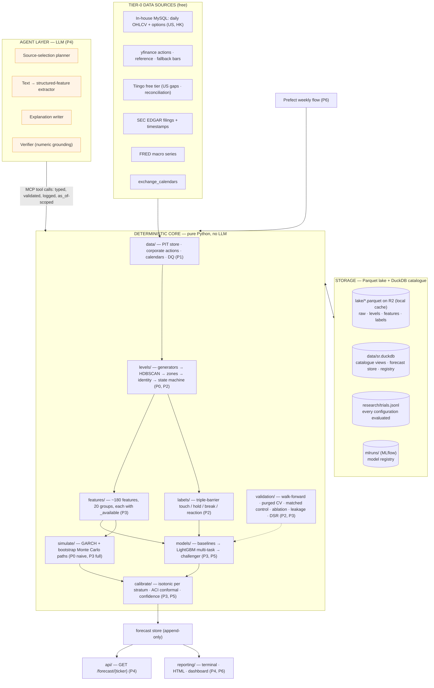
```mermaid
flowchart TB
    subgraph AGENT["AGENT LAYER — LLM (P4)"]
        PLAN["Source-selection planner"]
        EXTRACT["Text → structured-feature extractor"]
        NARR["Explanation writer"]
        VERIFY["Verifier (numeric grounding)"]
    end

    subgraph CORE["DETERMINISTIC CORE — pure Python, no LLM"]
        direction TB
        DATA["data/ — PIT store · corporate actions · calendars · DQ (P1)"]
        LEVELS["levels/ — generators → HDBSCAN → zones → identity → state machine (P0, P2)"]
        FEAT["features/ — ~180 features, 20 groups, each with _available (P3)"]
        LABELS["labels/ — triple-barrier touch / hold / break / reaction (P2)"]
        MODELS["models/ — baselines → LightGBM multi-task → challenger (P3, P5)"]
        SIM["simulate/ — GARCH + bootstrap Monte Carlo paths (P0 naive, P3 full)"]
        CAL["calibrate/ — isotonic per stratum · ACI conformal · confidence (P3, P5)"]
        VAL["validation/ — walk-forward · purged CV · matched control · ablation · leakage · DSR (P2, P3)"]
        DATA --> LEVELS --> FEAT --> MODELS --> CAL
        LEVELS --> LABELS --> MODELS
        FEAT --> SIM --> CAL
        VAL -.-> MODELS
    end

    subgraph STORE["STORAGE — Parquet lake + DuckDB catalogue"]
        LAKE[("lake/*.parquet on R2 (local cache)<br/>raw · levels · features · labels")]
        DUCK[("data/sr.duckdb<br/>catalogue views · forecast store · registry")]
        TRIALS[("research/trials.jsonl<br/>every configuration evaluated")]
        MLF[("mlruns/ (MLflow)<br/>model registry")]
    end

    subgraph SRC["TIER-0 DATA SOURCES (free)"]
        MYSQLS["In-house MySQL: daily OHLCV + options (US, HK)"]
        STOOQ["yfinance actions · reference · fallback bars"]
        TIINGO["Tiingo free tier (US gaps · reconciliation)"]
        EDGAR["SEC EDGAR filings + timestamps"]
        FRED["FRED macro series"]
        XCAL["exchange_calendars"]
    end

    FS["forecast store (append-only)"]
    API["api/ — GET /forecast/#123;ticker#125; (P4)"]
    REPORT["reporting/ — terminal · HTML · dashboard (P4, P6)"]
    SCHED["Prefect weekly flow (P6)"]

    AGENT -- "MCP tool calls: typed, validated, logged, as_of-scoped" --> CORE
    SRC --> DATA
    CORE <--> STORE
    CAL --> FS
    FS --> API
    FS --> REPORT
    SCHED --> CORE

    classDef llm fill:#fff4e6,stroke:#e8a33d
    class PLAN,EXTRACT,NARR,VERIFY llm
```

The MCP boundary is the whole point (BP §4): the LLM decides *which* sources to use and *how to explain* the result; the core computes every level, probability, and score. Nothing above the boundary can write a number into a forecast.

### 2.2 Repository layout and layer map

The package tree is BUILD-PLAN §11, annotated with the phase that first creates each module. On disk the package lives under `src/sr_agent/` (src-layout, as in the author's other repos) with `tests/` at the repository root; import paths are unchanged (`sr_agent.levels.cluster`).

```text
sr_agent/
├─ config/            markets.yaml · features.yaml · models.yaml · thresholds.yaml        P0 (grows every phase)
├─ data/              bars.py · calendars.py · ingestion/{base,cache,loader,yfinance,tiingo,stooq}.py  P0
│                     ingestion/{mysql,edgar,fred}.py · objectstore.py · lake.py · adjust.py  P1
│                     quality.py · universe.py · store.py (PITStore)                       P1
├─ levels/            generators/{structure,round,volume_profile,vwap,technical,          P0: structure, round
│                                 statistical,options}.py                                  P2: the rest (options = stub)
│                     cluster.py · zone.py · identity.py · state_machine.py               P0 naive cluster · P2 full
├─ features/          20 modules, one per group · registry.py                              P3
├─ labels/            triple_barrier.py · touch.py · hold.py · reaction.py                P2
├─ models/            baseline.py · logistic.py · lgbm.py · survival.py                   P3
│                     sequence.py · ensemble.py                                            P5
├─ simulate/          monte_carlo.py · gaps.py · limits.py                                 P0 naive · P3 full
├─ calibrate/         isotonic.py · confidence.py                                          P3
│                     conformal.py                                                         P5
├─ validation/        matched_control.py · leakage.py · trials.py                          P2
│                     walk_forward.py · purged_cv.py · ablation.py · stress.py             P3
│                     dsr.py                                                               P5
├─ agent/             loop.py · prompts/ · verifier.py · mcp_server.py · extract.py        P4
├─ api/               main.py                                                              P4
├─ reporting/         render.py · dashboard.py · score.py · drift.py                       P4 render · P6 rest
├─ ops/               lambdas.py · systemd/ (VPS timers)                                   P1
│                     flows.py (Prefect)                                                   P6
├─ research/          notebooks/ · trials.jsonl · rejected.md                              P2
├─ cli.py             `sr p0 AAPL` · `sr ingest` · `sr forecast` …                         P0
└─ tests/             unit/ · leakage/ · determinism/ · guardrails/                        P1
data/                 raw/ · lake/ · sr.duckdb            (git-ignored)                    P0 raw · P1 lake
```

Layer discipline (enforced by import-linter in CI from P1):

| Layer | Packages | May import |
|---|---|---|
| L0 Config | `config/` | nothing |
| L1 Data | `data/` | L0 |
| L2 Level engine | `levels/`, `labels/` | L0–L1 |
| L3 Features & simulation | `features/`, `simulate/` | L0–L2 |
| L4 Models & calibration | `models/`, `calibrate/`, `validation/` | L0–L3 |
| L5 Agent & delivery | `agent/`, `api/`, `reporting/`, `ops/` | L0–L4 |

### 2.3 Notation

| Symbol | Meaning | Defined by |
|---|---|---|
| `t`, `as_of` | Forecast timestamp: the close of the last session before the forecast week (Friday close, 20:00 UTC for XNYS) | BP §3.2, design-fixed §4 |
| `H` | Horizon = 5 local trading sessions | BP §7.1 |
| `ATR₂₀` | Wilder average true range over 20 sessions, evaluated at `t` | §3.6.1 |
| `δ` | Breach buffer = `0.25·ATR₂₀` | BP §7.1 |
| `R_min` | Reaction threshold = `0.5·ATR₂₀` | BP §7.1 |
| `[L, U]` | Zone interval, lower and upper bound; `center`, `width = U − L` | BP §6.1 |
| `q` | Zone width in ATR units, `width = q·ATR₂₀`, learned per (market × vol-decile) | BP §6.3 |
| `d` | Signed distance from spot to zone center in ATR units, `d = (center − close_t)/ATR₂₀` (negative below spot) | BP §3.2 `distance_atr` |
| `event_ts` | When the fact occurred (bar close, filing acceptance, …) | BP §7.4 |
| `available_at` | Earliest timestamp at which the fact could have been known to a forecaster | BP §7.4, §10.4.3 |
| `security_id` | Stable internal integer key; tickers change, ids do not | design-fixed §48 |
| `zone_id` | Persistent identity `{TICKER}-{S\|R}-{ISOyear}W{week}-{nn}` | BP §3.2, §6.1 |
| `Y_touch, Y_hold, Y_break, Y_reaction, T_*` | Triple-barrier labels | BP §7.1, §5.6.5 here |
| `DQ` | Data-quality score in [0,1]; `< 0.7` suppresses the zone | BP §9.3, design-fixed §43 |

### 2.4 Core definitions carried by every phase

**Zone and events** (BP §7.1; design-fixed §6–7). For a support zone `[L,U]` observed at `t`:

- *Touch* on session `s ∈ (t, t+H]`: `Low_s ≤ U` **and** `High_s ≥ L`.
- *Hold* (defined only if touched): after first entry at session `s₀` with entry price `E` (§5.6.5), price reaches `E + R_min` (support) / `E − R_min` (resistance) before the breach condition.
- *Break*: `Close_s < L − δ` (support) / `Close_s > U + δ` (resistance) occurs first.
- *Reaction* `Y_reaction = (post-touch extreme − E)/ATR₂₀`, signed in the favourable direction.

**Session arithmetic.** `sessions(as_of, n)` returns the next `n` sessions of the security's exchange from `exchange_calendars`; the forecast window is `sessions(t, 5)`. Half-days count as sessions.

**Availability rule.** A row is visible to a query with `as_of` iff `available_at ≤ as_of`. There is no other read path (BP §10.4.3). For daily bars `available_at = session close + publication lag` (default lag 0 for daily EOD bars, set in `markets.yaml`); for EDGAR filings `available_at = acceptance datetime`; for FRED `available_at = release datetime` from the release calendar, never the observation date.

### 2.5 Data sources — Tier-0 catalogue

All sources are free. Every source is optional at forecast time; missing sources set `*_available = 0` and lower `DQ` (BP §5).

| Source | What we take | Access | Limits & notes | Landing table | First used |
|---|---|---|---|---|---|
| **yfinance** (Yahoo) | Daily OHLCV, US and HK (`0700.HK`); also index/ETF series (SPY, sector ETFs, `^GSPC`, `^HSI`) | `yfinance.Ticker(sym).history(period="max", auto_adjust=False)` → CSV in the raw cache | Split-adjusted back through time, dividends unadjusted (`Adj Close` carries them) → treated as **split-adjusted raw**; our own corporate-action layer handles dividends and re-checks splits against Tiingo. Serves the partial bar of an open session (cut by the availability rule). Occasional inverted bars (`0700.HK` 2009-12-31 and 2010-01-15 have `high < low`) — kept raw, flagged by the P1 DQ score (§4.6.3). Unofficial client: polite rate, cache everything. **No history for delisted names** (→ D4 amendment: Tiingo backfill). From P1, fetched with `actions=True` so split rows let the lake reconstruct true raw (§4.6.1). | `bar_daily_raw` | P0 |
| **Stooq** | Manual fallback: browser-downloaded per-symbol CSV (`https://stooq.com/q/d/l/?s={sym}&i=d`) dropped into the raw cache | CSV endpoint behind a JavaScript proof-of-work since 2026-09; not solved programmatically | Unadjusted for dividends; split-adjusted inconsistently. | `bar_daily_raw` (source=`stooq`) | P0 (fallback) |
| **Tiingo (free tier)** | Daily OHLCV + adjusted close, split/dividend factors: (1) **spine for delisted names** (P1 amendment, D4), (2) the reconciliation sample and CA cross-check | REST `https://api.tiingo.com/tiingo/daily/{ticker}/prices`, token | Free-tier caps (verify at sign-up; treat as hard limits in `markets.yaml`): 50 req/hr, 1 000 req/day, 500 unique symbols/month, 1 GB/month bandwidth (confirmed 2026-09-23). Enough for 50 tickers × 200 dates plus ≈ 450 delisted names per 30 days (`QuotaLedger`, §4.4). | `bar_daily_ref`, `corporate_action` (source=`tiingo`) | P1 |
| **SEC EDGAR** | Filing index with acceptance timestamps (8-K, 10-Q, 10-K, Form 25, Form 15), full text for extraction | `https://data.sec.gov/submissions/CIK##########.json`; full-text search `https://efts.sec.gov/LATEST/search-index?q=…`; documents from `https://www.sec.gov/Archives/` | Descriptive `User-Agent: SR-Agent <email>`; ≤ 10 req/s; no key. Acceptance datetime is `available_at`. | `filing`, `document` | P1 (index), P4 (text) |
| **FRED** | Macro series (DGS10, DFF, VIXCLS, …) and the release calendar | `https://api.stlouisfed.org/fred/series/observations`, free key; `fred/releases/dates` | Unlimited for our volume. Use *vintage* (ALFRED) endpoints for revised series so `available_at` is the release date. | `macro_series`, `macro_release` | P1 |
| **In-house MySQL (DigitalOcean)** | Daily OHLCV (US, HK) and daily options prices | DuckDB `mysql` extension, read-only user `sr_reader`, TLS, VPS IP allow-listed | Coverage, adjustment convention, delisted rows, history depth, load time and vendor are established by the P1 M0 audit (§4.5.1). Mutable upstream: copied out as immutable extracts, never queried by backtests (D6). | `bar_daily_raw` (source=`mysql`), `option_daily` | P1 |
| **`exchange_calendars`** | Sessions, holidays, half-days for XNYS, XHKG (XSHG/XSHE for the inactive limit hook) | Python package | Pin the version; sessions are computed, not stored, but a materialised `session_calendar` table exists for SQL joins. | `session_calendar` | P0 |
| **Index membership (curated)** | Point-in-time S&P 500 / Nasdaq-100 / DJIA / Hang Seng membership intervals | `curated/index_membership.csv` (git-tracked, repo root), drafted from pinned Wikipedia revisions by `sr universe draft` and verified by hand from published change histories (pinned Wikipedia revisions of the S&P 500, Nasdaq-100, DJIA and HSI change tables; S&P Dow Jones Indices press releases; Nasdaq index notices; Hang Seng Indexes quarterly review results), one source URL per row | This is the survivorship-bias defence (BP §12 P1). Rows: `(index, ticker_at_time, security_id, cik_or_hkex_code, start_date, end_date, source_url, evidence_grade)`. Companion files: `curated/exchange_closures.csv` (HK typhoon/black-rain closures), `curated/corporate_actions_manual.csv` (HK rights/bonus issues missing from yfinance). | `universe_membership` | P1 |
| **EDGAR Form 25 / Form 15** | Delisting / deregistration evidence with dates, to close membership intervals and mark `security_master.delisting_date` | EDGAR full-text search on form type | Free; the only free authoritative delisting record. | `security_master`, `corporate_action` (type=`delist`) | P1 |

**Explicitly not used (D1):** Tiingo Power, EODHD, Polygon/Massive, Databento, CBOE snapshots, any LOB or dark-pool feed. `features.yaml` still declares the `options`, `offexchange`, `orderbook`, and `intraday_vp` groups so that the feature matrix shape is stable. `options_available` is 1 where the in-house options data covers the underlying; the others are always 0.

### 2.6 Storage architecture

**Layout.**

```text
data/
├─ raw/                        immutable downloads, one file per (source, symbol, fetch_date)
│   └─ yfinance/AAPL/2026-09-19.csv(.gz from P1)
├─ lake/                       Parquet, Hive-partitioned; written only by ingestion/pipeline jobs
│   ├─ bar_daily_raw/market=US/year=2026/*.parquet
│   ├─ bar_daily_adj_latest/market=US/year=2026/*.parquet   (recon only; PIT bars are adjusted on read)
│   ├─ candidate_level/market=US/year=2026/*.parquet
│   ├─ zone/…  zone_state_history/…  zone_label/…
│   ├─ feature_store/market=US/year=2026/*.parquet
│   └─ (option_daily is a view over raw/mysql/options/…, not a copy)
└─ sr.duckdb                   catalogue: views over lake/ + small mutable tables
curated/index_membership.csv   git-tracked point-in-time membership (D5)
research/trials.jsonl          append-only experiment log
mlruns/                        MLflow tracking + model registry
```

Hosts: `data/` above is the **local cache** on the VPS or workstation. The canonical copies of `raw/` (write-once) and `lake/` live in Cloudflare R2 bucket `sr-agent`, which also holds `manifests/` (D9, §4.5.4). `PITStore` reads either the local lake or `r2://sr-agent/lake`.

Rules: raw data is never overwritten (design-fixed §44); lake datasets are rewritten per partition by idempotent jobs keyed on `(source, as_of)`; every table carries `event_ts` and `available_at` (BP §7.4); DuckDB is the only query engine and `PITStore` the only read API (§4.4).

**Entity model.** Each entity is tagged with the phase that introduces it. Full DDL is in Appendix A.

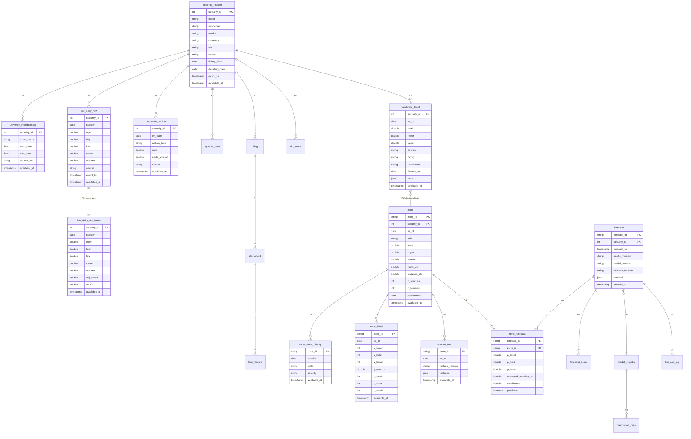
```mermaid
erDiagram
    security_master ||--o{ universe_membership : "P1"
    security_master ||--o{ bar_daily_raw : "P1"
    security_master ||--o{ corporate_action : "P1"
    bar_daily_raw ||--|| bar_daily_adj_latest : "P1 recon view"
    security_master ||--o{ symbol_map : "P1"
    security_master ||--o{ filing : "P1"
    filing ||--o{ document : "P4"
    document ||--o{ text_feature : "P4"
    security_master ||--o{ dq_score : "P1"
    security_master ||--o{ candidate_level : "P2"
    candidate_level }o--|| zone : "P2 clustered into"
    zone ||--o{ zone_state_history : "P2"
    zone ||--o{ zone_label : "P2"
    zone ||--o{ feature_row : "P3"
    zone ||--o{ zone_forecast : "P4"
    forecast ||--o{ zone_forecast : "P4"
    forecast ||--o{ forecast_score : "P6"
    forecast }o--|| model_registry : "P3"
    model_registry ||--o{ calibration_map : "P3"
    forecast ||--o{ llm_call_log : "P4"

    security_master {
        int security_id PK
        string ticker
        string exchange
        string market
        string currency
        string cik
        string sector
        date listing_date
        date delisting_date
        timestamp event_ts
        timestamp available_at
    }
    universe_membership {
        int security_id FK
        string index_name
        date start_date
        date end_date
        string source_url
        timestamp available_at
    }
    bar_daily_raw {
        int security_id FK
        date session
        double open
        double high
        double low
        double close
        double volume
        string source
        timestamp event_ts
        timestamp available_at
    }
    corporate_action {
        int security_id FK
        date ex_date
        string action_type
        double ratio
        double cash_amount
        string source
        timestamp available_at
    }
    bar_daily_adj_latest {
        int security_id FK
        date session
        double open
        double high
        double low
        double close
        double volume
        double adj_factor
        double atr20
        timestamp available_at
    }
    candidate_level {
        int security_id FK
        date as_of
        double level
        double lower
        double upper
        string source
        string family
        string timeframe
        date formed_at
        json meta
        timestamp available_at
    }
    zone {
        string zone_id PK
        int security_id FK
        date as_of
        string side
        double lower
        double upper
        double center
        double width_atr
        double distance_atr
        int n_sources
        int n_families
        json provenance
        timestamp available_at
    }
    zone_state_history {
        string zone_id FK
        date session
        string state
        string polarity
        timestamp available_at
    }
    zone_label {
        string zone_id FK
        date as_of
        int y_touch
        int y_hold
        int y_break
        double y_reaction
        int t_touch
        int t_react
        int t_break
        timestamp available_at
    }
    feature_row {
        string zone_id FK
        date as_of
        string feature_version
        json features
        timestamp available_at
    }
    forecast {
        string forecast_id PK
        int security_id FK
        timestamp forecast_ts
        string config_version
        string model_version
        string schema_version
        json payload
        timestamp created_at
    }
    zone_forecast {
        string forecast_id FK
        string zone_id FK
        double p_touch
        double p_hold
        double p_break
        double expected_reaction_atr
        double confidence
        boolean published
    }
```

### 2.7 Configuration files

| File | Keys (initial) | Owner phase |
|---|---|---|
| `markets.yaml` | per market: `calendar` (XNYS/XHKG), `close_utc`, `bar_publication_lag_minutes`, `tick_size`, `price_limit` (`null` for US/HK; `±0.10` hook for A-shares), `yfinance_suffix`, `stooq_suffix`, `round_number_multipliers` | P0 |
| `thresholds.yaml` | `atr_window: 20`, `horizon_sessions: 5`, `delta_atr: 0.25`, `r_min_atr: 0.5`, `dq_suppress: 0.7`, `publish: {p_touch: 0.60, p_hold: 0.65, confidence: 0.70, dq: 0.80}`, `dq_weights`, `cluster: {eps_atr: 0.25, min_cluster_size: 2}`, `identity_match_atr: 0.25` | P0, P1, P2 |
| `features.yaml` | 20 groups, each: `enabled`, `lookback_sessions`, `available_at_rule`, and the feature list with `dtype` | P3 |
| `models.yaml` | walk-forward schedule, purge/embargo, LightGBM params per target, isotonic strata + min-n ladder, MC params (`n_paths`, `block_len`, `seed`) | P3 |
| `agent.yaml` | model ids per role, prompt-cache settings, cost cap per forecast, tool allow-list | P4 |

All numbers in `thresholds.yaml` that BUILD-PLAN fixes are marked `frozen: true` and a unit test asserts they equal the BUILD-PLAN values.

### 2.8 Output contract and its storage projection

The forecast JSON is BUILD-PLAN §3.2, `schema_version: "1.0"`, frozen at P1 and versioned thereafter. It is stored twice: verbatim in `forecast.payload` (append-only, never updated) and flattened into `zone_forecast` for SQL. `forecast_id = sha256(security_id, forecast_ts, config_version, model_version)[:16]` so a replay of the same inputs collides on purpose (replay determinism, BP §10.4.4).

---

## 3. P0 — Walking skeleton (Week 1)

### 3.1 Objective, gate, kill

> One ticker, daily bars only, swing + round-number generators, naive clustering, MC touch probability, printed output. Ugly and end-to-end. **Purpose:** validate the shape of the pipeline before investing in any of it. **Gate:** it runs. **Kill:** none. — BP §12 P0

"Done" means `uv run sr p0 AAPL` fetches (or reads cached) daily bars, prints the spot, `ATR₂₀`, at least one support and one resistance zone, each with a `P(touch)` from 10 000 bootstrap paths, in under 10 s. No DuckDB, no LLM, no persistence beyond a CSV cache.

### 3.2 Architecture (this phase)

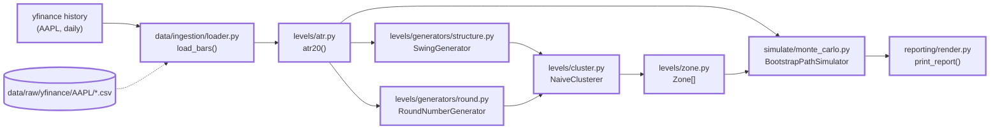
```mermaid
flowchart LR
    STOOQ["yfinance history\n(AAPL, daily)"]:::new --> LOAD["data/ingestion/loader.py\nload_bars()"]:::new
    LOAD --> ATR["levels/atr.py\natr20()"]:::new
    ATR --> SW["levels/generators/structure.py\nSwingGenerator"]:::new
    ATR --> RN["levels/generators/round.py\nRoundNumberGenerator"]:::new
    SW --> CL["levels/cluster.py\nNaiveClusterer"]:::new
    RN --> CL
    CL --> Z["levels/zone.py\nZone[]"]:::new
    ATR --> MC["simulate/monte_carlo.py\nBootstrapPathSimulator"]:::new
    Z --> MC
    MC --> OUT["reporting/render.py\nprint_report()"]:::new
    CACHE[("data/raw/yfinance/AAPL/*.csv")]:::new -.-> LOAD
    classDef new stroke-width:3px
```

Everything is new; every box is a module that survives into later phases (the *naive* clusterer and the *bar-triple* simulator are replaced in P2/P3 but keep their interfaces).

### 3.3 Data / work flow

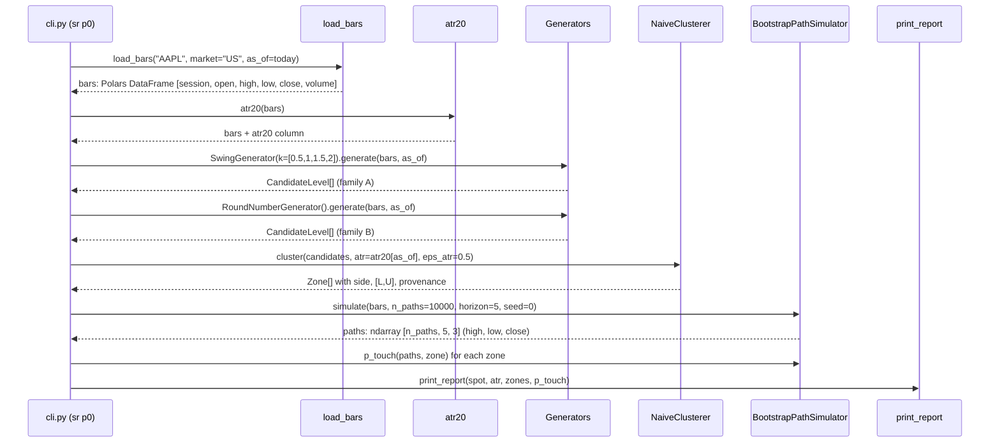
```mermaid
sequenceDiagram
    participant CLI as cli.py (sr p0)
    participant ST as load_bars
    participant AT as atr20
    participant GEN as Generators
    participant CL as NaiveClusterer
    participant MC as BootstrapPathSimulator
    participant R as print_report
    CLI->>ST: load_bars("AAPL", market="US", as_of=today)
    ST-->>CLI: bars: Polars DataFrame [session, open, high, low, close, volume]
    CLI->>AT: atr20(bars)
    AT-->>CLI: bars + atr20 column
    CLI->>GEN: SwingGenerator(k=[0.5,1,1.5,2]).generate(bars, as_of)
    GEN-->>CLI: CandidateLevel[] (family A)
    CLI->>GEN: RoundNumberGenerator().generate(bars, as_of)
    GEN-->>CLI: CandidateLevel[] (family B)
    CLI->>CL: cluster(candidates, atr=atr20[as_of], eps_atr=0.5)
    CL-->>CLI: Zone[] with side, [L,U], provenance
    CLI->>MC: simulate(bars, n_paths=10000, horizon=5, seed=0)
    MC-->>CLI: paths: ndarray [n_paths, 5, 3] (high, low, close)
    CLI->>MC: p_touch(paths, zone) for each zone
    CLI->>R: print_report(spot, atr, zones, p_touch)
```

### 3.4 Layers & classes

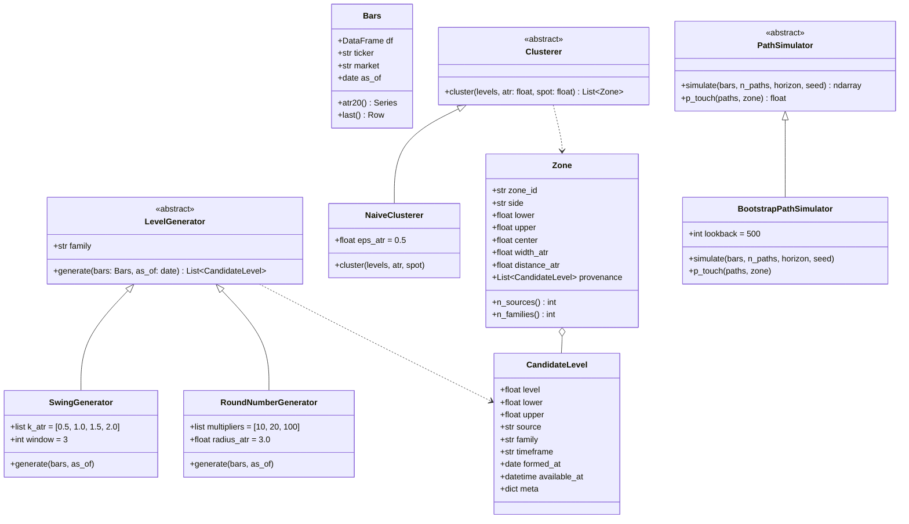
```mermaid
classDiagram
    class Bars {
        +DataFrame df
        +str ticker
        +str market
        +date as_of
        +atr20() Series
        +last() Row
    }
    class CandidateLevel {
        +float level
        +float lower
        +float upper
        +str source
        +str family
        +str timeframe
        +date formed_at
        +datetime available_at
        +dict meta
    }
    class LevelGenerator {
        <<abstract>>
        +str family
        +generate(bars: Bars, as_of: date) List~CandidateLevel~
    }
    class SwingGenerator {
        +list k_atr = [0.5, 1.0, 1.5, 2.0]
        +int window = 3
        +generate(bars, as_of)
    }
    class RoundNumberGenerator {
        +list multipliers = [10, 20, 100]
        +float radius_atr = 3.0
        +generate(bars, as_of)
    }
    class Zone {
        +str zone_id
        +str side
        +float lower
        +float upper
        +float center
        +float width_atr
        +float distance_atr
        +List~CandidateLevel~ provenance
        +n_sources() int
        +n_families() int
    }
    class Clusterer {
        <<abstract>>
        +cluster(levels, atr: float, spot: float) List~Zone~
    }
    class NaiveClusterer {
        +float eps_atr = 0.5
        +cluster(levels, atr, spot)
    }
    class PathSimulator {
        <<abstract>>
        +simulate(bars, n_paths, horizon, seed) ndarray
        +p_touch(paths, zone) float
    }
    class BootstrapPathSimulator {
        +int lookback = 500
        +simulate(bars, n_paths, horizon, seed)
        +p_touch(paths, zone)
    }
    LevelGenerator <|-- SwingGenerator
    LevelGenerator <|-- RoundNumberGenerator
    Clusterer <|-- NaiveClusterer
    PathSimulator <|-- BootstrapPathSimulator
    LevelGenerator ..> CandidateLevel
    Clusterer ..> Zone
    Zone o-- CandidateLevel
```

| Module | Class / function | Responsibility | Inputs → Outputs |
|---|---|---|---|
| `data/bars.py` | `Bars.from_frame(df, ticker, market, as_of)` | The bar frame every layer consumes; enforces the column set and the availability filter `available_at ≤ as_of` (§2.4) on construction | `DataFrame → Bars` |
| `data/calendars.py` | `next_sessions`, `session_close_utc`, `is_session` | Session arithmetic via `exchange_calendars` (exact per-session closes, DST- and half-day-aware) | — |
| `data/ingestion/base.py` | `RawSource` (abstract), `RawSourceError` | One provider of raw daily OHLCV: `symbol()`, `fetch()` (text, the only place network happens), `parse()` (text → normalised frame). The cached artefact is the provider's text, verbatim | — |
| `data/ingestion/yfinance.py`, `tiingo.py`, `stooq.py` | `YFinanceSource`, `TiingoSource`, `StooqSource` | Tier-0 sources. `yfinance` is the default (D4): `Ticker.history(period="max", auto_adjust=False)` serialised to CSV so the raw cache stays text; US and HK (numeric HK codes zero-padded, `0700.HK`). Tiingo (free tier, `TIINGO_API_KEY`, US only, `--source tiingo`) keeps the unadjusted columns for P1 reconciliation. Stooq's CSV endpoint has sat behind a JavaScript proof-of-work challenge since 2026-09, so its `fetch()` fails with a clear message and its cache path is fed by a manual browser download; we do not solve the challenge programmatically | — |
| `data/ingestion/cache.py` | `fetch_to_cache`, `pick_cache_file` | Immutable `data/raw/{source}/{SYMBOL}/{fetch_date}.csv`; same-day re-fetch is a no-op, a later fetch adds a file, nothing is ever overwritten | — |
| `data/ingestion/loader.py` | `load_bars(ticker, market, as_of, data_dir, source, offline, today, now)` | Cache-or-fetch, parse, drop rows after `as_of`, attach `available_at = exact session close + lag`, build `Bars` with the cut `available_at ≤ min(end of as_of, now)` — so the partial bar a provider serves while the session is open is not visible (2026-09-18 finding) | `… → Bars` |
| `levels/atr.py` | `atr20(bars)`, `atr_at_as_of(bars)` | Wilder ATR (§3.6.1); lives in L2 rather than as a `Bars` method so L1 stays free of level logic | `Bars → Series` |
| `levels/generators/base.py` | `LevelGenerator`, `CandidateLevel` | Interface every generator implements from here on; `family` is the independence key used in P2 | — |
| `levels/generators/structure.py` | `SwingGenerator` | Multi-k swing highs/lows (§3.6.2) | `Bars, date → CandidateLevel[]` |
| `levels/generators/round.py` | `RoundNumberGenerator` | Round-number ladder near spot (§3.6.3) | `Bars, date → CandidateLevel[]` |
| `levels/cluster.py` | `NaiveClusterer` | 1-D single-linkage merge in ATR units (§3.6.4); replaced by HDBSCAN in P2 behind the same `Clusterer` interface | `CandidateLevel[], atr, spot → Zone[]` |
| `levels/zone.py` | `Zone` | Value object; `side` = support if `center < spot` else resistance; `zone_id` provisional (`{ticker}-{S\|R}-P0-{nn}`) until identity exists in P2 | — |
| `simulate/monte_carlo.py` | `BootstrapPathSimulator` | Bar-triple bootstrap paths and `P(touch)` (§3.6.5) | `Bars → ndarray[n, H, 3]` |
| `reporting/render.py` | `print_report(...)` | Fixed-width table to stdout | — |
| `reporting/export.py` | `P0Dump`, `write_p0_dump(dump, dir)` | `sr p0 --dump DIR`: `run/bars/candidates/zones/triples/paths.csv` — every intermediate of §3.6 (TR and ATR per bar, each candidate with its ATR-unit coordinates and the zone it landed in, τ triples, simulated bars) so the formulas can be re-derived offline; `test_cli.py` does exactly that from the CSVs | — |
| `cli.py` | `sr p0 TICKER`, `run_p0(bars, n_paths, seed)` | `run_p0` is the pure pipeline on loaded bars (what tests call); the command adds `--as-of`, `--seed`, `--paths`, `--source`, `--offline`, `--data-dir` (`$SR_DATA_DIR`) and loads `.env` | — |

### 3.5 Data sources & storage

| Source | Used for | Storage |
|---|---|---|
| yfinance (`Ticker("AAPL").history(period="max", auto_adjust=False)`) | Daily bars, default source; split-adjusted OHLC, `Adj Close` kept in the raw file | `data/raw/yfinance/AAPL/{fetch_date}.csv` (header `Date,Open,High,Low,Close,Adj Close,Volume`), immutable; loader picks the newest file with `fetch_date ≤ as_of`, else the newest at all |
| Tiingo free tier (`https://api.tiingo.com/tiingo/daily/aapl/prices?format=csv`, `Authorization: Token`) | Daily bars, `--source tiingo`; unadjusted OHLCV columns are used, the adjusted ones are kept in the raw file for P1 reconciliation | `data/raw/tiingo/AAPL/{fetch_date}.csv`, same rules |
| Stooq (`https://stooq.com/q/d/l/?s=aapl.us&i=d`) | Daily bars, via manual browser download while the endpoint requires a browser (see §3.4); `--source stooq --offline` | `data/raw/stooq/AAPL.US/{fetch_date}.csv`, same rules |
| `exchange_calendars` XNYS/XHKG, built from 1960 | Exact per-session close for `available_at`; validating that every session in the CSV is a real session (warn, don't fail); `sessions(as_of, 5)` for the report header | none |

No DuckDB, no Parquet, no forecast store in P0. The report is stdout only.

### 3.6 Algorithms & formulas

#### 3.6.1 Wilder ATR

```
TR_t   = max( H_t − L_t,  |H_t − C_{t−1}|,  |L_t − C_{t−1}| )
ATR_t  = ( (n−1)·ATR_{t−1} + TR_t ) / n,   n = 20,   ATR_n = mean(TR_1..TR_n)
```

`ATR₂₀` at `as_of` is the value on the last session ≤ `as_of`. All ATR-normalised quantities in every later phase use this exact series (frozen: `thresholds.yaml: atr_window: 20`, BP §7.1).

#### 3.6.2 Multi-k swing points (design-fixed §9)

A bar `t` is a swing high candidate if `H_t = max(H_{t−w..t+w})` with window `w = 3` sessions (**initial**), and is *accepted* at significance `k` if the subsequent retrace is large enough:

```
accept_high(t, k)  ⇔  H_t − min(L_{t+1..t+m}) ≥ k·ATR_t   for some m ≤ 20
accept_low(t, k)   ⇔  max(H_{t+1..t+m}) − L_t ≥ k·ATR_t
k ∈ {0.5, 1.0, 1.5, 2.0}
```

Each accepted swing emits one `CandidateLevel` with `level = H_t` (or `L_t`), `lower = level − 0.1·ATR`, `upper = level + 0.1·ATR` (**initial** half-width, superseded by the learned `q` in P2), `source = "swing_high_k{k}"`, `family = "A"`, `timeframe = "1D"`, `formed_at = session t`, and — critically — `available_at = close of session t+m` (the swing is not known until the retrace confirms it; this is the first leakage trap in the project). Only levels within `±6·ATR` of spot are kept (**initial**).

#### 3.6.3 Round numbers (BP §6.2 family B; Osler 2003)

Let `P = close_{as_of}` and `e = 10^⌊log₁₀ P⌋` (for `P = 182.4`, `e = 100`). Generate three ladders with step `e/m`, `m ∈ {10, 20, 100}` (steps 10, 5, 1 for a $182 stock), plus half-steps of the finest ladder (0.5). Keep every rung within `±3·ATR₂₀` of `P` (**initial**). Each rung is a `CandidateLevel` with `source = "round_{step}"`, `family = "B"`, `meta.step = step`, `formed_at = null`, `available_at = −∞` (always known), and half-width `0.1·ATR`. Coarser steps carry `meta.rank` so P2 features can weight $10 rungs above $1 rungs.

#### 3.6.4 Naive clustering

1. Convert every candidate to ATR units: `x_i = level_i / ATR₂₀`.
2. Sort ascending; walk once, starting a new cluster whenever `x_i − x_first > ε`, where `x_first` is the cluster's first member (cluster diameter ≤ `ε`), `ε = 0.5` (**initial**; P2 replaces this with HDBSCAN, §5.6.2). *Fixed 2026-09-18:* the rule was first written as a gap to the previous member, `x_i − x_{i−1} > ε`. That is single linkage: the family-B ladder (rungs 0.07–0.3 ATR apart across ±3 ATR) chained into one cluster containing the spot, which step 4 then dropped, and the walking skeleton produced no resistance zones. The diameter rule bounds every zone's span by `ε` and keeps the §3.7 test (“0.4 ATR apart merge, 0.6 do not”). Known consequence, visible in `sr p0 AAPL --dump`: the ladder *tiles* the window in ≈0.67-ATR zones with `n_families = 1`, and adjacent zones overlap by up to `2 × 0.1·ATR` (the half-width padding). Both are P0-acceptable; HDBSCAN with `min_cluster_size` and the learned `q` (P2) must not inherit them.
3. For each cluster: `center = mean(level_i)`, `L = min(lower_i)`, `U = max(upper_i)`, `provenance = members`, `side = support if center < spot else resistance`, `distance_atr = (center − spot)/ATR₂₀`.
4. Drop clusters whose interval contains the spot (neither side). Rank each side by `|distance_atr|` ascending and keep the nearest 4 per side for the report.

#### 3.6.5 Bar-triple bootstrap Monte Carlo and `P(touch)`

The daily path model needs a high and a low per session, not just a close; sampling historical *bar shapes* as a unit preserves the intra-bar high/low relationship without a model. From the last `N = 500` sessions build the triple set

```
τ_s = ( H_s/C_{s−1},  L_s/C_{s−1},  C_s/C_{s−1} )
```

Then for each of `n_paths = 10 000` paths and each of the `H = 5` sessions, draw `τ` i.i.d. with replacement (seeded `numpy.random.default_rng(seed)`) and roll forward:

```
C_0 = spot
H_j = C_{j−1}·τ.h,   L_j = C_{j−1}·τ.l,   C_j = C_{j−1}·τ.c,   j = 1..5
```

`P(touch)` for zone `[L,U]`:

```
P(touch) = (1/n_paths) · Σ_paths 1[ ∃ j ≤ 5 : L_j ≤ U  and  H_j ≥ L ]
```

which is exactly the touch definition in §2.4 applied to simulated bars. This estimator ignores volatility clustering, gaps, and events; P3 replaces it (§6.6.6) behind the same `PathSimulator` interface. Also report `P(Low < L)` and `P(High > U)` for the P0 table — they are free and sanity-check the zone side.

### 3.7 Tests that decide the gate

- `tests/unit/test_atr.py` — ATR against a hand-computed 25-bar fixture.
- `tests/unit/test_swings.py` — a synthetic zig-zag series where the accepted swings for each `k` are known by construction; asserts `available_at > formed_at`.
- `tests/unit/test_round.py` — `P = 182.4` yields rungs `{170,175,180,185,190,…}` ∩ `±3·ATR`.
- `tests/unit/test_cluster.py` — two levels 0.4 ATR apart merge, 0.6 ATR apart do not.
- `tests/unit/test_mc.py` — with `seed` fixed, `simulate()` is byte-identical across two calls; a zone containing the spot has `P(touch) = 1.0`; a zone 50 ATR away has `P(touch) = 0.0`.
- Gate: `uv run sr p0 AAPL` exits 0 and prints ≥ 1 support and ≥ 1 resistance zone with `0 < P(touch) < 1`. Mechanised, offline, in `tests/unit/test_cli.py` on a 600-session synthetic cache (also asserts replay determinism and the < 10 s budget). Also present: `test_config.py` (frozen constants = BUILD-PLAN), `test_layering.py` (L0–L5 import edges), `test_ingestion.py` (sources incl. a monkeypatched yfinance history, immutable cache, point-in-time cut, the open-session partial-bar cut, `available_at` stamping), `test_calendars.py`, and `test_cli.py::test_dump_csvs_reproduce_the_report_offline` (re-derives TR/ATR, the §3.6.4 geometry and `P(touch)` from the `--dump` CSVs alone); live-provider checks (yfinance US + HK, Tiingo, Stooq status) are `@pytest.mark.integration` and opt-in.

### 3.8 Deliverables

- [x] `uv init`, Python 3.11, `pyproject.toml` with `polars numpy exchange_calendars typer pyyaml python-dotenv`; the §2.2 package skeleton with empty `__init__.py`. *(2026-09-18)*
- [x] `config/markets.yaml`, `config/thresholds.yaml` with the frozen constants.
- [x] Modules in §3.4; `sr p0` CLI.
- [x] The five unit tests above, plus config/layering/ingestion/calendar/CLI suites (63 tests, 59 offline).
- [x] `sr p0 --dump DIR` CSV export for offline validation of every §3.6 formula. *(2026-09-19)*
- [x] `.gitignore` covers `data/`, `mlruns/`.
- [x] Live gate run `uv run sr p0 AAPL` — Tiingo on 2026-09-18 (9 246 bars, 1.91 s, 8 zones) and yfinance on 2026-09-19 (11 534 bars, 1.49 s, 8 zones, same spot/ATR); see HISTORY.md.

---

## 4. P1 — Data spine (Weeks 2–3)

*Implementation plan; revised 2026-09-24 after review. Changes from the 2026-09-23 draft:*

- *The **universe** is now S&P 500, Nasdaq-100, Dow Jones Industrial Average and Hang Seng Index. S&P 400 is dropped and HK data moves into P1.*
- *The plan runs on the **existing infrastructure**: MySQL on DigitalOcean (the in-house daily OHLCV and daily options data), Cloudflare R2, AWS Serverless and a Hostinger VPS (§4.5.3–§4.5.6).*
- *In-house **daily options prices** are landed point-in-time in P1 and replace the CBOE archive.*
- *The owner answered most of the M0 audit on 2026-09-24 (§4.5.1). Bars come from `histdailyprice7` and options from `OptionChains`. Both are **yfinance mirrors**, loaded every weeknight after the US close and before the HK open. Delisted prices are kept up to the delisting date. Options cover ≈ 50 US stocks/ETFs. The VPS has 4 vCPU / 16 GB / 200 GB NVMe.*

*Two findings still stand:*

- *yfinance has **no history for delisted names**.*
- *yfinance offers a dividend-unadjusted `Close` and a fully adjusted `Adj Close`, but **no split-unadjusted series**. Its `Close` for AAPL on 2020-08-28 is 124.81; the traded close was ≈ $499. So prices are adjusted point-in-time on read (§4.6.1).*

### 4.1 Objective, gate, kill

> Point-in-time store, `event_ts` + `available_at` on every row, corporate actions (raw preserved separately from adjusted), exchange calendars, **point-in-time universe reconstruction including delisted names**, DQ scoring. Universe: ~~S&P 500 + S&P 400~~ **S&P 500, Nasdaq-100, DJIA (US) and Hang Seng Index (HK)** members as of each historical date, 2010→present.
> **Gate:** (a) adjusted closes reconcile against a second source within tolerance on a 50-ticker × 200-date sample; (b) the 2015 universe contains companies that no longer exist; (c) the leakage test suite passes on all features defined so far.
> **Kill:** cannot assemble a survivorship-free universe → descope to a smaller curated universe with hand-verified delistings; do not proceed with a survivorship-biased one. — BP §12 P1 (universe amended 2026-09-24, BP §17.2 A5)

"Done" means:

1. `sr ingest --full` builds the lake from nothing, and `sr lake rebuild` rebuilds it byte-for-byte from the immutable raw extracts alone.
2. `PITStore` is the only read path, and every P0 consumer reads through it.
3. Gates (a) to (c) pass as the tests in §4.7.
4. The nightly and weekly jobs (§4.5.6) have run unattended on the VPS, with the Lambda watchdog green.

**Scope note.** P1 builds data for both markets. Modelling stays US-first (D2): P2–P3 use US data, and HK is still the P4 generalisation test. Its data simply exists earlier.

### 4.2 Architecture (this phase)

**Logical components.**

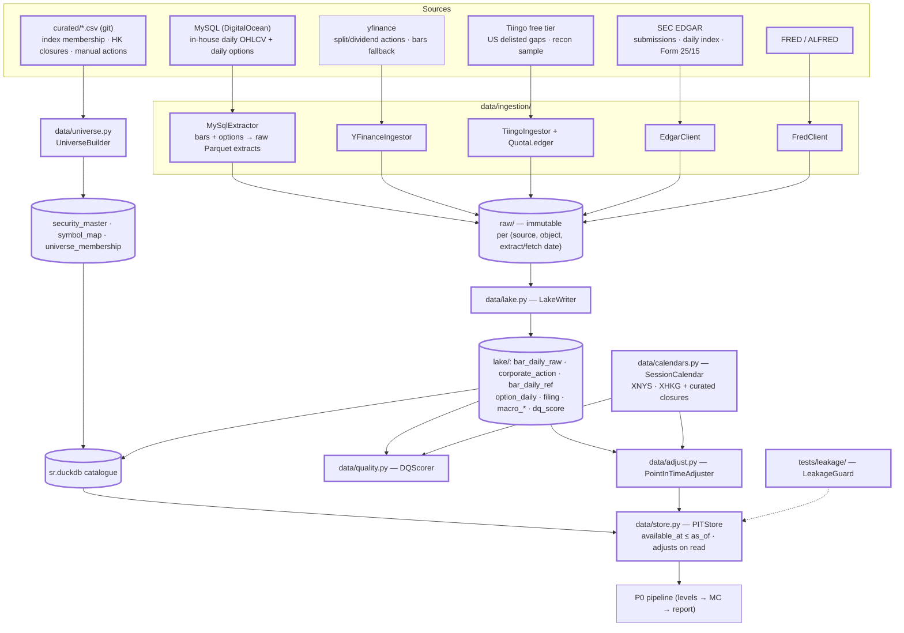
```mermaid
flowchart TB
    subgraph SRC["Sources"]
        MY["MySQL (DigitalOcean)<br/>in-house daily OHLCV + daily options"]:::new
        YF["yfinance<br/>split/dividend actions · bars fallback"]
        TI["Tiingo free tier<br/>US delisted gaps · recon sample"]:::new
        ED["SEC EDGAR<br/>submissions · daily index · Form 25/15"]:::new
        FR["FRED / ALFRED"]:::new
        CUR["curated/*.csv (git)<br/>index membership · HK closures · manual actions"]:::new
    end
    subgraph ING["data/ingestion/"]
        I0["MySqlExtractor<br/>bars + options → raw Parquet extracts"]:::new
        I1["YFinanceIngestor"]:::new
        I2["TiingoIngestor + QuotaLedger"]:::new
        I3["EdgarClient"]:::new
        I4["FredClient"]:::new
    end
    MY --> I0
    YF --> I1
    TI --> I2
    ED --> I3
    FR --> I4
    I0 & I1 & I2 & I3 & I4 --> RAW[("raw/ — immutable<br/>per (source, object, extract/fetch date)")]:::new
    CUR --> UB["data/universe.py<br/>UniverseBuilder"]:::new
    RAW --> LAND["data/lake.py — LakeWriter"]:::new
    UB --> SM[("security_master · symbol_map · universe_membership")]:::new
    LAND --> LK[("lake/: bar_daily_raw · corporate_action · bar_daily_ref<br/>option_daily · filing · macro_* · dq_score")]:::new
    LK --> ADJ["data/adjust.py — PointInTimeAdjuster"]:::new
    LK --> DQ["data/quality.py — DQScorer"]:::new
    CAL["data/calendars.py — SessionCalendar<br/>XNYS · XHKG + curated closures"]:::new --> ADJ & DQ
    SM & LK --> DUCK[("sr.duckdb catalogue")]:::new --> PIT["data/store.py — PITStore<br/>available_at ≤ as_of · adjusts on read"]:::new
    ADJ --> PIT
    PIT --> P0["P0 pipeline (levels → MC → report)"]
    LEAK["tests/leakage/ — LeakageGuard"]:::new -.-> PIT
    classDef new stroke-width:3px
```

**Deployment (existing infrastructure).**

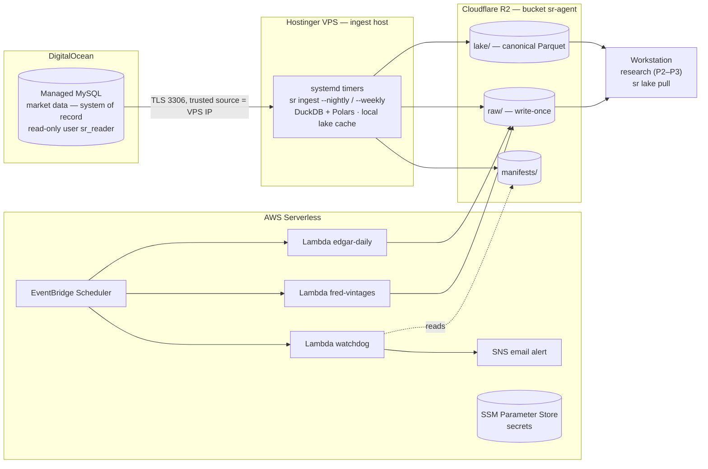
```mermaid
flowchart LR
    subgraph DO["DigitalOcean"]
        MYSQL[("Managed MySQL<br/>market data — system of record<br/>read-only user sr_reader")]
    end
    subgraph HV["Hostinger VPS — ingest host"]
        JOBS["systemd timers<br/>sr ingest --nightly / --weekly<br/>DuckDB + Polars · local lake cache"]
    end
    subgraph AWS["AWS Serverless"]
        EB["EventBridge Scheduler"] --> L1["Lambda edgar-daily"]
        EB --> L2["Lambda fred-vintages"]
        EB --> L3["Lambda watchdog"]
        L3 --> SNS["SNS email alert"]
        SSM[("SSM Parameter Store<br/>secrets")]
    end
    subgraph CF["Cloudflare R2 — bucket sr-agent"]
        RRAW[("raw/ — write-once")]
        RLAKE[("lake/ — canonical Parquet")]
        RMAN[("manifests/")]
    end
    WS["Workstation<br/>research (P2–P3)<br/>sr lake pull"]
    MYSQL -- "TLS 3306, trusted source = VPS IP" --> JOBS
    JOBS --> RRAW & RLAKE & RMAN
    L1 & L2 --> RRAW
    L3 -. "reads" .-> RMAN
    RLAKE --> WS
    RRAW --> WS
```

Responsibilities, and why each host does what it does:

| Host | Runs | Why here |
|---|---|---|
| **DO MySQL** | Nothing new. It stays the system of record for in-house market data, and P1 only reads from it. | It is mutable (rows can be restated in place). The point-in-time store needs immutable extracts plus `available_at`, which is why data is copied out, not queried live in backtests. |
| **Hostinger VPS** | All stateful ingest: MySQL extracts, yfinance, Tiingo, lake build, adjust, DQ, catalogue, R2 upload. | A fixed IP (DO trusted sources allow-list), no 15-min limit, a local disk for DuckDB, and it is always on. |
| **AWS Lambda** | Stateless fetchers that only write raw text to R2 (EDGAR daily index, FRED vintages) and an **independent watchdog**. | Cheap, scheduled and isolated. The watchdog runs outside the VPS, so it notices when the VPS is down. Lambda does **not** connect to MySQL (dynamic IPs; a VPC + NAT would cost more than it saves) and does **not** call Yahoo (datacenter IPs are throttled, and 1 900 calls exceed 15 min). |
| **Cloudflare R2** | The **canonical lake** and the write-once raw archive. It is the hand-off point between VPS, Lambda and workstation. | S3 API, free egress (research pulls are free), and DuckDB reads R2 natively (`CREATE SECRET (TYPE r2, …)`). |
| **Workstation** | Research compute from P2 on. `sr lake pull` syncs R2 → `data/lake/` by manifest hash. | 16 cores / 31 GB for walk-forward work. |

### 4.3 Data / work flow

**Initial build** (`sr ingest --full` on the VPS; resumable, one `ingest_run` row per step):

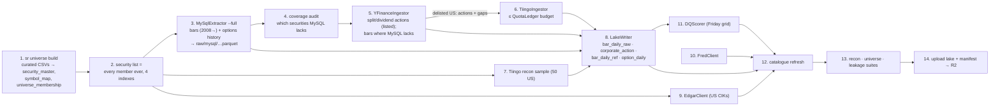
```mermaid
flowchart LR
    A["1. sr universe build<br/>curated CSVs → security_master,<br/>symbol_map, universe_membership"] --> B["2. security list =<br/>every member ever, 4 indexes"]
    B --> C["3. MySqlExtractor --full<br/>bars (2008→) + options history<br/>→ raw/mysql/…parquet"]
    C --> COV["4. coverage audit<br/>which securities MySQL lacks"]
    COV --> Y["5. YFinanceIngestor<br/>split/dividend actions (listed);<br/>bars where MySQL lacks"]
    Y -->|"delisted US: actions + gaps"| T["6. TiingoIngestor<br/>≤ QuotaLedger budget"]
    B --> R["7. Tiingo recon sample (50 US)"]
    C & Y & T & R --> L["8. LakeWriter<br/>bar_daily_raw · corporate_action ·<br/>bar_daily_ref · option_daily"]
    B --> E["9. EdgarClient (US CIKs)"]
    F["10. FredClient"]
    L --> D["11. DQScorer (Friday grid)"]
    L & E & F & D --> K["12. catalogue refresh"]
    K --> G["13. recon · universe · leakage suites"]
    G --> U["14. upload lake + manifest → R2"]
```

**Nightly** (VPS, Mon–Fri 22:00 America/New_York). The in-house load runs after the US close and finishes before the HK open (21:30 ET in summer, 20:30 ET in winter). A **freshness gate** makes the job wait until `histdailyprice7` holds today's US session and `OptionChains` holds today's `Date`. It polls every 10 min until 23:30, then alerts:

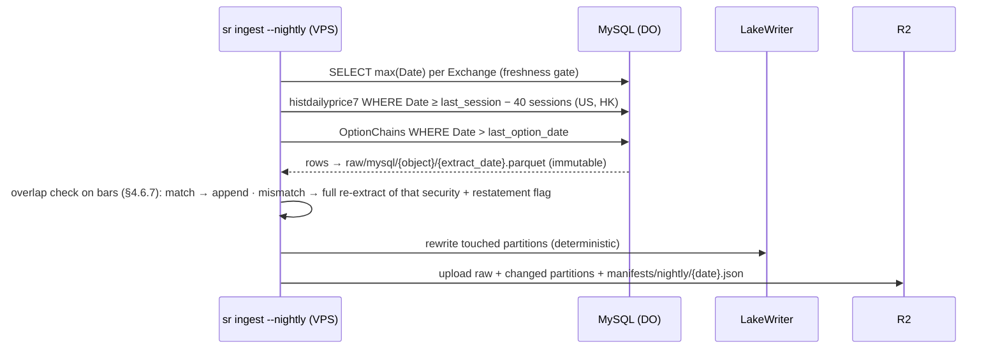
```mermaid
sequenceDiagram
    participant J as sr ingest --nightly (VPS)
    participant M as MySQL (DO)
    participant W as LakeWriter
    participant R as R2
    J->>M: SELECT max(Date) per Exchange (freshness gate)
    J->>M: histdailyprice7 WHERE Date ≥ last_session − 40 sessions (US, HK)
    J->>M: OptionChains WHERE Date > last_option_date
    M-->>J: rows → raw/mysql/{object}/{extract_date}.parquet (immutable)
    J->>J: overlap check on bars (§4.6.7): match → append · mismatch → full re-extract of that security + restatement flag
    J->>W: rewrite touched partitions (deterministic)
    J->>R: upload raw + changed partitions + manifests/nightly/{date}.json
```

**Weekly** (VPS, Sat 06:00): yfinance split/dividend actions for listed securities (≈ 800 calls) → `corporate_action`. Then universe rebuild, adjust, DQ for the new Friday, catalogue refresh, a leakage smoke test (5 securities), and `manifests/weekly/{date}.json` with gate flags. **Lambda** runs on its own schedule: EDGAR daily index Mon–Fri 22:30, FRED Mon–Fri 17:30, watchdog daily 07:00 and Sat 09:00.

**Point-in-time read** (every consumer from P1 on): the same `AsOfQuery` / `PointInTimeAdjuster` path as before.

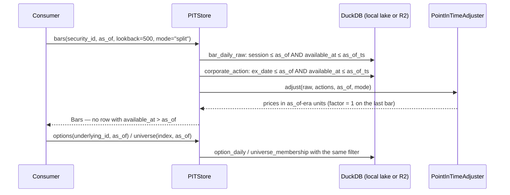
```mermaid
sequenceDiagram
    participant C as Consumer
    participant S as PITStore
    participant D as DuckDB (local lake or R2)
    participant A as PointInTimeAdjuster
    C->>S: bars(security_id, as_of, lookback=500, mode="split")
    S->>D: bar_daily_raw: session ≤ as_of AND available_at ≤ as_of_ts
    S->>D: corporate_action: ex_date ≤ as_of AND available_at ≤ as_of_ts
    S->>A: adjust(raw, actions, as_of, mode)
    A-->>S: prices in as_of-era units (factor = 1 on the last bar)
    S-->>C: Bars — no row with available_at > as_of
    C->>S: options(underlying_id, as_of) / universe(index, as_of)
    S->>D: option_daily / universe_membership with the same filter
```

### 4.4 Layers & classes

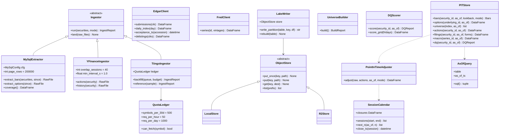
```mermaid
classDiagram
    class Ingestor {
        <<abstract>>
        +run(securities, mode) IngestReport
        +land(raw_files) None
    }
    class MySqlExtractor {
        +MySqlConfig cfg
        +int page_rows = 200000
        +extract_bars(securities, since) RawFile
        +extract_options(since) RawFile
        +coverage() DataFrame
    }
    class YFinanceIngestor {
        +int overlap_sessions = 40
        +float min_interval_s = 1.0
        +actions(security) RawFile
        +history(security) RawFile
    }
    class TiingoIngestor {
        +QuotaLedger ledger
        +backfill(queue, budget) IngestReport
        +reference(sample) IngestReport
    }
    class QuotaLedger {
        +symbols_per_30d = 500
        +req_per_hour = 50
        +req_per_day = 1000
        +can_fetch(symbol) bool
    }
    class EdgarClient {
        +submissions(cik) DataFrame
        +daily_index(day) DataFrame
        +acceptance_ts(accession) datetime
        +delistings(ciks) DataFrame
    }
    class FredClient {
        +series(id, vintages) DataFrame
    }
    class LakeWriter {
        +ObjectStore store
        +write_partition(table, key, df) str
        +rebuild(table) None
    }
    class ObjectStore {
        <<abstract>>
        +put_once(key, path) None
        +put(key, path) None
        +get(key, dest) None
        +list(prefix) list
    }
    class LocalStore
    class R2Store
    class PointInTimeAdjuster {
        +adjust(raw, actions, as_of, mode) DataFrame
    }
    class SessionCalendar {
        +sessions(start, end) list
        +next_n(as_of, n) list
        +close_ts(session) datetime
        +closures DataFrame
    }
    class UniverseBuilder {
        +build() BuildReport
    }
    class DQScorer {
        +score(security_id, as_of) DQReport
        +score_grid(fridays) DataFrame
    }
    class AsOfQuery {
        +table
        +as_of_ts
        +sql() tuple
    }
    class PITStore {
        +bars(security_id, as_of, lookback, mode) Bars
        +options(underlying_id, as_of) DataFrame
        +universe(index, as_of) list
        +actions(security_id, as_of) DataFrame
        +filings(security_id, as_of, forms) DataFrame
        +macro(series_id, as_of) DataFrame
        +dq(security_id, as_of) DQReport
    }
    Ingestor <|-- MySqlExtractor
    Ingestor <|-- YFinanceIngestor
    Ingestor <|-- TiingoIngestor
    TiingoIngestor --> QuotaLedger
    ObjectStore <|-- LocalStore
    ObjectStore <|-- R2Store
    LakeWriter --> ObjectStore
    PITStore ..> AsOfQuery
    PITStore ..> PointInTimeAdjuster
    PointInTimeAdjuster ..> SessionCalendar
```

| Module | Class / function | Responsibility | Inputs → Outputs |
|---|---|---|---|
| `data/ingestion/mysql.py` | `MySqlExtractor`, `MySqlConfig` | **Primary source for bars (`histdailyprice7`) and options (`OptionChains`)** wherever the in-house tables cover a security. MySQL `FLOAT` is 4-byte single precision, so values are cast to `DOUBLE` on extract. The cast is exact, but the stored precision is ~7 significant digits: prices are exact to well under a tick, and volumes above 2²⁴ are rounded by ≤ 6·10⁻⁸ relative. Strikes are rounded to 0.001 on extract so contract keys are stable. The DuckDB `mysql` extension (`ATTACH … (TYPE mysql, READ_ONLY)`) with `COPY (SELECT …) TO … (FORMAT parquet)` writes typed raw extracts, one query per `(object, market, year)` for the full build and per date range for the nightly run. No row-by-row Python. Uses a read-only user over TLS (`ssl_ca`) and never writes to MySQL. `coverage()` reports, per `security_id`, the first and last session and row count in MySQL, which drives the fallback chain (§4.6.2). Column mapping lives in `config/sources.yaml: mysql` (table and column names), so the class does not hard-code the in-house schema. | → `raw/mysql/{bars\|options}/{market}/{extract_date}/…parquet` |
| `data/ingestion/yfinance.py` | `YFinanceIngestor` | (1) **Corporate actions for listed securities**: `Dividends` and `Stock Splits`. These are needed to recover traded prices from the MySQL mirror (§4.6.1). (2) **Bars** only when MySQL lacks the security. Reference closes are *not* fetched: the MySQL data is itself yfinance, so they would not be independent. The P0 `YFinanceSource` is wrapped, not replaced. | → `corporate_action`, `bar_daily_ref`, fallback `bar_daily_raw` |
| `data/ingestion/tiingo.py` | `TiingoIngestor`, `QuotaLedger` | (1) **Split/dividend actions for delisted US names**, which yfinance no longer serves (one call each, ≈ 350 names, one 30-day quota window). (2) Bars for US securities absent from MySQL. (3) The 50-name reconciliation sample, the only source independent of Yahoo. Quota: 500 symbols per 30 d, 50 req/h, 1 000 req/d, refused rather than exceeded. | → fallback `bar_daily_raw`, `bar_daily_ref`, `corporate_action` |
| `data/ingestion/edgar.py` | `EdgarClient` | Initial: submissions JSON for US CIKs (10-K/10-Q/8-K and 20-F/6-K filers). Nightly (Lambda): daily-index filtered to tracked CIKs, with acceptance ts from each filing's `-index.htm`. Form 25/15 for delistings. ≤ 5 req/s with `SEC_USER_AGENT`. HK has no EDGAR; HK delisting evidence is an HKEXnews URL in the curated file. | → `filing`, delisting evidence |
| `data/ingestion/fred.py` | `FredClient` | ALFRED vintages; `available_at = vintage release ts`; 13 series (§4.5.1). Runs in Lambda. | → `macro_series`, `macro_release` |
| `data/objectstore.py` | `ObjectStore`, `LocalStore`, `R2Store` | Where raw extracts and lake partitions live. `put_once` refuses to overwrite a key with different content (HEAD, then PUT with `If-None-Match: *`). `R2Store` uses boto3 against `https://$R2_ACCOUNT_ID.r2.cloudflarestorage.com`. `LocalStore` is used by tests and offline runs. This sits in L1 because the lake needs it; it has no knowledge of ingest schedules. | — |
| `data/lake.py` | `LakeWriter` | Deterministic Parquet (§4.6.8). It rewrites one partition at a time, writes locally first, then uploads to the `ObjectStore`, and records `manifests/…json` (key, sha256, rows). `rebuild(table)` folds every raw extract in `(extract_date, source, object)` order. **Options are not copied**: `option_daily` is a DuckDB view over the raw option extracts plus a computed `available_at` (§4.6.9), so the largest dataset is stored once. | raw → `lake/<table>/…` |
| `data/adjust.py` | `PointInTimeAdjuster` | §4.6.1; `mode ∈ {"split","total","none"}`; pure, with no I/O. Also writes `bar_daily_adj_latest` (for recon only; not readable via `PITStore`). | raw + actions + as_of → adjusted |
| `data/calendars.py` | `SessionCalendar` | `exchange_calendars` XNYS/XHKG plus `curated/exchange_closures.csv` (§4.6.5), materialised into `session_calendar`. | — |
| `data/universe.py` | `MembershipDrafter`, `UniverseBuilder` | Drafts from pinned Wikipedia revisions (S&P 500, Nasdaq-100, DJIA, HSI change tables). A human verifies the draft and promotes it to `curated/index_membership.csv`. The builder does a full deterministic rebuild of `security_master`, `symbol_map` (sources `mysql`, `yfinance`, `tiingo`) and `universe_membership`. | → three tables |
| `data/quality.py` | `DQScorer` | §4.6.3. | → `dq_score` |
| `data/store.py` | `PITStore`, `AsOfQuery` | The only read path. `lake_uri` is either `data/lake` or `r2://sr-agent/lake`. `AsOfQuery.sql()` always binds `available_at <= ?`. The allow-list excludes `bar_daily_adj_latest`. | — |
| `ops/lambdas.py` | `edgar_daily_handler`, `fred_handler`, `watchdog_handler` | Lambda entry points (L5). The fetchers call `EdgarClient` / `FredClient` and `R2Store.put_once` raw text only; the VPS lands it. The watchdog checks that `manifests/weekly/` has this week's file with all gate flags green and `manifests/nightly/` has ≤ 1 missing weekday, and publishes to SNS otherwise. | — |
| `ops/systemd/`, `infra/aws/template.yaml` | units and timers; AWS SAM template | VPS schedule; Lambda functions (container image, arm64, Python 3.11) + EventBridge Scheduler + SNS topic + SSM parameters. | — |
| `cli.py` | `sr universe draft\|build\|check`, `sr ingest --full\|--nightly\|--weekly [--only …]`, `sr ingest tiingo-backfill --budget N`, `sr mysql coverage`, `sr lake rebuild\|pull`, `sr catalogue refresh`, `sr dq TICKER --as-of`, `sr recon`, `sr restore`, `sr p0 --store` | Thin commands over the above. | — |
| `tests/leakage/guard.py` | `LeakageGuard` | A physically truncated lake copy, so the probe is not tautological with `PITStore`'s filter. | — |

The CBOE archiver of the 2026-09-23 draft is **dropped**: the in-house daily options data supersedes it.

### 4.5 Data sources & storage

#### 4.5.1 Sources live in P1

| Source | P1 role | Markets | Rate / access discipline |
|---|---|---|---|
| **MySQL (DO)** — `histdailyprice7` | **Spine** for every security it covers (a yfinance mirror incl. delisted names up to their delisting date) | US, HK | read-only user, TLS, VPS IP only; paged bulk queries, off-peak |
| **MySQL (DO)** — `OptionChains` | Lands as `option_daily` (point-in-time; archive for the P4 options module, BP §8 rung 7) | ≈ 50 US stocks/ETFs | same |
| yfinance | Split/dividend actions for listed names; bars fallback | US, HK | ≥ 1 s/call + jitter, backoff; VPS only |
| Tiingo free | Split/dividend actions for delisted US names; bars fallback; the independent 50-name recon sample | US | `QuotaLedger` (500 sym/30 d, 50 req/h, 1 000 req/d, 1 GB/mo) |
| SEC EDGAR | CIKs, filing index + acceptance ts, Form 25/15 | US (incl. 20-F filers in NDX) | ≤ 5 req/s, `SEC_USER_AGENT` |
| FRED / ALFRED | `DGS10, DGS2, DTB3, DFF, T10Y2Y, VIXCLS, BAMLH0A0HYM2, UNRATE, CPIAUCSL, INDPRO, UMCSENT, USREC, DTWEXBGS` | US macro | ≤ 60 req/min |
| Index sources (curated) | S&P DJI press releases; Nasdaq-100 annual/quarterly change notices; DJIA changes; Hang Seng Indexes quarterly review announcements; pinned Wikipedia revisions as the draft | all | manual, one `source_url` per row |
| HKEXnews (curated) | HK delisting / privatisation evidence; HK rights-issue terms not in yfinance | HK | manual |

**M0 audit of the MySQL data — owner's answers (2026-09-24) and consequences:**

| Question | Answer | Consequence |
|---|---|---|
| Bars table | `histdailyprice7`: PK `(Date, Symbol, Exchange)`; `Open, High, Low, Close, Volume, AdjClose` as `FLOAT` | `symbol_map(source='mysql')` keys on `(Symbol, Exchange)`. Nightly range queries on `Date` use the PK prefix. Per-security re-extracts do not, so they are batched into one scan per night (or a secondary index `(Symbol, Exchange, Date)` is added if the DB owner agrees). |
| Traded or adjusted prices? | Source is **yfinance**, so `Close` is split-adjusted *as of the day each row was loaded*. The loader is **append-only**: it never re-downloads history after a split (owner, 2026-09-24). | Each security has two segments. The **backfill** segment (the first load) is rescaled for every split before the backfill date. The **appended** segment is in traded units. §4.6.1 finds the boundary from the split jumps and recovers traded prices. |
| Delisted securities? | **Yes**, up to the delisting date | This is the survivorship defence. Coverage of a delisted name depends on whether it was collected before yfinance dropped it, which `sr mysql coverage` measures. Split events for delisted names come from Tiingo (yfinance has none). |
| Vendor | yfinance | Live yfinance is **not** an independent reconciliation source, so gate a rests on the Tiingo sample (§4.6.2). |
| `updated_at` column? | No | Restatements are detected by the 40-session overlap check (§4.6.7). |
| Load time | Every weeknight, after the US close and before the HK/China open | Nightly extract at 22:00 ET behind a freshness gate (§4.5.6). |
| Options table | `OptionChains`: PK `(Date, Section, UnderlyingSymbol, strike, Expiration, OptionType)`; `contractSymbol, lastTradeDate (varchar), lastPrice, bid, ask, change, percentChange, volume, openInterest, impliedVolatility, inTheMoney, contractSize, currency, UnderlyingPrice`; captured daily after the US close; ≈ 50 US stocks/ETFs | This is yfinance's `option_chain()` layout: no greeks, Yahoo-computed IV, and open interest that is the prior session's. `available_at` and field semantics are in §4.6.9. |
| VPS | 4 vCPU / 16 GB / 200 GB NVMe / 16 TB transfer | Holds the whole lake locally; §4.5.5. |

**Still to measure in M0** (queries, no decisions needed):

- `MIN(Date)` and row counts per `Exchange` in both tables, and the distinct `Exchange` and `Section` values;
- MySQL coverage of every universe member over its membership span;
- the split-state classification (§4.6.1) on AAPL 2020-08-31, TSLA 2020-08-31 / 2022-08-25 and NVDA 2024-06-10;
- the exact time the nightly load finishes;
- whether HSI names are present under the `.HK` convention;
- the production host of the myFinData cron jobs, its time zone and its yfinance version (U0 in §4.5.7);
- whether the loader's raw CSV cache survives on that host (it dates each symbol's first load; §4.5.7 inventory #7).

#### 4.5.2 Tables introduced

DDL is in Appendix A. The small tables (`security_master`, `symbol_map`, `universe_membership`, `session_calendar`, `ingest_run`) live in `sr.duckdb` and are rebuilt deterministically from `curated/` on every host.

| Table | Grain | Key columns | `available_at` rule |
|---|---|---|---|
| `security_master` | one per listing | `security_id, cik, name, exchange, market, currency, listing_date, delisting_date, spine_source, mysql_backfill_bracket, mysql_first_load_date` | from `listing_date`; `delisting_date` known at the Form 25 acceptance / HKEXnews announcement ts |
| `symbol_map` | security × source × interval | `security_id, source, symbol, valid_from, valid_to` | −∞ (provider key) |
| `universe_membership` | interval | `security_id, index_name ∈ {SP500, NDX, DJIA, HSI}, start_date, end_date, ticker_at_time, source_url, evidence_grade` | `max(announcement_ts, close of the session before start_date)`; effective date only → close of the effective session |
| `bar_daily_raw` | security × session | **traded (unadjusted)** OHLCV, `source`, `extract_date` | exact session close + `bar_publication_lag_minutes` |
| `corporate_action` | security × ex_date × type | `split, bonus, dividend, special_dividend, rights, spinoff, delist`; `ratio, cash_amount, subscription_price, source` | announcement ts if known; else close of the session before `ex_date` |
| `bar_daily_ref` | security × session | live-yfinance traded close (monthly, a2); Tiingo `adj_close` for the sample (a1) | as bars |
| `bar_daily_adj_latest` | security × session | total-adjusted to latest, `adj_factor`, `atr20` | **not point-in-time; not readable through `PITStore`** |
| `option_daily` | underlying × trade date × contract | `OptionChains` mapped to `underlying_id, trade_date, section, expiry, strike (rounded 0.001), right, contract_symbol, last_trade_ts, last, bid, ask, volume, open_interest_prev, iv_yahoo, in_the_money, contract_size, currency, underlying_price`, plus derived `quote_stale` and `iv_valid` | §4.6.9 |
| `session_calendar` | exchange × session | `open_ts, close_ts, is_half_day, closure_reason` | −∞ (curated closures: the closure announcement ts) |
| `filing` | filing | `security_id, cik, form, acceptance_ts, accession, primary_doc_url, items` | `acceptance_ts` |
| `macro_series`, `macro_release` | series × obs × vintage | `series_id, obs_date, value, vintage_ts` | `vintage_ts` |
| `dq_score` | security × Friday | `score, components, blockers` | the Friday's close ts |
| `ingest_run` | run × step | `run_id, host, step, n_rows, n_new, n_restated, errors, git_sha` | n/a |

#### 4.5.3 Resource — database

**Choice: MySQL stays the upstream system of record. The point-in-time store is DuckDB over Parquet (D6), and the Parquet lives in R2.**

| Option | Verdict | Reason |
|---|---|---|
| Query MySQL directly for backtests | no | Mutable rows break replay determinism (BP §10.4.4) and leakage-as-a-type-error (rows have no `available_at`). Walk-forward runs scan ~10⁷ bar rows and, from P2, ~10⁸ candidate/feature rows repeatedly, which is a row store over a WAN. It would also put research load on the production market-data DB. |
| Add `available_at` tables inside MySQL | no | Solves leakage but not scan cost or determinism, and it adds schema to a DB that other systems own. |
| **Extract → immutable Parquet → DuckDB** | **yes** | Columnar and local-speed. Extracts are immutable, so `lake rebuild` is byte-reproducible. DuckDB reads MySQL (extension), local Parquet and R2 with one engine. |

Settings:

- `duckdb` pinned `>=1.1,<2` with the `mysql` and `httpfs` extensions (version-pinned and installed at build time on the VPS);
- `SET threads = 4 (VPS) / 8 (workstation); SET memory_limit = '10GB' (VPS, 16 GB RAM) / '8GB'; SET TimeZone = 'UTC'`;
- one writer per host, holding `data/.ingest.lock`; readers open `read_only`.

**MySQL requirements** (on the DO side; nothing is bought):

- a read-only user `sr_reader` with `SELECT` on the market-data schema only;
- the VPS public IP added to DO *Trusted Sources*, plus the workstation IP if ad-hoc extracts are wanted;
- a read-only replica or a connection pool, if the cluster has one, to keep bulk extracts off the primary;
- env `MYSQL_HOST, MYSQL_PORT, MYSQL_USER, MYSQL_PASSWORD, MYSQL_DATABASE, MYSQL_SSL_CA`.

**MySQL load:**

- initial extract: one paged scan per `(object, market, year)`, run off-peak (Sat 02:00–06:00 ET);
- nightly: two range queries on the leading PK column, `histdailyprice7 WHERE Date >= ?` and `OptionChains WHERE Date > ?`;
- restatement re-extracts `WHERE Symbol IN (…)` are batched into one scan per night, because `Symbol` is not a PK prefix.

**Sizing** (bars: estimates; options: ≈ 50 underlyings per the owner, row rate estimated until M0 measures it; ≈ 1 150 securities = US ≈ 1 020 ever in S&P 500 ∪ NDX ∪ DJIA since 2010, HK ≈ 130 ever in HSI; bars from 2008):

| Dataset | Rows | Parquet (zstd) |
|---|---|---|
| `bar_daily_raw` | ≈ 4.5 M | ≈ 150 MB |
| `bar_daily_adj_latest` + `bar_daily_ref` | ≈ 9 M | ≈ 300 MB |
| `corporate_action` | ≈ 50 k | < 5 MB |
| `filing` (US) | ≈ 1.5 M | ≈ 60 MB |
| `macro_*`, `dq_score` | ≈ 2 M | ≈ 50 MB |
| **Lake excluding options** | | **≈ 0.6 GB** (growth ≈ 0.1 GB/yr) |
| `option_daily`, ≈ 50 US underlyings | `R` ≈ 100–150 k contracts/day (SPY-class ETFs ≈ 5–10 k each, single stocks ≈ 1–3 k) → 25–38 M/yr | ≈ 0.8–1.2 GB/yr (≈ 32 B/row) |

Options still dominate storage, but at ≈ 1 GB/yr the whole lake fits the VPS disk (200 GB) and R2's free tier for years. M0 replaces `R` and the history depth with `COUNT(*)` / `MIN(Date)`.

#### 4.5.4 Resource — Cloudflare R2

**Role (changed from the 2026-09-23 draft).** R2 is now the **canonical home of the lake and the write-once raw archive**, and the hand-off point between VPS, Lambda and workstation. It is not just a backup. Local disks hold caches of it.

| Item | Setting |
|---|---|
| Bucket | `sr-agent`, Standard class |
| Endpoint / auth | `https://$R2_ACCOUNT_ID.r2.cloudflarestorage.com`, S3 API, region `auto`. Two tokens scoped to the bucket: **VPS** read & write; **Lambda + workstation** write-only on `raw/{edgar,fred}/`, read elsewhere. Env `R2_ACCOUNT_ID, R2_ACCESS_KEY_ID, R2_SECRET_ACCESS_KEY, R2_BUCKET`; Lambda reads them from SSM. |
| Key layout | `raw/{source}/{object}/{market}/{extract_date}/part-*.parquet\|.csv.gz` **write-once** · `lake/{table}/market=/year=/part-0.parquet` (rewritten per partition) · `manifests/{nightly,weekly}/{date}.json` · `curated/` (mirror of git) |
| Immutability | `put_once` in code on `raw/`; also an R2 bucket-lock rule on `raw/` if the account offers it (M0) |
| DuckDB access | `CREATE SECRET r2 (TYPE r2, KEY_ID …, SECRET …, ACCOUNT_ID …)`; `PITStore(lake_uri="r2://sr-agent/lake")` works without a local copy (slower; used by the watchdog-free smoke test) |
| Restore | `sr restore` = pull `raw/`, then `sr lake rebuild`; the quarterly drill hash-compares against `manifests/weekly/` |

**Storage and cost** (free tier: 10 GB-month Standard, 1 M Class A, 10 M Class B; beyond that $0.015/GB-month, $4.50/M Class A, $0.36/M Class B, egress free):

| Component | Size |
|---|---|
| Lake excluding options | ≈ 0.6 GB |
| Raw extracts, bars + actions + EDGAR + FRED | ≈ 0.4 GB, + ≈ 0.3 GB/yr |
| Options (stored once, as raw extracts), ≈ 50 underlyings | ≈ 1 GB per history-year, + ≈ 1 GB/yr |
| **Total with 5 yr of options history** | ≈ 1 + 5 ≈ **6 GB → $0** (the free tier holds until ≈ 3–4 more years of growth) |
| Class A ops | ≈ 3 k/mo (nightly ≈ 6 files × 22 + weekly ≈ 80 partitions × 4.3 + Lambda ≈ 450 raw objects) |
| Class B ops | ≈ 20 k/mo (HEADs + workstation pulls) |

Ops stay well under 1 % of the free quota. When the bucket passes 8 GB (≈ 2029 at this rate), the manifest job warns. Overage is $0.015/GB-month (≈ $0.03/mo per extra 2 GB).

#### 4.5.5 Resource — compute

| Host | Minimum spec for P1 | P1 load |
|---|---|---|
| **Hostinger VPS** (ingest host) | **4 vCPU / 16 GB RAM / 200 GB NVMe / 16 TB transfer** (owner's VPS; ≥ 2 vCPU / 8 GB would suffice). Ubuntu 24.04, `uv`, Python 3.11, systemd timers, static IP. | Nightly ≈ 5 min at < 1 GB RAM. Weekly ≈ 20 min at ≈ 3 GB. Initial build ≈ 1.5 h. The whole lake (≈ 7 GB with 5 yr of options) stays on local disk, so no eviction is needed. Spare capacity for P6's scheduled forecast run. |
| **AWS Lambda** | 3 functions, container image, arm64, 512 MB, timeout 5 min; EventBridge Scheduler; SNS; SSM Standard parameters | ≈ 70 invocations/month, each < 2 min → ≈ 2 k GB-s/month. Inside the Lambda free tier (1 M requests, 400 k GB-s), so **$0**. |
| **DO MySQL** | existing cluster | Initial extract: one long read scan per table and year, off-peak (Sat 02:00–06:00 ET). Nightly: two PK-range queries, < 1 min, after the owner's load has finished. |
| **Workstation** | 16 cores / 31 GB (unchanged) | P1: development and tests only. From P2, research reads the pulled lake. Disk has 60 GB free (87 % used); pull options selectively (`sr lake pull --tables … --years …`). |

| Job | Host | Wall time | Bound by |
|---|---|---|---|
| MySQL full extract, bars (≈ 4.5 M rows) | VPS | ≈ 2–5 min | WAN + MySQL scan |
| MySQL full extract, options (≈ 25–38 M rows per history-year) | VPS | ≈ 6–9 min per history-year at ≈ 75 k rows/s | WAN; measured in M0 |
| yfinance actions, ≈ 800 listed securities | VPS | ≈ 15–20 min | 1 s/call politeness |
| Tiingo: actions for ≈ 350 delisted US names + bar gaps + 50 recon | VPS | ≈ 8 h unattended, one 30-day window | 50 req/h, 500 sym/30 d |
| EDGAR initial, ≈ 1 600 calls | VPS | ≈ 6 min | 5 req/s |
| Lake rebuild excluding options | VPS | ≈ 1–2 min | Polars |
| DQ Friday grid (≈ 1 M scores) | VPS | ≈ 1 min | Polars |
| Leakage suite | workstation / CI | ≈ 1–2 min | Parquet rewrite |

#### 4.5.6 Resource — time of operation

All times are America/New_York. HK closes at 16:00 HKT = 04:00 ET (EDT) / 03:00 ET (EST).

**One-off initial build** (after M0–M7 code exists): ≈ 1.5 h active on the VPS (options history ≈ 6–9 min per year of history; bars minutes), plus one unattended Tiingo window (≈ 8 h) for delisted-US split/dividend actions and the recon sample.

**Recurring schedule:**

| Job | Host | When | Duration | Why then |
|---|---|---|---|---|
| `sr ingest --nightly` (MySQL bars + options, US + HK) | VPS | Mon–Fri 22:00, freshness-gated (polls to 23:30). After the upstream cutover (§4.5.7 U6) it starts on the `load_audit` signal from 19:00 (≈ 18:45 load finish), and the 22:00 gate becomes the fallback | ≈ 5 min | the owner's load runs after the US close and finishes before the HK open (21:30 ET summer / 20:30 ET winter); HK's session closed at 04:00 / 03:00 ET the same day |
| `sr ingest --weekly` (actions, universe, adjust, DQ, catalogue, leakage smoke, manifest) | VPS | Sat 06:00 | ≈ 20 min | Friday's nightly extract has landed; nothing trades |
| `edgar-daily` | Lambda | Mon–Fri 22:30 | < 1 min | EDGAR's daily index is published after the 22:00 acceptance cut-off |
| `fred-vintages` | Lambda | Mon–Fri 17:30 | < 1 min | after most FRED releases |
| `watchdog` | Lambda | daily 07:00 (checks last night's manifest), Sat 09:00 (weekly) | < 10 s | outside the VPS, so it can detect a dead VPS |
| `sr recon` (Tiingo 50-name sample) | VPS | 1st Sat monthly, 09:00 | ≈ 1 h | 50 req/h |
| Universe file update | workstation | S&P 500 / DJIA: as announced (≈ 5 sessions before effective). NDX: December annual reconstitution + ad hoc. HSI: quarterly review (results announced mid-Feb/May/Aug/Nov, effective about three weeks later) | ≈ 1 h each, manual | each row needs a `source_url` |
| HK closure file update | workstation | after any typhoon/black-rainstorm closure before 2024-09-23; none expected since Severe Weather Trading | minutes | — |
| Restore drill | VPS | quarterly | ≈ 15 min | proves R2 restores |

#### 4.5.7 Upstream collectors — Fin-Lambda reuse and the myFinData migration

*Added 2026-09-24 after scanning the two repositories that feed MySQL: `Fin-Lambda` at `fa1d6ac` (`Ops/fin-cron-data/`, ten scheduled Lambdas) and the local checkout of `myFinData` at `37c9493`. The local myFinData copy is **not** the production copy. Its logs end in June 2024, its config still names `histdailyprice6`, and this workstation has no crontab. The production host of the two cron jobs is found in U0 below.*

**Repository boundary (D10).** Two repositories, split by who writes MySQL:

| Repository | Owns | Writes | Conventions |
|---|---|---|---|
| **`Fin-Lambda`**: the upstream collector | every job that writes the owner's market-data MySQL, for all consumers (web predictions, trading, this project). It **absorbs myFinData's two live cron jobs**, and myFinData is archived after the cutover. | MySQL `GlobalMarketData`/`Trading`; its own R2/S3 prefixes (news, raw collector cache) | Fin-Lambda's own `CLAUDE.md`: flat handlers, `dataUtil`, Serverless v3, `HISTORY.md` + four `doc/` files |
| **`Support-Resistance-Agent`**: the point-in-time spine and everything above it | P1 extract, lake, adjustment, `PITStore`, and the SR Lambdas (EDGAR, FRED, watchdog). Those Lambdas write SR's raw contract, not MySQL, so they stay here as a separate stack in the same AWS account. | only the `sr-agent` R2 bucket; MySQL is read-only | this document |

The spine does **not** get a third repository. L1 `data/` is imported in-process by L2–L5, and the leakage and determinism tests guard exactly those imports. A separate package would need versioned releases and cross-repo contract tests, which is overhead one developer does not need. The contract between the two repositories is **data, not code**: the tables and their semantics below, documented in Fin-Lambda's `doc/API-REFERENCE.md` and asserted by `tests/integration/test_upstream_contract.py` here.

**Code is reused by porting, never by importing.** Fin-Lambda pins pandas 1.5 and SQLAlchemy 1.4 in its Lambda layers, uses flat imports, reads CSVs relative to the working directory and swallows errors. This repository is Python 3.11 with Polars and errors that raise. Ported functions keep a `# ported from Fin-Lambda <path>@<sha>` comment.

**Inventory: what exists and what P1 does with it**

| # | Upstream asset | Written by (schedule) | P1 use |
|---|---|---|---|
| 1 | `histdailyprice7` | myFinData `eoddata_ext_fetch.py -m` (cron `10 21 * * 1-5`, host-local) | **Spine** (§4.6.1). Migrated to Fin-Lambda `eodDaily` (U2) |
| 2 | `OptionChains` | myFinData `optchain_fetch.py -S PM -U` (cron `40 21 * * 1-5`) | `option_daily` (§4.6.9). Migrated to Fin-Lambda `optChainEOD` (U3) |
| 3 | `Trading.portfolio_assets_info` | Fin-Lambda `portAssetsHandler` (22:30 UTC, S&P 500 + NDX-100, a new dated set only on change, since 2026-08) | **Forward change detector** for `curated/index_membership.csv`: a new set raises a review item. The curated file stays the record because each row needs a `source_url` and an announcement timestamp. Extended to DJIA + HSI (U8) |
| 4 | `Product_List/stock_exchange.csv` (13 909 symbol → exchange rows) | manual | Seed for `symbol_map(source='mysql')` `Exchange` values; read once in M3 |
| 5 | `port_assets_handler.py` parsers (`normalize_us_symbol`, `_pick_table`, `parse_sp500_wikipedia`, the Wikimedia User-Agent) and their fixtures | — | **Ported** into the M3 universe drafter. The dashed form (`BRK-B`) is what `histdailyprice7` stores |
| 6 | `yf-news-collect.py` R2 client (boto3 with `endpoint_url`) | — | Pattern for `R2Store` (§4.4); SR uses its own bucket and tokens |
| 7 | the loader's raw CSV cache on the production host: `Ops/yfinance/{sym}_{start}_{end}.csv`, `Ops/OptionsChain/`, `Ops/loadDB/` | myFinData, every run | **Archived once**, write-once, to R2 `sr-agent/raw/myfindata-cache/` (U7). A `{sym}_2010-01-01_{D}.csv` file dates that symbol's **first load exactly**, so where the file survives it replaces the bracket `b̂` of §4.6.1. In the local copy, 181 of 183 first loads are on 2023-04-26, and AAL 2010-01-04 has `Close` 4.770 vs `AdjClose` 4.497, which confirms `auto_adjust=False` semantics at that time |
| 8 | `USRates` (Fed H.15 page scrape) | `usrateHandler` | Not the rate source: FRED `DTB3` has full history and vintages. Optional cross-check |
| 9 | `histminprice` (15-min bars) | `yfus30minEOD`, `yfasia30minEOD` | **Not consumed** (D1: no intraday modules) |
| 10 | `snapshot`, options snapshot, `FX_snapshot` | `cronHandler`, `optHandler`, `FXrateHandler` | **Never consumed**: delete-then-append tables hold only the latest snapshot and cannot be point-in-time |
| 11 | `FX_histdaily`, `famaFrench` | `FXHistHandler`, `fffHandler` (broken, Fin-Lambda TODOS §4.1) | Not consumed (per-market models in local currency) |
| 12 | R2 `NEWS/`, `FINANCIALS/`, `STATISTICS/` JSON | `yfNewshandler` (hourly) | P4 candidate for text features, with `available_at = providerPublishTime` (else fetch time). Not in P1 |

**What the loader code says** (read 2026-09-24; each item feeds M0 or U2):

| # | Finding | Consequence for P1 | Fix in the port |
|---|---|---|---|
| L1 | `yf.download(sym, start, end)` **does not pin `auto_adjust`**. The script's `Adj Close` → `AdjClose` rename and its column selection only work on yfinance **< 0.2.51**, where the default is `False`. From 0.2.51 the default is `True`: Open, High, Low and Close all come back **split- and dividend-adjusted**, and the `Adj Close` column is removed because `Close` already is the adjusted close. An upgrade either crashes the job on the missing column or, if someone "fixes" the KeyError, silently makes every new backfill fully adjusted. | M0 records the production yfinance version. DQ check on each first-load segment: `Close ≠ AdjClose` on dividend-paying names, otherwise a `split_state` blocker. | `auto_adjust=False, actions=True, multi_level_index=False` pinned (Fin-Lambda's 15-min handlers already do this). The version is written to `load_audit`. |
| L2 | The schedule is **host-local cron**. This workstation is America/Phoenix, and the production host's time zone is unknown. If it is UTC, 21:10 runs at 17:10 ET in summer but **16:10 ET in winter**, ten minutes after the close. The bar may not be final (closing auction, consolidated volume), and append-only never corrects it. | M0: host and time zone. Gate a1's Tiingo sample is split by DST regime; a winter-only volume or close bias identifies this. | EventBridge Scheduler with `timezone: America/New_York` (Serverless v3 `schedule.method: scheduler`), 18:30 ET. Rows with `Date` = today are dropped unless the exchange closed ≥ 60 min ago (the P0 partial-bar rule). |
| L3 | One `to_sql` per symbol list, with errors swallowed. One PK collision or dropped connection **loses the whole list for that night**. The next night refills from `max(Date)+1`, so the refilled rows carry the later date's split state. | This is the "mixed" pattern that §4.6.1's monotone check flags. The coverage report counts per-night gaps. | Per-batch `INSERT IGNORE` (the first written value wins, so append-only semantics are kept); per-symbol outcome in `load_audit`. |
| L4 | Every first load starts at `FIRSTTRAINDTE = 2010-01-01`. | The MySQL spine has **no 2008–09 bars**, so the 500-session lookback that BP §17.1 wants full on 2010-01-01 is missing. See BP §17.2 A8. | `FIRSTTRAINDTE="2008/01/01"` in the Fin-Lambda `.env` (owner, 2026-09-24): new first loads start in 2008. A one-off **prepend** run (U2b) inserts 2008-01-01 → `MIN(Date)−1` for symbols already loaded. Delisted names get nothing from it (yfinance has no rows for them), so their MySQL history still starts in 2010. |
| L5 | The symbol list is the stored procedure `current_symbols_V2` (`master_db_list`). An index member that is not in that list is never collected, and once delisted it **cannot be backfilled** from yfinance. | This is the gate b risk for future delistings. | The list becomes `current_symbols_V2 ∪` current members of SP500, NDX100, DJI and HSI from `portfolio_assets_info`. A new member is collected from the night its set appears. |
| L6 | No load timestamp is written. | `available_at` for MySQL rows is assumed (close + lag, freshness-gated extract). | `load_audit.finished_at` gives it exactly for rows loaded after the cutover. |
| L7 | Options: the underlying list is three CSVs (`etf_list`, `stock_list`, `us-cn_stock_list`; 194 names in the local copy, versus the owner's ≈ 50 in production). `UnderlyingPrice` = last `history()` close; `contractSize` is forced to 100; a same-day rerun reuses the cached CSV. | §4.6.9's field semantics rest on this behaviour. | Kept **identical**. The raw chain goes to R2 instead of the host disk. |

**New and changed modules: how many.** P1 adds **no data-collection module beyond the five already in its design** (MySQL extractor, yfinance actions/reference, Tiingo, EDGAR, FRED) plus the watchdog. The upstream side adds **three Lambdas (two ports and a status report) and one extension** in Fin-Lambda:

| Id | Repo | Module | Type | What it does |
|---|---|---|---|---|
| U2 | Fin-Lambda | `eod_daily_handler.py` → `eodDaily` | **port** of `eoddata_ext_fetch.py` | Batched `yf.download` (≈ 200 tickers per call, pinned flags L1). Appends bars with `Date > max(Date)` per symbol to `histdailyprice7`, exactly as today. Downloads a 14-session window so late-posted actions are caught, and writes those actions to the new `corp_action_daily` (first-seen wins). Writes `load_audit`. Sharded under the 15-min rule below (`EOD_SHARDS`, default 1). The same handler runs the one-off prepend (U2b) with event `{"prepend": true}`. |
| U3 | Fin-Lambda | `optchain_eod_handler.py` → `optChainEOD` | **port** of `optchain_fetch.py` | Same columns and semantics as `OptionChains` (L7). Writes `load_audit`; the raw chain CSV goes to R2. **Sharded by default** (`OPT_SHARDS=3`) plus a sweep, under the 15-min rule below. |
| U9 | Fin-Lambda | `status_report_handler.py` → `statusReport` | **new** | Daily status report: one line per data set, giving **DataName (table), last data date, last run date and time, status, symbols ok/expected, rows** (format below). Sent by SNS e-mail, written to R2 `status/latest.json`, printed on a local run. |
| U10 | Fin-Lambda | the other daily handlers (`usrateHandler`, `FXHistHandler`, `yfus30minEOD`, `yfasia30minEOD`, `portAssetsHandler`) | **change** | One `DU.audit_run()` call each, writing a summary row to `load_audit`, so they appear in the report with real run times. |
| U8 | Fin-Lambda | `port_assets_handler.py` | **extension** | Adds DJIA (row band 30–30) and HSI (band 50–110) next to SP500/NDX100. M0 asks what writes the existing DJI/HSI rows today. |
| U4 | Fin-Lambda | `dataUtil.append_ignore()`, `dataUtil.audit_run()`, two tables + one view | shared | DDL below. `sql_require_primary_key=ON`, so both tables are created by hand before the first write. |
| S1 | SR | `MySqlExtractor` | change | The nightly extract is **triggered by `load_audit`** (polling from 19:00 ET) instead of the 22:00 freshness gate, which stays as the fallback. `available_at = load_audit.finished_at` for rows loaded after the cutover. Before the cutover it stays close + `bar_publication_lag_minutes`. |
| S2 | SR | `UniverseBuilder` | change | Diffs `portfolio_assets_info` against the curated file every week and opens a review item for each difference. |
| S3 | SR | `corporate_action` build | change | `corp_action_daily` becomes the action source for names delisted **after** the cutover (they carry their own actions). Tiingo remains the source for names delisted before it. |
| S4 | SR | `sr mysql import-cache` | one-off | Reads the archived cache (inventory #7) and sets `security_master.mysql_first_load_date`, which overrides `b̂` in §4.6.1. |
| S5 | SR | `sr status` | change | Prints SR's own `ingest_run` and the upstream `v_load_status` in the U9 format. The watchdog Lambda alerts on the same fields. |

```sql
-- Fin-Lambda, GlobalMarketData schema. Created manually (sql_require_primary_key=ON).
CREATE TABLE load_audit (
  run_id        CHAR(26)     NOT NULL,          -- ULID of the invocation
  job           VARCHAR(32)  NOT NULL,          -- 'eodDaily' | 'optChainEOD'
  Symbol        VARCHAR(45)  NOT NULL,          -- '*' = run summary row
  Exchange      VARCHAR(45)  NOT NULL,
  date_lo       DATE         NULL,              -- first and last trade date written
  date_hi       DATE         NULL,
  table_name    VARCHAR(64)  NOT NULL,          -- DataName in the status report, e.g. 'histdailyprice7'
  segment       VARCHAR(8)   NOT NULL,          -- 'first' | 'append' | 'prepend' | 'summary'
  n_rows        INT          NOT NULL,
  n_ok          INT          NULL,              -- summary rows: symbols with status ok
  n_expected    INT          NULL,              -- summary rows: symbols this shard was given
  status        VARCHAR(16)  NOT NULL,          -- ok | empty | error | skipped
  error         VARCHAR(512) NULL,
  started_at    DATETIME(3)  NOT NULL,          -- UTC
  finished_at   DATETIME(3)  NOT NULL,          -- UTC, commit of this symbol's rows
  yf_version    VARCHAR(16)  NOT NULL,
  host          VARCHAR(64)  NOT NULL,          -- 'lambda:eodDaily' or hostname
  PRIMARY KEY (run_id, Symbol, Exchange),
  KEY k_job_date (job, date_hi),
  KEY k_table_finished (table_name, finished_at)
);
CREATE TABLE corp_action_daily (
  Date          DATE         NOT NULL,          -- ex-date, exchange-local
  Symbol        VARCHAR(45)  NOT NULL,
  Exchange      VARCHAR(45)  NOT NULL,
  Dividends     DOUBLE       NULL,              -- cash per share, traded units of that date
  StockSplits   DOUBLE       NULL,              -- r_u, new/old
  first_seen_at DATETIME(3)  NOT NULL,          -- UTC; INSERT IGNORE keeps the first sighting
  run_id        CHAR(26)     NOT NULL,
  PRIMARY KEY (Date, Symbol, Exchange)
);
-- Latest summary row per data set; statusReport and `sr status` read this.
CREATE VIEW v_load_status AS
SELECT table_name, job, date_hi AS last_data_date, started_at, finished_at,
       status, n_ok, n_expected, n_rows, error
FROM (SELECT a.*, ROW_NUMBER() OVER (PARTITION BY table_name, job ORDER BY finished_at DESC) AS rn
      FROM load_audit a WHERE a.segment = 'summary') s
WHERE rn = 1;
```

`corp_action_daily.first_seen_at` is an honest `available_at` for an action. Actions older than the cutover keep the §4.5.2 rule.

**The 15-minute Lambda limit.** A Lambda invocation stops at 900 s. Each ported job therefore runs as `n` shards plus a sweep:

```
shard i of n   gets symbols  S_i = { s_k ∈ sorted(list) : k mod n = i }        # round-robin; n from .env
budget         stop starting new symbols when context.get_remaining_time_in_millis() < 120 000;
               the unstarted ones get load_audit status 'skipped'
sizing         n = ⌈ T_total / (0.6 · 900 s) ⌉, where T_total = Σ per-symbol (finished_at − started_at) of the last 10 runs
sweep          one invocation 30 min after the last shard: every expected symbol without an 'ok' row for the date
               is retried (same time guard); anything still missing is 'error' in the status report
schedule       one EventBridge Scheduler entry per shard, staggered 3 min apart, each with input {"shard": i, "of": n};
               the sweep gets {"sweep": true}
```

*Options.* One underlying costs ≈ one `option_chain()` call per expiry (≈ 20–40 expiries for index ETFs, fewer for single names) plus one `history()` call: ≈ 10–25 s. About 50 underlyings is ≈ 8–20 min sequentially, too close to or over the limit, so `OPT_SHARDS=3` from the start (≈ 17 underlyings, ≈ 3–7 min each). U3's dry run measures `T_total` and resets `n` if needed. A shard's chains are written per underlying, never at the end of the shard, so a timeout loses at most the underlying in progress. The sweep captures a skipped chain up to ≈ 40 min later. That chain's own `finished_at` is its `available_at` in SR (§4.6.9), so a late quote is never treated as an on-time one.

*Bars.* A batched `yf.download` of ≈ 200 tickers takes seconds, so `EOD_SHARDS=1` should cover a list of a few thousand symbols. U2 measures this, and the rule above applies unchanged if it does not. The one-off prepend (U2b) downloads ≈ 2 years per symbol and runs with its own `n`.

**Status report (U9).** Mon–Fri 20:00 ET and on demand. One line per data set, read from `v_load_status`:

```
DataName (table)     Job           Last data   Last run (ET)             Status   Symbols      Rows
histdailyprice7      eodDaily      2026-09-24  2026-09-24 18:31–18:44    ok       1212/1212    1212
OptionChains         optChainEOD   2026-09-24  2026-09-24 17:40–18:27    partial  49/50        61330
corp_action_daily    eodDaily      2026-09-24  2026-09-24 18:31–18:44    ok       —            7
USRates              usrateHandler 2026-09-23  2026-09-24 17:01–17:01    ok       —            1
FX_histdaily         (inferred)    2026-09-24  —                         —        —            —
```

- **Status** is `ok` (every expected symbol ok), `partial` (some `skipped`/`error` after the sweep), `error` (the run failed), or `stale`. A data set is `stale` when its last data date is older than the previous weekday. The SR watchdog applies the exchange calendar, so a holiday does not alert.
- Tables whose handler does not yet write `load_audit` (before U10) show `MAX(Date)` marked `(inferred)` and no run time.
- The run time spans all shards and the sweep: first start to last finish.

**Start date 2008 (`.env`).** The start date is configuration, not code, in both repositories:

- **Fin-Lambda:** `FIRSTTRAINDTE="2008/01/01"` in `Ops/fin-cron-data/.env` and the root `.env.example`. The `eodDaily` first load of any new symbol starts there.
- **This repository:** `SR_HISTORY_START=2008-01-01` in `.env.example`. It is read by `MySqlExtractor`, `YFinanceIngestor` and `TiingoIngestor` as the earliest session to extract; nothing earlier is landed.

Symbols already in MySQL start in 2010. **U2b** prepends 2008-01-01 → `MIN(Date) − 1` for every symbol whose `MIN(Date)` is later than its listing date allows:

- It uses `INSERT IGNORE`, so no existing row changes.
- It writes `load_audit` rows with `segment='prepend'` and the exact load time.
- Its rows are rescaled for every split up to the prepend date, not the original first-load date. §4.6.1 handles this with the per-row load date `L_t`.
- Delisted names get nothing from it; their coverage rule is BP §17.2 A8.

**Executable plan: the upstream track.** It runs alongside M0–M8. **The P1 gate does not depend on it.** The spine works on the current loader, and the migration only changes rows written after the cutover; no history is touched.

| Step | Owner | Work | Done when | Est. |
|---|---|---|---|---|
| **U0** | owner | On the production host: `crontab -l`, `timedatectl`, `$HOME/env/myFinData/bin/pip show yfinance pandas`, `git -C ~/projects/myFinData log -1`, `du -sh Ops/yfinance Ops/OptionsChain`. In MySQL: row count of `CALL GlobalMarketData.current_symbols_V2`, the production option lists, and what writes the DJI/HSI rows in `portfolio_assets_info`. | the answers are in `research/spikes/p1.md`; L1/L2 are resolved to facts | 0.5 h |
| **U1** | Claude | Fin-Lambda layer `finData313`: the `finPort313` recipe + `yfinance` (pinned to the version U0 found, or 0.2.58 if U0 shows < 0.2.51 and the U5 shadow diff is clean). The new handlers start on python3.13 because python3.10 is being retired by AWS (Fin-Lambda TODOS §5). | `make finData313.zip`; the import check passes | 1.5 h |
| **U2** | Claude | `eodDaily` port + `tests/unit/test_eod_daily_handler.py` (batch shaping, `Date > max(Date)` filter, partial-bar cut, list union L5, flag pinning, `load_audit` rows, action window). Dry run `{"localrun": true, "dbFlag": false}` against the same dates as a myFinData run. | unit tests green; the dry-run CSV equals the old job's CSV for appended dates (O/H/L/C/V/`AdjClose` bit-equal after the float cast) | 5 h |
| **U2b** | owner runs, Claude writes | One-off **prepend** 2008 → `MIN(Date)−1` (`{"prepend": true}`, sharded) after `FIRSTTRAINDTE` is set to 2008/01/01. Test: prepend never overwrites (`INSERT IGNORE`), and `segment='prepend'` rows carry their `date_lo/hi`. | every live symbol has `MIN(Date)` = the later of 2008-01-02 and its first yfinance session; `load_audit` has one prepend row per symbol | 1.5 h |
| **U3** | Claude | `optChainEOD` port + `tests/unit/test_optchain_eod_handler.py` (column set and dtypes, `Section`, `contractSize`, empty-chain path, **shard assignment, time guard → `skipped`, sweep picks up only missing symbols**). Dry run measures `T_total` and sets `OPT_SHARDS`. | same, against a `loadDB/` CSV; every shard's dry run < 600 s | 4 h |
| **U4** | owner + Claude | Create `load_audit`, `corp_action_daily`, `v_load_status`, `histdailyprice7_shadow`, `OptionChains_shadow` (the last two `CREATE TABLE … LIKE`). `dataUtil.append_ignore()` and `audit_run()` + tests. | `serverless package` OK; tables exist | 1.5 h |
| **U5** | Claude | **Shadow run, 10 sessions**: the Lambdas write the `_shadow` tables while the old cron keeps writing production. A diff query, kept in Fin-Lambda `doc/OPERATIONS.md`, compares key sets and values each morning. | identical key sets for the list; `|ΔC|/C ≤ 1e-6` on ≥ 99.9 % of rows, every exception explained (L2 timing, late prints) | 1 h active, 2 weeks elapsed |
| **U6** | owner | **Cutover** on a Friday after U5 passes: comment out the two crontab lines (keep the scripts), point the Lambda env at the production tables, `serverless deploy`. **Rollback:** re-enable the lines. The loader's `max(Date)+1` start refills any gap. | first production night: `load_audit` has one `ok` row per symbol; the SR nightly extract triggered from it | 0.5 h |
| **U7** | owner | Archive: copy the host cache (inventory #7) to R2 write-once; `git tag final-cron` in myFinData; README pointer to Fin-Lambda. Keep the host scripts 30 days, then retire. | `sr mysql import-cache` read it (S4) | 0.5 h |
| **U8** | Claude | `portAssetsHandler` DJIA + HSI with fixtures and tests. | dry run writes 4 sets within their bands | 3 h |
| **U9** | Claude | `statusReport` Lambda + `tests/unit/test_status_report_handler.py` (status rules ok/partial/error/stale, shard aggregation, the `(inferred)` fallback, formatting); SNS topic; R2 `status/latest.json`. | the report runs during the shadow run and shows both old and new jobs | 3 h |
| **U10** | Claude | `DU.audit_run()` in the five other daily handlers; one test each for the audit row. | all daily data sets in the report with real run times | 2 h |

Upstream total ≈ **24 h**, logged in Fin-Lambda's `HISTORY.md` and its `doc/` files (its rules). SR-side changes S1–S5 and the per-row load date in §4.6.1 add ≈ 3 h to M3/M4/M7.

**After the cutover** (America/New_York): `eodDaily` Mon–Fri 18:30 (shards 18:30 + 3 min each, sweep +30 min); `statusReport` Mon–Fri 20:00; `optChainEOD` three shards and a sweep starting at the time the PM job runs now, converted to ET once U0 gives the host time zone, so the options series stays homogeneous. If that time moves with DST, it is fixed at its summer value. The SR nightly extract then starts on the `load_audit` signal (≈ 18:45) instead of 22:00, and the 22:00–23:30 gate remains the fallback.

**Test section.**

- *No regression:* the 59 offline tests and the pre-commit gate are unchanged. Nothing in this repository imports Fin-Lambda.
- *New here:* `tests/integration/test_upstream_contract.py` (`-m integration`, live MySQL read-only) asserts the column sets and PKs of `histdailyprice7`, `OptionChains`, `load_audit` and `corp_action_daily`, and that every `load_audit` row since the cutover has `yf_version` set. `test_mysql_extract.py` gains `available_at` from `load_audit`. `test_split_state.py` gains "a cache-archive first-load date overrides `b̂`" and "a prepend segment with a later load date recovers to continuous traded prices across the 2009/2010 seam". `test_status.py` covers `sr status` formatting from a fixture view. `test_universe.py` gains the `portfolio_assets_info` diff.
- *New in Fin-Lambda:* one pytest file per new Lambda (its rule), U2/U3 dry runs as the golden-CSV baseline, and the shadow-diff procedure in its `doc/OPERATIONS.md`.
- *Removed:* none. The myFinData jobs have no tests to retire.

### 4.6 Algorithms & formulas

#### 4.6.1 Point-in-time corporate-action adjustment (design-fixed §44)

**Why.** A series back-adjusted to *today* rescales past prices by splits that had not happened yet. In ATR units that is harmless. For **round numbers (family B)** it is leakage: on 2020-08-28 AAPL traded near $500, while its back-adjusted close is 124.81. yfinance offers two series, `Close` (split-adjusted, dividend-unadjusted) and `Adj Close` (split- and dividend-adjusted), and neither is the traded price. So the lake stores **traded prices** and adjusts on read, as of the forecast date.

**Traded prices by source.**

```
yfinance (live):  raw_t = Close_t · Π_{splits u : t < ex_u ≤ fetch_date} r_u          # r_u = split ratio (4:1 → 4), from `Stock Splits`
                  raw_vol_t = Vol_t / Π_{same u} r_u
MySQL histdailyprice7 (a yfinance mirror loaded row by row over time): see the split-state rule below
Tiingo:           raw_t = open/high/low/close columns (already unadjusted)
```

**Split-state rule for the MySQL mirror.** Each row carries yfinance's split adjustment *as of the day it was loaded*, and the owner's loader is **append-only** (no history re-download after a split). So each security splits into two segments. The first load's backfill is rescaled for all splits before the backfill date `b`. Every later row is appended in traded units. Splits with `ex_u ≤ b` are therefore *applied*, and splits with `ex_u > b` are not. `b` is not stored, so it is inferred from the jump across each split's ex-date. For every split `u` of the security (from yfinance actions, Tiingo for delisted names, or the curated file):

```
j_u        = C_{ex_u} / C_{prev(ex_u)}                      # stored closes either side of the ex-date
applied_u  ⇔ |ln j_u| < |ln(j_u · r_u)|                     # no ≈1/r_u drop at ex_u → rows before ex_u were already rescaled
ambiguous  ⇔ min(|ln j_u|, |ln(j_u · r_u)|) > ln 1.25       # neither explanation fits → DQ blocker "split_state", manual review
raw_t      = Close_t · Π_{u : t < ex_u, applied_u} r_u;     raw_vol_t = Volume_t / Π_{same u} r_u
monotone   ⇔ every applied split precedes every non-applied split (ex-date order)   # the append-only signature;
             violated → DQ blocker "split_state", manual review (the loader was not append-only for this name)
b̂          = ex-date of the last applied split ≤ b < ex-date of the first non-applied split   # recorded in security_master
```

**Per-row load date.** From the cutover on, and for the 2008–09 prepend (§4.5.7 U2b), each row's load date `L_t` is known exactly from `load_audit`. The rule then generalises to

```
raw_t = Close_t · Π_{u : t < ex_u ≤ L_t} r_u          # a row is rescaled for exactly the splits between its session and its load
seam  ⇔ |ln(raw_{first 2010 session} / raw_{last 2009 session})| < ln 1.25   # prepend/backfill seam; violated → "split_state" blocker
```

The two-segment formula above is the special case `L_t = b` on the backfill and `L_t = t` on appended rows. The jump classification stays as the check on rows whose `L_t` is only inferred.

Where the archived loader cache dates the first load exactly (`mysql_first_load_date = b`, §4.5.7), the classification becomes a check. Every split with `ex_u ≤ b` must be applied and every later one not; any disagreement is a `split_state` blocker. The bracket `b̂` is then only a cross-check.

A split that the action list lacks but the table shows (an unexplained ≈ 1/r jump) is caught by DQ `c_ca`. The fix is a curated action row. **`AdjClose` is not used.** On appended rows it equals `Close` (yfinance's adjusted close of the latest day *is* the close), so it carries no dividend information. Dividends always come from actions.

**Adjust as of `T`** (`PointInTimeAdjuster.adjust`). Only actions knowable by `T` count:

```
A(T)   = { u : ex_u ≤ T  and  available_at_u ≤ T }
F_t(T) = Π_{u ∈ A(T) : ex_u > t} g_u
g_u    = 1/r_u                                    split, bonus issue (HK: r = 1 + bonus shares per share)
g_u    = 1 − D_u / C_{u−1}                        cash dividend D_u, C_{u−1} = traded close of the session before ex_u
g_u    = TERP_u / C_{u−1},  TERP_u = (N·C_{u−1} + M·S_u)/(N + M)     rights issue, M new per N held at subscription price S_u (HK)
g_u    = 1/(1 + V_u / C_{u−1})                    spin-off with known value V_u; else as a dividend of the reference source
mode "split": splits + bonus + rights only         (levels, ATR, swings, round numbers — as_of-era units)
mode "total": all g_u                              (returns, MC triples, reconciliation)
P_t(T) = raw_t · F_t(T);    V_t(T) = raw_vol_t / Π_{splits/bonus u ∈ A(T), ex_u > t} r_u
```

Tested properties:

- The last bar at or before `T` has `F = 1`.
- `F_t(T)/F_s(T)` does not depend on `T` once every action between `s` and `t` is in `A(T)`. So every ATR-unit quantity from P0 is unchanged by the switch to point-in-time adjustment.

HK rights issues and bonus issues are often missing from yfinance. The DQ `c_ca` component flags any unexplained gap > 25 %, and the fix is a row in `curated/corporate_actions_manual.csv` with an HKEXnews `source_url`.

#### 4.6.2 Spine selection and reconciliation (gate a)

**Spine rule.** One `spine_source` per security for its whole history. This is the first source in the chain `mysql → yfinance → tiingo (US) → stooq_manual → uncovered` that covers the security's **entire** universe-membership span plus 500 sessions of lookback. Sources are never spliced within a security: a seam is indistinguishable from a price gap. If MySQL covers only part of the span and a fallback covers all of it, the fallback wins and MySQL becomes a reference source for that security.

**Gate a** (unchanged tolerance):

```
rel_err = |P_t(T_latest) − ref_t| / ref_t
pass    ⇔ rel_err ≤ 0.001  or  |Δ| ≤ 1 tick
gate    ⇔ pass rate ≥ 99.0 %  and  no security < 95 %
```

It runs on two comparisons:

- **(a1) independent sample.** The committed 50 US names × 200 sessions against Tiingo `adjClose`. This is the BP gate, and it is the only independent check: the MySQL data is itself yfinance.
- **(a2) path consistency.** Every listed security (US and HK) × every session: the traded close recovered from MySQL by the split-state rule, against the traded close recovered from a *live* yfinance download with its full split list (§4.6.1, yfinance line). Same vendor, different reconstruction path. This is a diagnostic, not a gate. It catches split-state misclassification and gaps in the appended segment. Securities under 95 % get `dq.blockers += ["reconciliation"]`. It costs ≈ 800 yfinance calls, so it runs in the monthly recon job.

Split events are compared too: MySQL/yfinance/Tiingo split dates and ratios must agree exactly on the sample, and a disagreement fails the test.

#### 4.6.3 Data-quality score (design-fixed §43)

```
c_missing  = 1 − (#sessions with no bar) / 252
c_stale    = 1 − (#sessions with close == prev close and volume == 0) / 252
c_spike    = 1 − (#sessions with |log return| > 8·σ_60) / 252      σ_60 = trailing 60-session std of log returns
c_ca       = 1 if every |overnight gap| > 25 % coincides with a known action, else 1 − (#unexplained)/(#gaps)
c_calendar = 1 − (#bars on non-sessions + #sessions with no bar) / 252
c_fresh    = 1 if last bar session == last session ≤ as_of, else exp(−(#sessions late)/2)
c_sources  = (#available optional sources)/(#optional sources declared)
c_ohlc     = 1 − (#bars with high < max(open, close) or low > min(open, close) or high < low) / 252
DQ = Σ_k w_k·c_k,  w = {missing .20, stale .10, spike .15, ca .15, calendar .10, fresh .15, sources .10, ohlc .05}   (initial, thresholds.yaml dq_weights)
```

This is computed on the `split`-mode series at `as_of` over the trailing 252 sessions. `blockers` lists any component < 0.5, plus `reconciliation`, `weak_delisting_evidence` and `restated`. `DQ < 0.7` suppresses publication (BP §9.3); `DQ < 0.8` fails the publication threshold (BP §10.5). With the in-house options data, `c_sources` for covered US names rises: `options_available = 1` where `option_daily` has the underlying.

#### 4.6.4 Point-in-time universe reconstruction (gate b, kill criterion)

1. **Draft.** `sr universe draft` parses the change tables of four pages at pinned revisions: *List of S&P 500 companies*, *Nasdaq-100* (the yearly component-change sections), *Historical components of the Dow Jones Industrial Average*, and *Hang Seng Index* (constituent changes). The output has intervals built backwards from each current constituent list.
2. **Verify and enrich** into git-tracked `curated/index_membership.csv`: `security_id` (append-only, never reused), `cik` (US) or HKEX stock code (HK), and `evidence_grade ∈ {press_release, index_notice, wikipedia_rev, edgar, hkexnews, weak}`. Index-provider sources to cite: S&P DJI press releases (S&P 500, DJIA), Nasdaq index notices (NDX), and Hang Seng Indexes Company quarterly review results (HSI). One security can have intervals in several indexes; overlap is checked per `(security_id, index)` only.
3. **Close intervals** of securities that no longer trade: US from the EDGAR Form 25/15 acceptance date; HK from the HKEXnews delisting/withdrawal announcement. Failing both, the last spine bar, with `evidence_grade = weak`.
4. **Identity.** One `security_id` per `(issuer, listing)`. Ticker reuse is resolved by CIK / HKEX code and date. `symbol_map` carries the per-source key: MySQL symbol, yfinance (`META` for FB, `BRK-B`, `0700.HK`), and Tiingo via `supported_tickers.zip`.
5. **Gate b** (BP threshold unchanged): `COUNT(DISTINCT security_id) WHERE index='SP500' AND start_date ≤ '2015-06-30' < coalesce(end_date,'9999-12-31') AND delisting_date IS NOT NULL ≥ 60`, each with a spine covering its 2015 membership. For NDX, DJIA and HSI the same count is **reported** in `research/universe_coverage.md` without a threshold, because the indexes are small.
6. **Coverage and kill.** `coverage(index, y) = #members with a spine / #members`. "Cannot assemble" means `coverage(index, y) < 0.90` for any index in any year 2010–2025, after the M0-planned fallback fetches. The descope (BP §12 P1 kill): restrict that index to the years with coverage ≥ 0.90, keep every covered delisted name, and state the residual.

#### 4.6.5 Session arithmetic

`sessions(as_of, n)` returns the first `n` entries of `calendar.sessions_in_range(as_of + 1 day, as_of + 30 days)`. `as_of` given as a date means that session's exact close; a non-session `as_of` is rejected. A label window that crosses a missing bar is flagged `label_gap` (P2).

**HK closures.** Typhoon signal 8 and black-rainstorm closures before HKEX's Severe Weather Trading (effective 2024-09-23) are not in `exchange_calendars`. They live in `curated/exchange_closures.csv` (`exchange, date, kind ∈ {full, morning, afternoon}, source_url`). A full-day closure removes the session. A half-day closure keeps the session, and the bar is flagged in DQ `c_calendar`. Until the file is complete, a session with no bar from *any* source for *all* HSI members is reported by `sr universe check` as a probable closure.

#### 4.6.6 Leakage suite (gate c)

"All features defined so far": `PITStore.bars` (both modes), `options`, `atr20`, `sessions`, `dq`, `universe`, the swing and round-number generators, and P0's `P(touch)`. The sample is 20 securities (US and HK) × 10 `as_of`s, seeded, and it includes split/bonus/rights ex-dates ± 1 session, a delisting date and a curated HK closure.

```
v₁ = f(security_id, as_of)                                         # full lake
v₂ = f(security_id, as_of) on LeakageGuard.truncated_lake(as_of)   # rows with available_at > as_of physically removed
assert v₁ == v₂
```

Static checks:

- every SQL string `PITStore` emits contains `available_at <=`;
- `AsOfQuery(as_of=None)` raises;
- `bar_daily_adj_latest` is not reachable;
- only `data/store.py`, `data/lake.py` and `data/ingestion/mysql.py` import `duckdb`, and only `data/ingestion/mysql.py` holds MySQL credentials (AST test).

Named trap tests:

- *split trap*: the last close before a 4:1 split is in pre-split units;
- *partial-bar trap*;
- *survivor trap*: the 2015 S&P 500 includes a 2019 delisting;
- *options trap*: `options(as_of = D)` never returns trade date `D`'s rows before their `available_at`.

#### 4.6.7 Incremental ingest and restatement detection

The nightly MySQL extract, and the weekly yfinance fetch for fallback-spined securities, re-read the last 40 sessions `O`:

```
match ⇔ max_{t ∈ O} |raw_new,t − raw_stored,t| / raw_stored,t ≤ 1e-6    (O, H, L, C; volume ≤ 1e-3)
match     → append sessions > last_stored_session
mismatch  → full re-extract of that security into a new raw object; ingest_run.n_restated += 1; dq blocker "restated" for 4 weeks
```

`histdailyprice7` has no `updated_at`, so the overlap check is the only restatement detector. MySQL `FLOAT` values are compared after the exact cast to `DOUBLE`: an unchanged row compares bit-equal, so the 1e-6 tolerance only absorbs yfinance's own float noise. The owner's loader is append-only, so a mismatch is not expected from splits. It signals a manual edit or a reload in MySQL. The security is then fully re-extracted, its split state recomputed, and the event logged for review. Raw objects are never edited; `LakeWriter.rebuild` uses the newest full extract plus all later incrementals.

#### 4.6.8 Determinism of the lake

`(raw objects, git_sha)` → byte-identical Parquet:

- rows sorted by the table key;
- fixed compression, level and row-group size;
- no wall-clock values (`ingested_at = extract_date`);
- `polars`, `duckdb` and the DuckDB extensions pinned.

`tests/determinism/test_lake_replay.py` compares sha256 per file across two builds from a synthetic raw tree (`LocalStore`).

#### 4.6.9 Options `available_at` and field semantics

`OptionChains` is yfinance's `option_chain()` output, captured once per US trading day after the close. The owner's load finishes before the HK open. The table has no capture timestamp, so:

```
available_at = close_ts(D) + options_publication_lag      options_publication_lag = 330 min (initial, conservative: the load
                                                            is complete by the HK open, 21:30 ET in summer); tightened to the
                                                            measured load-finish time in M0
```

| Column | Treatment | Why |
|---|---|---|
| `openInterest` | exposed as **`open_interest_prev`** | OCC publishes OI overnight, so an after-close Yahoo snapshot on `D` carries the OI of `D−1` |
| `impliedVolatility` | exposed as `iv_yahoo`, with `iv_valid = bid > 0 ∧ ask > 0 ∧ iv_yahoo > 0.01` | after the close Yahoo often zeroes bid/ask, and its IV then collapses toward 0 |
| `lastTradeDate` (varchar) | parsed to UTC `last_trade_ts`; `quote_stale = last_trade_ts < open_ts(D)` | `lastPrice` of an untraded contract is days old |
| `strike` (FLOAT, in the PK) | rounded to 0.001 | stable contract key |
| `UnderlyingPrice` | kept; DQ compares it with the bar close of `D` | snapshot sanity |
| greeks | not stored | the table has none. A P4 options module computes them (Black–Scholes from `iv_yahoo`, `UnderlyingPrice`, and FRED `DTB3`, added to the series list for this) |
| `Section` | kept verbatim | semantics recorded in M0 (distinct values) |

**Consequence for the forecast timestamp.** With `forecast_ts` = Friday 16:00 ET (§2.3), Friday's chain is *not* visible, because `available_at` is ≈ 21:30. A P4 options module would see Thursday's chain. Moving the options-using forecast to Friday 22:00 ET is a P4 decision; P1 only records the correct `available_at`.

`option_daily` is a DuckDB view over the raw option extracts that joins `session_calendar` for `available_at`. It is deterministic, and the data is not duplicated.

### 4.7 Tests that decide the gate

Offline unless marked. New fixtures in `tests/conftest.py`: `synthetic_raw_tree`, `fake_mysql` (a DuckDB in-memory database standing in for the MySQL attach, with the `sources.yaml` column mapping), `fake_tiingo`, `fake_edgar`, `local_store`.

| Test | Asserts | Gate |
|---|---|---|
| `tests/unit/data/test_adjust.py` | split, bonus, dividend and rights fixtures reproduce hand-computed `F_t(T)`; `raw == P / F` to 1e-12; `F = 1` on the last bar; Hypothesis: ATR-unit quantities invariant to `T` | a |
| `tests/unit/data/test_raw_reconstruct.py` | yfinance `Close` + splits → traded prices (AAPL-like 4:1 fixture: 124.8075 → 499.23) | a |
| `tests/unit/data/test_spine.py` | chain selection; no splicing; partial MySQL coverage → fallback wins | a |
| `tests/unit/data/test_recon.py` | §4.6.2 arithmetic, blockers | a |
| `tests/integration/test_recon_live.py` *(integration)* | a1 on the committed sample | **a** |
| `tests/unit/data/test_mysql_extract.py` | `histdailyprice7`/`OptionChains` mapping, FLOAT→DOUBLE cast, strike rounding, paging, freshness gate, read-only attach, no writes | — |
| `tests/unit/data/test_split_state.py` | append-only fixtures: (i) backfill after both splits (all applied), (ii) backfill before both (none applied; traded throughout), (iii) backfill between two splits (first applied, second not; `b̂` bracketed); (iv) an ambiguous jump → blocker; (v) a non-monotone pattern → blocker. Each recovers traded prices. | a |
| `tests/unit/data/test_options_view.py` | `available_at = close + 330 min`; `open_interest_prev`; `iv_valid`; `quote_stale`; the Friday-close forecast sees Thursday's chain | c |
| `tests/unit/data/test_universe.py` | loader rejects rows without `source_url`/`security_id`, overlapping intervals per index; multi-index membership; Form 25 / HKEXnews closes; ticker reuse → two ids | b |
| `tests/unit/data/test_universe_gate.py` *(needs a built lake; skipped otherwise)* | §4.6.4 step 5 ≥ 60; coverage table for 4 indexes | **b** |
| `tests/leakage/test_pit.py` | §4.6.6 probes, static checks, four trap tests | **c** |
| `tests/unit/data/test_store.py` | `AsOfQuery` SQL and binding; allow-list; non-session `as_of` rejected; local and `r2://` URIs resolve | c |
| `tests/unit/data/test_calendar.py` | `sessions('2026-09-11', 5)`; a half-day counts; a curated HK typhoon closure removes the session | — |
| `tests/unit/data/test_ingest_incremental.py` | overlap match appends; mismatch → full re-extract; landing drops `available_at > extract_ts` | — |
| `tests/unit/data/test_quota.py`, `test_edgar.py`, `test_fred.py`, `test_quality.py` | as named | — |
| `tests/unit/data/test_objectstore.py` | `put_once` refuses a different body; `LocalStore` ≡ `R2Store` contract (the R2 one is `-m integration`) | — |
| `tests/unit/ops/test_lambdas.py` | handlers write only `raw/`; watchdog alerts on a missing or red manifest | — |
| `tests/determinism/test_lake_replay.py` | §4.6.8 | c |
| `tests/unit/test_cli.py::test_p0_store_matches_csv` | `sr p0 --store` = `sr p0` on the same bars | — |

No existing test is weakened or removed. `test_ingestion.py::test_cache_is_immutable_and_dated` is extended to Parquet and `.csv.gz` raw objects. `test_layering.py` needs no change: `ops → data` is already a legal downward edge.

### 4.8 Deliverables — implementation milestones

Effort assumes BP §12's 15–20 h/week. The estimate is ≈ 47 h ≈ Weeks 2–4 in this repository, plus ≈ 24 h for the upstream track in Fin-Lambda (§4.5.7 U0–U8), which runs in parallel and does not gate P1. This is **about half a week more than BP's Weeks 2–3**: HK and the four-host deployment add work, while dropping S&P 400 removes some. Each milestone ends green on the pre-commit gate with a `HISTORY.md` entry.

| # | Milestone | Est. | Exit criterion |
|---|---|---|---|
| M0 | **Residual audit** (most answered 2026-09-24, §4.5.1): row counts and `MIN(Date)` per `Exchange`; `Section` values; universe coverage (`sr mysql coverage`); split-state on AAPL/TSLA/NVDA; load-finish time; HK symbol convention; **U0** (production host, time zone, yfinance version, loader cache). Tiingo on 3 delisted US names; EDGAR `-index.htm`; R2 bucket, tokens and bucket-lock availability | 3.5 h | `research/spikes/p1.md`; §4.5.3–§4.5.6 estimates replaced by measurements; L1/L2 of §4.5.7 resolved to facts |
| M1 | Infrastructure: VPS provisioning (uv, systemd, lock, firewall), DO trusted source + `sr_reader`, R2 bucket/tokens, SAM stack skeleton | 4 h | a hello-world timer on the VPS writes to R2; the Lambda watchdog reads it |
| M2 | Storage foundation: `ObjectStore`, `LakeWriter`, `AsOfQuery`, `PITStore`, `SessionCalendar` + closures, catalogue refresh | 5 h | `test_store`, `test_calendar`, `test_objectstore`, `test_lake_replay` green |
| M3 | Universe: drafter for four indexes, curation (S&P 500 ≈ 6 h, NDX ≈ 2 h, DJIA ≈ 0.5 h, HSI ≈ 2 h), `UniverseBuilder` + the `portfolio_assets_info` diff (S2), EDGAR Form 25/15 | 10.5 h | `test_universe` green; the security list feeds the extract |
| M4 | Prices: `MySqlExtractor` (bars + options), spine chain, `YFinanceIngestor`, `TiingoIngestor` + `QuotaLedger`, incremental + restatement; `load_audit` trigger and `available_at` (S1); `corp_action_daily` (S3); `sr mysql import-cache` (S4) | 9 h | `test_mysql_extract`, `test_spine`, `test_ingest_incremental`, `test_quota` green; full extract landed |
| M5 | Corporate actions + point-in-time adjustment + reconciliation | 5 h | `test_adjust`, `test_raw_reconstruct`, `test_recon` green; **gate a** live |
| M6 | DQ, EDGAR/FRED Lambdas, watchdog, systemd timers | 4 h | nightly + weekly ran unattended once; watchdog green |
| M7 | Leakage suite; P0 → `PITStore`; `sr status` (S5); `.env.example` (`MYSQL_*`, `R2_*`, `FRED_API_KEY`, `SEC_USER_AGENT`, `SR_HISTORY_START=2008-01-01`) | 4 h | **gate c** green |
| M8 | Gate run, `research/universe_coverage.md`, doc updates | 2 h | **gate b** green; P1 gate recorded in HISTORY; one restore drill passed |

Checklist:

- [ ] `MySqlExtractor`, `YFinanceIngestor`, `TiingoIngestor`, `EdgarClient`, `FredClient`, `ObjectStore`/`R2Store`, `LakeWriter`, `PointInTimeAdjuster`, `SessionCalendar`, `UniverseBuilder`, `DQScorer`, `PITStore`.
- [ ] `curated/index_membership.csv` (SP500, NDX, DJIA, HSI; 2010→), `curated/exchange_closures.csv`, `curated/corporate_actions_manual.csv`, `research/universe_coverage.md`.
- [ ] VPS systemd units; AWS SAM stack (3 Lambdas, scheduler, SNS, SSM); R2 bucket with tokens.
- [ ] P0 reads through `PITStore` (`sr p0 --store`), including one delisted name as of a date it traded (e.g. XLNX as of 2021-06-30): the survivorship case P0 on yfinance could not run.
- [ ] Upstream track (Fin-Lambda, §4.5.7): U0–U10, shadow diff passed, cutover done, 2008 prepend run, status report live, myFinData archived. Not a P1 gate item.
- [ ] Unit, leakage and determinism suites in the pre-commit gate; recon and R2 contract tests as `-m integration`.

---

## 5. P2 — Levels, labels, and the matched-control gate (Weeks 4–6)

### 5.1 Objective, gate, kill

> All Tier-0 generators (families A–F), ATR-space HDBSCAN, zone identity + state machine, triple-barrier labels, the full level-reaction database, and the §7.3 matched-control experiment.
> **Gate — THE decision point:** real zones beat matched-distance placebos on hold rate and reaction magnitude, per distance decile, bootstrap CI excluding zero, in at least two distinct regimes, for at least three generator families.
> **Kill:** no family beats placebo → the premise is not supported on daily bars for this universe. Options then are (i) drop to intraday, (ii) restrict to the families that *did* work, or (iii) stop. **Do not proceed to modelling by adding features until something works.** — BP §12 P2

Under D1, option (i) is unavailable; the kill path is (ii) or (iii).

### 5.2 Architecture (this phase)

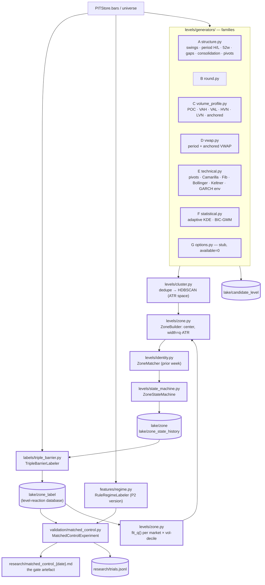
```mermaid
flowchart TB
    PIT["PITStore.bars / universe"] --> GENS
    subgraph GENS["levels/generators/ — families"]
        A["A structure.py\nswings · period H/L · 52w · gaps · consolidation · pivots"]:::new
        B["B round.py"]
        C["C volume_profile.py\nPOC · VAH · VAL · HVN · LVN · anchored"]:::new
        D["D vwap.py\nperiod + anchored VWAP"]:::new
        E["E technical.py\npivots · Camarilla · Fib · Bollinger · Keltner · GARCH env"]:::new
        F["F statistical.py\nadaptive KDE · BIC-GMM"]:::new
        G["G options.py — stub, available=0"]:::new
    end
    GENS --> DEDUP["levels/cluster.py\ndedupe → HDBSCAN (ATR space)"]:::new
    DEDUP --> ZW["levels/zone.py\nZoneBuilder: center, width=q·ATR"]:::new
    ZW --> ID["levels/identity.py\nZoneMatcher (prior week)"]:::new
    ID --> SM["levels/state_machine.py\nZoneStateMachine"]:::new
    SM --> ZT[("lake/zone\nlake/zone_state_history")]:::new
    GENS --> CLT[("lake/candidate_level")]:::new
    ZT --> LAB["labels/triple_barrier.py\nTripleBarrierLabeler"]:::new
    PIT --> LAB
    LAB --> LT[("lake/zone_label\n(level-reaction database)")]:::new
    LT --> MCX["validation/matched_control.py\nMatchedControlExperiment"]:::new
    PIT --> REG["features/regime.py\nRuleRegimeLabeler (P2 version)"]:::new
    REG --> MCX
    MCX --> REP["research/matched_control_{date}.md\nthe gate artefact"]:::new
    MCX --> TR[("research/trials.jsonl")]:::new
    QF["levels/zone.py\nfit_q() per market × vol-decile"]:::new --> ZW
    LT --> QF
    classDef new stroke-width:3px
```

### 5.3 Data / work flow

**Weekly level build**, run for every `(security, Friday as_of)` in the universe from 2010 (`sr levels build --from 2010-01-08`):


```mermaid
flowchart LR
    S0["as_of = Friday close\nbars = PITStore.bars(id, as_of, 756)"] --> S1["run every generator\n→ CandidateLevel[] (N ≈ 40–80)"]
    S1 --> S2["dedupe: same source+level within 0.05 ATR"]
    S2 --> S3["HDBSCAN on level/ATR20"]
    S3 --> S4["ZoneBuilder: center, [L,U] = center ± q·ATR/2,\nside, distance, n_sources, n_families"]
    S4 --> S5["ZoneMatcher: inherit zone_id from prior week\nor mint new"]
    S5 --> S6["ZoneStateMachine.step(bars since prior as_of)\n→ state, polarity, touch_count"]
    S6 --> S7["write candidate_level, zone, zone_state_history"]
    S7 --> S8["TripleBarrierLabeler over sessions(as_of, 5)\n(runs only when as_of + 5 sessions ≤ now)"]
    S8 --> S9["write zone_label"]
```

**Matched-control experiment** (`sr research matched-control`): reads `zone` ⋈ `zone_label` ⋈ regime, samples placebos, computes the lift table (§5.6.9), writes the gate artefact and a `trials.jsonl` line.

### 5.4 Layers & classes

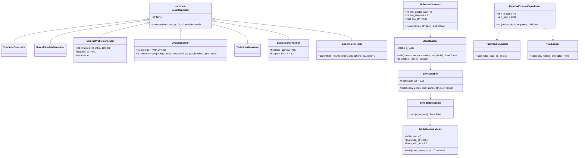
```mermaid
classDiagram
    class LevelGenerator {
        <<abstract>>
        +str family
        +generate(bars, as_of) List~CandidateLevel~
    }
    class StructureGenerator
    class RoundNumberGenerator
    class VolumeProfileGenerator {
        +list windows = [5,20,60,120,252]
        +float bin_atr = 0.1
        +list anchors
    }
    class VwapGenerator {
        +list periods = [W,M,Q,YTD]
        +list anchors = [major_high, major_low, earnings_gap, breakout, year_start]
    }
    class TechnicalGenerator
    class StatisticalGenerator {
        +float kde_gamma = 0.5
        +int gmm_max_k = 12
    }
    class OptionsGenerator {
        +generate() returns empty, sets options_available=0
    }
    class HdbscanClusterer {
        +int min_cluster_size = 2
        +int min_samples = 1
        +float eps_atr = 0.25
        +cluster(levels, atr, spot) List~Zone~
    }
    class ZoneBuilder {
        +QTable q_table
        +build(clusters, atr, spot, market, vol_decile) List~Zone~
        +fit_q(labels, kernel) QTable
    }
    class ZoneMatcher {
        +float match_atr = 0.25
        +match(new_zones, prior_zones, atr) List~Zone~
    }
    class ZoneStateMachine {
        +step(zone, bars) ZoneState
    }
    class TripleBarrierLabeler {
        +int horizon = 5
        +float delta_atr = 0.25
        +float r_min_atr = 0.5
        +label(zone, future_bars) ZoneLabel
    }
    class RuleRegimeLabeler {
        +label(index_bars, as_of) str
    }
    class MatchedControlExperiment {
        +int k_placebo = 5
        +int n_boot = 2000
        +run(zones, labels, regimes) LiftTable
    }
    class TrialLogger {
        +log(config, metrics, artefacts) None
    }
    LevelGenerator <|-- StructureGenerator
    LevelGenerator <|-- RoundNumberGenerator
    LevelGenerator <|-- VolumeProfileGenerator
    LevelGenerator <|-- VwapGenerator
    LevelGenerator <|-- TechnicalGenerator
    LevelGenerator <|-- StatisticalGenerator
    LevelGenerator <|-- OptionsGenerator
    HdbscanClusterer ..> ZoneBuilder
    ZoneBuilder ..> ZoneMatcher
    ZoneMatcher ..> ZoneStateMachine
    ZoneStateMachine ..> TripleBarrierLabeler
    MatchedControlExperiment ..> RuleRegimeLabeler
    MatchedControlExperiment ..> TrialLogger
```

| Module | Class | Responsibility | Inputs → Outputs |
|---|---|---|---|
| `levels/generators/structure.py` | `StructureGenerator` (family A) | P0 swings + prior day/week/month/quarter H/L, 52-week and YTD extremes, open/filled gap edges, consolidation boundaries, prior breakout/breakdown pivots (§5.6.1) | `Bars, as_of → CandidateLevel[]` |
| `levels/generators/volume_profile.py` | `VolumeProfileGenerator` (C) | Daily-bar volume profiles over five windows + event-anchored windows (§5.6.1) | idem |
| `levels/generators/vwap.py` | `VwapGenerator` (D) | Period and anchored VWAPs (§5.6.1) | idem |
| `levels/generators/technical.py` | `TechnicalGenerator` (E) | Classic + Camarilla pivots, Fibonacci, Bollinger, Keltner, GARCH envelope (§5.6.1) | idem |
| `levels/generators/statistical.py` | `StatisticalGenerator` (F) | Adaptive KDE and BIC-GMM over turning points (§5.6.1) | idem |
| `levels/generators/options.py` | `OptionsGenerator` (G) | Stub returning `[]`; exists so family G has a slot and `options_available = 0` is emitted (D1) | — |
| `levels/cluster.py` | `HdbscanClusterer` | Dedupe + HDBSCAN in ATR space (§5.6.2) | `CandidateLevel[] → cluster[]` |
| `levels/zone.py` | `ZoneBuilder`, `fit_q` | Zone geometry with learned width (§5.6.3) | clusters → `Zone[]` |
| `levels/identity.py` | `ZoneMatcher` | Persistent `zone_id` across weeks (§5.6.4) | — |
| `levels/state_machine.py` | `ZoneStateMachine` | State/polarity/touch-count updates (§5.6.5) | → `zone_state_history` rows |
| `labels/triple_barrier.py` | `TripleBarrierLabeler` | Labels (§5.6.6); `labels/{touch,hold,reaction}.py` hold the per-label helpers | `Zone, future bars → ZoneLabel` |
| `features/regime.py` | `RuleRegimeLabeler` | P2 rule-based regime (§5.6.8); upgraded to HMM in P3 | index bars → label |
| `validation/matched_control.py` | `MatchedControlExperiment` | Placebo sampling, lift, bootstrap CI, FDR (§5.6.9) | → `LiftTable`, markdown |
| `validation/trials.py` | `TrialLogger` | Appends one JSON line per evaluated configuration (§5.6.10) | — |

### 5.5 Data sources & storage

Inputs: point-in-time bars via `PITStore.bars(as_of, mode)` (§4.6.1), `filing` (earnings-date anchors for the anchored profiles/VWAPs: the 8-K Item 2.02 acceptance date), index bars (SPY / `^GSPC` from yfinance) for the regime labeler. No new external source.

New tables (level-reaction database, design-fixed §15):

| Table | Grain | Columns beyond §2.6 | `available_at` |
|---|---|---|---|
| `candidate_level` | security × as_of × candidate | `level, lower, upper, source, family, timeframe, formed_at, meta{k, window, anchor, rank, …}` | max over inputs (the generator's own `available_at`; for swings, confirmation close) |
| `zone` | zone × as_of | `zone_id, side, lower, upper, center, width_atr, distance_atr, n_sources, n_families, redundancy_ratio, provenance(json: candidate ids + weights), q_used, vol_decile, market` | = `as_of` |
| `zone_state_history` | zone × session | `state, polarity, touch_count, hold_count, break_count, last_touch_session, age_sessions` | session close |
| `zone_label` | zone × as_of | `y_touch, y_hold, y_break, y_reaction, t_touch, t_react, t_break, entry_price, label_gap, horizon_end` | `horizon_end` close (labels are known only after the window) |
| `regime_label` | market × session | `regime ∈ {strong_bull, weak_bull, range, weak_bear, strong_bear, high_vol}`, `trend_z, vol_pctile` | session close |
| `matched_control_result` | experiment × family × decile × regime | `n_real, n_placebo, hold_real, hold_placebo, lift, ci_lo, ci_hi, p_value, q_value, reaction_real, reaction_placebo` | run ts |
| `research/trials.jsonl` | one line per evaluated configuration | §5.6.10 | — |

Expected volume: ~900 securities × ~850 Fridays × ~8 zones ≈ 6 M zone rows, ~50 M candidate rows; both are comfortable in Parquet + DuckDB on the target workstation.

### 5.6 Algorithms & formulas

#### 5.6.1 Candidate generators (BP §6.2)

All generators emit `CandidateLevel` with half-width `0.1·ATR` (**initial**; the zone width is decided later by `q`, §5.6.3) and a family letter. Unless stated, `timeframe = "1D"` and `available_at = as_of` close.

**Family A — structure.** P0 swings (§3.6.2) on daily bars, plus weekly-bar swings (`timeframe="1W"`, bars resampled by ISO week); `prev_{day,week,month,quarter}_{high,low}`; `52w_{high,low}`, `ytd_{high,low}`; **gap edges**: for each session with `Open_s > High_{s−1}` (gap up) emit `High_{s−1}` and `Open_s` (`source="gap_up_edge"`) until filled (`Low_u ≤ High_{s−1}` for some later `u`); symmetric for gap down; **consolidation boundaries**: any run of ≥ 10 sessions with `(max High − min Low) ≤ 2·ATR` emits its max and min; **breakout pivots**: the level of a consolidation boundary that was subsequently closed through by > δ, re-emitted as `source="broken_boundary"` with the flip recorded in `meta.polarity_flip`.

**Family C — volume profile** (SR-Plan §1.1, design-fixed §11) from daily bars. For window `w ∈ {5, 20, 60, 120, 252}` sessions ending at `as_of`, with `bin_width = c·ATR₂₀`, `c = 0.1` (**initial**):

```
Each session s contributes V_s spread uniformly over [L_s, H_s]   (daily bars have no intra-bar distribution)
VP(b) = Σ_s V_s · |bin_b ∩ [L_s, H_s]| / (H_s − L_s)
POC   = argmax_b VP(b)
VA    = smallest set of bins, grown outward from POC one bin at a time on the heavier side, with Σ VP ≥ 0.70·Σ_all VP;  VAH = top of VA, VAL = bottom
Smooth: VP̃ = VP ⊛ Gaussian(σ = 1 bin)
HVN   = local maxima of VP̃ with VP̃ ≥ 1.5 · median(VP̃)
LVN   = local minima of VP̃ with VP̃ ≤ 0.5 · median(VP̃)
```

Each of POC/VAH/VAL/HVN/LVN is a candidate with `source="{name}_{w}d"` and `meta.volume_pctile`. **Anchored profiles** repeat the computation from an anchor session to `as_of` for anchors: last earnings (8-K 2.02 acceptance date), last gap > 2·ATR, last 252-day high, last 252-day low.

**Family D — VWAP** (design-fixed §12). `VWAP_{a→t} = Σ_{s=a..t} P̄_s V_s / Σ V_s` with `P̄_s = (H_s+L_s+C_s)/3` (daily typical price). Periods: current week, month, quarter, YTD. Anchors: last major swing high/low (k=2 swing), last earnings gap, last breakout pivot, year start. `meta.slope = (VWAP_t − VWAP_{t−5})/ATR`.

**Family E — technical.**

```
Classic pivots (prior week H,L,C):  P=(H+L+C)/3;  R1=2P−L; S1=2P−H;  R2=P+(H−L); S2=P−(H−L);  R3=H+2(P−L); S3=L−2(H−P)
Camarilla (SR-Plan §3.3):           H3=C+(H−L)·1.1/4;  H4=C+(H−L)·1.1/2;  L3=C−(H−L)·1.1/4;  L4=C−(H−L)·1.1/2
Fibonacci of dominant swing (largest k=2 swing in the last 120 sessions, from low ℓ to high h or vice-versa):
                                    level_r = h − r·(h−ℓ),  r ∈ {0.236, 0.382, 0.5, 0.618, 0.786}
Bollinger (20, 2):                  SMA20 ± 2·σ20 of close
Keltner (20, 1.5):                  EMA20 ± 1.5·ATR20
GARCH(1,1) envelope:                fit on 750 sessions of log returns (arch package, zero mean, Student-t);
                                    σ²_{5} = Σ_{j=1..5} E[σ²_{t+j}]  (multi-step forecast);  level_±k = C_t · exp(±k·sqrt(σ²_5)),  k ∈ {1, 2}
```

**Family F — statistical** (SR-Plan §3.1–3.2). Turning points `P_i` = all k≥0.5 swing highs/lows of the last 504 sessions, weight `ω_i` = volume of the swing session.

```
KDE:  f̂(p) = Σ_i ω_i · K((p − P_i)/h) / (h·Σ ω_i),   K Gaussian,   h = γ·ATR₁₄,  γ = 0.5 (initial)
      candidates = local maxima of f̂ on a grid of 0.05·ATR, with meta.density = f̂/max f̂
GMM:  fit 1-D Gaussian mixtures with K = 1..12 (sklearn, weighted by ω_i via sample repetition), pick K by BIC;
      candidates = μ_k with meta.weight = w_k, half-width = max(0.1·ATR, σ_k)
```

**Family G — options.** Stub (D1). Emits nothing; `features.options_available = 0`.

#### 5.6.2 Dedupe and HDBSCAN clustering (BP §6.1; design-fixed §13)

1. Dedupe: candidates with the same `source` within `0.05·ATR` collapse to their mean.
2. Normalise: `x_i = level_i / ATR₂₀`. One-dimensional input, metric = absolute difference.
3. HDBSCAN (`hdbscan` package): `min_cluster_size = 2`, `min_samples = 1`, `cluster_selection_epsilon = 0.25`, `cluster_selection_method = "leaf"` (**initial**, all in `thresholds.yaml`). Noise points (label −1) become singleton clusters — a lone 52-week high is still a zone.
4. Clusters spanning more than `1.0·ATR` are split at their widest internal gap (a guard against chaining).

#### 5.6.3 Zone geometry and the learned width `q` (BP §6.3)

For a cluster `𝒞` with members `(level_i, family_i, meta_i)`:

```
w_i     = family_base[family_i] · recency_i,   family_base = 1 initially (all families equal; learned weights are a P3 feature, not a P2 input)
          recency_i = exp(−λ·age_i), λ = 1/252 (initial), age in sessions since formed_at (round numbers: age = 0)
center  = Σ w_i·level_i / Σ w_i
width   = q(market, vol_decile)·ATR₂₀
[L, U]  = [center − width/2, center + width/2]
side    = support if center < close_t else resistance;  clusters containing close_t are dropped
n_sources = |𝒞|,  n_families = |{family_i}|,  redundancy_ratio = n_sources / n_families    (BP §6.4)
```

`vol_decile` = decile of 20-session realised volatility across the market's universe at `as_of`.

**Fitting `q`** (`ZoneBuilder.fit_q`). Bootstrap `q` from an **initial** value of 0.5 and refine on the level-reaction database once labels exist, using only training-window years (BP §7.4). For each `(market, vol_decile)` bucket, let `𝒯` be the set of touched zones and `e_z` the ATR-normalised distance from the zone center to the *reaction point* (the extreme reached after entry). Choose `q` to maximise the out-of-sample log-likelihood of those reaction points under a boxcar-plus-Gaussian kernel centred on the zone:

```
q* = argmax_q  Σ_{z∈𝒯} log[ (1−π)·𝟙(|e_z| ≤ q/2)/q  +  π·N(e_z; 0, (q/2)²) ],   π = 0.2
```

evaluated on validation years only; `q` is clipped to `[0.2, 1.5]`. The fitted table is versioned (`q_table_version`) and stored with the zone (`q_used`). Until the first fit, `q = 0.5` and `q_table_version = "init"`.

#### 5.6.4 Zone identity across weeks (BP §6.1; design-fixed §64)

For each new zone `z` at `as_of` and the prior week's zones `Z_prev` for the same security:

```
candidates = { p ∈ Z_prev : |center_z − center_p| ≤ 0.25·ATR₂₀ }
J(z, p)    = |sources(z) ∩ sources(p)| / |sources(z) ∪ sources(p)|         (source = generator name, not level value)
match      = argmax_{p ∈ candidates, J > 0} J(z,p);   ties → smallest |Δcenter|
```

A matched zone inherits `zone_id`, `touch_count`, `hold_count`, `break_count`, `polarity_history`, and `formed_at`; an unmatched one is minted `{TICKER}-{S|R}-{ISOyear}W{week}-{nn}`. A prior zone that no new zone matches is retired (`state = RETIRED` in `zone_state_history`) but keeps its id, so a later revival re-links by the same rule against the last 12 weeks, not only the prior week.

#### 5.6.5 Zone state machine (design-fixed §63)

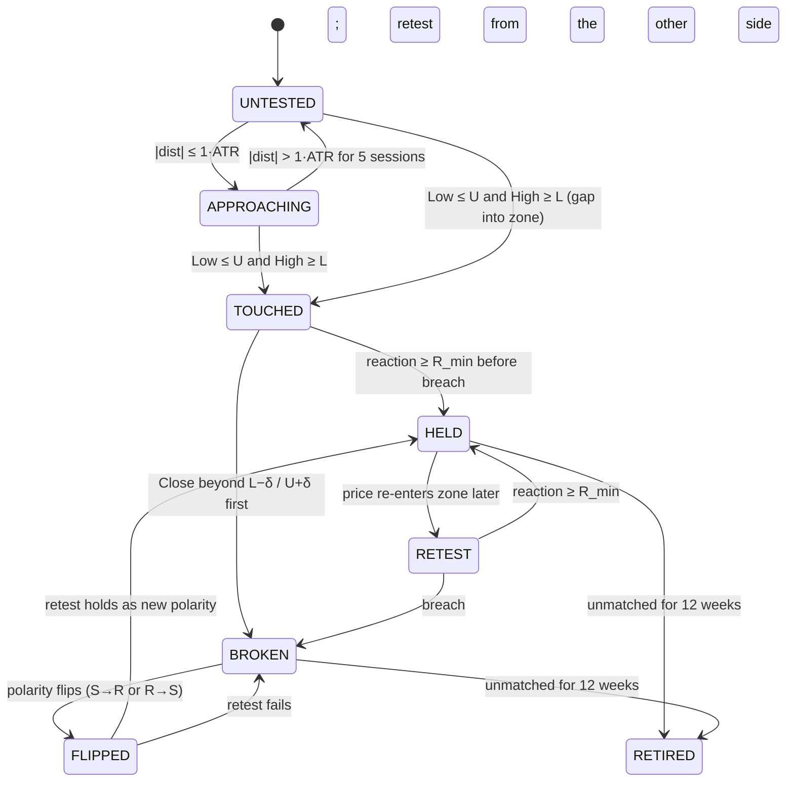
```mermaid
stateDiagram-v2
    [*] --> UNTESTED
    UNTESTED --> APPROACHING : |dist| ≤ 1·ATR
    APPROACHING --> UNTESTED : |dist| > 1·ATR for 5 sessions
    APPROACHING --> TOUCHED : Low ≤ U and High ≥ L
    UNTESTED --> TOUCHED : Low ≤ U and High ≥ L (gap into zone)
    TOUCHED --> HELD : reaction ≥ R_min before breach
    TOUCHED --> BROKEN : Close beyond L−δ / U+δ first
    HELD --> RETEST : price re-enters zone later
    RETEST --> HELD : reaction ≥ R_min
    RETEST --> BROKEN : breach
    BROKEN --> FLIPPED : polarity flips (S→R or R→S); retest from the other side
    FLIPPED --> HELD : retest holds as new polarity
    FLIPPED --> BROKEN : retest fails
    HELD --> RETIRED : unmatched for 12 weeks
    BROKEN --> RETIRED : unmatched for 12 weeks
```

`ZoneStateMachine.step(zone, bars)` replays the sessions since the prior `as_of` in order and applies the transitions with the §2.4 event definitions; every transition appends a `zone_state_history` row. `touch_count` increments on each `→ TOUCHED` or `→ RETEST`; `hold_count`/`break_count` on `→ HELD`/`→ BROKEN`. `polarity_history` records `"resistance->support@{session}"` on `→ FLIPPED`.

#### 5.6.6 Triple-barrier labels (BP §7.1; design-fixed §16)

For zone `[L,U]` (support case; resistance mirrors signs) at `as_of = t`, over `sessions(t, 5) = s₁..s₅`, with `ATR = ATR₂₀(t)`, `δ = 0.25·ATR`, `R_min = 0.5·ATR`:

```
touch session  s₀ = min{ s_j : L_{s_j} ≤ U and H_{s_j} ≥ L }        Y_touch = 1[s₀ exists], T_touch = j
entry price    E  = clip(O_{s₀}, L, U) if O_{s₀} ∈ [L,U]  else  U   (first price inside the zone: the open if it opens inside, else the upper bound crossed from above)
for sessions s ≥ s₀ in order (including s₀):
    breach_s   = C_s < L − δ
    react_s    = H_s ≥ E + R_min
    tie rule within one session: if both react_s and breach_s, the session's OPEN decides —
        O_s ≥ E → reaction is assumed to have come first (HELD);  O_s < E → breach first (BROKEN)
    first session with react → Y_hold = 1, Y_break = 0, T_react = j
    first session with breach → Y_break = 1, Y_hold = 0, T_break = j
neither by s₅ → Y_hold = Y_break = 0 (touched, unresolved; kept in the hold model as a censored 0 with flag unresolved=1)
Y_reaction = (max_{s₀ ≤ s ≤ s₅, s ≤ first breach} H_s − E) / ATR        (support; for resistance: (E − min L_s)/ATR)
```

`Y_hold`, `Y_break`, `Y_reaction`, `T_react`, `T_break` are `NULL` when `Y_touch = 0` (BP §7.2 — they are conditional labels). `label_gap = 1` if any session in the window is missing a bar; such rows are excluded from all gates. Labels are written with `available_at = close(s₅)`.

#### 5.6.7 Approach features captured at touch (design-fixed §53)

Stored on `zone_label` for the P3 hold model: `approach_velocity = (C_{s₀−1} − C_{s₀−5})/ATR`, `consec_down = #consecutive down closes before s₀`, `gap_into = 1[O_{s₀} < L_{s₀−1}]`, `vol_accel = V_{s₀−1} / mean(V_{s₀−21..s₀−2})`, `vwap_dist = (C_{s₀−1} − VWAP_week)/ATR`.

#### 5.6.8 Rule-based regime labeler (P2 version; design-fixed §17)

On the market index (SPY for US, `^HSI` for HK) at `as_of`:

```
trend_z    = (C − SMA_200) / (σ_20·sqrt(200))            standardised distance from the 200-day mean
vol_pctile = percentile rank of σ_20 over the trailing 3 years
regime     = high_vol      if vol_pctile ≥ 0.90
           = strong_bull   if trend_z ≥ +1.0
           = weak_bull     if 0 < trend_z < 1.0
           = weak_bear     if −1.0 < trend_z ≤ 0
           = strong_bear   if trend_z ≤ −1.0
           (range = |trend_z| < 0.25 overrides weak_bull/weak_bear)
```

"Two distinct regimes" for the gate means two of `{bull := strong_bull ∪ weak_bull, bear := strong_bear ∪ weak_bear, range, high_vol}` each with ≥ 5 000 touched real zones.

#### 5.6.9 Matched-control experiment (BP §7.3) — the gate

For every real zone `z` (security `i`, `as_of` `t`, side, distance `d_z`, width `w_z`) sample `K = 5` placebos:

```
d_k  = d_z + ε_k,  ε_k ~ U(−0.1, +0.1) ATR, same sign as d_z
center_k = C_t + d_k·ATR,   [L_k, U_k] = center_k ± w_z/2
reject and resample if [L_k,U_k] overlaps any real zone of (i,t) by more than 25 % of its width
```

Placebos are labelled with the identical `TripleBarrierLabeler`. Then, per stratum `g` = (family ∈ provenance, distance decile of `|d|` over all real zones, regime):

```
hold_rate_real(g) = mean(Y_hold | Y_touch=1, real, g)         hold_rate_pl(g) = same over placebos
lift(g)           = hold_rate_real − hold_rate_pl
reaction_lift(g)  = mean(Y_reaction | touched, real) − mean(Y_reaction | touched, placebo)
CI                = BCa bootstrap, B = 2000, resampling by (security, ISO-week) cluster so overlapping labels stay together
p(g)              = two-sided bootstrap p-value;  q(g) = Benjamini–Hochberg over all (family × decile) cells within a regime
```

**Gate condition** (BP §12 P2), evaluated on 2010–2021 only (2022+ is sealed for P3's test years): there exist ≥ 3 families and ≥ 2 regimes such that, for that family and regime, `lift(g) > 0` with `ci_lo(g) > 0` and `q(g) < 0.10` in **every** distance decile that has `n_real ≥ 500`, and `reaction_lift` shares the sign in at least half of those deciles. The artefact is the table (family × decile × regime → n, hold_real, hold_placebo, lift, CI, q) written to `research/matched_control_{date}.md` and `matched_control_result`.

Note also the H1' test (BP §6.4): regress `Y_hold` on `n_independent_families` and `n_sources` (logit, touched real zones, distance-decile fixed effects); report both coefficients with cluster-robust SEs. This is informational in P2 and becomes a feature-selection input in P3.

#### 5.6.10 `research/trials.jsonl` (BP §7.4)

One line per evaluated configuration, from the first matched-control run onward, so the P5 Deflated Sharpe has a true trial count:

```json
{"trial_id": "uuid", "ts": "2026-10-03T14:02:11Z", "phase": "P2", "kind": "matched_control|fit_q|model|ablation|threshold",
 "git_sha": "…", "config_hash": "…", "config": {...}, "data_window": ["2010-01-08","2021-12-31"],
 "metrics": {...}, "artefacts": ["research/matched_control_2026-10-03.md"], "note": "…"}
```

`TrialLogger.log` is called by every experiment entry point; a CI check fails if an experiment script imports `TrialLogger` but does not call it.

### 5.7 Tests that decide the gate

- `tests/levels/test_generators.py` — each family on synthetic bars with known answers (e.g. a synthetic profile with one heavy bin yields POC there; VWAP of constant price = price; Camarilla arithmetic; Fibonacci of a known swing; KDE peak at a repeated turning point).
- `tests/levels/test_cluster.py` — HDBSCAN merges levels 0.2 ATR apart, keeps 0.6 apart; a lone level survives as a singleton; the chaining guard splits a 1.5-ATR chain.
- `tests/levels/test_identity.py` — a zone persisting three weeks keeps its id; a 0.3-ATR drift with disjoint sources mints a new id.
- `tests/levels/test_state_machine.py` — every transition in §5.6.5 exercised on hand-built bar sequences, including the gap-into-zone and the tie rule.
- `tests/labels/test_triple_barrier.py` — the six label outcomes (no touch; hold; break; unresolved; reaction magnitude; label_gap) plus Hypothesis property tests: `Y_hold + Y_break ≤ 1`, `Y_hold = 1 ⇒ Y_reaction ≥ 0.5`, labels are `NULL` iff `Y_touch = 0`.
- `tests/leakage/test_levels.py` — `LeakageGuard.probe_feature` over every generator and over `zone_label` (a label must not be visible before `horizon_end`).
- `tests/validation/test_matched_control.py` — on a synthetic universe where zones are placed at random (no structure), the lift table shows no cell with `ci_lo > 0` after FDR in > 5 % of cells; on a synthetic universe with planted bounce behaviour, the planted family clears the gate.
- Gate: `sr research matched-control` produces the artefact and the §5.6.9 condition is true.

### 5.8 Deliverables

- [ ] Six generators + options stub; HDBSCAN clusterer; `ZoneBuilder` with `q` table (`init` then fitted); `ZoneMatcher`; `ZoneStateMachine`.
- [ ] `TripleBarrierLabeler` + approach features; level-reaction database built 2010→present for the P1 universe (`sr levels build`, `sr labels build`).
- [ ] `RuleRegimeLabeler`; `MatchedControlExperiment`; `TrialLogger` + `research/trials.jsonl`.
- [ ] Gate artefact `research/matched_control_{date}.md` and, if the gate fails, `research/rejected.md` with the per-family numbers and the chosen kill option.

---

## 6. P3 — Baselines, LightGBM, calibration, Monte Carlo (Weeks 7–10)

### 6.1 Objective, gate, kill

> Rungs 0–6 of §8. Walk-forward with purge + embargo. Isotonic calibration. Full MC path engine. Ablation harness and `trials.jsonl` in place from day one.
> **Gate:** calibrated LightGBM beats rung-3 logistic on Brier with bootstrap CI excluding zero, ECE < 0.05 in the three largest strata, calibration slope in [0.85, 1.15], and matched-control lift preserved after calibration.
> **Kill:** ML adds nothing over historical frequency → ship the statistical engine as the product. — BP §12 P3

### 6.2 Architecture (this phase)

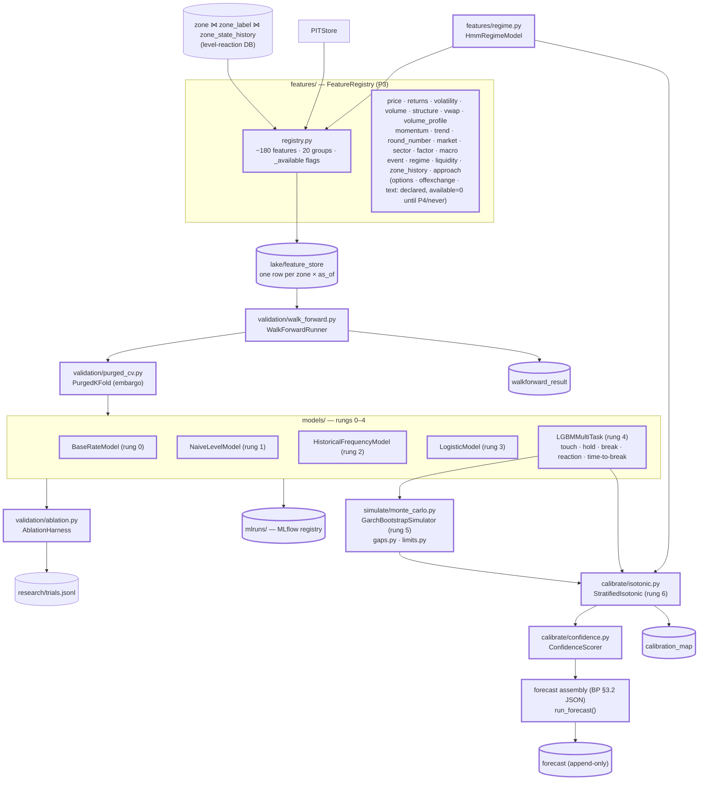
```mermaid
flowchart TB
    ZL[("zone ⋈ zone_label ⋈ zone_state_history\n(level-reaction DB)")] --> FR
    PIT["PITStore"] --> FR
    subgraph FEAT["features/ — FeatureRegistry (P3)"]
        FR["registry.py\n~180 features · 20 groups · _available flags"]:::new
        FG["price · returns · volatility · volume · structure · vwap · volume_profile\nmomentum · trend · round_number · market · sector · factor · macro\nevent · regime · liquidity · zone_history · approach\n(options · offexchange · text: declared, available=0 until P4/never)"]:::new
    end
    FR --> FS[("lake/feature_store\none row per zone × as_of")]:::new
    FS --> WF["validation/walk_forward.py\nWalkForwardRunner"]:::new
    WF --> PCV["validation/purged_cv.py\nPurgedKFold (embargo)"]:::new
    subgraph LADDER["models/ — rungs 0–4"]
        R0["BaseRateModel (rung 0)"]:::new
        R1["NaiveLevelModel (rung 1)"]:::new
        R2["HistoricalFrequencyModel (rung 2)"]:::new
        R3["LogisticModel (rung 3)"]:::new
        R4["LGBMMultiTask (rung 4)\ntouch · hold · break · reaction · time-to-break"]:::new
    end
    PCV --> LADDER
    R4 --> MC["simulate/monte_carlo.py\nGarchBootstrapSimulator (rung 5)\ngaps.py · limits.py"]:::new
    MC --> ISO["calibrate/isotonic.py\nStratifiedIsotonic (rung 6)"]:::new
    R4 --> ISO
    ISO --> CONF["calibrate/confidence.py\nConfidenceScorer"]:::new
    HMM["features/regime.py\nHmmRegimeModel"]:::new --> FR
    HMM --> ISO
    LADDER --> ABL["validation/ablation.py\nAblationHarness"]:::new
    ABL --> TR[("research/trials.jsonl")]
    LADDER --> MLF[("mlruns/ — MLflow registry")]:::new
    ISO --> CM[("calibration_map")]:::new
    WF --> WR[("walkforward_result")]:::new
    CONF --> FC["forecast assembly (BP §3.2 JSON)\nrun_forecast()"]:::new
    FC --> FST[("forecast (append-only)")]:::new
    classDef new stroke-width:3px
```

### 6.3 Data / work flow

**Training (annual walk-forward, `sr train --test-year 2022`)**:

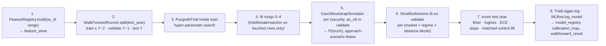
```mermaid
flowchart LR
    A["1. FeatureRegistry.build(as_of range)\n→ feature_store"] --> B["2. WalkForwardRunner.split(test_year)\ntrain ≤ Y−2 · validate Y−1 · test Y"]
    B --> C["3. PurgedKFold inside train\nhyper-parameter search"]
    C --> D["4. fit rungs 0–4\n(hold/break/reaction on touched rows only)"]
    D --> E["5. GarchBootstrapSimulator per (security, as_of) in validate\n→ P(touch), approach-scenario draws"]
    E --> F["6. StratifiedIsotonic.fit on validate\nper (market × regime × distance decile)"]
    F --> G["7. score test year\nBrier · logloss · ECE · slope · matched-control lift"]
    G --> H["8. TrialLogger.log · MLflow.log_model\n→ model_registry, calibration_map, walkforward_result"]
```

**Inference (`run_forecast(security_id, as_of, config_version)`)** — the deterministic core of every later phase:

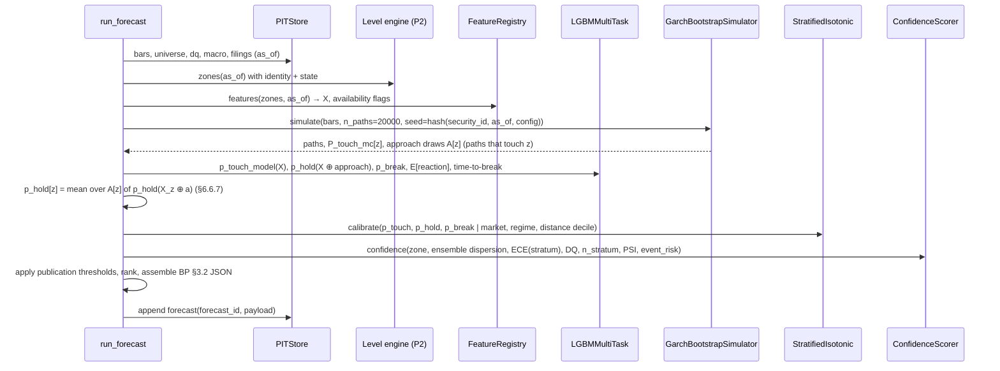
```mermaid
sequenceDiagram
    participant RF as run_forecast
    participant P as PITStore
    participant L as Level engine (P2)
    participant F as FeatureRegistry
    participant M as LGBMMultiTask
    participant S as GarchBootstrapSimulator
    participant C as StratifiedIsotonic
    participant K as ConfidenceScorer
    RF->>P: bars, universe, dq, macro, filings (as_of)
    RF->>L: zones(as_of) with identity + state
    RF->>F: features(zones, as_of) → X, availability flags
    RF->>S: simulate(bars, n_paths=20000, seed=hash(security_id, as_of, config))
    S-->>RF: paths, P_touch_mc[z], approach draws A[z] (paths that touch z)
    RF->>M: p_touch_model(X), p_hold(X ⊕ approach), p_break, E[reaction], time-to-break
    RF->>RF: p_hold[z] = mean over A[z] of p_hold(X_z ⊕ a)   (§6.6.7)
    RF->>C: calibrate(p_touch, p_hold, p_break | market, regime, distance decile)
    RF->>K: confidence(zone, ensemble dispersion, ECE(stratum), DQ, n_stratum, PSI, event_risk)
    RF->>RF: apply publication thresholds, rank, assemble BP §3.2 JSON
    RF->>P: append forecast(forecast_id, payload)
```

### 6.4 Layers & classes


```mermaid
classDiagram
    class FeatureSpec {
        +str name
        +str group
        +callable fn
        +int lookback
        +str available_at_rule
        +str dtype
    }
    class FeatureRegistry {
        +list~FeatureSpec~ specs
        +register(spec)
        +build(zones, as_of, store) DataFrame
        +availability(as_of) dict
    }
    class WalkForwardRunner {
        +int first_test_year = 2015
        +split(test_year) Split
        +run(model_factory, years) list~FoldResult~
    }
    class PurgedKFold {
        +int n_splits = 5
        +int embargo_sessions
        +split(X, label_windows) iterator
    }
    class SRModel {
        <<abstract>>
        +str rung
        +fit(X, Y, sample_weight)
        +predict(X) Predictions
    }
    class BaseRateModel
    class NaiveLevelModel
    class HistoricalFrequencyModel {
        +dict table
    }
    class LogisticModel {
        +list feature_subset
    }
    class LGBMMultiTask {
        +dict boosters
        +fit(X, Y)
        +predict(X) Predictions
        +shap(X) DataFrame
    }
    class Predictions {
        +Series p_touch
        +Series p_hold_cond
        +Series p_break_cond
        +Series e_reaction
        +Series t_break_q50
    }
    class PathSimulator {
        <<abstract>>
    }
    class GarchBootstrapSimulator {
        +int n_paths = 20000
        +int block_len = 5
        +simulate(bars, as_of, events, market_bars, seed) Paths
        +p_touch(paths, zone) float
        +approach_draws(paths, zone) DataFrame
        +quantiles(paths) dict
    }
    class PriceLimitHook {
        +truncate(paths, limit) Paths
    }
    class StratifiedIsotonic {
        +list strata_keys
        +int min_n = 500
        +fit(p, y, strata)
        +transform(p, strata) Series
        +ece(stratum) float
    }
    class ConfidenceScorer {
        +dict weights
        +score(zone_ctx) float
    }
    class AblationHarness {
        +run(groups, model_factory, years) DataFrame
    }
    class HmmRegimeModel {
        +int n_states = 6
        +fit(index_features)
        +probs(as_of) dict
    }
    SRModel <|-- BaseRateModel
    SRModel <|-- NaiveLevelModel
    SRModel <|-- HistoricalFrequencyModel
    SRModel <|-- LogisticModel
    SRModel <|-- LGBMMultiTask
    SRModel ..> Predictions
    PathSimulator <|-- GarchBootstrapSimulator
    GarchBootstrapSimulator ..> PriceLimitHook
    FeatureRegistry o-- FeatureSpec
    WalkForwardRunner ..> PurgedKFold
    AblationHarness ..> WalkForwardRunner
```

| Module | Class | Responsibility | Inputs → Outputs |
|---|---|---|---|
| `features/registry.py` | `FeatureRegistry`, `FeatureSpec` | Declarative feature catalogue; every feature emits `<name>` and `<name>_available`; `available_at_rule` is one of `bar_close`, `filing_acceptance`, `release_ts`, `label_horizon_end`, `always` and is what the leakage suite checks (§6.6.1) | zones, as_of → wide frame |
| `features/<group>.py` (20 modules) | functions | One module per group of BP §8.1; §6.6.2 lists the members | — |
| `features/regime.py` | `HmmRegimeModel` | 6-state Gaussian HMM on index features; emits `regime_probs` (features) and the argmax label (calibration stratum). Replaces the P2 rule labeler for features; the rule labeler is kept for reporting continuity. | index bars → probs |
| `validation/walk_forward.py` | `WalkForwardRunner` | Expanding-window schedule (§6.6.3) | — |
| `validation/purged_cv.py` | `PurgedKFold` | Purge + embargo splits inside the training window (§6.6.3) | — |
| `models/baseline.py` | `BaseRateModel`, `NaiveLevelModel`, `HistoricalFrequencyModel` | Rungs 0–2 (§6.6.4) | — |
| `models/logistic.py` | `LogisticModel` | Rung 3 on ~30 features (§6.6.4) | — |
| `models/lgbm.py` | `LGBMMultiTask` | Rung 4: five boosters over one feature matrix (§6.6.5); SHAP via `booster.predict(pred_contrib=True)` | — |
| `models/survival.py` | `TimeToBreakModel` | Discrete-time hazard over sessions 1–5 (a LightGBM classifier on the person-period expansion); optional in P3, its output is the `t_break_q50` field | — |
| `simulate/monte_carlo.py` | `GarchBootstrapSimulator` | Rung 5 path engine (§6.6.6) | bars, events → paths |
| `simulate/gaps.py` | `OvernightGapModel` | Empirical overnight-gap distribution and event-jump mixture | — |
| `simulate/limits.py` | `PriceLimitHook` | Path truncation at daily price limits; a no-op for US/HK (D2) | — |
| `calibrate/isotonic.py` | `StratifiedIsotonic` | Rung 6 (§6.6.8) | — |
| `calibrate/confidence.py` | `ConfidenceScorer` | BP §9.3 (§6.6.9) | — |
| `validation/ablation.py` | `AblationHarness` | Leave-one-group-out / add-one-group ΔBrier with bootstrap CI (§6.6.10) | — |
| `models/forecast.py` | `run_forecast` | Assembles the BP §3.2 JSON; the only writer to `forecast` | → `forecast_id` |

### 6.5 Data sources & storage

Inputs: everything from P1–P2 plus yfinance sector ETF and index bars (XLK, XLF, …, SPY, `^GSPC`, `^VIX` via FRED `VIXCLS`) and FRED macro (DGS10, DGS2, DFF, BAMLH0A0HYM2). No new external source.

| Table / artefact | Grain | Contents | `available_at` |
|---|---|---|---|
| `feature_store` (Parquet) | zone × as_of × feature_version | ~180 feature columns + ~180 `_available` flags + `feature_version`; wide layout, one Parquet partition per (market, year) | max over the inputs' `available_at` (= as_of close for bar features; filing/release ts for event/macro features) |
| `regime_label` (extended) | market × session | + `hmm_probs` (json), `hmm_label`, `hmm_version` | session close |
| `model_registry` (MLflow + DuckDB mirror) | model version | `model_version, rung, trained_through, validate_year, test_year, feature_version, params, metrics(json), q_table_version, git_sha, trial_id` | training run ts |
| `calibration_map` | model_version × stratum | isotonic breakpoints `(x[], y[])`, `n`, `ece`, `slope`, fallback level used | validate-year end |
| `walkforward_result` | model_version × test_year × metric × stratum | Brier, logloss, ECE, slope, matched-control lift, with bootstrap CI | — |
| `forecast`, `zone_forecast` (§2.6) | forecast | full JSON + flattened zones; append-only from P3 (historical replays are forecasts too, flagged `replay = true`) | `created_at` |
| `research/trials.jsonl` | — | every fit, every ablation cell, every threshold trial | — |

### 6.6 Algorithms & formulas

#### 6.6.1 Feature registry contract

```python
FeatureSpec(name="touch_count", group="zone_history", fn=zone_history.touch_count,
            lookback=0, available_at_rule="bar_close", dtype="int")
```

`FeatureRegistry.build` evaluates every enabled spec for every zone at `as_of`, writes `<name>` and `<name>_available` (0 when the source is missing, the lookback is not covered, or the group is disabled by D1), and records the per-row `available_at`. The leakage suite (§4.6.6) is parameterised over the registry, so adding a feature automatically adds its leakage test.

#### 6.6.2 Feature groups (~180 features; BP §8.1)

| Group | Count | Members (all ATR- or percentile-normalised where a price unit would otherwise leak scale) |
|---|---|---|
| `price` | 8 | range/ATR, body/ATR, upper/lower wick/ATR, close position in range, close vs 5/20/60-day mean /ATR |
| `returns` | 6 | log returns over 1, 2, 5, 10, 20, 60 sessions |
| `volatility` | 10 | ATR₂₀/close, realised σ₅/σ₂₀/σ₆₀, Parkinson, Garman–Klass, Rogers–Satchell (20), vol percentile (3y), σ₂₀/σ₆₀ ratio, GARCH σ₅ forecast |
| `volume` | 8 | relative volume 1/5/20, OBV slope, volume acceleration, volume percentile, dollar-volume rank in universe, volume surprise |
| `structure` | 12 | distance/ATR to prev day/week/month H/L, 52w H/L, YTD H/L; sessions since 52w high/low; open-gap count |
| `vwap` | 8 | distance/ATR to weekly/monthly/quarterly/YTD VWAP; count of VWAPs within 0.25/0.5/1 ATR; weekly VWAP slope |
| `volume_profile` | 10 | distance/ATR to POC/VAH/VAL (20, 60, 252), HVN count, LVN count, profile skew, kurtosis |
| `momentum` | 6 | RSI14, ROC10, stochastic %K, MACD hist/ATR, momentum acceleration, 20-day drawdown |
| `trend` | 6 | SMA20/50/200 distance/ATR, SMA slope, ADX14, trend persistence (sign runs) |
| `round_number` | 5 | distance/ATR to nearest $1/$5/$10 rung, rung rank of nearest, whether zone contains a rung |
| `market` | 8 | SPY returns 1/5/20, VIX level & 5-day change, breadth (% of universe above SMA50), index vol percentile, index trend_z |
| `sector` | 6 | sector ETF returns 5/20, stock−sector relative strength 5/20/60, sector breadth |
| `factor` | 6 | beta (60d), size rank, 12-1 momentum rank, low-vol rank, idiosyncratic vol, liquidity rank |
| `macro` | 6 | DGS10 level & 20d change, 2s10s slope, HY OAS & 20d change, days to next FOMC |
| `event` | 6 | days to next earnings (from 8-K cadence: last 8-K 2.02 + ~91 days until a date is filed), days since last 8-K, ex-dividend in window, event_risk score, days to FOMC/CPI (FRED release calendar), macro-heavy-week flag |
| `regime` | 8 | HMM state probabilities (6) + rule label one-hot compressed (2) |
| `liquidity` | 5 | ADV20, spread proxy (Corwin–Schultz), turnover, zero-volume days, price level bucket |
| `zone_history` | 14 | touch_count, hold_count, break_count, hold ratio, last-touch age, age with decay `e^{−λ·age}` (λ ∈ {1/63, 1/252}), polarity flips, mean past reaction, reaction σ, sessions between touches, state one-hot (4) |
| `zone_geom` | 10 | distance/ATR (signed), |distance|, width_atr, n_sources, n_families, redundancy_ratio, family one-hot (6), q_used, side |
| `approach` (hold model only) | 5 | §5.6.7 — at inference these come from MC draws, §6.6.7 |
| `options`, `offexchange`, `text`, `orderbook` | declared, empty | `_available = 0` in P3 (`text` becomes live in P4) |

Total ≈ 178 live in P3. The `distance` feature is deliberately included in every rung ≥ 3 — the gate is the matched-control lift *after* the model has distance, not a distance-blind model.

#### 6.6.3 Walk-forward and purged CV (BP §7.4)

Test years `Y = 2015 … 2021` in P3 (2022+ sealed until model selection is frozen). For each: `train = as_of.year ≤ Y−2`, `validate = Y−1`, `test = Y`. Within `train`, hyper-parameters use `PurgedKFold`:

```
label window of row r:  W_r = [as_of_r, horizon_end_r]  (5 sessions)
for fold k with validation rows V_k:
    purge:   drop train row r if W_r ∩ (∪_{v∈V_k} W_v) ≠ ∅
    embargo: additionally drop train rows with as_of ∈ (max_{v∈V_k} horizon_end, + E sessions],  E = H + max lookback of any feature = 5 + 252
```

Rows within the same `(security, as_of)` (all zones of one ticker-week) are always assigned to the same fold. Sample weights `1/(#zones of that ticker-week)` keep tickers with many zones from dominating.

#### 6.6.4 Rungs 0–3 (BP §8)

```
Rung 0  P(hold) = hold rate in the zone's distance decile (train years)
Rung 1  "naive levels": zones from prior-week H/L, ATR bands (±1,±2), classic pivots, Bollinger only;
        P(hold) = per-source hold rate by distance decile — i.e. what a chartist's toolbox gives
Rung 2  P(hold | source family, distance decile, regime) — a 3-way frequency table with Laplace smoothing (α = 5),
        backing off to (family, decile) then (decile) when n < 200
Rung 3  Logistic regression, L2, on 30 features chosen a priori: zone_geom (10), zone_history (8), volatility (4), regime (6), market (2)
```

Every rung produces `p_touch` (on all zones), `p_hold_cond`, `p_break_cond` (on touched), and rungs ≥ 3 an `e_reaction` regression.

#### 6.6.5 Rung 4 — LightGBM "multi-task" (BP §8, design-fixed §26)

LightGBM has no native multi-task head; "multi-task" here means **one feature matrix, five boosters, jointly validated**:

| Target | Rows | Objective | Notes |
|---|---|---|---|
| `p_touch` | all zones | `binary` | includes distance; the MC estimate is a *feature* (`mc_p_touch`) from rung 5 onward |
| `p_hold_cond` | `Y_touch = 1` | `binary` | features ⊕ approach features (§5.6.7); `unresolved` rows weighted 0.5 (**initial**) |
| `p_break_cond` | `Y_touch = 1` | `binary` | trained separately (not `1 − p_hold`) because of the unresolved class; then renormalised: `p_break ← p_break/(p_hold + p_break)` if the sum exceeds 1 |
| `e_reaction` | `Y_touch = 1` | `huber` | clipped at 5 ATR |
| `t_break` | `Y_touch = 1` | discrete hazard (`models/survival.py`) | person-period rows (zone × session 1..5), `binary` on "breaks this session | not yet" |

Parameters (**initial**, `models.yaml`): `num_leaves 31, learning_rate 0.03, n_estimators ≤ 3000 with early stopping on the purged validation fold (50 rounds), feature_fraction 0.7, bagging_fraction 0.7, min_child_samples 200, lambda_l2 10, max_bin 255, categorical: market, family, state, regime_label`. Monotone constraint: `p_touch` decreasing in `|distance|` (guards the confound from inverting). Attribution = TreeSHAP; the top-3 positive/negative contributions per zone populate `attribution` in the forecast JSON.

#### 6.6.6 Rung 5 — Monte Carlo path engine (BP §9.4; design-fixed §30)

Per `(security, as_of)`, `n_paths = 20 000` (**initial**, 10k–50k allowed), `H = 5`, seeded by `sha256(security_id, as_of, config_version)`.

```
1. Returns:      r_s = log(C_s/C_{s−1}) over the last 750 sessions (adjusted)
2. GARCH(1,1):   r_s = μ + ε_s,  ε_s = σ_s z_s,   σ²_s = ω + α ε²_{s−1} + β σ²_{s−1}     (arch, Student-t innovations; fit at as_of only on data ≤ as_of)
                 standardised residuals  ẑ_s = ε_s/σ_s;   forecast σ²_{t+1..t+5} by recursion
3. Market factor: β = OLS slope of r_s on index returns m_s (60 sessions);  idiosyncratic residual û_s = ẑ_s − β·(m_s/σ^m_s)
                 index path m̃_{t+j} drawn by block bootstrap of index standardised residuals with its own GARCH σ^m
4. Block bootstrap (block_len = 5) of û_s → ũ_{t+j};   z̃_{t+j} = β·m̃_{t+j} + ũ_{t+j}    (rescaled to unit variance over the bootstrap sample)
5. Close path:   C̃_{t+j} = C̃_{t+j−1} · exp( μ + σ_{t+j}·z̃_{t+j} )
6. Overnight gap: split each session's return into gap + intraday using the empirical ratio ρ_s = log(O_s/C_{s−1}) / r_s from the same bootstrapped session (keeps gap/intraday coherence)
7. High/low:     from the same bootstrapped session s take (H_s − max(O_s,C_s))/ATR_s and (min(O_s,C_s) − L_s)/ATR_s — the wick sizes — and scale by ATR at as_of:
                 H̃ = max(Õ, C̃) + wick_up·ATR_t,   L̃ = min(Õ, C̃) − wick_dn·ATR_t
8. Event jump:   if an earnings date (event group) falls in the window at session j*, with probability 1 draw an extra jump
                 J ~ mixture( 0.5·N(0, s_e²) + 0.5·Laplace(0, s_e/√2) ),  s_e = historical |earnings-day move| median for the security (fallback: sector median)
                 applied to the gap of session j*; the window's σ forecast is not otherwise changed
9. Price limits:  PriceLimitHook.truncate — no-op for US/HK; for A-shares would clip Õ,H̃,L̃,C̃ to ±limit·C̃_{j−1} and freeze the path if a limit is hit at the close (hook only, D2)
Outputs:
   P_touch_mc(z) = mean_paths 1[∃ j: L̃_j ≤ U_z and H̃_j ≥ L_z]
   P(Low < L), P(High > U), quantiles q05/q50/q95 of weekly high, low, close   (raw; ACI-calibrated in P5)
   approach draws A(z): for each path that touches z, the §5.6.7 approach features computed from the simulated bars up to the touch session
```

Replay determinism (BP §10.4.4): the RNG seed, the `arch` fit (deterministic given data), and the bootstrap index sequence are all functions of `(security_id, as_of, config_version)`; a CI test asserts byte-identical output across two processes.

#### 6.6.7 Conditioning `P(hold)` at Friday close (BP §7.2)

The hold booster needs approach features that are unknown at `t`. Integrate over the MC approach scenarios:

```
p_hold(z) = (1/|A(z)|) · Σ_{a ∈ A(z)} p_hold_cond( X_z ⊕ a )
p_break(z) analogously;  E[reaction](z) analogously
joint     = p_touch(z) · p_hold(z)      (published separately; BP §7.2)
```

If `|A(z)| < 200` (zone rarely touched in simulation), the approach features are set to their training medians and `confidence` is penalised via `sample_support`.

#### 6.6.8 Rung 6 — stratified isotonic calibration (BP §9.1) and metrics

Strata `g = (market, regime_label, distance decile)`. Fit `IsotonicRegression(out_of_bounds="clip")` on the validation year for each stratum with `n ≥ 500` (**initial**); fallback ladder `(market, regime) → (market) → global`. Metrics, reported per stratum and overall:

```
Brier  = (1/N) Σ (p_i − y_i)²
LogLoss= −(1/N) Σ [y_i log p_i + (1−y_i) log(1−p_i)]
ECE    = Σ_b (n_b/N) · |mean(p | b) − mean(y | b)|,  b = 10 equal-mass bins
slope  = β̂₁ from the logistic recalibration  logit P(y=1) = β₀ + β₁·logit(p)     (target 1; gate [0.85, 1.15])
ΔBrier(A vs B) with BCa bootstrap CI, B = 2000, cluster resampling by (security, ISO-week)
```

**Gate check** (BP §12 P3): `ΔBrier(rung 6 vs rung 3) < 0` with CI excluding 0 on every test year 2015–2021 pooled; `ECE < 0.05` and `slope ∈ [0.85, 1.15]` in the three largest strata; the §5.6.9 lift table recomputed with **published** zones (post-threshold) still shows positive lift with `ci_lo > 0` in the same families/regimes.

#### 6.6.9 Confidence score (BP §9.3)

```
model_agreement     = 1 − sd(p_hold over {rung 2, rung 3, rung 4, rung 4 ⊕ MC}) / 0.25       clipped to [0,1]
calibration_quality = 1 − ECE(stratum of z)
data_quality        = DQ(security, as_of)
sample_support      = min(1, log10(n_stratum)/4)                                                (n = 10 000 → 1)
regime_stability    = 1 − PSI(feature distribution at as_of vs training)/0.25                  clipped
penalty             = event_risk · 0.3
confidence          = Σ w_k·component_k − penalty,   w fit on the validation year by maximising the Spearman correlation between confidence and −(per-zone Brier); initial w = (0.25, 0.25, 0.2, 0.15, 0.15)
```

Publication (BP §10.5, frozen in `thresholds.yaml`): `p_touch ≥ 0.60 ∧ p_hold ≥ 0.65 ∧ confidence ≥ 0.70 ∧ DQ ≥ 0.80 ∧ event_risk ≤ 0.7`; rank by `p_touch · p_hold · E[reaction] · confidence`; top 2 per side, up to 4 when the 3rd/4th are within 10 % of the 2nd's score. `DQ < 0.7` suppresses all zones (refusal path).

#### 6.6.10 Ablation harness (BP §8 rung 7 mechanics, used from P3)

For a feature group `G`: fit rung 4 with and without `G` on the same folds; report `ΔBrier` with CI per test year and pooled; log each cell to `trials.jsonl`. `AblationHarness.run` also produces the design-fixed §66 ladder (price-only → +technical → +volume → …) as a single table. A group is *admitted* if pooled `ΔBrier < 0` with `ci_hi < 0`; rejected groups go to `research/rejected.md`.

### 6.7 Tests that decide the gate

- `tests/features/test_registry.py` — every spec has an `available_at_rule`; `build` emits exactly `2 × |specs|` columns; disabled groups emit `_available = 0`.
- `tests/leakage/test_features.py` — the §4.6.6 probe over all ~180 features on 200 random `(security, as_of)`; a feature whose rule is `bar_close` must be invariant to deleting any filing/macro row.
- `tests/validation/test_purged_cv.py` — no train row's window overlaps any validation window; embargo length asserted.
- `tests/models/test_rungs.py` — on a synthetic dataset with a planted signal each rung ≥ its predecessor on Brier; monotone constraint holds (`p_touch` non-increasing in `|distance|` on a grid).
- `tests/simulate/test_garch_mc.py` — determinism across processes; a zone at the spot has `P_touch_mc = 1`; simulated 5-day variance within 10 % of the GARCH forecast; the price-limit hook clips a synthetic A-share path.
- `tests/calibrate/test_isotonic.py` — perfectly calibrated input is unchanged; fallback ladder used when `n < 500`; ECE of the calibrated validation output ≤ raw.
- `tests/determinism/test_run_forecast.py` — `run_forecast` twice → identical `forecast_id` and byte-identical payload.
- Gate: `sr train --years 2015-2021` writes `walkforward_result` satisfying §6.6.8's gate check; `sr research matched-control --published` preserves lift.

### 6.8 Deliverables

- [ ] `FeatureRegistry` + 20 group modules + `HmmRegimeModel`; `feature_store` built 2010→present.
- [ ] Rungs 0–6; `GarchBootstrapSimulator` with gap/event/limit hooks; `StratifiedIsotonic`; `ConfidenceScorer`; `run_forecast`.
- [ ] `WalkForwardRunner`, `PurgedKFold`, `AblationHarness`; MLflow registry; `walkforward_result`, `calibration_map`.
- [ ] `sr train`, `sr forecast TICKER --as-of` (prints the JSON; no LLM yet), `sr research ablation`.
- [ ] Gate report `research/p3_gate_{date}.md`; if killed, the statistical engine (rung 2 + MC + isotonic) is what `run_forecast` ships.

---

## 7. P4 — Agent layer + enrichment (Weeks 11–14)

### 7.1 Objective, gate, kill

> MCP tools, agent loop, verifier, `GET /forecast/{ticker}`, terminal + HTML report. Then enrichment modules, each through the §8 rung-7 gate individually: options/GEX (US), events + LLM-extracted text features, sector/market context, intraday volume profile (only if Tier 2 was purchased). HK universe added here as the generalization test.
> **Gate:** each module admitted or rejected on its own ΔBrier; agent passes all five §10.4 guardrail test suites; HK model calibrates without architecture changes (market embedding + feature-availability flags only).
> **Kill (per module):** module fails ablation → it is removed, not "kept for completeness." — BP §12 P4

Under D1 the enrichment set is: **(a) events + LLM-extracted text features (EDGAR), (b) sector/market context, (c) HK universe.** Options/GEX and intraday volume profile are **not built**; §7.5 records the slots they keep.

**LLM provider policy.** The LLM is a *configurable reference*, not a dependency on one vendor: every call goes through an `LLMClient` interface with a role → (provider, model) mapping in `agent.yaml`, and adapters translate the MCP tool schemas into each provider's tool-calling format. BUILD-PLAN §10.3's model choices are the shipped *defaults* in that file, nothing more; swapping providers (hosted API, OpenAI-compatible endpoint, local server) is a config change, and the guardrail suites (§7.7) must pass against whichever provider is configured.

### 7.2 Architecture (this phase)

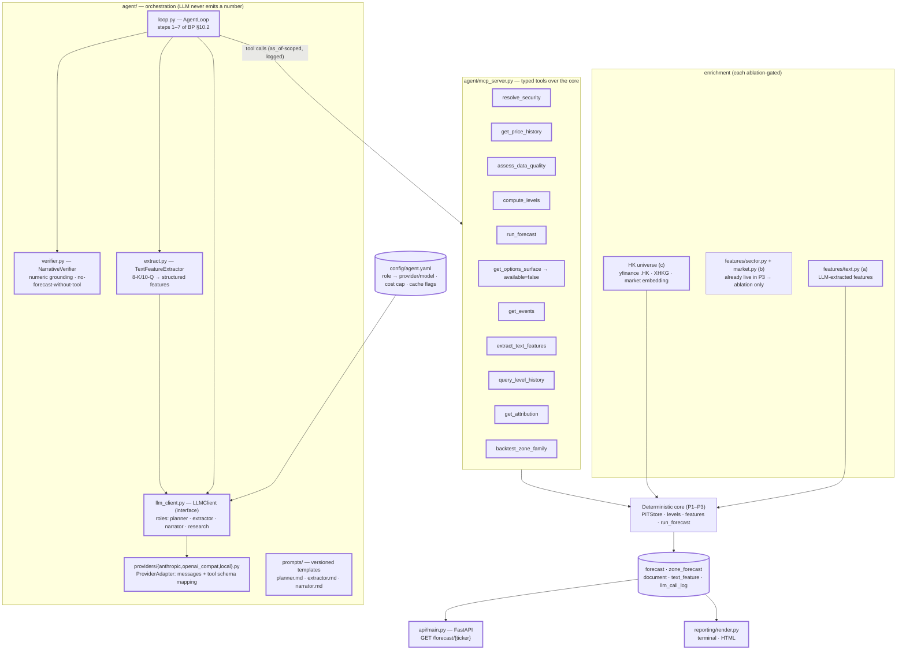
```mermaid
flowchart TB
    subgraph AGENT["agent/ — orchestration (LLM never emits a number)"]
        LOOP["loop.py — AgentLoop\nsteps 1–7 of BP §10.2"]:::new
        LLM["llm_client.py — LLMClient (interface)\nroles: planner · extractor · narrator · research"]:::new
        ADP["providers/{anthropic,openai_compat,local}.py\nProviderAdapter: messages + tool schema mapping"]:::new
        PR["prompts/ — versioned templates\nplanner.md · extractor.md · narrator.md"]:::new
        VER["verifier.py — NarrativeVerifier\nnumeric grounding · no-forecast-without-tool"]:::new
        EXT["extract.py — TextFeatureExtractor\n8-K/10-Q → structured features"]:::new
    end
    CFG[("config/agent.yaml\nrole → provider/model · cost cap · cache flags")]:::new --> LLM
    LLM --> ADP
    LOOP --> LLM
    LOOP --> VER
    LOOP --> EXT
    EXT --> LLM
    subgraph MCP["agent/mcp_server.py — typed tools over the core"]
        T1["resolve_security"]:::new
        T2["get_price_history"]:::new
        T3["assess_data_quality"]:::new
        T4["compute_levels"]:::new
        T5["run_forecast"]:::new
        T6["get_options_surface → available=false"]:::new
        T7["get_events"]:::new
        T8["extract_text_features"]:::new
        T9["query_level_history"]:::new
        T10["get_attribution"]:::new
        T11["backtest_zone_family"]:::new
    end
    LOOP -- "tool calls (as_of-scoped, logged)" --> MCP
    MCP --> CORE["Deterministic core (P1–P3)\nPITStore · levels · features · run_forecast"]
    subgraph ENRICH["enrichment (each ablation-gated)"]
        E1["features/text.py (a)\nLLM-extracted features"]:::new
        E2["features/sector.py + market.py (b)\nalready live in P3 → ablation only"]
        E3["HK universe (c)\nyfinance .HK · XHKG · market embedding"]:::new
    end
    E1 --> CORE
    E3 --> CORE
    CORE --> FS[("forecast · zone_forecast\ndocument · text_feature · llm_call_log")]:::new
    FS --> API["api/main.py — FastAPI\nGET /forecast/{ticker}"]:::new
    FS --> REP["reporting/render.py\nterminal · HTML"]:::new
    classDef new stroke-width:3px
```

### 7.3 Data / work flow

**Interactive forecast (`sr forecast AAPL`, target < 60 s, ≤ cost cap):**

```mermaid
sequenceDiagram
    participant U as User / API
    participant A as AgentLoop
    participant L as LLMClient (role)
    participant M as MCP tools
    participant V as NarrativeVerifier
    participant S as forecast store
    U->>A: forecast("AAPL", as_of)
    A->>M: resolve_security("AAPL") · assess_data_quality(id, as_of)
    M-->>A: security_id, coverage{}, dq_score, blockers[]
    alt dq_score < 0.7
        A-->>U: refusal: "No publishable levels — DQ 0.62 (blockers: …)"
    end
    A->>L: planner: choose source set given coverage + blockers (structured output: {sources[], families[], reason})
    L-->>A: plan (validated against the allow-list, no numbers accepted)
    A->>M: get_events(id, window) → events[], documents[]
    loop each unstructured document not yet extracted
        A->>M: extract_text_features(document_id)   (→ TextFeatureExtractor → LLMClient extractor role)
    end
    A->>M: run_forecast(id, as_of, config_version)   (deterministic, consumes plan + text features)
    M-->>A: forecast_json, forecast_id
    A->>M: get_attribution(forecast_id, zone_id) for each published zone
    A->>L: narrator: write narrative grounded in forecast_json + attributions (display_strings quoted verbatim)
    L-->>A: narrative
    A->>V: verify(narrative, forecast_json)
    alt verifier fails
        A->>L: narrator: regenerate once with the violation list
        A->>V: verify again
        alt fails again
            A->>A: narrative ← templated narrative (deterministic)
        end
    end
    A->>S: attach narrative + llm_call_log to forecast_id
    A-->>U: forecast_json (+ terminal/HTML render)
```

**Scheduled batch** runs the same loop per ticker in the Friday flow (P6) with the planner cached per coverage class, so its cost is dominated by extraction of new filings.

**Text-feature extraction (batchable, offline):**

```mermaid
flowchart LR
    F[("filing (P1)\n8-K, 10-Q, 10-K since 2010")] --> D["EdgarClient.fetch_document\n→ document (text, acceptance_ts)"]
    D --> CH["chunk + section select\n(Item 2.02, 7.01, 8.01; MD&A)"]
    CH --> X["TextFeatureExtractor\nLLMClient(role=extractor)\nJSON-schema-constrained output"]
    X --> VAL["schema + range validation\nreject if any field out of [−1,1]/[0,1]"]
    VAL --> TF[("text_feature\navailable_at = acceptance_ts")]
    TF --> FR["FeatureRegistry group 'text'\ntext_available = 1 where a row exists"]
```

### 7.4 Layers & classes

```mermaid
classDiagram
    class LLMClient {
        <<interface>>
        +complete(role, messages, tools, schema, max_cost) LLMResult
        +capabilities(role) ProviderCaps
    }
    class ProviderAdapter {
        <<abstract>>
        +str provider
        +to_provider_tools(mcp_tools) list
        +from_provider_toolcall(raw) ToolCall
        +complete(model, messages, tools, schema) LLMResult
    }
    class AnthropicAdapter
    class OpenAICompatAdapter
    class LocalAdapter
    class RoleConfig {
        +str role
        +str provider
        +str model
        +float max_cost_usd
        +bool cache_system_prompt
        +bool batch_ok
    }
    class LLMResult {
        +str text
        +dict structured
        +list~ToolCall~ tool_calls
        +Usage usage
        +float cost_usd
    }
    class AgentLoop {
        +run(ticker, as_of) ForecastResult
        +plan_sources(coverage, blockers) SourcePlan
        +write_narrative(forecast, attributions) str
    }
    class SourcePlan {
        +list sources
        +list families
        +str reason
    }
    class NarrativeVerifier {
        +verify(narrative, forecast_json) Verdict
        +extract_numbers(text) list
        +flatten(forecast_json) set
    }
    class TextFeatureExtractor {
        +schema TextFeatureSchema
        +extract(document) list~TextFeature~
    }
    class TextFeature {
        +str name
        +float value
        +float confidence
        +str source
        +datetime timestamp
        +str evidence_span
    }
    class MCPServer {
        +tools list
        +call(name, args, as_of) ToolResult
    }
    class ToolResult {
        +dict data
        +str display_string
        +str schema_version
    }
    class ForecastAPI {
        +get_forecast(ticker, as_of) JSON
    }
    LLMClient <|.. ProviderAdapter
    ProviderAdapter <|-- AnthropicAdapter
    ProviderAdapter <|-- OpenAICompatAdapter
    ProviderAdapter <|-- LocalAdapter
    LLMClient o-- RoleConfig
    LLMClient ..> LLMResult
    AgentLoop ..> LLMClient
    AgentLoop ..> MCPServer
    AgentLoop ..> NarrativeVerifier
    AgentLoop ..> SourcePlan
    TextFeatureExtractor ..> LLMClient
    TextFeatureExtractor ..> TextFeature
    MCPServer ..> ToolResult
    ForecastAPI ..> AgentLoop
```

| Module | Class | Responsibility | Inputs → Outputs |
|---|---|---|---|
| `agent/llm_client.py` | `LLMClient`, `RoleConfig` | Provider-agnostic entry point. Reads `agent.yaml`; enforces per-call and per-forecast cost caps; logs every call to `llm_call_log`; supports JSON-schema-constrained output for planner/extractor roles. | role, messages → `LLMResult` |
| `agent/providers/*.py` | `ProviderAdapter` subclasses | Map messages, tool schemas and structured-output requests to the provider's API; expose `ProviderCaps{prompt_cache, batch, json_schema, max_context}` so the loop degrades gracefully (e.g. no caching → still correct, just costlier). Adding a provider = one file. | — |
| `agent/loop.py` | `AgentLoop` | BP §10.2 steps 1–7; only steps 2 and 6 call the LLM. | ticker, as_of → forecast |
| `agent/prompts/` | templates | Versioned (`prompt_version` recorded per call); planner and narrator prompts contain the rule "quote `display_string` fields verbatim; never compute". | — |
| `agent/verifier.py` | `NarrativeVerifier` | §7.6.2 | narrative, JSON → verdict |
| `agent/extract.py` | `TextFeatureExtractor` | §7.6.3 | document → `TextFeature[]` |
| `agent/mcp_server.py` | `MCPServer` | BP §10.1 tools; every tool takes `as_of`; every numeric return carries a `display_string` | — |
| `features/text.py` | group `text` | Aggregates `text_feature` rows into the registry (latest value per feature with decay, `days_since_filing`) with `available_at = acceptance_ts` | — |
| `data/universe.py` (ext.) | HK support | Hang Seng membership intervals (curated CSV), `.HK` yfinance symbols, XHKG calendar, `market = "HK"` embedding (categorical) | — |
| `api/main.py` | `ForecastAPI` | `GET /forecast/{ticker}?as_of=` → latest stored forecast (never recomputes on a GET; `POST /forecast/{ticker}` triggers the loop) | — |
| `reporting/render.py` (ext.) | `render_terminal`, `render_html` | Zone ladder (design-fixed §85), probabilities, evidence, narrative, DQ, model versions | — |

### 7.5 Data sources & storage

Sources: EDGAR document text (§2.5, now fetched), yfinance HK bars and `^HSI`, curated HSI membership CSV. The configured LLM provider(s) are an external dependency but **not a data source**: nothing they return is stored except `text_feature` rows (which pass through the same ablation gate as any feature) and the narrative.

| Table | Grain | Columns | `available_at` |
|---|---|---|---|
| `document` | filing document | `document_id, security_id, accession, form, item_codes, text_hash, char_len, fetched_at` | filing `acceptance_ts` |
| `text_feature` | document × feature | `name ∈ {sentiment, guidance_change, earnings_risk, regulatory_risk, demand_change, pricing_change, margin_change, capex_change, management_confidence, surprise_probability, event_severity}`, `value, confidence, evidence_span, extractor_version, provider, model` | `acceptance_ts` (never the extraction time) |
| `forecast` (ext.) | forecast | + `narrative, narrative_source ∈ {llm, template}, verifier_verdict(json), source_plan(json), prompt_version` | — |
| `llm_call_log` | call | `call_id, forecast_id?, role, provider, model, prompt_version, input_tokens, output_tokens, cached_tokens, cost_usd, latency_ms, schema_valid` | — |
| `agent_run` | run | `run_id, ticker, as_of, steps(json), total_cost_usd, wall_ms, outcome ∈ {published, refused, error}` | — |
| `research/rejected.md` | — | modules that failed ablation with their ΔBrier tables | — |

**Slots kept for modules not built (D1):** `features.yaml` groups `offexchange`, `intraday_vp`, `orderbook` stay declared with `_available = 0`. *Amended 2026-09-24:* in-house daily options history now exists (`option_daily`, P1), so an options/GEX module (family G) is a candidate P4 enrichment behind the rung-7 ablation gate. Until it is admitted, `get_options_surface` returns `{available: false, reason: "options module not admitted"}` and `levels/generators/options.py` stays a stub.

### 7.6 Algorithms & formulas

#### 7.6.1 Source-selection planner (the one judgment call; BP §4.1)

Input to the planner role: `coverage{source → available, freshness, dq_component}` and `blockers[]` from `assess_data_quality`, plus the family list. Output is JSON-schema constrained:

```json
{"sources": ["yfinance_daily", "edgar_filings", "fred_macro"], "families": ["A","B","C","D","E","F"],
 "exclude": [{"family": "C", "reason": "volume flagged stale for 40 sessions"}], "reason": "…"}
```

The loop validates it against the allow-list (only declared sources/families), rejects any numeric content, and applies it as a *mask* to `run_forecast` — the core still computes everything; the mask only affects which candidates enter clustering. A planner failure (timeout, invalid JSON) falls back to "all available sources", which is what the deterministic batch uses anyway.

#### 7.6.2 Narrative verifier (BP §10.4.1)

```
1. numbers(text)  = every match of  [-+]?\d[\d,]*(\.\d+)?\s*(%|ATR|x)?   normalised: strip commas; "%" → /100; "ATR" tag kept
2. F              = flatten(forecast_json): every numeric leaf, plus for each leaf v the renderings {v, round(v,1), round(v,2), 100·v (if 0≤v≤1)}
3. for each n in numbers(text):  ok(n) ⇔ ∃ f ∈ F : |n − f| ≤ max(0.005·|f|, 0.005)   (a 0.5 % or half-cent tolerance for rounding)
4. verdict = PASS iff all ok;  else FAIL with the list of ungrounded numbers
5. additional checks: every zone_id mentioned exists in the forecast; no phrase from a deny-list ("guaranteed", "will bounce") ;
   narrative length ≤ 1 200 chars
```

Dates and session counts are exempt only when they appear in `session_calendar` for the forecast. On FAIL the loop regenerates once with the violation list injected; a second FAIL publishes the structured forecast with `narrative_source = "template"` (a deterministic Jinja template over the JSON).

#### 7.6.3 Text-feature extraction (BP §4.1, design-fixed §23)

Per document: select sections by item code (8-K: 2.02, 7.01, 8.01, 1.01, 5.02; 10-Q/10-K: MD&A, Risk Factors first 6 000 chars), chunk at 8 000 chars, and ask the extractor role for the schema below **per chunk**, then aggregate by `confidence`-weighted mean per feature:

```json
{"features": [{"name": "guidance_change", "value": -1.0, "confidence": 0.7, "evidence_span": "…verbatim quote…"}, …]}
value ∈ [−1, 1] for directional features, [0, 1] for risk/probability features; confidence ∈ [0, 1]
```

Validation: schema-valid, ranges respected, `evidence_span` must be a substring of the chunk (rejects hallucinated support). Rejected chunks are logged and the feature row is omitted (`text_available` stays 0 for that filing). `available_at = acceptance_ts` — extraction happens later, but the information existed at acceptance; the leakage suite checks that the feature value at `as_of` depends only on documents with `acceptance_ts ≤ as_of`. In the registry, `text` features decay: `value_t = value_doc · exp(−days_since/45)` (**initial**).

#### 7.6.4 Enrichment ablations (BP §8 rung 7)

Run `AblationHarness` for: `text` (a), `sector ∪ market` (b), and — for (c) — the HK pooled-vs-US-only comparison. Admission is §6.6.10's rule. (b) is already in the P3 feature set; here it is *tested for removal*: if `ΔBrier ≥ 0` with `ci_lo > 0` when removed, it is dropped.

#### 7.6.5 HK generalisation (BP §12 P4, design-fixed §75–76)

No new model code. Changes are: `markets.yaml` entry for HK (XHKG, close 08:00 UTC, tick size table by price band, `round_number_multipliers` adjusted for HKD price levels), `security_master.market = "HK"` as a categorical feature (the "market embedding" in LightGBM is the categorical split), `^HSI` for regime/market features, sector via Hang Seng industry classification, `options_available = 0`, `text_available = 0` (HKEX filings are out of scope in P4; slot kept). Calibration strata already key on `market`. Gate: the same §6.6.8 checks on HK test years with `n_stratum ≥ 500` where available; the fallback ladder covers thin strata.

#### 7.6.6 Cost and latency budget

```
per forecast:  planner ≤ 1 call (cached system prompt when ProviderCaps.prompt_cache), narrator ≤ 2 calls, extraction 0..k calls (only new filings)
cap            = agent.yaml: max_cost_usd_per_forecast (default 0.15, BP §3.1);  exceeding it → templated narrative, forecast still published
latency        = run_forecast (deterministic) dominates; MC at 20k paths ≈ 2–4 s per ticker; LLM calls ≤ 15 s total
batch          = extraction over the historical filing backlog uses the provider's batch endpoint when ProviderCaps.batch, else a rate-limited queue
```

### 7.7 Tests that decide the gate (BP §10.4 — "each is a test, not a policy")

- `tests/guardrails/test_numeric_grounding.py` — 50 narratives with planted ungrounded numbers all FAIL; 50 grounded ones PASS; the templated fallback always PASSes.
- `tests/guardrails/test_no_forecast_without_tool.py` — the loop cannot return a forecast object whose `forecast_id` is absent from the store (mocked LLM that tries to "answer directly" is rejected).
- `tests/guardrails/test_leakage_tool_boundary.py` — every MCP tool signature has `as_of`; a static check that no tool implementation calls DuckDB except through `PITStore`.
- `tests/guardrails/test_replay_determinism.py` — `run_forecast` via the MCP tool twice → identical payload; the narrative may differ but `forecast_id` and all numbers match.
- `tests/guardrails/test_refusal_path.py` — DQ 0.62 → refusal message, no `forecast` row; no zone clearing thresholds → forecast row with `zones: []` and the "no high-conviction levels" narrative.
- `tests/agent/test_provider_adapters.py` — each adapter round-trips the MCP tool schemas and a structured-output request against a recorded fixture; the loop passes all guardrail suites with every configured provider (parametrised).
- `tests/agent/test_extractor.py` — `evidence_span` not in chunk → row rejected; ranges enforced; `available_at == acceptance_ts`.
- `tests/api/test_forecast_endpoint.py` — GET returns the stored JSON unchanged; unknown ticker → 404; DQ-refused → 200 with `refused: true`.
- Gate artefacts: `research/p4_ablation_{date}.md` (per-module ΔBrier tables), `research/hk_calibration_{date}.md`.

### 7.8 Deliverables

- [ ] `LLMClient` + three adapters + `agent.yaml`; `AgentLoop`; prompts v1; `NarrativeVerifier`; `TextFeatureExtractor`; `MCPServer` with the 11 tools.
- [ ] `document`, `text_feature`, `llm_call_log`, `agent_run` tables; text-feature backfill 2010→present for the US universe.
- [ ] HK universe (curated HSI membership), XHKG calendar, HK bars, HK level/label/feature builds.
- [ ] FastAPI service; terminal + HTML renderers; `sr forecast TICKER`, `sr serve`, `sr extract --backfill`.
- [ ] Ablation reports; `research/rejected.md` entries for any rejected module; the five guardrail suites in CI.

---

## 8. P5 — Challengers + economic validation (Weeks 15–18) **[provisional]**

### 8.1 Objective, gate, kill

> Sequence model (TCN/small Transformer, multi-task + quantile head), ACI/EnbPI conformal intervals, meta-ensemble, trading simulation with market-specific costs, Deflated Sharpe.
> **Gate:** DL beats LightGBM OOS, or it is not deployed. Economic result survives DSR given the true trial count.
> **Kill:** DSR indicates the economic result is attributable to selection → publish the forecast product as a *calibrated-probability* tool and do not make trading claims. — BP §12 P5

This section is provisional: its inputs depend on which rungs and modules survived P3–P4, and on the P3 gate outcome (if the statistical engine shipped, the challenger is compared against *that*).

### 8.2 Architecture (this phase)

```mermaid
flowchart TB
    FS[("feature_store (P3)")] --> SD["models/sequence_data.py\nSequenceDatasetBuilder\n(ATR-normalised OHLCV windows + zone context)"]:::new
    SD --> SDS[("lake/sequence_dataset\n.npz shards per (market, year)")]:::new
    SDS --> SEQ["models/sequence.py\nTCN / small Transformer\nmulti-task + quantile heads"]:::new
    R4["LGBMMultiTask (P3)"] --> ENS
    SEQ --> ENS["models/ensemble.py\nMetaEnsemble (logistic stacking)"]:::new
    MC["GarchBootstrapSimulator (P3)"] --> ENS
    ENS --> ISO["StratifiedIsotonic (P3)"]
    MC --> ACI["calibrate/conformal.py\nACI · EnbPI over weekly H/L/C quantiles"]:::new
    ISO --> FC["run_forecast (P3)"]
    ACI --> FC
    FC --> TS["validation/trading_sim.py\nTradingSimulator + CostModel"]:::new
    TS --> DSR["validation/dsr.py\nDeflatedSharpe(trials.jsonl)"]:::new
    TR[("research/trials.jsonl")] --> DSR
    DSR --> REP["research/p5_gate_{date}.md"]:::new
    GPU["GPU: rented by the hour\n(local driver mismatch, BP §11)"]:::new -.-> SEQ
    classDef new stroke-width:3px
```

### 8.3 Data / work flow

```mermaid
flowchart LR
    A["1. SequenceDatasetBuilder\nwindow = 120 sessions per zone × as_of"] --> B["2. train sequence model\nsame walk-forward folds as P3"]
    B --> C["3. score validate year\n→ per-zone p_touch, p_hold, p_break, quantiles"]
    C --> D["4. MetaEnsemble.fit on validate\n(rung outputs → logit stack)"]
    D --> E["5. StratifiedIsotonic refit"]
    E --> F["6. ACI over MC + quantile-head intervals\n(online on validate, frozen γ)"]
    F --> G["7. score test years\nΔBrier vs rung 6 · pinball · coverage"]
    G --> H["8. TradingSimulator on published zones\n→ P&L, Sharpe, costs"]
    H --> I["9. DeflatedSharpe with N_trials from trials.jsonl"]
    I --> J["10. gate report + trials.jsonl"]
```

### 8.4 Layers & classes

```mermaid
classDiagram
    class SequenceDatasetBuilder {
        +int window = 120
        +build(zones, as_of_range) SequenceDataset
    }
    class SequenceModel {
        <<abstract>>
        +fit(dataset, folds)
        +predict(dataset) Predictions
    }
    class TCNModel {
        +int channels = 64
        +int levels = 6
        +float dropout = 0.2
    }
    class SmallTransformer {
        +int d_model = 64
        +int n_heads = 4
        +int n_layers = 3
    }
    class MultiTaskHead {
        +touch
        +hold
        +break_
        +quantiles
        +reaction
    }
    class MetaEnsemble {
        +fit(rung_outputs, y)
        +predict(rung_outputs) Series
        +weights() dict
    }
    class AdaptiveConformal {
        +float alpha = 0.10
        +float gamma = 0.005
        +update(err) None
        +interval(q_lo, q_hi) tuple
        +trailing_coverage(n) float
    }
    class EnbPI {
        +int n_members = 20
        +residual_window = 250
    }
    class CostModel {
        +dict per_market
        +cost(trade) float
    }
    class TradingSimulator {
        +run(forecasts, bars, cost_model) BacktestResult
    }
    class DeflatedSharpe {
        +compute(sharpe, n_trials, skew, kurt, T) float
    }
    SequenceModel <|-- TCNModel
    SequenceModel <|-- SmallTransformer
    SequenceModel o-- MultiTaskHead
    SequenceDatasetBuilder ..> SequenceModel
    MetaEnsemble ..> SequenceModel
    TradingSimulator ..> CostModel
    DeflatedSharpe ..> TradingSimulator
```

| Module | Class | Responsibility |
|---|---|---|
| `models/sequence_data.py` | `SequenceDatasetBuilder` | Per zone × as_of: a `[120, F]` tensor of ATR-normalised OHLCV + selected daily features, a static vector (zone_geom, zone_history, market categorical), and the P3 labels |
| `models/sequence.py` | `TCNModel`, `SmallTransformer`, `MultiTaskHead` | Rung 8 challenger (§8.6.1); PyTorch; trained on rented GPU or CPU for the TCN |
| `models/ensemble.py` | `MetaEnsemble` | Rung 9 logistic stacking over rung outputs (§8.6.2) |
| `calibrate/conformal.py` | `AdaptiveConformal`, `EnbPI` | Interval calibration of weekly high/low/close (§8.6.3) |
| `validation/trading_sim.py` | `TradingSimulator`, `CostModel` | Economic validation (§8.6.4); reads only *published* forecasts (BP §10.5) |
| `validation/dsr.py` | `DeflatedSharpe` | §8.6.5 |

### 8.5 Data sources & storage

No new external data. New artefacts: `lake/sequence_dataset` (`.npz` shards; regenerated from `feature_store`, never a source of truth), `ensemble_weights` (model_version × rung → weight), `conformal_state` (market × quantile → `α_t`, trailing coverage), `backtest_result` (strategy_version × year → gross/net return, Sharpe, DSR, turnover, hit rate, max drawdown, cost breakdown). The forecast JSON's `weekly_distribution.interval_method` string (BP §3.2) is populated from `conformal_state`.

### 8.6 Algorithms & formulas

#### 8.6.1 Sequence challenger (design-fixed §27–28)

Input: `X_seq ∈ ℝ^{120×F}` (F ≈ 24: O/H/L/C returns and wicks in ATR units, volume z-score, ATR/close, distance of each bar to the zone in ATR, weekday), `X_static ∈ ℝ^{S}`. Encoder: TCN (dilated causal convolutions, receptive field ≥ 120) **or** a 3-layer Transformer encoder with learned positional encoding; both project to a 64-d shared representation concatenated with an embedding of `X_static`. Heads: `touch`, `hold`, `break` (sigmoid), `reaction` (linear), `quantiles` of weekly high/low/close (7 quantiles each, non-crossing enforced by cumulative softplus).

```
L = λ₁·BCE(touch) + λ₂·BCE(hold | touched) + λ₃·BCE(break | touched) + λ₄·Σ_q pinball_q(quantiles) + λ₅·Huber(reaction | touched)
pinball_q(y, ŷ) = max(q·(y − ŷ), (q − 1)·(y − ŷ))
λ selected on the validate year by minimising Brier(hold); initial λ = (1, 1, 1, 0.5, 0.5)
```

Training uses exactly the P3 folds (purge + embargo). Admission: `ΔBrier(challenger vs rung 6) < 0` with `ci_hi < 0` pooled over test years, **and** pinball loss ≤ MC quantiles'. Otherwise it is not deployed (BP §8).

#### 8.6.2 Meta-ensemble (design-fixed §31)

`logit p̂ = β₀ + Σ_r β_r · logit p_r` over rung outputs `r ∈ {2, 3, 4, 4⊕MC, 8}`, fit on the validate year with L2, followed by `StratifiedIsotonic`. Weights are reported per regime (`regime_probs` interact with `logit p_r`) — this is the "learned, regime-conditioned meta-model" that replaces SR-Plan's hand-assigned table (BP §1.2).

#### 8.6.3 Conformal intervals (BP §9.2)

For each weekly target `Y ∈ {high, low, close}` and level `α = 0.10`, raw interval `[q̂_{α/2}, q̂_{1−α/2}]` from MC (or the quantile head if admitted). **ACI** (Gibbs & Candès; Zaffran et al.):

```
err_t   = 1[Y_t ∉ Ĉ_t(α_t)]
α_{t+1} = α_t + γ·(α − err_t),        γ = 0.005 (initial), α_t clipped to [0.01, 0.5]
Ĉ_t(α_t) = [q̂_{α_t/2}, q̂_{1−α_t/2}] widened by the conformity quantile of trailing residuals
```

**EnbPI** alternative: `n_members = 20` bootstrap MC seeds, residuals from leave-one-out aggregation, sliding window 250. Both are run on validate + test; the one with realised coverage closest to 90 % and narrower average width is selected per market and recorded in `interval_method`. Gate (BP §14): realised coverage 88–92 % at target 90 %.

#### 8.6.4 Trading simulation and costs (design-fixed §41–42)

Strategy (fixed, not optimised — optimisation would inflate the trial count): for each published support zone, a limit buy at `U` valid 5 sessions; stop at `L − δ`; target `E + max(R_min, E[reaction]·ATR)`; symmetric short for resistance where allowed. Position size = equal notional (sizing belongs to the portfolio layer, design-fixed §87–88).

```
Net = Gross − commission − spread/2 (each side) − slippage − impact
US:  commission 0.0005/share, spread from Corwin–Schultz proxy, slippage 0.02 %, impact 0.1·σ_daily·sqrt(notional/ADV)
HK:  commission 0.03 % + stamp 0.1 % + levies 0.0057 %, spread from tick table, slippage 0.05 %, impact as above
```

#### 8.6.5 Deflated Sharpe Ratio (Bailey & López de Prado; BP §7.4)

```
SR₀      = sqrt( V[SR_n] ) · ( (1−γ_E)·Φ⁻¹(1 − 1/N) + γ_E·Φ⁻¹(1 − 1/(N·e)) ),   γ_E = 0.5772,  N = #trials from trials.jsonl (all kinds, all phases)
DSR      = Φ( (SR̂ − SR₀)·sqrt(T − 1) / sqrt(1 − γ₃·SR̂ + (γ₄ − 1)/4 · SR̂²) )
```

with `SR̂` the observed net Sharpe (per period), `T` the number of periods, `γ₃, γ₄` skew and kurtosis of returns, and `V[SR_n]` the variance of Sharpe across the logged trials. Gate: `DSR ≥ 0.95`; otherwise no trading claims (BP §12 P5 kill).

### 8.7 Tests that decide the gate

- `tests/models/test_sequence.py` — overfits a 200-sample synthetic set; quantile heads are non-crossing; determinism with fixed seeds on CPU.
- `tests/calibrate/test_conformal.py` — ACI on a synthetic series with a variance shift recovers 90 % coverage within 300 steps; EnbPI coverage ≥ 88 % on stationary noise.
- `tests/validation/test_trading_sim.py` — a known zone sequence reproduces hand-computed P&L including costs; no fills at prices outside the session's [L, H].
- `tests/validation/test_dsr.py` — DSR of a random-strategy set with N trials ≈ uniform under the null.
- Gate artefacts: `research/p5_gate_{date}.md` with ΔBrier, pinball, coverage, Sharpe, N_trials, DSR.

### 8.8 Deliverables

- [ ] Sequence dataset + TCN/Transformer challenger; `MetaEnsemble`; ACI/EnbPI; `TradingSimulator` + `CostModel`; `DeflatedSharpe`.
- [ ] Decision recorded: challenger deployed or rejected (`research/rejected.md`); interval method per market in `conformal_state`.

---

## 9. P6 — Production loop (ongoing) **[provisional]**

### 9.1 Objective, gate, kill

> Friday post-close scheduled run, forecast store, weekly scoring of last week's forecast against what happened, drift monitoring (PSI, KS, Wasserstein), model registry with full governance metadata, auto-downgrade of confidence on drift. — BP §12 P6

There is no gate; the phase is "keep the product honest every week". Provisional because the exact modules scheduled depend on P4–P5 admissions.

### 9.2 Architecture (this phase)

```mermaid
flowchart TB
    CRON["Prefect schedule\nFriday 21:30 UTC (XNYS) · Friday 09:30 UTC (XHKG)\nsession-calendar aware"]:::new --> FLOW
    subgraph FLOW["ops/flows.py — weekly_forecast_flow"]
        S1["ingest (P1)\nMySQL · yfinance · EDGAR · FRED"]
        S2["dq_all (P1)"]
        S3["score_last_week (P6)\nreporting/score.py"]:::new
        S4["levels + labels build (P2)"]
        S5["features build (P3)"]
        S6["drift_check (P6)\nreporting/drift.py"]:::new
        S7["forecast_all (P3–P5)\nrun_forecast per ticker"]
        S8["agent narratives (P4)\nAgentLoop batch"]
        S9["publish + rank\ncross-sectional table"]:::new
        S1 --> S2 --> S3 --> S4 --> S5 --> S6 --> S7 --> S8 --> S9
    end
    S3 --> FS[("forecast_score")]:::new
    S6 --> DM[("drift_metric")]:::new
    DM --> DG["confidence downgrade rule\n(calibrate/confidence.py)"]:::new
    DG --> S7
    S9 --> DB["reporting/dashboard.py\nzone ladders · calibration curves · drift"]:::new
    REG[("model_registry\n+ governance fields")]:::new --> S7
    ALERT["alerts: DQ blockers · drift WARN · verifier fallbacks"]:::new
    S2 --> ALERT
    S6 --> ALERT
    S8 --> ALERT
    classDef new stroke-width:3px
```

### 9.3 Data / work flow

```mermaid
sequenceDiagram
    participant P as Prefect
    participant F as weekly_forecast_flow
    participant ST as PITStore / lake
    participant SC as Scorer
    participant DR as DriftMonitor
    participant RF as run_forecast
    participant AG as AgentLoop
    P->>F: trigger(as_of = last session close this week)
    F->>ST: ingest + catalogue refresh
    F->>SC: score forecasts with forecast_ts = as_of − 1 week
    SC->>ST: labels for those zones (now available: horizon_end ≤ as_of)
    SC-->>ST: forecast_score rows (Brier, hit, reaction realised, calibration bin update)
    F->>DR: compare feature_store(as_of) vs training distribution
    DR-->>ST: drift_metric rows with level OK / WARN / CRITICAL
    F->>RF: forecast every ticker in universe(as_of) with drift-adjusted confidence
    F->>AG: narratives for tickers with ≥ 1 published zone
    F-->>P: summary: n_published, n_refused, cost, alerts
```

### 9.4 Layers & classes

```mermaid
classDiagram
    class WeeklyForecastFlow {
        +run(as_of) FlowSummary
    }
    class ForecastScorer {
        +score(forecast_id) ScoreRow
        +update_calibration_bins(scores) None
    }
    class DriftMonitor {
        +psi(ref, cur) float
        +ks(ref, cur) float
        +wasserstein(ref, cur) float
        +check(as_of) DriftReport
    }
    class ConfidenceDowngrade {
        +apply(confidence, drift_report) float
    }
    class ModelRegistry {
        +register(model, governance) str
        +active(market) ModelVersion
        +retire(version, reason) None
    }
    class Dashboard {
        +render(as_of) HTML
    }
    class AlertSink {
        +send(level, message) None
    }
    WeeklyForecastFlow ..> ForecastScorer
    WeeklyForecastFlow ..> DriftMonitor
    WeeklyForecastFlow ..> ModelRegistry
    DriftMonitor ..> ConfidenceDowngrade
    WeeklyForecastFlow ..> AlertSink
    Dashboard ..> ForecastScorer
```

| Module | Class | Responsibility |
|---|---|---|
| `ops/flows.py` | `WeeklyForecastFlow` | Prefect flow; each step is a task with retries; idempotent per `as_of` |
| `reporting/score.py` | `ForecastScorer` | Realised labels vs published probabilities (§9.6.1); updates the `calibration_bin.historical_realized` shown in the forecast JSON |
| `reporting/drift.py` | `DriftMonitor` | PSI / KS / Wasserstein per feature and group (§9.6.2) |
| `calibrate/confidence.py` (ext.) | `ConfidenceDowngrade` | §9.6.3 |
| `models/registry.py` | `ModelRegistry` | design-fixed §58 governance fields; one active version per market |
| `reporting/dashboard.py` | `Dashboard` | Static HTML from DuckDB: zone ladders (design-fixed §85), cross-sectional ranking, calibration curves per stratum, drift heatmap, cost |
| `ops/alerts.py` | `AlertSink` | stdout/email/webhook (configurable) |

### 9.5 Data sources & storage

No new external sources; the in-house options history keeps growing (`option_daily`). New tables:

| Table | Grain | Columns |
|---|---|---|
| `forecast_score` | zone_forecast × scoring run | `y_touch, y_hold, y_break, y_reaction` realised, `brier_touch, brier_hold, hit, reaction_realised_atr, scored_at` |
| `drift_metric` | as_of × feature | `psi, ks_stat, ks_p, wasserstein, level` |
| `model_registry` (ext.) | model version | + `data_version, validation_results(json), calibration_results(json), market_coverage, known_limitations, activated_at, retired_at, retire_reason` |
| `flow_run` | run | `as_of, started, finished, n_published, n_refused, total_cost_usd, alerts(json)` |

### 9.6 Algorithms & formulas

#### 9.6.1 Weekly scoring

For each published zone of last week's forecasts, once `horizon_end ≤ as_of`: apply `TripleBarrierLabeler` (P2) to the realised bars, then `brier_hold = (p_hold − y_hold)²` on touched zones, `brier_touch = (p_touch − y_touch)²` on all; roll into the per-stratum calibration bins (`predicted`, `historical_realized`, `n`) that the forecast JSON reports. Monthly: recompute ECE/slope per stratum on the trailing 52 weeks; if `ECE > 0.05` in a top-3 stratum → alert `WARN` and schedule recalibration (isotonic refit on the trailing year; retrain only on the annual walk-forward cadence).

#### 9.6.2 Drift monitors (design-fixed §84)

```
PSI(f)  = Σ_b (cur_b − ref_b) · ln(cur_b / ref_b),   10 equal-mass bins from the training distribution;  WARN ≥ 0.10, CRITICAL ≥ 0.25
KS(f)   = sup_x |F_ref(x) − F_cur(x)|,  two-sample p-value
W₁(f)   = Wasserstein-1 between ref and cur, in units of ref σ
group level = max over the group's features;  regime drift = PSI over HMM state probabilities
```

`cur` = feature values at `as_of` over the universe; `ref` = the active model's training distribution (stored with the model version).

#### 9.6.3 Confidence auto-downgrade (BP §12 P6, §9.3)

`regime_stability` in §6.6.9 already carries PSI; in production add a hard rule:

```
level = max(group levels)
confidence' = confidence                     if OK
            = confidence · 0.85              if WARN
            = min(confidence, 0.69) · 0.7    if CRITICAL   (below the 0.70 publication threshold → nothing publishes until recalibration)
```

CRITICAL also flags the model version `needs_review` in the registry and raises an alert; it never silently retrains.

#### 9.6.4 Schedule and session awareness

The flow is scheduled per market at `close_ts(last session of ISO week) + 90 min` from `session_calendar` (holiday-shortened weeks still forecast; a week with no session is skipped). `as_of` is that session's close, so a Thursday-close week is a legitimate `as_of`.

### 9.7 Tests

- `tests/ops/test_flow_idempotent.py` — running the flow twice for one `as_of` produces no duplicate `forecast`, `forecast_score` or `drift_metric` rows.
- `tests/reporting/test_score.py` — scoring reuses `TripleBarrierLabeler` (no second label implementation); hand-built case reproduces Brier values.
- `tests/reporting/test_drift.py` — PSI = 0 on identical samples; the WARN/CRITICAL thresholds trigger on shifted synthetic data; downgrade rule arithmetic.
- `tests/ops/test_schedule.py` — a holiday week schedules on Thursday's close; an empty week schedules nothing.

### 9.8 Deliverables

- [ ] `WeeklyForecastFlow` with Prefect deployment; `ForecastScorer`; `DriftMonitor`; `ConfidenceDowngrade`; `ModelRegistry` governance; dashboard; alerts.
- [ ] Runbook `docs/RUNBOOK.md`: how to read alerts, recalibrate, retrain, roll back a model version.

---

## Appendix A — DuckDB DDL (catalogue)

Views over Parquet are created by `sr catalogue refresh`; the mutable tables below live inside `sr.duckdb`. Types: DuckDB. `event_ts`/`available_at` are `TIMESTAMPTZ`.

```sql
-- P1 -----------------------------------------------------------------------
CREATE TABLE security_master (
  security_id INTEGER PRIMARY KEY, ticker VARCHAR NOT NULL, name VARCHAR, exchange VARCHAR, market VARCHAR NOT NULL,
  currency VARCHAR NOT NULL, cik VARCHAR, sector VARCHAR, industry VARCHAR,
  listing_date DATE, delisting_date DATE, spine_source VARCHAR,  -- mysql | yfinance | tiingo | stooq_manual | NULL (uncovered)
  mysql_backfill_lo DATE, mysql_backfill_hi DATE,  -- b̂ bracket from the split-state rule (§4.6.1)
  mysql_first_load_date DATE,                      -- exact b from the archived loader cache (§4.5.7), NULL if absent
  event_ts TIMESTAMPTZ, available_at TIMESTAMPTZ NOT NULL);
CREATE TABLE symbol_map (
  security_id INTEGER REFERENCES security_master, source VARCHAR NOT NULL, symbol VARCHAR NOT NULL,
  valid_from DATE, valid_to DATE, PRIMARY KEY (security_id, source, valid_from));
CREATE TABLE universe_membership (
  security_id INTEGER REFERENCES security_master, index_name VARCHAR NOT NULL,  -- SP500 | NDX | DJIA | HSI
  ticker_at_time VARCHAR,
  start_date DATE NOT NULL, end_date DATE, source_url VARCHAR NOT NULL, evidence_grade VARCHAR NOT NULL,
  available_at TIMESTAMPTZ NOT NULL);
CREATE TABLE ingest_run (
  run_id VARCHAR, host VARCHAR, step VARCHAR, started TIMESTAMPTZ, finished TIMESTAMPTZ, n_rows BIGINT, n_new BIGINT,
  n_restated INTEGER, errors JSON, git_sha VARCHAR, PRIMARY KEY (run_id, step));
CREATE VIEW bar_daily_raw AS SELECT * FROM read_parquet('data/lake/bar_daily_raw/**/*.parquet', hive_partitioning=true);
  -- columns: security_id, session DATE, open, high, low, close DOUBLE (true unadjusted, §4.6.1), volume DOUBLE, source VARCHAR, extract_date DATE, event_ts, available_at, ingested_at
CREATE VIEW bar_daily_ref AS SELECT * FROM read_parquet('data/lake/bar_daily_ref/**/*.parquet', hive_partitioning=true);
CREATE VIEW corporate_action AS SELECT * FROM read_parquet('data/lake/corporate_action/**/*.parquet', hive_partitioning=true);
  -- security_id, ex_date DATE, action_type VARCHAR (split|bonus|dividend|special_dividend|rights|spinoff|delist), ratio DOUBLE, cash_amount DOUBLE, subscription_price DOUBLE, source VARCHAR, available_at
CREATE VIEW bar_daily_adj_latest AS SELECT * FROM read_parquet('data/lake/bar_daily_adj_latest/**/*.parquet', hive_partitioning=true);
  -- total-return adjusted to the latest ingest: + adj_factor DOUBLE, atr20 DOUBLE. NOT point-in-time; excluded from PITStore (§4.6.1).
  -- Point-in-time adjusted bars are computed on read by PITStore.bars(as_of, mode).
CREATE TABLE session_calendar (exchange VARCHAR, session DATE, open_ts TIMESTAMPTZ, close_ts TIMESTAMPTZ, is_half_day BOOLEAN, closure_reason VARCHAR, PRIMARY KEY (exchange, session));
CREATE VIEW filing AS SELECT * FROM read_parquet('data/lake/filing/**/*.parquet', hive_partitioning=true);
  -- security_id, cik, form VARCHAR, filed_date DATE, acceptance_ts TIMESTAMPTZ, accession VARCHAR, primary_doc_url VARCHAR, items VARCHAR[], available_at
CREATE VIEW macro_series AS SELECT * FROM read_parquet('data/lake/macro_series/**/*.parquet');
  -- series_id, obs_date DATE, value DOUBLE, vintage_ts TIMESTAMPTZ, available_at
CREATE VIEW macro_release AS SELECT * FROM read_parquet('data/lake/macro_release/**/*.parquet');
CREATE VIEW dq_score AS SELECT * FROM read_parquet('data/lake/dq_score/**/*.parquet', hive_partitioning=true);
  -- security_id, as_of DATE, score DOUBLE, components JSON, blockers JSON, available_at
CREATE VIEW option_daily AS
  SELECT o.*, c.close_ts + INTERVAL (:options_publication_lag_minutes) MINUTE AS available_at
  FROM read_parquet('data/raw/mysql/options/**/*.parquet', hive_partitioning=true) o
  JOIN session_calendar c ON c.exchange = o.exchange AND c.session = o.trade_date;
  -- from MySQL OptionChains: underlying_id, trade_date, section, expiry, strike, right, contract_symbol, last_trade_ts, last, bid, ask,
  -- volume, open_interest_prev, iv_yahoo, in_the_money, contract_size, currency, underlying_price, quote_stale, iv_valid (§4.6.9)

-- P2 -----------------------------------------------------------------------
CREATE VIEW candidate_level AS SELECT * FROM read_parquet('data/lake/candidate_level/**/*.parquet', hive_partitioning=true);
  -- candidate_id VARCHAR, security_id, as_of DATE, level, lower, upper DOUBLE, source, family, timeframe VARCHAR, formed_at DATE, meta JSON, available_at
CREATE VIEW zone AS SELECT * FROM read_parquet('data/lake/zone/**/*.parquet', hive_partitioning=true);
  -- zone_id VARCHAR, security_id, as_of DATE, side VARCHAR, lower, upper, center, width_atr, distance_atr DOUBLE,
  -- n_sources, n_families INTEGER, redundancy_ratio DOUBLE, provenance JSON, q_used DOUBLE, q_table_version VARCHAR, vol_decile INTEGER, market VARCHAR, available_at
CREATE VIEW zone_state_history AS SELECT * FROM read_parquet('data/lake/zone_state_history/**/*.parquet', hive_partitioning=true);
  -- zone_id, session DATE, state, polarity VARCHAR, touch_count, hold_count, break_count INTEGER, last_touch_session DATE, age_sessions INTEGER, available_at
CREATE VIEW zone_label AS SELECT * FROM read_parquet('data/lake/zone_label/**/*.parquet', hive_partitioning=true);
  -- zone_id, as_of DATE, y_touch, y_hold, y_break INTEGER, y_reaction DOUBLE, t_touch, t_react, t_break INTEGER, entry_price DOUBLE,
  -- unresolved, label_gap BOOLEAN, horizon_end DATE, approach_velocity, consec_down, gap_into, vol_accel, vwap_dist DOUBLE, available_at
CREATE VIEW regime_label AS SELECT * FROM read_parquet('data/lake/regime_label/**/*.parquet');
  -- market, session DATE, regime VARCHAR, trend_z, vol_pctile DOUBLE, hmm_probs JSON, hmm_label VARCHAR, hmm_version VARCHAR, available_at
CREATE TABLE matched_control_result (
  experiment_id VARCHAR, run_ts TIMESTAMPTZ, family VARCHAR, distance_decile INTEGER, regime VARCHAR,
  n_real INTEGER, n_placebo INTEGER, hold_real DOUBLE, hold_placebo DOUBLE, lift DOUBLE, ci_lo DOUBLE, ci_hi DOUBLE,
  p_value DOUBLE, q_value DOUBLE, reaction_real DOUBLE, reaction_placebo DOUBLE);

-- P3 -----------------------------------------------------------------------
CREATE VIEW feature_store AS SELECT * FROM read_parquet('data/lake/feature_store/**/*.parquet', hive_partitioning=true);
  -- zone_id, as_of DATE, feature_version VARCHAR, <~180 feature columns>, <~180 *_available SMALLINT>, available_at
CREATE TABLE model_registry (
  model_version VARCHAR PRIMARY KEY, rung VARCHAR, market VARCHAR, trained_through DATE, validate_year INTEGER, test_year INTEGER,
  feature_version VARCHAR, data_version VARCHAR, q_table_version VARCHAR, params JSON, metrics JSON,
  validation_results JSON, calibration_results JSON, market_coverage JSON, known_limitations VARCHAR,
  git_sha VARCHAR, trial_id VARCHAR, mlflow_run_id VARCHAR, created_at TIMESTAMPTZ,
  activated_at TIMESTAMPTZ, retired_at TIMESTAMPTZ, retire_reason VARCHAR, needs_review BOOLEAN DEFAULT FALSE);
CREATE TABLE calibration_map (
  model_version VARCHAR REFERENCES model_registry, target VARCHAR, stratum JSON, fallback_level INTEGER,
  x DOUBLE[], y DOUBLE[], n INTEGER, ece DOUBLE, slope DOUBLE, fitted_on_year INTEGER);
CREATE TABLE walkforward_result (
  model_version VARCHAR, test_year INTEGER, metric VARCHAR, stratum JSON, value DOUBLE, ci_lo DOUBLE, ci_hi DOUBLE, n INTEGER);
CREATE TABLE forecast (
  forecast_id VARCHAR PRIMARY KEY, security_id INTEGER, forecast_ts TIMESTAMPTZ NOT NULL, config_version VARCHAR, model_version VARCHAR,
  schema_version VARCHAR, replay BOOLEAN DEFAULT FALSE, refused BOOLEAN DEFAULT FALSE, payload JSON NOT NULL,
  narrative VARCHAR, narrative_source VARCHAR, verifier_verdict JSON, source_plan JSON, prompt_version VARCHAR, created_at TIMESTAMPTZ);
CREATE TABLE zone_forecast (
  forecast_id VARCHAR REFERENCES forecast, zone_id VARCHAR, side VARCHAR, lower DOUBLE, upper DOUBLE, distance_atr DOUBLE,
  p_touch DOUBLE, p_hold DOUBLE, p_break DOUBLE, p_joint DOUBLE, expected_reaction_atr DOUBLE, confidence DOUBLE,
  rank INTEGER, published BOOLEAN, calibration_bin JSON, attribution JSON);

-- P4 -----------------------------------------------------------------------
CREATE VIEW document AS SELECT * FROM read_parquet('data/lake/document/**/*.parquet', hive_partitioning=true);
  -- document_id, security_id, accession, form, item_codes VARCHAR[], text_hash, char_len, acceptance_ts, fetched_at, available_at
CREATE VIEW text_feature AS SELECT * FROM read_parquet('data/lake/text_feature/**/*.parquet', hive_partitioning=true);
  -- document_id, security_id, name, value, confidence DOUBLE, evidence_span VARCHAR, extractor_version, provider, model VARCHAR, available_at
CREATE TABLE llm_call_log (
  call_id VARCHAR PRIMARY KEY, forecast_id VARCHAR, role VARCHAR, provider VARCHAR, model VARCHAR, prompt_version VARCHAR,
  input_tokens INTEGER, output_tokens INTEGER, cached_tokens INTEGER, cost_usd DOUBLE, latency_ms INTEGER, schema_valid BOOLEAN, ts TIMESTAMPTZ);
CREATE TABLE agent_run (run_id VARCHAR PRIMARY KEY, ticker VARCHAR, as_of DATE, steps JSON, total_cost_usd DOUBLE, wall_ms INTEGER, outcome VARCHAR, ts TIMESTAMPTZ);

-- P5 -----------------------------------------------------------------------
CREATE TABLE ensemble_weights (model_version VARCHAR, rung VARCHAR, regime VARCHAR, weight DOUBLE);
CREATE TABLE conformal_state (market VARCHAR, target VARCHAR, method VARCHAR, alpha_t DOUBLE, trailing_coverage DOUBLE, updated_at TIMESTAMPTZ);
CREATE TABLE backtest_result (strategy_version VARCHAR, market VARCHAR, year INTEGER, gross DOUBLE, net DOUBLE, sharpe DOUBLE, dsr DOUBLE,
  n_trials INTEGER, turnover DOUBLE, hit_rate DOUBLE, max_dd DOUBLE, cost_breakdown JSON);

-- P6 -----------------------------------------------------------------------
CREATE TABLE forecast_score (forecast_id VARCHAR, zone_id VARCHAR, y_touch INTEGER, y_hold INTEGER, y_break INTEGER, y_reaction DOUBLE,
  brier_touch DOUBLE, brier_hold DOUBLE, hit BOOLEAN, reaction_realised_atr DOUBLE, scored_at TIMESTAMPTZ);
CREATE TABLE drift_metric (as_of DATE, market VARCHAR, feature VARCHAR, feature_group VARCHAR, psi DOUBLE, ks_stat DOUBLE, ks_p DOUBLE, wasserstein DOUBLE, level VARCHAR);
CREATE TABLE flow_run (run_id VARCHAR PRIMARY KEY, market VARCHAR, as_of DATE, started TIMESTAMPTZ, finished TIMESTAMPTZ, n_published INTEGER, n_refused INTEGER, total_cost_usd DOUBLE, alerts JSON);
```

## Appendix B — Formula index

| Formula | Section | Phase |
|---|---|---|
| Wilder ATR₂₀ | §3.6.1 | P0 |
| Multi-k swing acceptance | §3.6.2 | P0 |
| Round-number ladder | §3.6.3 | P0 |
| Bar-triple bootstrap `P(touch)` | §3.6.5 | P0 |
| Point-in-time corporate-action factor `F_t(T)` (split, bonus, dividend, rights, spin-off), traded-price reconstruction | §4.6.1 | P1 |
| Options `available_at` | §4.6.9 | P1 |
| Incremental overlap / restatement check | §4.6.7 | P1 |
| Reconciliation tolerance | §4.6.2 | P1 |
| DQ score | §4.6.3 | P1 |
| Leakage probe | §4.6.6 | P1 |
| Volume profile: POC, VA(70 %), HVN/LVN | §5.6.1 C | P2 |
| VWAP / anchored VWAP | §5.6.1 D | P2 |
| Classic & Camarilla pivots, Fibonacci, Bollinger, Keltner, GARCH envelope | §5.6.1 E | P2 |
| Adaptive KDE (`h = γ·ATR₁₄`), BIC-GMM | §5.6.1 F | P2 |
| HDBSCAN in ATR space | §5.6.2 | P2 |
| Zone center, width `q·ATR`, `q` likelihood fit | §5.6.3 | P2 |
| Zone identity match | §5.6.4 | P2 |
| Triple-barrier labels + tie rule | §5.6.6 | P2 |
| Rule regime labeler | §5.6.8 | P2 |
| Matched-control lift, BCa CI, BH-FDR | §5.6.9 | P2 |
| Purged k-fold + embargo | §6.6.3 | P3 |
| Rungs 0–3 | §6.6.4 | P3 |
| LightGBM five-booster multi-task | §6.6.5 | P3 |
| GARCH(1,1) + block-bootstrap + gap + event-jump MC | §6.6.6 | P3 |
| `P(hold)` integrated over approach scenarios | §6.6.7 | P3 |
| Brier, log loss, ECE, calibration slope, isotonic strata | §6.6.8 | P3 |
| Confidence score | §6.6.9 | P3 |
| Ablation ΔBrier admission | §6.6.10 | P3 |
| Narrative numeric grounding | §7.6.2 | P4 |
| Text-feature extraction + decay | §7.6.3 | P4 |
| Multi-task sequence loss, pinball | §8.6.1 | P5 |
| Meta-ensemble stacking | §8.6.2 | P5 |
| ACI update, EnbPI | §8.6.3 | P5 |
| Cost model | §8.6.4 | P5 |
| Deflated Sharpe | §8.6.5 | P5 |
| Weekly scoring | §9.6.1 | P6 |
| PSI / KS / Wasserstein drift | §9.6.2 | P6 |
| Confidence downgrade | §9.6.3 | P6 |

## Appendix C — Glossary

| Term | Meaning |
|---|---|
| Candidate level | A single price produced by one generator, with provenance (`source`, `family`) |
| Zone | An interval `[L,U]` produced by clustering candidates; the unit of forecasting |
| Family | Evidence family A–G (BP §6.2); the unit of independence in confluence tests |
| Touched / held / broken | Triple-barrier outcomes over the 5-session window (§2.4) |
| Placebo zone | A synthetic zone with the same distance and width as a real one but no provenance (§5.6.9) |
| Rung | A step on the model ladder (BP §8); each must beat the one below |
| Stratum | `(market × regime × distance decile)` — the unit of calibration and reporting |
| `available_at` | The earliest time a fact could have been known; the only thing `PITStore` filters on |
| Replay | Re-running `run_forecast` for a historical `as_of`; must be byte-identical |
| Role (LLM) | planner / extractor / narrator / research — each mapped to a configurable provider + model |

## Appendix D — External references

Carried from BUILD-PLAN's bibliography; the ones this document's algorithms rely on directly:

- Osler (2000, 2003) — round-number order clustering: https://papers.ssrn.com/sol3/papers.cfm?abstract_id=888805 · https://onlinelibrary.wiley.com/doi/abs/10.1111/1540-6261.00588
- Chung & Bellotti (2021) — touch count and level-age decay: https://arxiv.org/abs/2101.07410
- López de Prado — triple-barrier labels, purged CV, Deflated Sharpe: https://www.garp.org/hubfs/Whitepapers/a1Z1W0000054x6lUAA.pdf · https://en.wikipedia.org/wiki/Deflated_Sharpe_ratio
- Zaffran et al. (2022) — Adaptive Conformal Inference for time series: https://proceedings.mlr.press/v162/zaffran22a/zaffran22a.pdf
- Conformal methods benchmark (2026): https://arxiv.org/pdf/2601.18509
- SEC EDGAR APIs: https://www.sec.gov/news/press-release/2021-159
- *Keep the LLM Out of the Math*: https://dev.to/feasibilityproaiai/keep-the-llm-out-of-the-math-deterministic-boundaries-for-financial-modelling-agents-5cl7
- Libraries: `polars`, `duckdb`, `hdbscan`, `arch`, `lightgbm`, `scikit-learn`, `exchange_calendars`, `mapie`/`puncc`, `hmmlearn`, `torch`, `mlflow`, `prefect`, `fastapi`, `mcp`.

